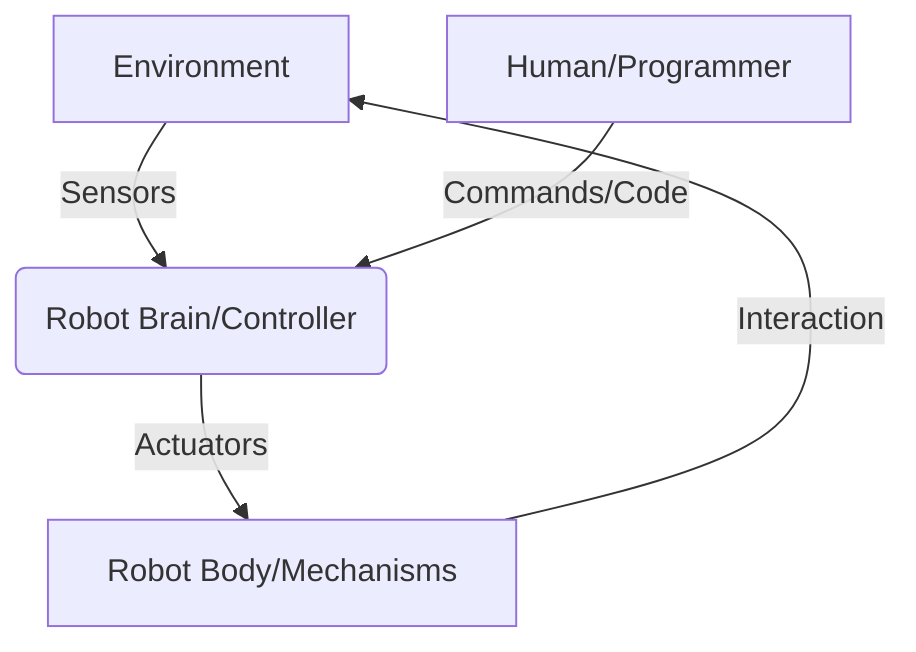

# Part 1: Introduction to Robotics

## 01-What is Robotics?

Robotics is an interdisciplinary field of science and engineering dedicated to the design, construction, operation, and application of robots. The term "robot" itself conjures images of humanoid figures, industrial arms, or even futuristic autonomous vehicles. However, the true scope of robotics extends far beyond these popular depictions, encompassing a vast array of automated machines designed to perform tasks with varying degrees of autonomy.

### 1.1 Defining a Robot

What constitutes a robot? While there's no single universally accepted definition, a robot typically embodies several key characteristics:

1.  **Sensing:** Robots can perceive their environment using various sensors (e.g., cameras, lidar, microphones, touch sensors) to gather information.
2.  **Processing:** They possess a "brain" (a microcontroller, computer, or AI system) to process sensor data, make decisions, and execute commands.
3.  **Actuation:** Robots interact with their environment through actuators (e.g., motors, hydraulics, pneumatics) that enable movement, manipulation, or other physical actions.
4.  **Programmability:** They can be programmed to perform a sequence of actions, often with the ability to adapt to changing conditions.
5.  **Autonomy (Varying Degrees):** Robots can operate with a certain level of independence, from simple pre-programmed tasks to complex decision-making in dynamic environments.

At its core, robotics seeks to automate tasks that are dangerous, dull, dirty, or difficult for humans, thereby improving efficiency, safety, and quality of life.

### 1.2 The Three Laws of Robotics (Asimov)

While fictional, Isaac Asimov's Three Laws of Robotics provide a foundational ethical framework often referenced in the field:

1.  A robot may not injure a human being or, through inaction, allow a human being to come to harm.
2.  A robot must obey the orders given to it by human beings except where such orders would conflict with the First Law.
3.  A robot must protect its own existence as long as such protection does not conflict with the First or Second Law.

These laws highlight the critical importance of safety and human well-being in robot design and operation.

**Diagram 1.1: Basic Robot System Diagram**



*Description: A simplified block diagram illustrating the fundamental components and interactions of a robot system with its environment and human input.*

### 1.3 Key Disciplines in Robotics

Robotics is inherently multidisciplinary, drawing expertise from various fields:

*   **Mechanical Engineering:** Deals with the physical design, kinematics, dynamics, materials, and construction of robots.
*   **Electrical Engineering:** Focuses on power systems, motor control, sensor interfacing, and electronic circuits.
*   **Computer Science:** Involves programming, artificial intelligence, machine learning, data structures, and algorithms for robot control and decision-making.
*   **Control Systems Engineering:** Develops methodologies to ensure robots perform tasks accurately and stably.
*   **Cognitive Science:** Contributes to understanding intelligence, perception, and human-robot interaction.
*   **Mathematics & Physics:** Provide the theoretical underpinnings for modeling robot behavior, motion, and interaction with the physical world.

### 1.4 Levels of Autonomy

Robots can exhibit various levels of autonomy, generally categorized as:

*   **Human-Operated:** Requires constant human control (e.g., remote-controlled drones, teleoperated surgical robots).
*   **Human-Assisted:** Performs some tasks autonomously but requires human supervision or intervention (e.g., industrial robots with safety overrides).
*   **Semi-Autonomous:** Can perform significant portions of a task independently but needs human input for complex decisions or unforeseen circumstances (e.g., self-driving cars requiring driver intervention).
*   **Fully Autonomous:** Can perceive, decide, and act without human intervention for extended periods within a defined operational domain (e.g., Mars rovers, some vacuum cleaners).

### 1.5 Applications of Robotics

Robots are transforming industries and aspects of daily life:

*   **Manufacturing:** Assembly, welding, painting, material handling.
*   **Healthcare:** Surgical assistance, rehabilitation, drug delivery, patient care.
*   **Exploration:** Space probes, underwater vehicles, hazardous environment inspection.
*   **Logistics & Warehousing:** Automated guided vehicles (AGVs), sorting, packaging.
*   **Agriculture:** Harvesting, planting, crop monitoring.
*   **Service Robotics:** Vacuum cleaners, lawnmowers, delivery robots, elder care assistants.
*   **Defense & Security:** Surveillance, bomb disposal, reconnaissance.

### 1.6 Why Study Robotics?

Studying robotics offers a unique blend of theoretical knowledge and practical application. It fosters problem-solving skills, critical thinking, and creativity. With the rapid advancement of AI and automation, robotics is a field with immense potential for innovation and impact across nearly every sector. It prepares students for diverse careers in engineering, research, and development.

---

### C++ Example: Simple Robot Movement (Conceptual)

This C++ snippet demonstrates a very basic conceptual structure for moving a robot. In a real-world scenario, `move_forward()` would interact with motor drivers.

```cpp
#include <iostream>
#include <chrono>
#include <thread>

// Assume these functions control physical motors
void set_left_motor_speed(int speed) {
    std::cout << "Setting left motor speed to: " << speed << std::endl;
    // Actual motor control logic here
}

void set_right_motor_speed(int speed) {
    std::cout << "Setting right motor speed to: " << speed << std::endl;
    // Actual motor control logic here
}

void stop_motors() {
    set_left_motor_speed(0);
    set_right_motor_speed(0);
    std::cout << "Motors stopped." << std::endl;
}

// Function to make the robot move forward
void move_forward(int duration_ms) {
    std::cout << "Robot moving forward for " << duration_ms << "ms..." << std::endl;
    set_left_motor_speed(100);  // Example speed
    set_right_motor_speed(100); // Example speed
    std::this_thread::sleep_for(std::chrono::milliseconds(duration_ms));
    stop_motors();
    std::cout << "Robot finished moving forward." << std::endl;
}

int main() {
    std::cout << "Starting robot program." << std::endl;
    move_forward(2000); // Move forward for 2 seconds
    std::cout << "Robot program finished." << std::endl;
    return 0;
}
```

---

### Python Example: Simulating a Robot Sensor

This Python code simulates a simple distance sensor reading.

```python
import time
import random

class DistanceSensor:
    def __init__(self, min_dist=10, max_dist=200):
        self.min_distance = min_dist
        self.max_distance = max_dist

    def read_distance(self):
        """
        Simulates reading a distance from a sensor.
        Returns a random integer within a defined range.
        """
        distance = random.randint(self.min_distance, self.max_distance)
        print(f"Sensor reading: {distance} cm")
        return distance

if __name__ == "__main__":
    sensor = DistanceSensor()
    print("Simulating distance sensor readings...")
    for _ in range(5):
        sensor.read_distance()
        time.sleep(1) # Wait for 1 second before next reading
    print("Simulation finished.")
```

---

### Arduino Example: Basic LED Control (Robot Indicator)

An Arduino sketch to blink an LED, which can serve as a basic indicator on a robot.

```arduino
// Define the LED pin
const int ledPin = 13; // Most Arduino boards have an on-board LED connected to pin 13

void setup() {
  // Initialize the LED pin as an output
  pinMode(ledPin, OUTPUT);
  Serial.begin(9600); // Initialize serial communication for debugging
  Serial.println("Robot indicator LED sketch started.");
}

void loop() {
  Serial.println("LED ON");
  digitalWrite(ledPin, HIGH); // Turn the LED on (HIGH is the voltage level)
  delay(1000);                // Wait for a second

  Serial.println("LED OFF");
  digitalWrite(ledPin, LOW);  // Turn the LED off by making the voltage LOW
  delay(1000);                // Wait for a second
}
```

---

### Equations in LaTeX: Kinematics (Conceptual)

Basic concept of position vector in 2D space:
```latex
mathbf{p}(t) = begin{bmatrix} x(t)  y(t) end{bmatrix}
```
Velocity as the derivative of position:
```latex
mathbf{v}(t) = frac{dmathbf{p}{dt} = begin{bmatrix} frac{dx}{dt}  frac{dy}{dt} end{bmatrix}
```

---

### MCQs with Answers

1.  Which of the following is NOT a typical characteristic of a robot?
    a) Sensing capabilities
    b) Ability to feel emotions
    c) Programmability
    d) Actuation
    *Answer: b) Ability to feel emotions*

2.  The field of engineering primarily concerned with the physical design and mechanics of robots is:
    a) Electrical Engineering
    b) Computer Science
    c) Mechanical Engineering
    d) Control Systems Engineering
    *Answer: c) Mechanical Engineering*

3.  According to Asimov's First Law, what is a robot's primary directive?
    a) To protect its own existence.
    b) To obey human orders.
    c) To not injure a human being.
    d) To explore new environments.
    *Answer: c) To not injure a human being.*

---

### Practice Tasks

1.  **Research and Present:** Choose an application of robotics (e.g., surgical robots, autonomous vehicles, industrial robots) and research its history, current capabilities, and future potential. Prepare a short presentation (5-10 minutes).
2.  **Define Your Robot:** Imagine you are designing a simple robot for a specific task (e.g., cleaning your room, delivering a snack, exploring a garden).
    *   What would its primary sensors be?
    *   What actuators would it need?
    *   What level of autonomy would be appropriate?
    *   Sketch a simple diagram of your robot and its main components.
3.  **Ethical Discussion:** Discuss in a small group the ethical implications of fully autonomous weapons systems, considering Asimov's Laws. What challenges arise when robots make life-or-death decisions?

---

### Notes for Teachers

*   **Engagement:** Begin with a "What is a robot?" brainstorm session to gauge student preconceptions and introduce the broad scope beyond pop culture.
*   **Activity:** A simple hands-on activity like disassembling an old toy with moving parts can illustrate mechanical components and actuators.
*   **Discussion:** Encourage debates on ethical aspects early to highlight the societal relevance of robotics.
*   **Project-Based Learning:** The practice tasks can be expanded into mini-projects for individual or group work, fostering research and presentation skills.

### Notes for Students

*   **Curiosity:** Robotics is a rapidly evolving field. Stay curious, read articles, and watch documentaries about new robotic developments.
*   **Hands-on:** Don't be afraid to experiment with electronics kits (like Arduino) or simple programming languages (like Python) to build your understanding.
*   **Interdisciplinary:** Recognize that robotics combines many subjects. Strengthening your skills in math, physics, and computer science will be highly beneficial.
*   **Safety First:** When working with any robotic or electronic components, always prioritize safety. Follow instructions carefully and seek help if unsure.