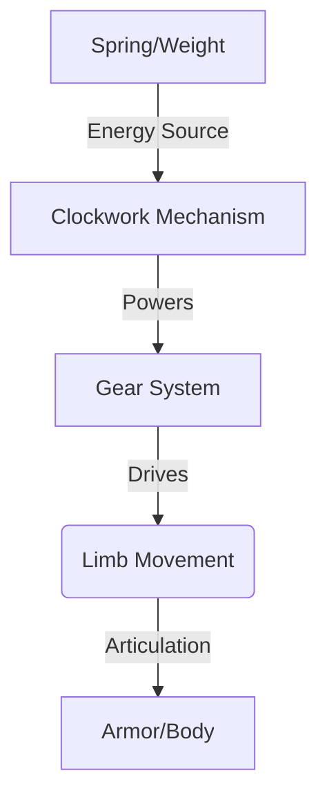
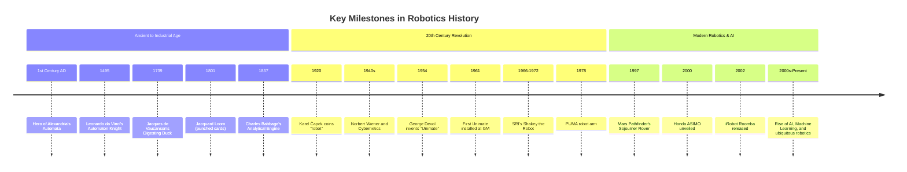

## 02-History of Robotics

The concept of automated machines performing human-like tasks is not new; it dates back centuries, long before the term "robot" was even coined. The evolution of robotics is a fascinating journey from ancient automata and mechanical wonders to sophisticated AI-driven systems. Understanding this history provides context for current advancements and future possibilities.

### 2.1 Early Concepts and Automata (Ancient Times - 18th Century)

The desire to create artificial beings has been present in human imagination for millennia.

*   **Ancient Egypt & Greece:** Early examples include statues of gods that could move or speak, often powered by hydraulics or steam (e.g., Hero of Alexandria's automata in the 1st century AD). These were primarily for religious or entertainment purposes.
*   **Medieval & Renaissance Periods:** Intricate mechanical devices, such as the "Automaton Knight" by Leonardo da Vinci (c. 1495) or the "Digesting Duck" by Jacques de Vaucanson (1739), demonstrated impressive mechanical engineering for their time, mimicking animal and human actions. These were complex clockwork mechanisms, not programmable in the modern sense.

**Diagram 2.1: Conceptual Drawing of Da Vinci's Automaton Knight**



*Description: A simplified representation of the internal mechanisms of an early automaton, highlighting the reliance on gear systems and clockwork for movement.*

### 2.2 The Industrial Revolution and Early Automation (18th - 19th Century)

The Industrial Revolution brought about significant advancements in machinery and the concept of mass production, laying groundwork for modern automation.

*   **Jacquard Loom (1801):** Joseph Marie Jacquard invented a loom that used punched cards to automatically weave complex patterns. This was a crucial precursor to programmable machines and data storage.
*   **Analytical Engine (1837):** Charles Babbage designed, and Ada Lovelace described, the Analytical Engine, a conceptual mechanical general-purpose computer. While never fully built, it introduced fundamental concepts of programming and algorithmic control.

### 2.3 The Dawn of Modern Robotics (20th Century)

The 20th century saw the term "robot" emerge and the first true programmable robots.

*   **"Robot" Coined (1920):** Czech playwright Karel Čapek introduced the word "robot" (from the Czech "robota," meaning 'forced labor' or 'drudgery') in his play *R.U.R. (Rossum's Universal Robots)*.
*   **Cybernetics (1940s):** Norbert Wiener's work on cybernetics (the study of control and communication in animals and machines) provided a theoretical framework for feedback systems crucial to robotics.
*   **First Industrial Robot (1954):** George Devol invented the "Unimate," considered the first programmable digital operating robot. It was later licensed to Joseph Engelberger, who founded Unimation, the world's first robot company.
*   **First Industrial Robot Application (1961):** The Unimate robot was installed at a General Motors factory in New Jersey, performing spot welding and die casting tasks, revolutionizing manufacturing.
*   **Shakey the Robot (1966-1972):** Developed at Stanford Research Institute (SRI), Shakey was the first mobile robot to reason about its own actions. It used vision, range finders, and an onboard computer to navigate and execute plans, demonstrating early AI and perception capabilities.

### 2.4 Expansion and Specialization (Late 20th Century - Early 21st Century)

The late 20th century witnessed rapid diversification and sophistication in robotics.

*   **Robotic Arms & Manipulators:** Further development of industrial robots with increased precision, speed, and versatility. (e.g., PUMA robot arm from Unimation/Stanford).
*   **Mobile Robots:** Advances in navigation, path planning, and obstacle avoidance led to more capable mobile robots for various applications.
*   **Space Exploration:** The deployment of robotic probes and rovers (e.g., Mars Pathfinder's Sojourner rover in 1997) for exploring extraterrestrial environments.
*   **Service Robotics:** Emergence of robots for domestic (e.g., robotic vacuum cleaners like Roomba, 2002) and professional service tasks.
*   **Humanoid Robotics:** Pioneering work on humanoid robots like Honda's ASIMO (2000), showcasing advanced bipedal locomotion and human-robot interaction.

**Diagram 2.2: Timeline of Key Robotic Developments**



*Description: A timeline highlighting significant inventions and conceptual breakthroughs in the history of robotics, from ancient automata to modern AI-driven systems.*

### 2.5 The Age of AI and Ubiquitous Robotics (Present Day)

Today, robotics is deeply intertwined with Artificial Intelligence (AI) and Machine Learning (ML).

*   **Advanced Perception:** Deep learning enables robots to "see" and understand their environment with unprecedented accuracy.
*   **Cognitive Abilities:** Robots are gaining capabilities in natural language processing, decision-making, and even social interaction.
*   **Soft Robotics:** Development of robots made from compliant materials, offering new possibilities for human-robot collaboration and interaction with delicate objects.
*   **Collaborative Robots (Cobots):** Robots designed to work safely alongside humans in shared workspaces.
*   **Autonomous Systems:** Significant progress in self-driving cars, drones, and delivery robots.
*   **Robotics in Medicine:** Minimally invasive surgery, prosthetics, exoskeletons, and assistive devices.

The history of robotics is a testament to human ingenuity and the persistent quest to extend our capabilities through machines. As technology continues to advance, robots will play an increasingly integral role in shaping our world.

---

### Python Example: Simulating Shakey's Path Planning (Conceptual)

This very simplified Python example conceptually represents how an early AI robot like Shakey might plan a path.

```python
import time
import random

class Robot:
    def __init__(self, name, start_pos=(0, 0)):
        self.name = name
        self.position = start_pos
        self.known_obstacles = [(1, 1), (1, 2), (2, 2)] # Simplified obstacles

    def perceive_environment(self):
        """Simulates sensing obstacles."""
        print(f"{self.name} perceives obstacles at: {self.known_obstacles}")
        return self.known_obstacles

    def plan_path(self, target_pos):
        """
        A very simple path planning algorithm (e.g., avoid direct obstacles).
        In reality, this would be much more complex (A*, Dijkstra's, etc.).
        """
        current_x, current_y = self.position
        target_x, target_y = target_pos
        path = [self.position]

        while (current_x, current_y) != (target_x, target_y):
            next_x, next_y = current_x, current_y

            if target_x > current_x and (current_x + 1, current_y) not in self.known_obstacles:
                next_x += 1
            elif target_x < current_x and (current_x - 1, current_y) not in self.known_obstacles:
                next_x -= 1
            elif target_y > current_y and (current_x, current_y + 1) not in self.known_obstacles:
                next_y += 1
            elif target_y < current_y and (current_x, current_y - 1) not in self.known_obstacles:
                next_y -= 1
            else:
                print(f"[{self.name}] No clear path found or blocked!")
                return None # Path blocked

            if (next_x, next_y) == (current_x, current_y):
                # Stuck or target reached, break to avoid infinite loop
                break

            current_x, current_y = next_x, next_y
            path.append((current_x, current_y))

        print(f"[{self.name}] Planned path to {target_pos}: {path}")
        return path

    def move_to(self, target_pos):
        path = self.plan_path(target_pos)
        if path:
            for step in path:
                self.position = step
                print(f"[{self.name}] Moved to: {self.position}")
                time.sleep(0.5) # Simulate movement time
            print(f"[{self.name}] Reached target: {target_pos}")
        else:
            print(f"[{self.name}] Could not reach target: {target_pos}")

if __name__ == "__main__":
    shakey = Robot("Shakey", start_pos=(0, 0))
    shakey.perceive_environment()
    shakey.move_to((3, 0))
    shakey.move_to((0, 3))
    shakey.move_to((1, 1)) # Should be blocked
```

---

### Arduino Example: Simple "Automaton" Display (LED Sequence)

This Arduino code simulates a simple sequence of LEDs, reminiscent of early automata displaying a pre-programmed action.

```arduino
const int ledPins[] = {2, 3, 4, 5}; // Array of LED pins
const int numLeds = sizeof(ledPins) / sizeof(ledPins[0]); // Calculate number of LEDs

void setup() {
  Serial.begin(9600);
  for (int i = 0; i < numLeds; i++) {
    pinMode(ledPins[i], OUTPUT); // Set all LED pins as outputs
  }
  Serial.println("Automaton LED sequence started.");
}

void loop() {
  // Sequence 1: LEDs light up one by one
  for (int i = 0; i < numLeds; i++) {
    digitalWrite(ledPins[i], HIGH);
    Serial.print("LED ");
    Serial.print(ledPins[i]);
    Serial.println(" ON");
    delay(200);
  }

  // Sequence 2: LEDs turn off one by one
  for (int i = 0; i < numLeds; i++) {
    digitalWrite(ledPins[i], LOW);
    Serial.print("LED ");
    Serial.print(ledPins[i]);
    Serial.println(" OFF");
    delay(200);
  }

  // Sequence 3: All LEDs blink simultaneously
  for (int j = 0; j < 3; j++) { // Blink 3 times
    for (int i = 0; i < numLeds; i++) {
      digitalWrite(ledPins[i], HIGH);
    }
    Serial.println("All LEDs ON");
    delay(300);
    for (int i = 0; i < numLeds; i++) {
      digitalWrite(ledPins[i], LOW);
    }
    Serial.println("All LEDs OFF");
    delay(300);
  }

  delay(1000); // Pause before repeating the whole sequence
}
```

---

### Equations in LaTeX: Feedback Control (Conceptual)

Early control systems laid the groundwork for modern robotics. A basic feedback loop can be represented as:

Let `e(t)` be the error, `r(t)` be the reference input, and `y(t)` be the output.
```latex
e(t) = r(t) - y(t)
```
The control input `u(t)` is often proportional to the error:
```latex
u(t) = K_p cdot e(t)
```
Where `K_p` is the proportional gain.

---

### MCQs with Answers

1.  The term "robot" was first introduced in a play by:
    a) Isaac Asimov
    b) Joseph Engelberger
    c) Karel Čapek
    d) Norbert Wiener
    *Answer: c) Karel Čapek*

2.  Which invention is considered a crucial precursor to programmable machines and data storage?
    a) Leonardo da Vinci's Automaton Knight
    b) Jacques de Vaucanson's Digesting Duck
    c) The Jacquard Loom
    d) Hero of Alexandria's Automata
    *Answer: c) The Jacquard Loom*

3.  Shakey the Robot was significant because it was the first mobile robot to:
    a) Perform spot welding in a factory.
    b) Be controlled remotely by humans.
    c) Reason about its own actions and environment.
    d) Fly autonomously.
    *Answer: c) Reason about its own actions and environment.*

---

### Practice Tasks

1.  **Historical Research Project:** Choose a specific period (e.g., Ancient, Industrial Revolution, Mid-20th Century) and research a prominent figure or invention in the history of automation/robotics. Create a short report or presentation detailing their contribution.
2.  **Compare and Contrast:** Research two different historical automata (e.g., Hero's devices vs. Vaucanson's duck). Compare their mechanisms, purpose, and the technological achievements they represented.
3.  **Future Scenario:** Imagine a robot from the year 2050. Based on historical trends and current advancements, describe its capabilities, its primary application, and any ethical considerations it might present.

---

### Notes for Teachers

*   **Visual Aids:** Utilize videos and images of historical automata (e.g., the Jaquet-Droz automata) and early industrial robots (e.g., Unimate footage) to captivate students.
*   **Connecting Past to Present:** Emphasize how historical concepts (like punched cards for programming) directly influenced modern computing and robotics.
*   **Timeline Activity:** Have students create their own timelines of robotics history, perhaps focusing on different categories like industrial, service, or space robotics.

### Notes for Students

*   **Beyond the Machine:** Understand that robotics isn't just about building machines; it's about the ideas and theories that drive their creation.
*   **Impact of Fiction:** Note how science fiction (like Čapek's play or Asimov's stories) often inspires scientific and engineering endeavors.
*   **Continuous Evolution:** The field is always moving forward. The "history" you study today is constantly being extended by new discoveries and inventions.