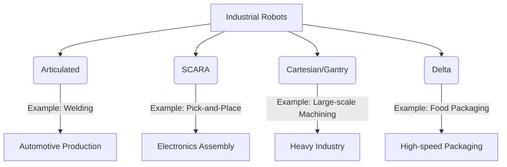

## 03-Robotics Domains and Applications

Robotics is an incredibly diverse field, with robots finding applications in nearly every sector imaginable. These applications often define distinct domains within robotics, each with its unique challenges, technologies, and goals. Understanding these domains helps to appreciate the breadth and impact of robotic innovation.

### 3.1 Industrial Robotics

This is perhaps the most well-known domain, focused on automating manufacturing and production processes.

*   **Characteristics:** High precision, repeatability, speed, strength, and durability. Often operates in structured, predictable environments.
*   **Tasks:** Welding, painting, assembly, material handling, packaging, quality inspection.
*   **Types of Industrial Robots:**
    *   **Articulated Robots:** Resemble human arms, with rotary joints (e.g., 6-axis robot arms).
    *   **SCARA Robots:** Selective Compliance Assembly Robot Arm, ideal for fast, precise pick-and-place or assembly operations.
    *   **Cartesian/Gantry Robots:** Move along three linear axes (X, Y, Z), often used for large workspaces.
    *   **Delta Robots:** Parallel manipulator robots, known for high speed and precision in light-payload applications.

**Diagram 3.1: Types of Industrial Robots**



*Description: Categorization of common industrial robot types and their typical applications, showcasing the diversity within manufacturing automation.*

### 3.2 Service Robotics

This domain focuses on robots that assist humans, excluding industrial automation. They often operate in dynamic, less predictable environments.

*   **Professional Service Robots:**
    *   **Logistics Robots:** Automated Guided Vehicles (AGVs), Autonomous Mobile Robots (AMRs) for warehouses and deliveries.
    *   **Medical Robots:** Surgical robots (e.g., Da Vinci system), rehabilitation robots, hospital delivery robots, disinfection robots.
    *   **Field Robots:** Agricultural robots (planting, harvesting, spraying), inspection robots (pipelines, infrastructure), construction robots.
    *   **Cleaning Robots:** Large-scale floor cleaners for commercial spaces.
*   **Personal/Domestic Service Robots:**
    *   **Household Robots:** Robotic vacuum cleaners, lawnmowers, pool cleaners.
    *   **Companion/Social Robots:** Designed for interaction, education, and entertainment (e.g., therapy bots, pet robots).
    *   **Assistive Robots:** Robots for elderly care, assisting people with disabilities.

### 3.3 Exploration and Hazardous Environment Robotics

Robots are indispensable for exploring environments inaccessible or dangerous to humans.

*   **Space Robotics:** Mars rovers (Curiosity, Perseverance), planetary landers, robotic arms on space stations (Canadarm).
*   **Underwater Robotics:** Remotely Operated Vehicles (ROVs), Autonomous Underwater Vehicles (AUVs) for oceanographic research, deep-sea exploration, pipeline inspection.
*   **Disaster Response:** Robots for search and rescue in collapsed buildings, inspecting nuclear facilities, bomb disposal (EOD robots).

### 3.4 Medical and Healthcare Robotics

Beyond surgical assistance, robotics is transforming various aspects of healthcare.

*   **Surgical Robots:** Enhance precision and minimize invasiveness for surgeons.
*   **Rehabilitation Robots:** Aid patients in physical therapy, helping to regain movement and strength.
*   **Prosthetics and Exoskeletons:** Advanced robotic limbs and wearable devices that restore function or enhance human capabilities.
*   **Pharmacy Automation:** Robots for dispensing and packaging medications.
*   **Telepresence Robots:** Allow doctors to consult with patients remotely, especially in rural areas.

### 3.5 Humanoid Robotics

This domain focuses on robots designed to resemble the human body, often with bipedal locomotion.

*   **Goals:** Mimic human motion, interaction, and adaptability to human-centric environments.
*   **Challenges:** Balance, complex gait generation, dexterous manipulation, human-robot interaction.
*   **Applications:** Research platforms, entertainment, future service roles, disaster response where human-shaped access is required.
*   **Examples:** Honda ASIMO, Boston Dynamics Atlas, Digit by Agility Robotics.

### 3.6 Soft Robotics

A newer domain exploring robots made from compliant, flexible materials.

*   **Characteristics:** Inherently safe for interaction with humans and delicate objects, adaptable to complex shapes, can absorb impacts.
*   **Materials:** Silicones, polymers, fluids, pneumatics.
*   **Applications:** Medical devices (e.g., minimally invasive tools, wearable sensors), grippers for delicate items, exploration in unstructured environments.

### 3.7 Collaborative Robotics (Cobots)

Robots designed to work safely and interactively with humans in a shared workspace.

*   **Key Feature:** Safety features allow them to operate without traditional safety cages, often with force-sensing capabilities.
*   **Applications:** Assembly assistance, quality control, packaging, machine tending, material handling in environments where human flexibility is still needed.
*   **Benefits:** Increased flexibility, reduced footprint, human-robot synergy.

### 3.8 Current Trends and Emerging Applications

The field continues to evolve rapidly:

*   **AI and Machine Learning Integration:** Robots are becoming smarter, more adaptable, and capable of learning from experience.
*   **Cloud Robotics:** Leveraging cloud computing for heavy processing, data storage, and sharing knowledge among robots.
*   **Swarm Robotics:** Coordination of multiple simple robots to achieve complex tasks.
*   **Robotics in Education:** Tools for teaching STEM concepts from elementary to university levels.
*   **Drones (UAVs):** Aerial robotics for delivery, surveillance, agriculture, inspection.

The continuous innovation across these domains underscores the transformative potential of robotics to address global challenges and improve human lives.

---

### C++ Example: Simple Industrial Robot Simulation (Conceptual)

This C++ example provides a very basic class structure to represent an industrial robot, illustrating how methods might control its position.

```cpp
#include <iostream>
#include <vector>
#include <string>
#include <iomanip> // For std::fixed and std::setprecision

class IndustrialRobot {
public:
    // Constructor
    IndustrialRobot(std::string name, int num_joints) : 
        name_(name), num_joints_(num_joints) {
        joint_angles_.resize(num_joints, 0.0); // Initialize all joint angles to 0
        std::cout << "Industrial Robot '" << name_ << "' with " << num_joints_ << " joints created." << std::endl;
    }

    // Move a specific joint
    void move_joint(int joint_idx, double angle) {
        if (joint_idx >= 0 && joint_idx < num_joints_) {
            joint_angles_[joint_idx] = angle;
            std::cout << name_ << ": Joint " << joint_idx + 1 
                      << " moved to " << std::fixed << std::setprecision(2) << angle << " degrees." << std::endl;
        } else {
            std::cerr << name_ << ": Error: Invalid joint index " << joint_idx << std::endl;
        }
    }

    // Move all joints to a predefined home position
    void go_to_home_position() {
        std::cout << name_ << ": Moving to home position..." << std::endl;
        for (int i = 0; i < num_joints_; ++i) {
            joint_angles_[i] = 0.0; // Home position usually all zeros
        }
        std::cout << name_ << ": At home position." << std::endl;
    }

    // Get current joint angles
    const std::vector<double>& get_joint_angles() const {
        return joint_angles_;
    }

    // Simulate performing a task (e.g., welding)
    void perform_task(std::string task_name) {
        std::cout << name_ << ": Performing task: '" << task_name << "'." << std::endl;
        // In a real robot, this would involve complex motion sequences
        // For simulation, we just print a message.
        std::this_thread::sleep_for(std::chrono::seconds(1)); // Simulate work
        std::cout << name_ << ": Task '" << task_name << "' completed." << std::endl;
    }

private:
    std::string name_;
    int num_joints_;
    std::vector<double> joint_angles_; // Current angle of each joint
};

int main() {
    IndustrialRobot kuka_robot("KUKA KR 60", 6); // A 6-axis industrial robot
    kuka_robot.go_to_home_position();
    kuka_robot.move_joint(0, 45.0);  // Move base joint to 45 degrees
    kuka_robot.move_joint(2, -90.0); // Move third joint to -90 degrees
    
    std::cout << "Current joint angles: ";
    for (double angle : kuka_robot.get_joint_angles()) {
        std::cout << angle << " ";
    }
    std::cout << std::endl;

    kuka_robot.perform_task("Spot Welding Car Chassis");
    kuka_robot.go_to_home_position();
    return 0;
}
```

---

### Python Example: Simple Delivery Robot Simulation (Service Robotics)

This Python example outlines a basic delivery robot that navigates to a destination.

```python
import time

class DeliveryRobot:
    def __init__(self, robot_id, current_location=(0,0)):
        self.robot_id = robot_id
        self.current_location = current_location
        self.status = "idle"
        print(f"Delivery Robot {self.robot_id} initialized at {self.current_location}.")

    def pick_up_item(self, item_name):
        self.status = "picking_up"
        print(f"Robot {self.robot_id}: Picking up {item_name} at {self.current_location}...")
        time.sleep(2) # Simulate pickup time
        self.status = "carrying_item"
        print(f"Robot {self.robot_id}: {item_name} picked up.")

    def deliver_to(self, destination):
        self.status = "delivering"
        print(f"Robot {self.robot_id}: Moving from {self.current_location} to {destination}...")
        # Simple movement simulation: assuming direct path
        distance_x = destination[0] - self.current_location[0]
        distance_y = destination[1] - self.current_location[1]
        
        steps = max(abs(distance_x), abs(distance_y))
        if steps == 0:
            print(f"Robot {self.robot_id}: Already at destination {destination}.")
            self.status = "idle"
            return

        for i in range(1, steps + 1):
            # Move proportionally towards destination
            new_x = self.current_location[0] + (distance_x / steps) * i
            new_y = self.current_location[1] + (distance_y / steps) * i
            self.current_location = (round(new_x), round(new_y)) # Round to integer coordinates
            print(f"Robot {self.robot_id}: Current location: {self.current_location}")
            time.sleep(0.5) # Simulate travel time per step

        self.status = "delivered"
        print(f"Robot {self.robot_id}: Item delivered to {self.current_location}.")
        self.status = "idle"

if __name__ == "__main__":
    robot_alpha = DeliveryRobot("Alpha")
    robot_alpha.pick_up_item("Package A")
    robot_alpha.deliver_to((5, 10))
    
    print("\n--- Next Delivery ---")
    robot_beta = DeliveryRobot("Beta", current_location=(1,1))
    robot_beta.pick_up_item("Medical Supplies")
    robot_beta.deliver_to((8, 2))
```

---

### Arduino Example: ROV Thruster Control (Conceptual)

A conceptual Arduino sketch for controlling an ROV's thrusters based on simple commands.

```arduino
// Define pins for hypothetical thrusters (e.g., motor drivers)
const int thruster1_pin = 9;  // PWM pin for speed control
const int thruster2_pin = 10; // PWM pin for speed control

void setup() {
  Serial.begin(9600);
  pinMode(thruster1_pin, OUTPUT);
  pinMode(thruster2_pin, OUTPUT);
  Serial.println("ROV Thruster Control Initialized. Send 'f' for forward, 's' for stop.");
}

void loop() {
  if (Serial.available() > 0) {
    char command = Serial.read();

    if (command == 'f') {
      Serial.println("Moving ROV Forward...");
      analogWrite(thruster1_pin, 150); // Set thruster 1 speed (0-255)
      analogWrite(thruster2_pin, 150); // Set thruster 2 speed
    } else if (command == 's') {
      Serial.println("Stopping ROV...");
      analogWrite(thruster1_pin, 0); // Stop thrusters
      analogWrite(thruster2_pin, 0);
    } else {
      Serial.println("Unknown command. Use 'f' or 's'.");
    }
  }
}
```

---

### Equations in LaTeX: Path Planning (Simplified Cost Function)

In mobile robotics, path planning often involves minimizing a cost function. A simple cost function for a path `P = {p_1, p_2, ldots, p_N}` could be:

```latex
C(P) = sum_{i=1}^{N-1} d(p_{i}, p_{i+1}) + sum_{i=1}^{N} text{obstacleCost}(p_{i})
```

Where:
*   `d(p_{i}, p_{i+1})` is the Euclidean distance between consecutive points.
*   `text{obstacleCost}(p_{i})` is a penalty if point `p_{i}` is near or in an obstacle.

---

### MCQs with Answers

1.  Which type of industrial robot is known for its high speed in pick-and-place operations?
    a) Articulated Robot
    b) SCARA Robot
    c) Cartesian Robot
    d) Delta Robot
    *Answer: d) Delta Robot*

2.  A robot designed to perform surgery with enhanced precision is an example of a:
    a) Industrial Robot
    b) Exploration Robot
    c) Professional Service Robot
    d) Personal Service Robot
    *Answer: c) Professional Service Robot*

3.  What is a key characteristic that distinguishes collaborative robots (cobots) from traditional industrial robots?
    a) They are always humanoid in shape.
    b) They are designed to work safely alongside humans in shared spaces.
    c) They can only operate underwater.
    d) They are exclusively used for space exploration.
    *Answer: b) They are designed to work safely alongside humans in shared spaces.*

---

### Practice Tasks

1.  **Domain Mapping:** For each of the main robotics domains discussed (Industrial, Service, Exploration, Medical, Humanoid, Soft, Cobots), identify at least two real-world examples not explicitly mentioned in the text. Describe the robot's function and why it fits that domain.
2.  **Market Research:** Choose a specific emerging application of robotics (e.g., delivery drones, elder care robots, agricultural harvesting robots). Research the current market, key players, and future growth potential.
3.  **Design a "Cobot" Task:** Imagine a manufacturing assembly line that requires both human dexterity and robotic strength. Design a task that a cobot and a human would perform collaboratively. Describe their roles and how they would ensure safety.

---

### Notes for Teachers

*   **Case Studies:** Use video case studies of robots in action across different domains (e.g., Boston Dynamics videos, Da Vinci surgery demos, warehouse AGVs) to make the applications tangible.
*   **Guest Speakers:** If possible, invite professionals from industries using robotics (e.g., manufacturing, logistics, healthcare) to share their experiences.
*   **Debate:** Organize a debate on the impact of robotics on employment in different sectors.

### Notes for Students

*   **Think Broadly:** Robotics is not just about building a single type of machine. The principles you learn can be applied to robots in factories, hospitals, homes, and even space.
*   **Interdisciplinary Nature:** Notice how different domains often combine technologies from others (e.g., an agricultural robot might use computer vision, mobile robotics, and specialized manipulators).
*   **Problem-Solving:** Consider how robots are used to solve specific problems. This perspective will help you identify opportunities for future robotic innovation.