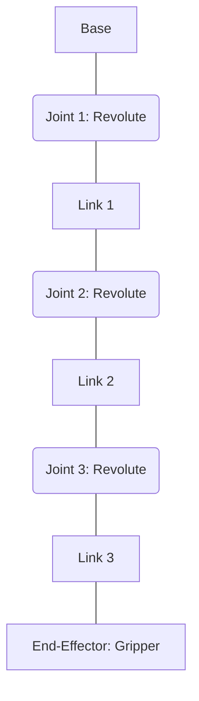
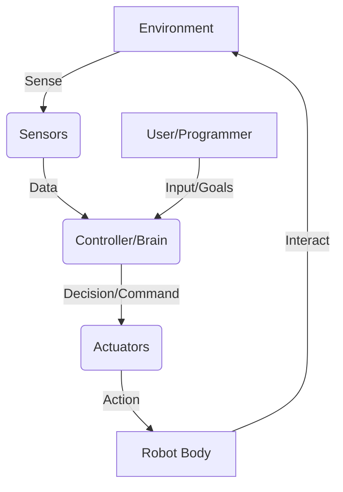

## 04-Components of a Robot System

A robot is not a monolithic entity but rather a complex system composed of several interconnected subsystems. Understanding these fundamental components is crucial for designing, building, and programming any robot, regardless of its application or complexity.

### 4.1 Mechanical Structure (Body)

The mechanical structure provides the physical support and framework for the robot.

*   **Frame/Chassis:** The main body that holds all other components. Can be rigid (for industrial robots) or flexible (for soft robots).
*   **Links and Joints:** For articulated robots, links are the rigid members, and joints are the connections between them, allowing relative motion.
    *   **Revolute Joint:** Allows rotational motion (like a hinge).
    *   **Prismatic Joint:** Allows linear (sliding) motion.
*   **End-Effectors:** The "hand" or tool at the end of a robot arm, designed to interact with the environment (e.g., grippers, welders, drills, cameras).
*   **Power Transmission:** Gears, belts, chains, and linkages that transfer power from actuators to joints or wheels.
*   **Mobility System:** Wheels, tracks, legs, or propellers that enable locomotion for mobile robots.

**Diagram 4.1: Robot Arm with Links, Joints, and End-Effector**



*Description: A simplified representation of an articulated robot arm, showing the sequence of a base, revolute joints, links, and an end-effector.*

### 4.2 Actuators

Actuators are the "muscles" of the robot, converting electrical, hydraulic, or pneumatic energy into mechanical motion.

*   **Electric Motors:**
    *   **DC Motors:** Simple, inexpensive, but difficult to control precisely without feedback.
    *   **Stepper Motors:** Move in discrete steps, good for precise positioning without complex feedback.
    *   **Servo Motors:** DC motor combined with a gearbox and a feedback control system, offering precise angular positioning. Widely used in smaller robots, RC applications.
    *   **Brushless DC (BLDC) Motors:** High efficiency, long lifespan, used where high power and reliability are needed.
*   **Hydraulic Actuators:** Use incompressible fluid pressure to generate powerful linear or rotary motion. Used for heavy-duty industrial robots.
*   **Pneumatic Actuators:** Use compressed air to generate linear or rotary motion. Faster and cleaner than hydraulics but less precise for fine control.
*   **Other Actuators:** Shape memory alloys (SMAs), piezoelectric actuators, electroactive polymers (EAPs) for soft robotics.

### 4.3 Sensors

Sensors are the "eyes, ears, and touch" of the robot, gathering information about the robot's internal state and its external environment.

*   **Proprioceptive Sensors:** Sense the robot's internal state.
    *   **Encoders:** Measure rotational position/speed of motors/joints.
    *   **Potentiometers:** Measure angular position.
    *   **IMUs (Inertial Measurement Units):** Combine accelerometers, gyroscopes, and magnetometers to measure orientation, angular velocity, and linear acceleration.
*   **Exteroceptive Sensors:** Sense the external environment.
    *   **Vision Sensors (Cameras):** Capture images/video for object recognition, navigation, depth perception (stereo cameras, RGB-D sensors like Intel RealSense or Microsoft Kinect).
    *   **Distance/Range Sensors:**
        *   **Ultrasonic Sensors:** Use sound waves to measure distance.
        *   **Infrared (IR) Sensors:** Use IR light to measure distance or detect objects.
        *   **Lidar (Light Detection and Ranging):** Uses pulsed laser light to measure distances, creating 2D or 3D maps of the environment.
        *   **Radar (Radio Detection and Ranging):** Uses radio waves, good for long-range detection in adverse weather.
    *   **Touch/Tactile Sensors:** Detect physical contact, pressure, or force.
    *   **Force/Torque Sensors:** Measure forces and torques applied to end-effectors or joints.
    *   **Microphones:** For sound detection, speech recognition.

### 4.4 Controller (Robot Brain)

The controller is the "brain" that processes sensor data, executes programs, and sends commands to actuators.

*   **Microcontrollers (MCUs):** Small, integrated computers ideal for real-time control of simple robots (e.g., Arduino, ESP32).
*   **Single Board Computers (SBCs):** More powerful than MCUs, capable of running full operating systems, complex algorithms, and AI (e.g., Raspberry Pi, NVIDIA Jetson).
*   **Industrial PCs/PLCs (Programmable Logic Controllers):** Robust, high-performance computers used in industrial settings for complex automation tasks.
*   **Software Components:**
    *   **Operating System:** Robot Operating System (ROS), Linux, Windows Embedded.
    *   **Control Algorithms:** PID controllers, state machines, motion planners.
    *   **Perception Modules:** Image processing, sensor fusion.
    *   **Decision-Making/AI:** Path planning, object recognition, machine learning models.

**Diagram 4.2: Robot Control Loop**



*Description: A feedback loop illustrating how a robot's controller integrates sensor data to make decisions, which then drive actuators to interact with the environment, with human input guiding the overall goals.*

### 4.5 Power Source

Robots require power to operate their electronics and actuators.

*   **Batteries:** Rechargeable (LiPo, NiMH) for mobile robots and portable applications.
*   **AC Power:** Wall outlets for stationary robots or charging stations.
*   **Generators/Fuel Cells:** For long-endurance field robots.
*   **Power Management System:** Regulates voltage, manages charging, and monitors battery health.

### 4.6 Communication System

Enables the robot to interact with external systems, other robots, or human operators.

*   **Wired Communication:** Ethernet, USB, Serial (UART, SPI, I2C) for local communication, debugging, or tethered operation.
*   **Wireless Communication:**
    *   **Wi-Fi:** For network connectivity, internet access, data transfer.
    *   **Bluetooth:** Short-range wireless for peripherals or low-bandwidth communication.
    *   **Radio (RF Modules):** For remote control, especially in environments without Wi-Fi.
    *   **Cellular (4G/5G):** For long-range autonomous operations.

### 4.7 User Interface/Human-Robot Interaction (HRI)

Allows humans to program, monitor, and interact with the robot.

*   **Teach Pendants:** Handheld devices for programming industrial robots.
*   **Graphical User Interfaces (GUIs):** Software applications for control, monitoring, and simulation.
*   **Voice Control/Speech Recognition:** For natural language interaction.
*   **Gestural Control:** Using hand movements or body posture.
*   **Displays/Indicators:** LEDs, screens to convey robot status.

By understanding how these components work together, one can begin to appreciate the engineering complexity and ingenuity behind even the simplest robot.

---

### C++ Example: Representing Robot Components

This example uses C++ classes to conceptually model some robot components.

```cpp
#include <iostream>
#include <string>
#include <vector>
#include <map>

// --- Mechanical Components ---
class Joint {
public:
    enum Type { REVOLUTE, PRISMATIC };
    Joint(int id, Type type, double min_limit, double max_limit) 
        : id_(id), type_(type), current_position_(0.0), min_limit_(min_limit), max_limit_(max_limit) {}

    void set_position(double pos) {
        if (pos >= min_limit_ && pos <= max_limit_) {
            current_position_ = pos;
            std::cout << "  Joint " << id_ << " set to: " << current_position_ << std::endl;
        } else {
            std::cerr << "  Error: Joint " << id_ << " position " << pos << " out of limits." << std::endl;
        }
    }
    double get_position() const { return current_position_; }
private:
    int id_;
    Type type_;
    double current_position_;
    double min_limit_, max_limit_;
};

class EndEffector {
public:
    enum Type { GRIPPER, WELDER, CAMERA };
    EndEffector(Type type) : type_(type) {}
    void operate() {
        if (type_ == GRIPPER) std::cout << "  Gripper operating." << std::endl;
        else if (type_ == WELDER) std::cout << "  Welder operating." << std::endl;
        else if (type_ == CAMERA) std::cout << "  Camera capturing image." << std::endl;
    }
private:
    Type type_;
};

// --- Actuators ---
class Motor {
public:
    enum Type { DC, STEPPER, SERVO };
    Motor(int id, Type type) : id_(id), type_(type) {}
    void set_power(double power) {
        std::cout << "  Motor " << id_ << " (Type " << type_ << ") power set to " << power << std::endl;
    }
private:
    int id_;
    Type type_;
};

// --- Sensors ---
class Sensor {
public:
    enum Type { ULTRASONIC, CAMERA, ENCODER, IMU };
    Sensor(int id, Type type) : id_(id), type_(type) {}
    double read_data() {
        // Simulate reading sensor data
        double data = static_cast<double>(rand() % 100) / 10.0;
        std::cout << "  Sensor " << id_ << " (Type " << type_ << ") read data: " << data << std::endl;
        return data;
    }
private:
    int id_;
    Type type_;
};

// --- Robot System ---
class RobotSystem {
public:
    RobotSystem(std::string name) : name_(name) {
        std::cout << "Robot System '" << name_ << "' initialized." << std::endl;
    }

    void add_joint(Joint::Type type, double min_limit, double max_limit) {
        joints_.emplace_back(joints_.size(), type, min_limit, max_limit);
    }
    void add_motor(Motor::Type type) {
        motors_.emplace_back(motors_.size(), type);
    }
    void add_sensor(Sensor::Type type) {
        sensors_.emplace_back(sensors_.size(), type);
    }
    void set_end_effector(EndEffector::Type type) {
        end_effector_ = std::make_unique<EndEffector>(type);
    }

    void perform_motion_sequence() {
        std::cout << "\nPerforming motion sequence for " << name_ << ":" << std::endl;
        if (!joints_.empty()) {
            joints_[0].set_position(45.0);
            motors_[0].set_power(0.7);
        }
        if (!sensors_.empty()) {
            sensors_[0].read_data();
        }
        if (end_effector_) {
            end_effector_->operate();
        }
        std::cout << "Motion sequence complete.\n" << std::endl;
    }

private:
    std::string name_;
    std::vector<Joint> joints_;
    std::vector<Motor> motors_;
    std::vector<Sensor> sensors_;
    std::unique_ptr<EndEffector> end_effector_;
};

int main() {
    RobotSystem my_robot("Manipulator Arm");
    my_robot.add_joint(Joint::REVOLUTE, -90, 90);
    my_robot.add_joint(Joint::REVOLUTE, 0, 180);
    my_robot.add_motor(Motor::SERVO);
    my_robot.add_motor(Motor::SERVO);
    my_robot.add_sensor(Sensor::ULTRASONIC);
    my_robot.set_end_effector(EndEffector::GRIPPER);

    my_robot.perform_motion_sequence();

    RobotSystem mobile_platform("Mobile Explorer");
    mobile_platform.add_motor(Motor::DC); // For wheels
    mobile_platform.add_motor(Motor::DC);
    mobile_platform.add_sensor(Sensor::CAMERA);
    mobile_platform.add_sensor(Sensor::IMU);
    mobile_platform.perform_motion_sequence(); // Example for mobile robot interaction

    return 0;
}
```

---

### Python Example: Simulating a Robot's Perception and Action Loop

This Python code demonstrates a basic loop where a robot perceives its environment and takes actions based on sensor readings.

```python
import time
import random

class SimulatedRobot:
    def __init__(self, name="RoboBuddy"):
        self.name = name
        self.distance_sensor_value = 0
        self.is_object_detected = False
        self.motor_speed = 0
        self.state = "idle"
        print(f"{self.name} initialized.")

    def read_distance_sensor(self):
        """Simulates reading a distance."""
        self.distance_sensor_value = random.randint(5, 50) # Distance in cm
        print(f"[{self.name} - Sensor] Distance: {self.distance_sensor_value} cm")
        return self.distance_sensor_value

    def detect_object(self):
        """Simulates object detection based on distance."""
        self.is_object_detected = self.distance_sensor_value < 20
        if self.is_object_detected:
            print(f"[{self.name} - Perception] Object detected!")
        else:
            print(f"[{self.name} - Perception] No object in close range.")
        return self.is_object_detected

    def move_forward(self, speed=50):
        """Simulates moving motors forward."""
        self.motor_speed = speed
        self.state = "moving_forward"
        print(f"[{self.name} - Actuator] Moving forward at speed {self.motor_speed}.")

    def stop_motors(self):
        """Simulates stopping motors."""
        self.motor_speed = 0
        self.state = "stopped"
        print(f"[{self.name} - Actuator] Motors stopped.")

    def avoid_obstacle(self):
        """Simulates obstacle avoidance behavior."""
        self.state = "avoiding_obstacle"
        print(f"[{self.name} - Behavior] Avoiding obstacle: Backing up and turning.")
        self.stop_motors()
        time.sleep(1) # Simulate pause
        # In a real robot, this would involve complex maneuvers
        self.move_forward(speed=-30) # Simulate backing up
        time.sleep(1.5)
        self.stop_motors()
        print(f"[{self.name} - Behavior] Obstacle avoidance complete.")
        self.state = "idle"


    def run_cycle(self):
        """Main robot operational loop."""
        print(f"\n--- {self.name} Cycle Start ---")
        self.read_distance_sensor()
        self.detect_object()

        if self.is_object_detected:
            self.avoid_obstacle()
        else:
            if self.state != "moving_forward": # If not already moving, start moving
                self.move_forward(50)
            else:
                print(f"[{self.name} - Action] Still moving forward.")

        print(f"--- {self.name} Cycle End (State: {self.state}, Motor Speed: {self.motor_speed}) ---")

if __name__ == "__main__":
    robot = SimulatedRobot()
    for _ in range(5):
        robot.run_cycle()
        time.sleep(2) # Wait before next cycle
    robot.stop_motors() # Ensure motors are off at the end
```

---

### Arduino Example: Ultrasonic Sensor and Servo Motor (Actuator & Sensor)

This Arduino sketch demonstrates how to use an ultrasonic distance sensor to detect objects and a servo motor to change an arm's position based on the detection.

```arduino
#include <Servo.h>

// Ultrasonic Sensor Pins
const int trigPin = 9;
const int echoPin = 10;

// Servo Motor Pin
const int servoPin = 3;

Servo myServo; // Create a servo object

long duration;
int distance;

void setup() {
  Serial.begin(9600);
  pinMode(trigPin, OUTPUT);
  pinMode(echoPin, INPUT);
  myServo.attach(servoPin); // Attaches the servo on pin 3 to the servo object
  myServo.write(90);        // Initial position for servo (center)
  Serial.println("Ultrasonic Sensor & Servo Motor Control Ready.");
}

void loop() {
  // Clear the trigPin by setting it LOW for 2 microseconds
  digitalWrite(trigPin, LOW);
  delayMicroseconds(2);

  // Set the trigPin on HIGH state for 10 microseconds to send a pulse
  digitalWrite(trigPin, HIGH);
  delayMicroseconds(10);
  digitalWrite(trigPin, LOW);

  // Read the echoPin, returns the sound wave travel time in microseconds
  duration = pulseIn(echoPin, HIGH);

  // Calculate the distance: Speed of sound = 0.034 cm/µs
  // Distance = (Duration * 0.034) / 2 (divided by 2 because it travels to and from)
  distance = duration * 0.034 / 2;

  Serial.print("Distance: ");
  Serial.print(distance);
  Serial.println(" cm");

  // Control servo based on distance
  if (distance < 30) { // If an object is closer than 30 cm
    myServo.write(45); // Move servo to 45 degrees
    Serial.println("Object detected! Servo to 45 degrees.");
  } else {
    myServo.write(135); // Move servo to 135 degrees
    Serial.println("No object. Servo to 135 degrees.");
  }

  delay(500); // Wait for half a second before next reading
}
```

---

### Equations in LaTeX: Proportional-Integral-Derivative (PID) Controller

A fundamental control algorithm for actuators is the PID controller. The control output `u(t)` is given by:

```latex
u(t) = K_p e(t) + K_i int e(t) dt + K_d frac{de(t)}{dt}
```

Where:
*   `e(t)` is the error (difference between desired and actual value).
*   `K_p` is the proportional gain.
*   `K_i` is the integral gain.
*   `K_d` is the derivative gain.

---

### MCQs with Answers

1.  Which robot component is responsible for converting energy into mechanical motion?
    a) Sensor
    b) Controller
    c) Actuator
    d) End-effector
    *Answer: c) Actuator*

2.  An IMU (Inertial Measurement Unit) typically combines which sensors?
    a) Ultrasonic, Infrared, Lidar
    b) Accelerometer, Gyroscope, Magnetometer
    c) Camera, Microphone, Touch Sensor
    d) Potentiometer, Encoder, Force Sensor
    *Answer: b) Accelerometer, Gyroscope, Magnetometer*

3.  What is the primary advantage of a servo motor over a simple DC motor in robotics?
    a) Higher speed
    b) More precise angular positioning due to feedback
    c) Lower cost
    d) Requires less power
    *Answer: b) More precise angular positioning due to feedback*

---

### Practice Tasks

1.  **Component Identification:** Take a simple household appliance (e.g., a fan, a remote-controlled car, a washing machine) and try to identify its "robot components" – even if they are very basic (e.g., switch as controller, motor as actuator, human eyes as sensor feedback). Discuss how these components work together.
2.  **Sensor Selection:** For a robot designed to navigate a cluttered room and pick up small objects, list the essential sensors it would need and explain why each is important.
3.  **Actuator Choice:** If you needed to design a robot arm to lift heavy boxes (50kg) versus one to delicately assemble micro-electronic components, what types of actuators would you choose for each scenario and why?

---

### Notes for Teachers

*   **Hands-on Kit:** If possible, provide students with basic robotics kits (e.g., Arduino kits with motors, sensors, LEDs) to assemble and program simple systems. This reinforces the component concepts.
*   **Component Showcase:** Bring in examples of different motors, sensors, and electronic boards to show students the physical appearance and function.
*   **Interactive Diagram:** Use an interactive diagram tool to allow students to build virtual robots by connecting components.

### Notes for Students

*   **Modular Design:** Think of a robot as a modular system. Each component has a specific role, and they work together to achieve the robot's overall function.
*   **Trade-offs:** There are always trade-offs when choosing components (e.g., cost vs. precision, speed vs. power). Understanding these helps in good design.
*   **Data Flow:** Visualize how information flows from sensors to the controller and then to actuators. This feedback loop is fundamental to robot behavior.