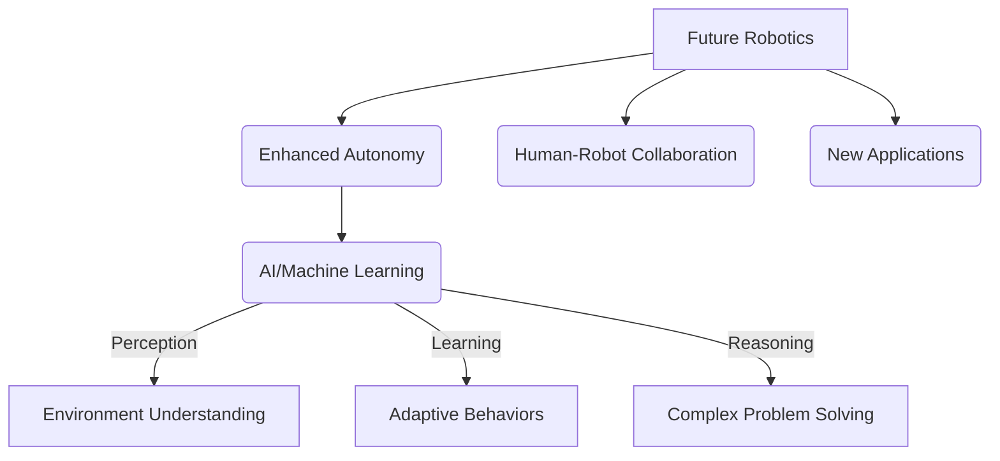

## 06-Future of Robotics

The field of robotics is on the cusp of transformative change, driven by advancements in artificial intelligence, materials science, and computational power. Looking ahead, robots are poised to become even more pervasive, intelligent, and integrated into the fabric of daily life, bringing both immense opportunities and new challenges.

### 6.1 Artificial Intelligence and Machine Learning

The synergy between AI/ML and robotics will continue to deepen, leading to more capable and autonomous systems.

*   **General Purpose AI:** The long-term goal of Artificial General Intelligence (AGI) could enable robots to perform any intellectual task a human can, leading to highly versatile robots.
*   **Reinforcement Learning:** Robots will learn complex behaviors directly from experience, adapting to unforeseen situations and optimizing performance in dynamic environments.
*   **Advanced Perception:** Enhanced computer vision, multimodal sensing (combining vision, touch, hearing), and predictive capabilities will allow robots to understand their surroundings with near-human proficiency.
*   **Human-like Cognition:** Robots may develop more sophisticated reasoning, planning, and problem-solving abilities, moving beyond mere task execution.

**Diagram 6.1: AI's Role in Future Robotics**



*Description: A diagram illustrating how AI and Machine Learning will be central to the advancements in future robotics, driving enhanced autonomy, adaptability, and the development of new applications.*

### 6.2 Human-Robot Interaction (HRI)

As robots become more common, their interaction with humans will become smoother, more intuitive, and more natural.

*   **Natural Language Interfaces:** Robots will understand and respond to spoken commands and gestures with greater accuracy, making them easier for non-technical users to operate.
*   **Emotional Intelligence:** Robots might be able to recognize and even express basic emotions, improving their effectiveness in social and caregiving roles.
*   **Shared Autonomy:** Humans and robots will increasingly work together, with robots handling repetitive or dangerous tasks while humans provide oversight and perform complex decision-making.
*   **Telepresence and Virtual/Augmented Reality:** Technologies that allow humans to remotely control robots or experience their environment through VR/AR will become more sophisticated, enabling deeper levels of remote presence.

### 6.3 Advanced Materials and Manufacturing

Innovations in materials and manufacturing techniques will lead to new forms and functionalities for robots.

*   **Soft Robotics:** Development of robots made from flexible, compliant materials will continue, enabling safer human-robot interaction, manipulation of delicate objects, and robust operation in unstructured environments.
*   **Modular and Reconfigurable Robots:** Robots composed of interchangeable modules that can be rearranged to suit different tasks, offering greater versatility and adaptability.
*   **Bio-inspired Robotics:** Robots that mimic the locomotion, sensing, or manipulation capabilities of biological organisms (e.g., flying insects, walking animals, fish).
*   **Additive Manufacturing (3D Printing):** Enables rapid prototyping and custom fabrication of complex robot components, including integrated sensors and actuators.

### 6.4 Swarm Robotics and Collaborative Systems

The future will see more systems composed of multiple, interacting robots.

*   **Swarm Intelligence:** Large numbers of simple robots working together to achieve complex tasks, often inspired by natural phenomena like ant colonies or bird flocks. Applications include environmental monitoring, search and rescue, and distributed manufacturing.
*   **Multi-Robot Coordination:** Sophisticated algorithms for task allocation, communication, and collision avoidance will enable effective collaboration among diverse robot teams.
*   **Decentralized Control:** Systems where individual robots make local decisions, leading to robust and scalable collective behavior.

### 6.5 Ubiquitous and Personalized Robotics

Robots will move beyond specialized industrial applications to become common in homes, cities, and public spaces, often tailored to individual needs.

*   **Smart Homes:** Integrated robotic systems that manage household tasks, security, and provide assistance to residents.
*   **Personalized Assistants:** Robots that learn individual preferences and habits, offering customized support in daily activities, education, and healthcare.
*   **Autonomous Transportation:** Fully self-driving cars, trucks, and delivery drones will transform logistics and personal mobility.
*   **Robotics in Space:** Continued development of robotic explorers, builders, and maintainers for space colonization and resource utilization.

### 6.6 Ethical Governance and Policy

As robots become more capable, the need for robust ethical frameworks and policy will intensify.

*   **Regulatory Frameworks:** Development of laws and standards for robot safety, accountability, data privacy, and ethical AI.
*   **International Cooperation:** Global collaboration to address challenges related to autonomous weapons, AI governance, and the societal impact of robotics.
*   **Public Education:** Increased efforts to educate the public about robotics, dispel myths, and foster informed discussions about its future.

The future of robotics is not just about technological advancement; it's about how humanity chooses to integrate these powerful tools responsibly, ensuring they serve to enhance, rather than diminish, human flourishing.

---

### Python Example: Simulating a Learning Robot (Reinforcement Learning Concept)

This Python example provides a highly simplified conceptual outline of how a robot might "learn" a preferred action through reinforcement (reward/penalty).

```python
import random

class LearningRobot:
    def __init__(self, name="RL_Bot", possible_actions=["move_left", "move_right", "stay"]):
        self.name = name
        self.actions = possible_actions
        # Simple Q-table: map state (current_env) to action values
        # In a real scenario, this would be much more complex (states, values, learning rate)
        self.q_table = {action: 0 for action in self.actions}
        self.learning_rate = 0.1
        self.discount_factor = 0.9
        self.epsilon = 0.2 # For exploration vs exploitation
        print(f"{self.name} initialized for learning.")

    def choose_action(self):
        """Chooses an action using epsilon-greedy policy."""
        if random.uniform(0, 1) < self.epsilon:
            # Explore: choose a random action
            action = random.choice(self.actions)
            print(f"[{self.name} - Explore] Chosen action: {action}")
            return action
        else:
            # Exploit: choose the action with the highest Q-value
            best_action = max(self.q_table, key=self.q_table.get)
            print(f"[{self.name} - Exploit] Chosen action: {best_action}")
            return best_action

    def receive_feedback(self, chosen_action, reward):
        """Updates Q-values based on feedback."""
        old_q_value = self.q_table[chosen_action]
        # Simplified update rule (no next state, just direct reward)
        # In full Q-learning: Q(s,a) = Q(s,a) + alpha * (reward + gamma * max(Q(s',a')) - Q(s,a))
        new_q_value = old_q_value + self.learning_rate * (reward - old_q_value)
        self.q_table[chosen_action] = new_q_value
        print(f"[{self.name} - Learning] Action '{chosen_action}' rewarded {reward}. New Q-value: {new_q_value:.2f}")

    def simulate_environment_interaction(self, iterations=5):
        print(f"\n--- {self.name} Learning Simulation ---")
        for i in range(iterations):
            print(f"\nIteration {i+1}:")
            action = self.choose_action()
            
            # Simulate environment giving a reward
            # For demonstration, reward "move_right" more often
            if action == "move_right":
                reward = random.choice([10, 5, 2])
            elif action == "move_left":
                reward = random.choice([-5, 0, 1])
            else: # stay
                reward = random.choice([0, 1])
            
            self.receive_feedback(action, reward)
            print(f"Current Q-Table: {self.q_table}")

if __name__ == "__main__":
    robot = LearningRobot()
    robot.simulate_environment_interaction(10)
    print("\n--- Final Learned Preferences ---")
    print(robot.q_table)
    print(f"Robot's preferred action: {max(robot.q_table, key=robot.q_table.get)}")
```

---

### C++ Example: Simple Modular Robot (Conceptual)

This C++ example shows how a robot could be composed of different "modules" that can be added or removed, representing a modular robot concept.

```cpp
#include <iostream>
#include <vector>
#include <string>
#include <memory> // For std::unique_ptr

// Base class for any robot module
class RobotModule {
public:
    virtual void operate() = 0; // Pure virtual function
    virtual std::string get_type() const = 0;
    virtual ~RobotModule() = default;
};

// Specific module implementations
class MobilityModule : public RobotModule {
public:
    void operate() override {
        std::cout << "  Mobility module moving." << std::endl;
    }
    std::string get_type() const override { return "Mobility"; }
};

class GripperModule : public RobotModule {
public:
    void operate() override {
        std::cout << "  Gripper module grasping." << std::endl;
    }
    std::string get_type() const override { return "Gripper"; }
};

class SensorModule : public RobotModule {
public:
    void operate() override {
        std::cout << "  Sensor module scanning environment." << std::endl;
    }
    std::string get_type() const override { return "Sensor"; }
};

// Robot composed of modules
class ModularRobot {
public:
    ModularRobot(std::string name) : name_(name) {
        std::cout << "Modular Robot '" << name_ << "' created." << std::endl;
    }

    void add_module(std::unique_ptr<RobotModule> module) {
        std::cout << "  Adding " << module->get_type() << " module." << std::endl;
        modules_.push_back(std::move(module));
    }

    void perform_all_operations() {
        std::cout << "\n" << name_ << " performing operations with all modules:" << std::endl;
        for (const auto& module : modules_) {
            module->operate();
        }
        std::cout << name_ << " operations complete." << std::endl;
    }

private:
    std::string name_;
    std::vector<std::unique_ptr<RobotModule>> modules_;
};

int main() {
    ModularRobot general_purpose_bot("Alpha");
    general_purpose_bot.add_module(std::make_unique<MobilityModule>());
    general_purpose_bot.add_module(std::make_unique<SensorModule>());
    general_purpose_bot.add_module(std::make_unique<GripperModule>());
    general_purpose_bot.perform_all_operations();

    ModularRobot explorer_bot("Beta");
    explorer_bot.add_module(std::make_unique<MobilityModule>());
    explorer_bot.add_module(std::make_unique<SensorModule>());
    explorer_bot.add_module(std::make_unique<SensorModule>()); // Two sensors
    explorer_bot.perform_all_operations();

    return 0;
}
```

---

### Arduino Example: Swarm Robot (Conceptual Leader/Follower)

This conceptual Arduino example shows a very basic "leader-follower" behavior for two hypothetical "swarm" robots using serial communication. This is highly simplified as true swarm robotics involves more complex decentralized algorithms.

```arduino
// This code would be uploaded to multiple Arduinos.
// For simplicity, imagine 'RobotA' and 'RobotB' communicating.

// Robot A (Leader)
#ifdef IS_LEADER
const int leaderLedPin = 13; // Onboard LED for leader status
const int triggerPin = 2;    // Button to trigger leader action

void setup() {
  Serial.begin(9600);
  pinMode(leaderLedPin, OUTPUT);
  pinMode(triggerPin, INPUT_PULLUP);
  Serial.println("Robot A (Leader) Ready.");
}

void loop() {
  if (digitalRead(triggerPin) == LOW) { // Button pressed
    digitalWrite(leaderLedPin, HIGH); // Leader LED ON
    Serial.println("Leader: Initiating action. Sending 'M' to followers.");
    Serial.write('M'); // Send 'M' for Move
    delay(200); // Debounce
    while(digitalRead(triggerPin) == LOW); // Wait for release
    delay(50);
  } else {
    digitalWrite(leaderLedPin, LOW); // Leader LED OFF
  }
  delay(10);
}
#endif

// Robot B (Follower)
#ifdef IS_FOLLOWER
const int followerLedPin = 12; // LED to indicate follower action

void setup() {
  Serial.begin(9600);
  pinMode(followerLedPin, OUTPUT);
  Serial.println("Robot B (Follower) Ready.");
}

void loop() {
  if (Serial.available()) {
    char command = Serial.read();
    if (command == 'M') {
      Serial.println("Follower: Received 'M' command. Performing move action.");
      digitalWrite(followerLedPin, HIGH); // Perform action (e.g., move LED on)
      delay(1000); // Simulate moving
      digitalWrite(followerLedPin, LOW);
      Serial.println("Follower: Move action complete.");
    }
  }
  delay(10);
}
#endif

// To compile: define IS_LEADER for one Arduino, and IS_FOLLOWER for another.
// E.g., add #define IS_LEADER or #define IS_FOLLOWER at the top of the sketch.
```

---

### Equations in LaTeX: Decentralized Control (Conceptual Consensus)

In swarm robotics, individual robots might try to reach a consensus. A simple update rule for a robot `i` to align its state `x_i` with its neighbors `j in N_i` could be:

```latex
x_{i}(t+1) = x_{i}(t) + alpha sum_{j in N_{i} (x_{j}(t) - x_{i}(t))
```

Where:
*   `N_i` is the set of neighbors of robot `i`.
*   `alpha` is the step size or learning rate.

---

### MCQs with Answers

1.  What is the long-term goal for AI in robotics that aims for human-level intellectual performance across any task?
    a) Reinforcement Learning
    b) Artificial General Intelligence (AGI)
    c) Machine Vision
    d) Natural Language Processing
    *Answer: b) Artificial General Intelligence (AGI)*

2.  Robots made from flexible and compliant materials, designed for safer human interaction, are part of which emerging field?
    a) Industrial Robotics
    b) Humanoid Robotics
    c) Soft Robotics
    d) Swarm Robotics
    *Answer: c) Soft Robotics*

3.  Which of the following best describes the concept of "swarm robotics"?
    a) A single, highly intelligent robot performing multiple tasks.
    b) Multiple robots connected by a single, powerful central controller.
    c) A large number of simple robots working together to achieve complex tasks.
    d) Robots that can change their physical shape to adapt to tasks.
    *Answer: c) A large number of simple robots working together to achieve complex tasks.*

---

### Practice Tasks

1.  **Future Robot Design:** Imagine you are designing a robot for a specific future application (e.g., an autonomous farming robot, a deep-sea explorer for a new planet, a personal medical assistant). Describe its key features, how it would interact with humans or its environment, and what emerging technologies (AI, soft robotics, etc.) it would leverage.
2.  **Ethical Foresight:** Choose one of the ethical challenges discussed in the previous chapter (e.g., job displacement, privacy, accountability). How might this challenge evolve in the next 20-30 years with advancements in robotics? Propose a futuristic solution or policy to address it.
3.  **Bio-inspired Exploration:** Research a specific animal or insect known for a unique movement or sensory ability (e.g., gecko climbing, bat echolocation, octopus manipulation). How could this biological principle be applied to design a future robot? Sketch your concept.

---

### Notes for Teachers

*   **Brainstorming Session:** Start with an open-ended brainstorming session: "What will robots be able to do in 50 years?" This encourages creative thinking.
*   **Sci-Fi Connection:** Connect future robotics concepts to science fiction literature or films. Discuss how these fictional depictions might inspire or warn about future developments.
*   **Expert Videos:** Show videos of cutting-edge robotics research (e.g., from university labs, Boston Dynamics, Google AI) to give students a glimpse into the near future.

### Notes for Students

*   **Impactful Field:** Robotics is one of the most impactful fields for the future. Your studies here can directly contribute to shaping that future.
*   **Beyond Current Tech:** Don't limit your thinking to current robot capabilities. Consider how exponential advancements in AI, sensors, and materials will redefine what's possible.
*   **Ethical Responsibility:** Remember that with great power comes great responsibility. The ability to design powerful robots also carries the duty to consider their ethical and societal implications.