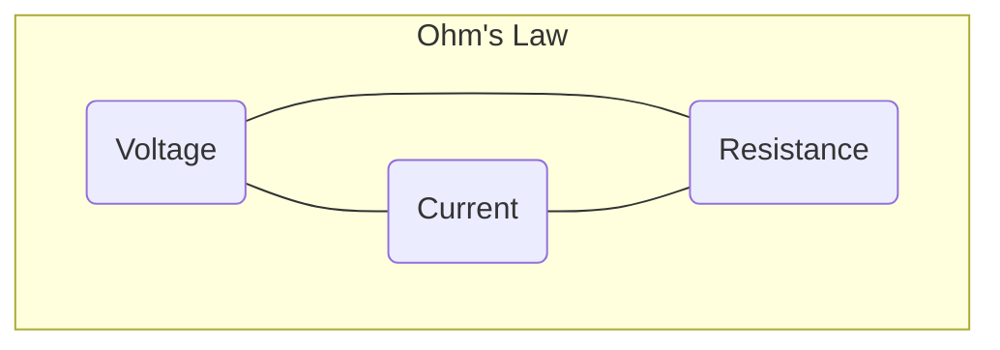

# Part 2: Electronics

## 01-Fundamentals of Electricity

Electronics is the backbone of all robotic systems. Without a solid understanding of fundamental electrical principles, it's impossible to design, troubleshoot, or even safely operate robots. This chapter lays the groundwork by introducing the core concepts of electricity, including charge, current, voltage, and resistance.

### 1.1 Electric Charge

At the heart of electricity is **electric charge**. All matter is made of atoms, which consist of protons (positive charge), neutrons (no charge), and electrons (negative charge).

*   **Protons and Electrons:** Protons and electrons have equal but opposite amounts of charge. An object is considered **neutral** if it has an equal number of protons and electrons.
*   **Static Electricity:** When there's an imbalance of charge (more electrons than protons, or vice-versa), an object becomes charged, leading to phenomena like static electricity.
*   **Unit of Charge:** The standard unit of electric charge is the **Coulomb (C)**. One electron has a charge of approximately `-1.602 times 10^{-19}` C.

### 1.2 Electric Current

**Electric current (I)** is the flow of electric charge. In most conductors, this flow is primarily due to the movement of electrons.

*   **Direction of Current:** Conventionally, current is defined as the direction of flow of *positive* charge. However, in metallic conductors, it's the negatively charged electrons that actually move in the opposite direction. This is a historical convention from when electricity was first studied.
*   **Unit of Current:** The standard unit of current is the **Ampere (A)**. One Ampere is defined as one Coulomb of charge passing a point in one second.

```latex
I = frac{Delta Q}{Delta t}
```

Where:
*   `I` is current in Amperes (A)
*   `Delta Q` is the change in charge in Coulombs (C)
*   `Delta t` is the change in time in seconds (s)

**Diagram 1.1: Electron Flow vs. Conventional Current**

```mermaid
flowchart LR
    A[High Potential (+)] --> B(Resistor)
    B --> C[Low Potential (-)]
    C -- Conventional Current Flow --> A
    A -- Electron Flow --> C
```

*Description: Illustrates the difference between conventional current flow (positive to negative) and actual electron flow (negative to positive) in a simple circuit.*

### 1.3 Voltage (Potential Difference)

**Voltage (V)**, also known as electric potential difference or electromotive force (EMF), is the "pressure" or "force" that drives electric current. It's the amount of potential energy difference between two points in an electric field.

*   **Analogy:** Think of voltage like water pressure in a pipe. Higher pressure means more force to push water (current) through.
*   **Unit of Voltage:** The standard unit of voltage is the **Volt (V)**. One Volt is defined as one Joule of energy per Coulomb of charge.

```latex
V = frac{Delta E}{Delta Q}
```

Where:
*   `V` is voltage in Volts (V)
*   `Delta E` is the change in energy in Joules (J)
*   `Delta Q` is the change in charge in Coulombs (C)

### 1.4 Resistance

**Resistance (R)** is the opposition to the flow of electric current. Materials that allow current to flow easily are called **conductors** (e.g., copper, silver), while materials that oppose current flow are **insulators** (e.g., rubber, plastic). Materials with properties between these two extremes are **semiconductors** (e.g., silicon).

*   **Factors Affecting Resistance:**
    *   **Material:** Different materials have different inherent resistance.
    *   **Length:** Longer conductors have more resistance.
    *   **Cross-sectional Area:** Thicker conductors have less resistance.
    *   **Temperature:** Resistance often increases with temperature in metals.
*   **Unit of Resistance:** The standard unit of resistance is the **Ohm (`Omega`)**.

### 1.5 Ohm's Law

**Ohm's Law** is a fundamental relationship between voltage, current, and resistance in a circuit. It states that the current flowing through a conductor between two points is directly proportional to the voltage across the two points and inversely proportional to the resistance between them.

```latex
V = I cdot R
```

Rearranging this formula, we can find:
```latex
I = frac{V}{R}
```
```latex
R = frac{V}{I}
```

**Diagram 1.2: Ohm's Law Triangle**



*Description: A visual aid for remembering Ohm's Law: V (top) equals I (bottom left) times R (bottom right).*

### 1.6 Electrical Power

**Electrical power (P)** is the rate at which electrical energy is converted into another form of energy (e.g., heat, light, mechanical motion).

*   **Unit of Power:** The standard unit of power is the **Watt (W)**. One Watt is defined as one Joule per second.

```latex
P = V cdot I
```

Using Ohm's Law, we can also express power as:
```latex
P = I^2 cdot R
```
```latex
P = frac{V^2}{R}
```

Understanding these fundamental concepts of charge, current, voltage, resistance, and power is essential for delving into the more complex aspects of electronics in robotics.

---

### C++ Example: Basic Ohm's Law Calculator

This C++ program calculates a missing value (Voltage, Current, or Resistance) given the other two, using Ohm's Law.

```cpp
#include <iostream>
#include <limits> // Required for numeric_limits

// Function to clear input buffer
void clearInputBuffer() {
    std::cin.ignore(std::numeric_limits<std::streamsize>::max(), '\n');
}

int main() {
    char choice;
    double val1, val2;

    std::cout << "Ohm's Law Calculator" << std::endl;
    std::cout << "--------------------" << std::endl;
    std::cout << "Calculate (V)oltage, (I)urrent, or (R)esistance? Enter V, I, or R: ";
    std::cin >> choice;
    clearInputBuffer(); // Clear any remaining newline character

    switch (toupper(choice)) {
        case 'V':
            std::cout << "Enter Current (A): ";
            std::cin >> val1;
            std::cout << "Enter Resistance (Ohms): ";
            std::cin >> val2;
            if (std::cin.fail()) {
                std::cerr << "Invalid input. Please enter numbers only." << std::endl;
                return 1;
            }
            std::cout << "Voltage (V) = " << val1 * val2 << " V" << std::endl;
            break;
        case 'I':
            std::cout << "Enter Voltage (V): ";
            std::cin >> val1;
            std::cout << "Enter Resistance (Ohms): ";
            std::cin >> val2;
            if (std::cin.fail() || val2 == 0) {
                std::cerr << "Invalid input. Resistance cannot be zero. Please enter numbers only." << std::endl;
                return 1;
            }
            std::cout << "Current (A) = " << val1 / val2 << " A" << std::endl;
            break;
        case 'R':
            std::cout << "Enter Voltage (V): ";
            std::cin >> val1;
            std::cout << "Enter Current (A): ";
            std::cin >> val2;
            if (std::cin.fail() || val2 == 0) {
                std::cerr << "Invalid input. Current cannot be zero. Please enter numbers only." << std::endl;
                return 1;
            }
            std::cout << "Resistance (Ohms) = " << val1 / val2 << " Ohms" << std::endl;
            break;
        default:
            std::cout << "Invalid choice. Please enter V, I, or R." << std::endl;
            break;
    }

    return 0;
}
```

---

### Python Example: Simulating a Simple Circuit's Power Consumption

This Python script calculates the power consumed by a component given its voltage and current, or resistance.

```python
def calculate_power(voltage=None, current=None, resistance=None):
    """
    Calculates power (P) given any two of Voltage (V), Current (I), Resistance (R).
    P = V * I
    P = I^2 * R
    P = V^2 / R
    """
    if voltage is not None and current is not None:
        return voltage * current
    elif current is not None and resistance is not None:
        return (current ** 2) * resistance
    elif voltage is not None and resistance is not None:
        if resistance == 0:
            return float('inf') # Infinite power if resistance is zero
        return (voltage ** 2) / resistance
    else:
        return "Error: Provide at least two values (V, I, or R)."

if __name__ == "__main__":
    print("Power Calculation Examples:")
    
    # Example 1: V and I given
    v1, i1 = 12, 2.5
    p1 = calculate_power(voltage=v1, current=i1)
    print(f"Voltage: {v1}V, Current: {i1}A -> Power: {p1}W") # Expected: 30W

    # Example 2: I and R given
    i2, r2 = 3, 4
    p2 = calculate_power(current=i2, resistance=r2)
    print(f"Current: {i2}A, Resistance: {r2}Ω -> Power: {p2}W") # Expected: 36W

    # Example 3: V and R given
    v3, r3 = 9, 3
    p3 = calculate_power(voltage=v3, resistance=r3)
    print(f"Voltage: {v3}V, Resistance: {r3}Ω -> Power: {p3}W") # Expected: 27W

    # Example 4: Missing inputs
    p4 = calculate_power(voltage=10)
    print(f"Voltage: 10V -> Power: {p4}")

    # Example 5: Zero resistance
    v5, r5 = 12, 0
    p5 = calculate_power(voltage=v5, resistance=r5)
    print(f"Voltage: {v5}V, Resistance: {r5}Ω -> Power: {p5}")
```

---

### Arduino Example: Reading Analog Voltage (Potentiometer)

This Arduino sketch reads the analog voltage from a potentiometer (a variable resistor) and prints it to the serial monitor. This demonstrates reading a varying voltage, a fundamental electronic task.

```arduino
const int analogPin = A0; // Analog input pin connected to the potentiometer

void setup() {
  Serial.begin(9600); // Initialize serial communication at 9600 bits per second
  Serial.println("Analog Voltage Reader Ready.");
}

void loop() {
  // Read the analog input value from the potentiometer (0-1023)
  int sensorValue = analogRead(analogPin); 
  
  // Convert the analog reading (0-1023) to a voltage (0-5V)
  // Assuming a 5V Arduino board.
  float voltage = sensorValue * (5.0 / 1023.0); 
  
  Serial.print("Sensor Value: ");
  Serial.print(sensorValue);
  Serial.print("\t Voltage: "); // Tab for separation
  Serial.print(voltage);
  Serial.println(" V");
  
  delay(100); // Wait for 100 milliseconds before the next reading
}
```

---

### Equations in LaTeX: Resistance of a Wire

The resistance `R` of a wire can be calculated using its physical properties:

```latex
R = rho frac{L}{A}
```

Where:
*   `R` is the resistance in Ohms (`Omega`).
*   `rho` (rho) is the resistivity of the material in Ohm-meters (`Omega cdot m`).
*   `L` is the length of the conductor in meters (m).
*   `A` is the cross-sectional area of the conductor in square meters (`m^2`).

---

### MCQs with Answers

1.  What is the standard unit of electric current?
    a) Volt (V)
    b) Ohm (`Omega`)
    c) Ampere (A)
    d) Coulomb (C)
    *Answer: c) Ampere (A)*

2.  Which statement best describes voltage?
    a) The opposition to the flow of current.
    b) The rate at which electrical energy is converted.
    c) The flow of electric charge.
    d) The electric potential difference that drives current.
    *Answer: d) The electric potential difference that drives current.*

3.  If a circuit has a voltage of 12V and a current of 2A, what is its resistance according to Ohm's Law?
    a) 24 `Omega`
    b) 6 `Omega`
    c) 0.16 `Omega`
    d) 10 `Omega`
    *Answer: b) 6 `Omega` (`R = V/I = 12V / 2A = 6Omega`)*

---

### Practice Tasks

1.  **Ohm's Law Calculations:** Solve the following problems:
    *   A light bulb has a resistance of 100 `Omega` and is connected to a 120V power supply. What is the current flowing through it?
    *   A device draws 0.5A of current when connected to a 9V battery. What is the resistance of the device?
    *   If a motor has a resistance of 5 `Omega` and 3A of current flows through it, what is the voltage across the motor?
2.  **Power Consumption:** Calculate the power consumed by each component in the problems above.
3.  **Real-world Resistance:** Research the resistivity of common materials like copper, aluminum, and plastic. Explain why copper is preferred for electrical wiring and plastic for insulation.

---

### Notes for Teachers

*   **Analogies:** Use water analogies (water pressure = voltage, water flow = current, pipe constriction = resistance) to help students grasp abstract electrical concepts.
*   **Hands-on Experiment:** Simple circuits with a battery, LED, and resistors can visibly demonstrate the effects of current and resistance. Multimeters can be introduced to measure V, I, R.
*   **Safety First:** Emphasize electrical safety when discussing current and voltage. Never work with mains electricity without proper supervision.

### Notes for Students

*   **Build a Foundation:** These fundamental concepts are the building blocks for all advanced electronics. Make sure you understand them thoroughly.
*   **Practice Problems:** The best way to learn Ohm's Law and power calculations is through consistent practice.
*   **Relate to Robotics:** Always try to think about how these electrical principles apply to the components in a robot (e.g., how much current a motor draws, the voltage required for a sensor).