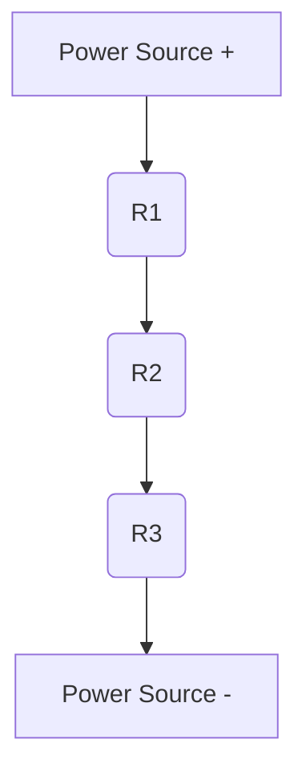
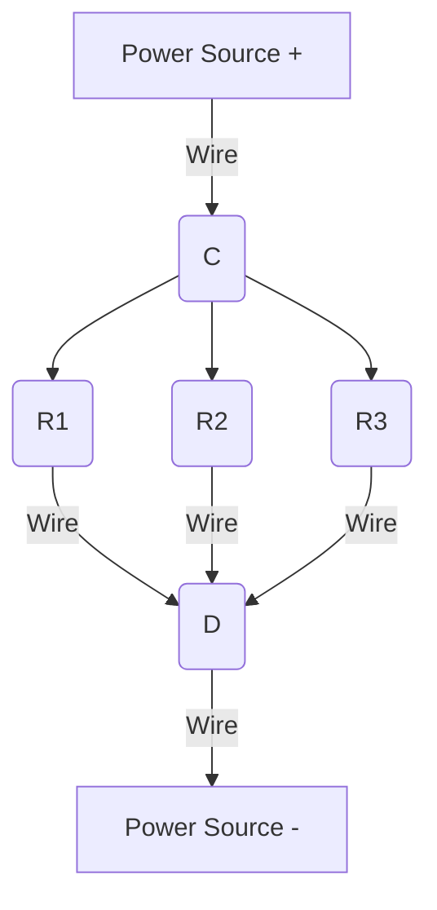
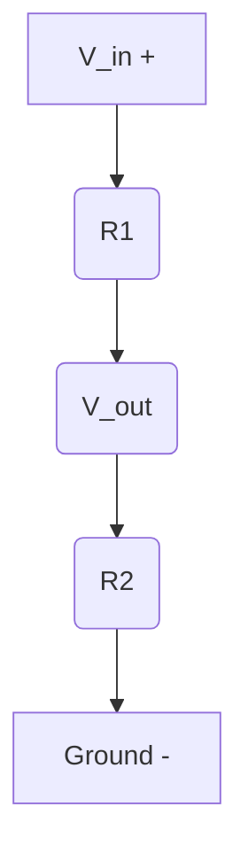

## 03-Basic Circuits and Ohm's Law

Understanding how electronic components interact within a circuit is fundamental to robotics. This chapter builds upon the basic concepts of electricity and introduces simple circuit configurations, explaining how components behave when connected in series and parallel, and reiterating the critical role of Ohm's Law in circuit analysis.

### 3.1 What is a Circuit?

An **electric circuit** is a closed loop through which electric current can flow. For a current to flow, there must be:
1.  **A Power Source:** To provide voltage (e.g., battery, power supply).
2.  **A Conductor:** A path for current to flow (e.g., wires, PCB traces).
3.  **A Load:** A component that consumes electrical energy and converts it into another form (e.g., LED, motor, resistor).
4.  **A Closed Path:** The current must be able to return to the power source to complete the loop.

If any part of this loop is broken, it's an **open circuit**, and no current will flow. If there's an unintended low-resistance path, it's a **short circuit**, which can cause excessive current and damage.

### 3.2 Series Circuits

In a **series circuit**, components are connected end-to-end, forming a single path for current to flow.

*   **Current (I):** The current is the same at every point in a series circuit.
*   **Voltage (V):** The total voltage across all components is the sum of the individual voltage drops across each component.
```latex
V_{total} = V_{1} + V_{2} + V_{3} + dots
```
*   **Resistance (R):** The total equivalent resistance is the sum of the individual resistances.
```latex
R_{total} = R_{1} + R_{2} + R_{3} + dots
```

**Diagram 3.1: Resistors in Series**



*Description: Three resistors (R1, R2, R3) connected in series with a power source, showing a single path for current.*

### 3.3 Parallel Circuits

In a **parallel circuit**, components are connected across the same two points, creating multiple paths for current to flow.

*   **Voltage (V):** The voltage across each branch in a parallel circuit is the same as the total voltage.
```latex
V_{total} = V_{1} = V_{2} = V_{3} = dots
```
*   **Current (I):** The total current flowing from the source is the sum of the currents flowing through each branch.
```latex
I_{total} = I_{1} + I_{2} + I_{3} + dots
```
*   **Resistance (R):** The reciprocal of the total equivalent resistance is the sum of the reciprocals of the individual resistances.
```latex
frac{1}{R_{total} = frac{1}{R_{1} + frac{1}{R_{2} + frac{1}{R_{3} + dots
```
    For two resistors in parallel:
```latex
R_{total} = frac{R_{1} cdot R_{2}{R_{1} + R_{2}
```


**Diagram 3.2: Resistors in Parallel**



*Description: Three resistors (R1, R2, R3) connected in parallel with a power source, showing multiple paths for current, each experiencing the same voltage.*

### 3.4 Combining Series and Parallel Circuits

Many practical circuits are combinations of series and parallel connections. To analyze these, you systematically reduce the complex circuit into simpler series and parallel equivalent resistances until a single total equivalent resistance is found.

**Steps:**
1.  Identify simple series and parallel combinations.
2.  Calculate their equivalent resistances.
3.  Replace the combinations with their equivalents, simplifying the circuit diagram.
4.  Repeat until the circuit is reduced to a single equivalent resistance.

### 3.5 Ohm's Law Revisited

Ohm's Law (`V = I cdot R`) is the cornerstone for analyzing all these circuits. Once you find the total equivalent resistance (`R_{total}`) and know the total voltage (`V_{total}`), you can calculate the total current (`I_{total} = V_{total} / R_{total}`). Then, you can use Ohm's Law and the properties of series/parallel circuits to find the voltage drops and currents through individual components.

### 3.6 Voltage Dividers

A **voltage divider** is a simple series circuit used to create an output voltage that is a fraction of the input voltage. It consists of two series resistors connected across a voltage source.

```latex
V_{out} = V_{in} frac{R_{2}{R_{1} + R_{2}
```

Where:
*   `V_{in}` is the total input voltage across `R_{1}` and `R_{2}`.
*   `V_{out}` is the voltage across `R_{2}`.
*   `R_{1}` and `R_{2}` are the resistances.

Voltage dividers are extremely common in sensor circuits in robotics to scale down sensor output voltages to a range acceptable by a microcontroller's analog input.

**Diagram 3.3: Voltage Divider Circuit**



*Description: A voltage divider circuit showing an input voltage (Vin) across two series resistors (R1, R2), with the output voltage (Vout) taken across R2.*

### 3.7 Current Dividers

A **current divider** is a parallel circuit that divides the total current among its branches. The current through a specific branch (e.g., `R_1`) can be calculated as:

```latex
I_{1} = I_{total} frac{R_{total_parallel}{R_{1}
```

Or for two resistors in parallel:
```latex
I_{1} = I_{total} frac{R_{2}{R_{1} + R_{2}
```
```latex
I_{2} = I_{total} frac{R_{1}{R_{1} + R_{2}
```

Where:
*   `I_{total}` is the total current entering the parallel combination.
*   `R_{total_parallel}` is the equivalent resistance of the parallel combination.

Mastering these basic circuit concepts and Ohm's Law is crucial for designing and analyzing the electrical systems that power and control robots.

---

### C++ Example: Resistor Network Calculator (Series/Parallel)

This C++ program calculates the equivalent resistance of resistors in series or parallel.

```cpp
#include <iostream>
#include <vector>
#include <numeric> // For std::accumulate

double calculate_series_resistance(const std::vector<double>& resistances) {
    if (resistances.empty()) return 0.0;
    return std::accumulate(resistances.begin(), resistances.end(), 0.0);
}

double calculate_parallel_resistance(const std::vector<double>& resistances) {
    if (resistances.empty()) return 0.0;
    double sum_of_reciprocals = 0.0;
    for (double r : resistances) {
        if (r == 0) return 0.0; // Short circuit
        sum_of_reciprocals += 1.0 / r;
    }
    if (sum_of_reciprocals == 0) return 0.0; // Avoid division by zero if all resistances are infinite (open circuit)
    return 1.0 / sum_of_reciprocals;
}

int main() {
    std::cout << "Resistor Network Calculator" << std::endl;
    std::cout << "---------------------------" << std::endl;

    // Series Example
    std::vector<double> series_res = {100.0, 220.0, 330.0};
    double r_series = calculate_series_resistance(series_res);
    std::cout << "Resistors in series: ";
    for (double r : series_res) std::cout << r << " ";
    std::cout << "Ohms. Equivalent Resistance = " << r_series << " Ohms." << std::endl;

    // Parallel Example
    std::vector<double> parallel_res = {100.0, 200.0};
    double r_parallel = calculate_parallel_resistance(parallel_res);
    std::cout << "Resistors in parallel: ";
    for (double r : parallel_res) std::cout << r << " ";
    std::cout << "Ohms. Equivalent Resistance = " << r_parallel << " Ohms." << std::endl;
    // For two resistors, R_eq = (R1*R2)/(R1+R2) = (100*200)/(100+200) = 20000/300 = 66.67 Ohms

    std::vector<double> parallel_res_multi = {100.0, 200.0, 50.0};
    double r_parallel_multi = calculate_parallel_resistance(parallel_res_multi);
    std::cout << "Resistors in parallel: ";
    for (double r : parallel_res_multi) std::cout << r << " ";
    std::cout << "Ohms. Equivalent Resistance = " << r_parallel_multi << " Ohms." << std::endl;

    // Voltage Divider Example
    double Vin = 9.0;
    double R1_vd = 1000.0; // 1k Ohm
    double R2_vd = 2000.0; // 2k Ohm
    double Vout = Vin * (R2_vd / (R1_vd + R2_vd));
    std::cout << "\nVoltage Divider (Vin=" << Vin << "V, R1=" << R1_vd << " Ohms, R2=" << R2_vd << " Ohms): Vout = " << Vout << " V." << std::endl;
    // Expected Vout = 9 * (2000 / 3000) = 9 * (2/3) = 6V

    return 0;
}
```

---

### Python Example: Simulating a Voltage Divider for a Sensor Input

This Python script simulates a sensor whose output voltage is scaled down by a voltage divider to be readable by a microcontroller's analog input.

```python
def calculate_voltage_divider_output(vin, r1, r2):
    """
    Calculates the output voltage of a voltage divider.
    Vout = Vin * (R2 / (R1 + R2))
    """
    if (r1 + r2) == 0:
        print("Error: Sum of resistances cannot be zero.")
        return 0.0
    return vin * (r2 / (r1 + r2))

if __name__ == "__main__":
    print("Simulating a Sensor Voltage Divider:\n")

    # Assume a sensor outputs up to 10V (e.g., from an external module)
    # Microcontroller Analog Input typically accepts 0-5V.
    # We need to scale 0-10V down to 0-5V.
    # If Vmax = 10V and Vout_max = 5V, then Vout_max / Vin_max = R2 / (R1 + R2) = 5/10 = 0.5
    # So, R2 must be equal to R1. Let's choose R1 = 10k, R2 = 10k.

    R1_divider = 10000 # 10 kOhms
    R2_divider = 10000 # 10 kOhms
    microcontroller_max_analog_input = 5.0 # Volts

    print(f"Voltage Divider Setup: R1 = {R1_divider/1000}kΩ, R2 = {R2_divider/1000}kΩ")
    print(f"Microcontroller Max Input: {microcontroller_max_analog_input}V\n")

    sensor_outputs = [0.0, 2.5, 5.0, 7.5, 10.0, 12.0] # Various possible sensor output voltages

    for sensor_vin in sensor_outputs:
        divided_vout = calculate_voltage_divider_output(sensor_vin, R1_divider, R2_divider)
        
        print(f"Sensor Output (Vin): {sensor_vin:.2f}V -> Divided Output (Vout): {divided_vout:.2f}V")
        
        if divided_vout > microcontroller_max_analog_input:
            print(f"  WARNING: Divided voltage {divided_vout:.2f}V exceeds microcontroller's max input {microcontroller_max_analog_input}V!")
```

---

### Arduino Example: LED Brightness Control (Voltage Division with Potentiometer)

This Arduino sketch uses a potentiometer (variable resistor) to create a voltage divider, which then controls the brightness of an LED using PWM (Pulse Width Modulation). This demonstrates a practical application of voltage division.

```arduino
const int potentiometerPin = A0; // Analog input pin for potentiometer
const int ledPin = 9;            // Digital pin with PWM capability for LED

void setup() {
  Serial.begin(9600);
  pinMode(ledPin, OUTPUT);
  Serial.println("LED Brightness Control (Voltage Divider with Potentiometer) Ready.");
}

void loop() {
  // Read the potentiometer value (0-1023)
  int sensorValue = analogRead(potentiometerPin);
  
  // Map the sensor value (0-1023) to an LED brightness value (0-255)
  // This is effectively scaling the voltage from the potentiometer (0-5V)
  // to the 0-5V range for PWM, where 0 is off and 255 is full brightness.
  int ledBrightness = map(sensorValue, 0, 1023, 0, 255);
  
  // Write the brightness value to the LED using PWM
  analogWrite(ledPin, ledBrightness);
  
  Serial.print("Potentiometer Value: ");
  Serial.print(sensorValue);
  Serial.print("\t LED Brightness: ");
  Serial.println(ledBrightness);
  
  delay(10); // Small delay to smooth out readings
}
```

---

### Equations in LaTeX: Kirchhoff's Current Law (KCL) and Voltage Law (KVL)

These laws are essential for analyzing complex circuits:

**Kirchhoff's Current Law (KCL):** The algebraic sum of currents entering a node (or a closed boundary) is zero. In other words, the total current entering a node is equal to the total current leaving the node.

```latex
sum I_{in} = sum I_{out}
```

**Kirchhoff's Voltage Law (KVL):** The algebraic sum of all voltages around any closed loop in a circuit is zero. In other words, the sum of voltage drops equals the sum of voltage rises in a closed loop.

```latex
sum V_{drops} = sum V_{rises}
```

---

### MCQs with Answers

1.  In a series circuit, what is true about the current?
    a) It increases after each component.
    b) It is the same at every point.
    c) It is divided among the components.
    d) It decreases after each component.
    *Answer: b) It is the same at every point.*

2.  If three resistors (R1, R2, R3) are connected in parallel, the total equivalent resistance (`R_{total}`) is calculated using the formula:
    a) `R_{total} = R_{1} + R_{2} + R_{3}`
    b) `R_{total} = (R_{1} cdot R_{2} cdot R_{3}) / (R_{1} + R_{2} + R_{3})`
    c) `1/R_{total} = 1/R_{1} + 1/R_{2} + 1/R_{3}`
    d) `R_{total} = R_{1} cdot R_{2} cdot R_{3}`
    *Answer: c) `1/R_{total} = 1/R_{1} + 1/R_{2} + 1/R_{3}`*

3.  A voltage divider is used to:
    a) Increase the output voltage.
    b) Create an output voltage that is a fraction of the input voltage.
    c) Convert AC voltage to DC voltage.
    d) Limit the total current in a circuit.
    *Answer: b) Create an output voltage that is a fraction of the input voltage.*

---

### Practice Tasks

1.  **Circuit Analysis:** Draw a circuit with a 9V battery. Connect a 100 `Omega` resistor in series with two 200 `Omega` resistors that are connected in parallel with each other.
    *   Calculate the total equivalent resistance of the circuit.
    *   Calculate the total current drawn from the battery.
    *   Calculate the current flowing through each 200 `Omega` resistor.
    *   Calculate the voltage drop across the 100 `Omega` resistor.
2.  **Voltage Divider Design:** You have a 12V power supply and need to provide 3V to a sensor. Design a voltage divider circuit using two resistors. Choose appropriate resistor values (e.g., from common E-series values) and explain your choice.
3.  **Breadboard Exercise:** Using a breadboard, a 5V power source (e.g., Arduino 5V pin), an LED, and a 220 `Omega` resistor, build a simple series circuit to light the LED. Then, add another 220 `Omega` resistor in series. Observe and explain the change in LED brightness.

---

### Notes for Teachers

*   **Breadboard Practice:** Hands-on experience with breadboards is critical. Start with very simple circuits and gradually increase complexity.
*   **Multimeter Use:** Teach students how to use a multimeter to measure voltage, current, and resistance in their circuits. This provides immediate feedback and reinforces theoretical concepts.
*   **Common Mistakes:** Point out common beginner mistakes like short circuits, reverse polarity, and forgetting current-limiting resistors for LEDs.

### Notes for Students

*   **Start Simple:** Master series and parallel concepts with resistors before moving to more complex components.
*   **Draw Diagrams:** Always draw clear circuit diagrams before building anything. Label components, voltages, and currents.
*   **Check Your Math:** Use Ohm's Law and the series/parallel rules to predict values, then measure them on your physical circuit to verify your understanding.
*   **Safety with Power:** Be mindful of power ratings for components. Ensure your power source doesn't exceed the safe operating limits of your components.
