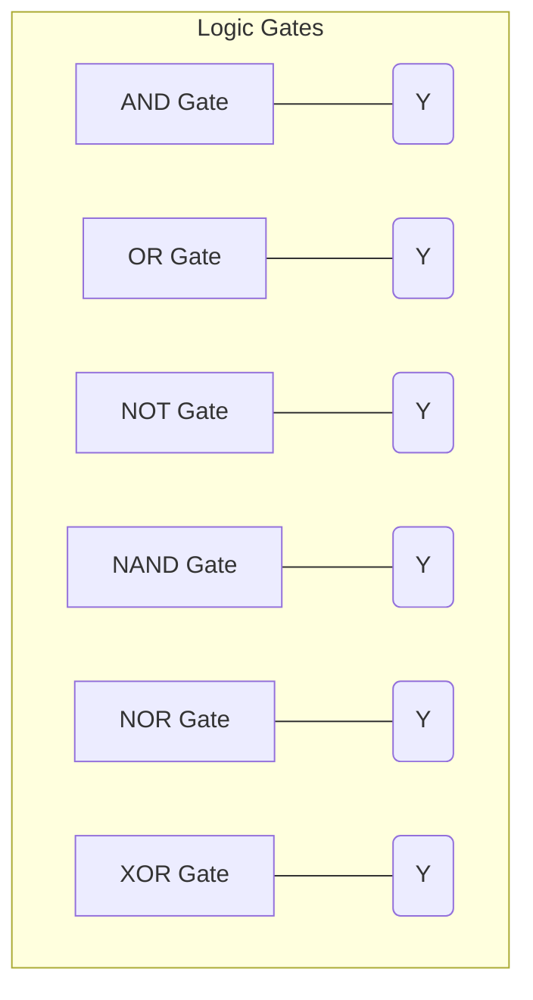

## 04-Digital Electronics and Logic Gates

While analog electronics deal with continuous signals, digital electronics deals with discrete signals, typically represented by two states: HIGH (logic 1) and LOW (logic 0). This binary nature is the foundation of all modern computing and, consequently, modern robotics. This chapter introduces the basic principles of digital electronics, including logic gates and Boolean algebra.

### 4.1 Analog vs. Digital Signals

*   **Analog Signals:** Vary continuously over time, taking on any value within a given range (e.g., sound waves, temperature, light intensity).
*   **Digital Signals:** Represent information using discrete values, typically two states (binary 0 and 1), which correspond to distinct voltage levels (e.g., 0V for LOW, 5V for HIGH).

Robotics often involves converting analog sensor data into digital signals for processing by a microcontroller, and then converting digital control signals back into analog commands for actuators.

### 4.2 Binary Representation

Digital systems use the **binary number system** (base-2), which uses only two digits: 0 and 1.
*   **Bit:** A single binary digit (0 or 1).
*   **Byte:** A group of 8 bits.
*   **Logic Levels:** In most digital circuits, a LOW state (logic 0) is represented by a voltage close to 0V (e.g., 0-0.8V), and a HIGH state (logic 1) is represented by a voltage close to the supply voltage (e.g., 2V-5V for a 5V system).

### 4.3 Logic Gates

**Logic gates** are the fundamental building blocks of digital circuits. They take one or more binary inputs and produce a single binary output based on a specific logical function. The relationship between inputs and outputs is defined by a **truth table**.

#### 4.3.1 AND Gate

*   **Function:** Output is HIGH (1) only if ALL inputs are HIGH (1).
*   **Symbol:** (D-shaped)
*   **Truth Table:**
| A | B | Y |
|---|---|---|
| 0 | 0 | 0 |
| 0 | 1 | 0 |
| 1 | 0 | 0 |
| 1 | 1 | 1 |

#### 4.3.2 OR Gate

*   **Function:** Output is HIGH (1) if ANY input is HIGH (1).
*   **Symbol:** (Curved input, pointed output)
*   **Truth Table:**
| A | B | Y |
|---|---|---|
| 0 | 0 | 0 |
| 0 | 1 | 1 |
| 1 | 0 | 1 |
| 1 | 1 | 1 |

#### 4.3.3 NOT Gate (Inverter)

*   **Function:** Output is the inverse of the input. If input is HIGH, output is LOW; if input is LOW, output is HIGH.
*   **Symbol:** (Triangle with a circle at the output)
*   **Truth Table:**
| A | Y |
|---|---|
| 0 | 1 |
| 1 | 0 |

#### 4.3.4 NAND Gate

*   **Function:** NOT AND. Output is LOW (0) only if ALL inputs are HIGH (1); otherwise, output is HIGH (1). It's an AND gate followed by a NOT gate.
*   **Symbol:** (AND gate with a circle at the output)

#### 4.3.5 NOR Gate

*   **Function:** NOT OR. Output is HIGH (1) only if ALL inputs are LOW (0); otherwise, output is LOW (0). It's an OR gate followed by a NOT gate.
*   **Symbol:** (OR gate with a circle at the output)

#### 4.3.6 XOR Gate (Exclusive OR)

*   **Function:** Output is HIGH (1) if inputs are DIFFERENT; otherwise, output is LOW (0).
*   **Symbol:** (OR gate with an additional curved line at the input)

**Diagram 4.1: Basic Logic Gate Symbols**



*Description: Standard symbols for common basic logic gates.*

### 4.4 Boolean Algebra

**Boolean algebra** is a mathematical system for analyzing and simplifying digital circuits. It uses variables that can only have two values (0 or 1) and operations that correspond to logic gates.

*   **Operations:**
    *   AND: represented by `.` or simply juxtaposition (e.g., A · B or AB)
    *   OR: represented by `+` (e.g., A + B)
    *   NOT: represented by an apostrophe (A') or an overbar (`bar{A}`)

*   **Key Laws/Theorems:**
    *   **Commutative Laws:** A + B = B + A; A · B = B · A
    *   **Associative Laws:** (A + B) + C = A + (B + C); (A · B) · C = A · (B · C)
    *   **Distributive Laws:** A · (B + C) = A · B + A · C; A + (B · C) = (A + B) · (A + C)
    *   **Identity Laws:** A + 0 = A; A · 1 = A
    *   **Complement Laws:** A + A' = 1; A · A' = 0
    *   **Idempotent Laws:** A + A = A; A · A = A
    *   **De Morgan's Theorems:** (A + B)' = A' · B'; (A · B)' = A' + B'

Boolean algebra allows engineers to express complex logic functions concisely and then simplify them to minimize the number of gates required, reducing cost and power consumption.

### 4.5 Combinational Logic Circuits

Combinational logic circuits are digital circuits where the output depends *only* on the current input values. They have no memory or feedback loops.

*   **Examples:** Adders, subtractors, multiplexers, demultiplexers, encoders, decoders.
*   **Construction:** Built by combining basic logic gates.

### 4.6 Sequential Logic Circuits

Sequential logic circuits are digital circuits where the output depends not only on the current input values but also on the *past* sequence of inputs (i.e., they have memory).

*   **Memory Elements:** These circuits incorporate memory elements called **flip-flops** or **latches**.
*   **Examples:** Flip-flops, registers, counters, state machines.
*   **Clock Signal:** Often controlled by a clock signal to synchronize operations.

Microcontrollers in robotics extensively use both combinational (for immediate decision-making) and sequential logic (for remembering states, counting, timing, etc.). Understanding these concepts is essential for programming microcontrollers and interfacing with digital sensors.

---

### C++ Example: Simulating Logic Gates

This C++ program defines functions to simulate the behavior of basic logic gates.

```cpp
#include <iostream>
#include <string>

// Function to print truth table header
void print_header(const std::string& gate_name, const std::string& inputs, const std::string& output) {
    std::cout << "\n--- " << gate_name << " Gate ---\n";
    std::cout << inputs << " | " << output << std::endl;
    std::cout << "---|---" << (inputs.length() > 1 ? "---" : "") << std::endl;
}

// AND Gate
bool AND(bool A, bool B) {
    return A && B;
}

// OR Gate
bool OR(bool A, bool B) {
    return A || B;
}

// NOT Gate
bool NOT(bool A) {
    return !A;
}

// NAND Gate
bool NAND(bool A, bool B) {
    return !(A && B);
}

// NOR Gate
bool NOR(bool A, bool B) {
    return !(A || B);
}

// XOR Gate
bool XOR(bool A, bool B) {
    return A != B; // Equivalent to (A && !B) || (!A && B)
}


int main() {
    // AND Gate
    print_header("AND", "A B", "Y");
    std::cout << "0 0 | " << AND(0, 0) << std::endl;
    std::cout << "0 1 | " << AND(0, 1) << std::endl;
    std::cout << "1 0 | " << AND(1, 0) << std::endl;
    std::cout << "1 1 | " << AND(1, 1) << std::endl;

    // OR Gate
    print_header("OR", "A B", "Y");
    std::cout << "0 0 | " << OR(0, 0) << std::endl;
    std::cout << "0 1 | " << OR(0, 1) << std::endl;
    std::cout << "1 0 | " << OR(1, 0) << std::endl;
    std::cout << "1 1 | " << OR(1, 1) << std::endl;

    // NOT Gate
    print_header("NOT", "A", "Y");
    std::cout << "0 | " << NOT(0) << std::endl;
    std::cout << "1 | " << NOT(1) << std::endl;

    // NAND Gate
    print_header("NAND", "A B", "Y");
    std::cout << "0 0 | " << NAND(0, 0) << std::endl;
    std::cout << "0 1 | " << NAND(0, 1) << std::endl;
    std::cout << "1 0 | " << NAND(1, 0) << std::endl;
    std::cout << "1 1 | " << NAND(1, 1) << std::endl;
    
    // NOR Gate
    print_header("NOR", "A B", "Y");
    std::cout << "0 0 | " << NOR(0, 0) << std::endl;
    std::cout << "0 1 | " << NOR(0, 1) << std::endl;
    std::cout << "1 0 | " << NOR(1, 0) << std::endl;
    std::cout << "1 1 | " << NOR(1, 1) << std::endl;

    // XOR Gate
    print_header("XOR", "A B", "Y");
    std::cout << "0 0 | " << XOR(0, 0) << std::endl;
    std::cout << "0 1 | " << XOR(0, 1) << std::endl;
    std::cout << "1 0 | " << XOR(1, 0) << std::endl;
    std::cout << "1 1 | " << XOR(1, 1) << std::endl;


    return 0;
}
```

---

### Python Example: Implementing a Simple Binary Adder (Combinational Logic)

This Python function simulates a single-bit full adder, a basic combinational logic circuit for arithmetic.

```python
def full_adder(A, B, C_in):
    """
    Simulates a single-bit full adder.
    Inputs:
        A, B: two single-bit operands
        C_in: carry-in from previous (less significant) bit
    Outputs:
        Sum: the sum bit
        C_out: the carry-out to the next (more significant) bit
    """
    # Sum = A XOR B XOR C_in
    Sum = (A ^ B) ^ C_in
    
    # C_out = (A AND B) OR (C_in AND (A XOR B))
    C_out = (A and B) or (C_in and (A ^ B))
    
    return Sum, C_out

if __name__ == "__main__":
    print("Single-Bit Full Adder Truth Table:")
    print("A B Cin | Sum Cout")
    print("------------------")

    test_cases = [
        (0, 0, 0), (0, 0, 1), (0, 1, 0), (0, 1, 1),
        (1, 0, 0), (1, 0, 1), (1, 1, 0), (1, 1, 1)
    ]

    for A, B, C_in in test_cases:
        Sum, C_out = full_adder(A, B, C_in)
        print(f"{A} {B} {C_in} |   {Sum}   {C_out}")

    print("\nExample: Adding 1 + 1 + Carry_in(0):")
    sum_val, carry_out = full_adder(1, 1, 0)
    print(f"1 + 1 + 0 = Sum: {sum_val}, Carry_out: {carry_out}") # Expected: Sum 0, Cout 1
```

---

### Arduino Example: Digital Input/Output (Button and LED)

This Arduino sketch demonstrates basic digital electronics: reading a digital input (a button) and controlling a digital output (an LED) based on the button's state.

```arduino
const int buttonPin = 2; // Digital input pin for the button
const int ledPin = 13;   // Digital output pin for the LED (onboard LED)

// Variable to store the current state of the button
int buttonState = 0; 

void setup() {
  Serial.begin(9600);      // Initialize serial communication
  pinMode(ledPin, OUTPUT);   // Set the LED pin as an output
  pinMode(buttonPin, INPUT_PULLUP); // Set the button pin as an input with internal pull-up resistor
                                    // This means the pin will be HIGH by default, and LOW when button is pressed.
  Serial.println("Digital I/O (Button and LED) Ready.");
}

void loop() {
  // Read the state of the button
  buttonState = digitalRead(buttonPin);

  // Check if the button is pressed (LOW, due to INPUT_PULLUP)
  if (buttonState == LOW) {
    // If pressed, turn the LED on
    digitalWrite(ledPin, HIGH);
    Serial.println("Button PRESSED -> LED ON");
  } else {
    // If not pressed, turn the LED off
    digitalWrite(ledPin, LOW);
    Serial.println("Button RELEASED -> LED OFF");
  }
  delay(50); // Small delay to debounce and avoid rapid state changes
}
```

---

### Equations in LaTeX: De Morgan's Theorems

De Morgan's Theorems are crucial for simplifying and converting Boolean expressions:

```latex
overline{A + B} = overline{A} cdot overline{B}
```
(The complement of a sum is the product of the complements)

```latex
overline{A cdot B} = overline{A} + overline{B}
```
(The complement of a product is the sum of the complements)

---

### MCQs with Answers

1.  What are the two discrete states typically used in digital electronics?
    a) Analog and Digital
    b) High and Low
    c) Current and Voltage
    d) Resistor and Capacitor
    *Answer: b) High and Low*

2.  Which logic gate produces a HIGH output only if all its inputs are HIGH?
    a) OR Gate
    b) NOT Gate
    c) XOR Gate
    d) AND Gate
    *Answer: d) AND Gate*

3.  A digital circuit whose output depends on both current inputs and past inputs (i.e., has memory) is called a:
    a) Combinational Logic Circuit
    b) Analog Circuit
    c) Sequential Logic Circuit
    d) Parallel Circuit
    *Answer: c) Sequential Logic Circuit*

---

### Practice Tasks

1.  **Truth Table Creation:** Create a truth table for a circuit with three inputs (A, B, C) that outputs HIGH only if exactly two of the inputs are HIGH. Then, write the Boolean expression for this logic.
2.  **Circuit Simplification:** Using Boolean algebra and De Morgan's theorems, simplify the following Boolean expression: `Y = Aprime B + ABprime`
3.  **Real-world Logic:** Think of a simple robotic task (e.g., a robot vacuum cleaner). Describe a scenario where an AND gate would be useful for a decision (e.g., "IF obstacle sensor is CLEAR AND path is CLEAR"). Do the same for an OR gate.

---

### Notes for Teachers

*   **Hands-on with ICs:** If possible, let students experiment with actual logic gate ICs (e.g., 74HC series or CD4000 series) on a breadboard. This makes the abstract concepts tangible.
*   **Boolean Algebra Practice:** Provide plenty of practice problems for Boolean algebra simplification. This is a critical skill for digital design.
*   **Microcontroller Connection:** Emphasize that the "digitalRead()" and "digitalWrite()" functions in Arduino directly manipulate these logic levels.

### Notes for Students

*   **Practice Truth Tables:** Understanding truth tables is key to understanding logic gates. Try to derive them yourself.
*   **Boolean Algebra is Your Friend:** It might seem abstract, but Boolean algebra is a powerful tool for designing efficient digital circuits and understanding microcontroller logic.
*   **Think Binary:** Get comfortable thinking in terms of 0s and 1s. This binary perspective is fundamental to all digital systems.