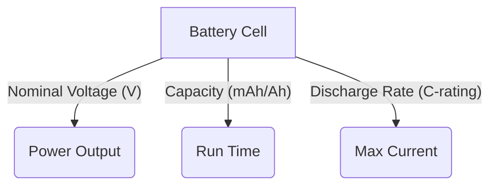

## 05-Power Supplies and Batteries

Robots need power to operate. This power can come from various sources, but it always needs to be managed and supplied in a stable and appropriate form. This chapter explores common power sources for robotics, including different types of batteries and various power supply configurations, along with concepts like voltage regulation and current capacity.

### 5.1 Overview of Power Sources

The choice of power source for a robot depends heavily on its application, size, mobility requirements, and operating environment.

*   **Batteries:** Provide portable DC power, essential for mobile robots.
*   **AC/DC Adapters (Wall Power):** Convert household AC (Alternating Current) to DC (Direct Current) for stationary robots, charging batteries, or powering development boards.
*   **Generators/Fuel Cells:** Used for long-duration, high-power field robotics.
*   **Solar Panels:** For outdoor, energy-harvesting applications.
*   **Power over Ethernet (PoE):** Delivers both power and data over a single Ethernet cable, common in some fixed robotic camera or communication systems.

### 5.2 Batteries

Batteries are electrochemical devices that convert stored chemical energy into electrical energy. They are characterized by their voltage, capacity, and discharge rate.

#### 5.2.1 Key Battery Parameters

*   **Voltage (V):** The nominal voltage produced by a single cell (e.g., 1.2V for NiMH, 3.7V for LiPo). Batteries are often composed of multiple cells connected in series to achieve higher voltages (e.g., a 3S LiPo battery is 3 cells in series, producing 3 * 3.7V = 11.1V nominal).
*   **Capacity (mAh or Ah):** The amount of charge a battery can deliver, typically measured in milliampere-hours (mAh) or ampere-hours (Ah). A 2000mAh battery can theoretically deliver 2000mA for 1 hour, or 1000mA for 2 hours, etc.
*   **Discharge Rate (C-rating for LiPo):** For LiPo batteries, the C-rating indicates how quickly the battery can safely discharge its capacity. A 10C battery with 2000mAh capacity can deliver 10 * 2000mA = 20A.
*   **Internal Resistance:** All batteries have some internal resistance, which causes voltage drop under load and generates heat.

#### 5.2.2 Common Battery Types in Robotics

*   **Alkaline Batteries (AA, AAA, 9V):** Disposable, low cost, good for low-power, non-rechargeable applications.
*   **Nickel-Metal Hydride (NiMH):** Rechargeable, 1.2V/cell, good balance of capacity and discharge rate, less prone to memory effect than NiCd. Common in older hobby robotics.
*   **Lithium-Ion (Li-ion) / Lithium Polymer (LiPo):** Rechargeable, 3.7V/cell (nominal), high energy density, high discharge rates possible. Widely used in modern robotics, drones, and portable electronics due to their light weight and power output. **Require careful handling and specialized chargers to prevent fire/explosion.**
*   **Lead-Acid Batteries:** Heavy, 2V/cell, low energy density, but can provide very high current. Used in larger, heavy-duty applications (e.g., large industrial robots, autonomous vehicles).

**Diagram 5.1: Battery Voltage & Capacity (Conceptual)**



*Description: Illustrates the key parameters of a battery cell and how they relate to its power delivery and run time characteristics.*

### 5.3 Power Supplies (AC/DC Adapters)

Power supplies convert power from one form to another, typically converting AC wall power to a stable DC voltage for electronics.

*   **Rectification:** Converts AC to pulsating DC (using diodes).
*   **Filtering:** Smooths out the pulsating DC (using capacitors).
*   **Regulation:** Stabilizes the DC voltage to a precise level (using voltage regulators).

### 5.4 Voltage Regulators

**Voltage regulators** are crucial components that maintain a constant output voltage, regardless of changes in the input voltage or load current. This is vital for protecting sensitive electronics like microcontrollers from voltage fluctuations.

*   **Linear Regulators (e.g., 7805):** Simple, inexpensive, but inefficient. They dissipate excess voltage as heat, making them suitable for small voltage differences or low current applications.
*   **Switching Regulators (Buck, Boost, Buck-Boost):** More complex but much more efficient. They rapidly switch a power element on and off to maintain output voltage.
    *   **Buck Converter:** Steps down voltage (e.g., 12V to 5V).
    *   **Boost Converter:** Steps up voltage (e.g., 3.7V to 5V).
    *   **Buck-Boost Converter:** Can step up or step down voltage, maintaining a stable output from a fluctuating input.

**Diagram 5.2: Voltage Regulator Types**

```mermaid
graph TD
    A[Input Voltage (Vin)] --> B{Linear Regulator}
    B -- Dissipates Heat --> C[Output Voltage (Vout)]
    D[Input Voltage (Vin)] --> E{Switching Regulator}
    E -- Efficient --> F[Output Voltage (Vout)]
    subgraph Linear Reg.
        B
    end
    subgraph Switching Reg.
        E
    end
```

*Description: Compares linear and switching voltage regulators, highlighting the heat dissipation in linear regulators versus the efficiency of switching regulators.*

### 5.5 Current Capacity and Distribution

Beyond voltage, ensuring adequate current capacity is critical.

*   **Current Draw:** Each component in a robot draws a certain amount of current. The power supply or battery must be able to provide the *sum* of these currents.
*   **Wire Gauge:** Wires must be thick enough (lower gauge number) to handle the current without overheating.
*   **Power Distribution Board (PDB):** In complex robots (e.g., drones), a PDB distributes power from the main battery to various components (ESCs, flight controller, sensors) while ensuring proper fusing and regulation.

### 5.6 Power Management Strategies

Efficient power management extends battery life and ensures reliable operation.

*   **Sleep Modes:** Microcontrollers can enter low-power sleep modes when not actively performing tasks.
*   **Dynamic Voltage Scaling:** Adjusting CPU voltage and frequency based on workload.
*   **Component Shutdown:** Powering down individual sensors or modules when not in use.
*   **Battery Monitoring:** Keeping track of battery voltage and current to estimate remaining capacity and prevent over-discharge.
*   **Energy Harvesting:** Utilizing ambient energy (solar, vibration) to supplement or recharge batteries.

Choosing the right power strategy and components is vital for the performance, autonomy, and safety of any robotic system.

---

### C++ Example: Simple Battery Monitor (Conceptual)

This C++ example simulates a battery monitoring system, checking voltage and estimating state of charge.

```cpp
#include <iostream>
#include <string>
#include <map>
#include <limits> // Required for numeric_limits

// Function to clear input buffer
void clearInputBuffer() {
    std::cin.ignore(std::numeric_limits<std::streamsize>::max(), '\n');
}

class BatteryMonitor {
public:
    BatteryMonitor(std::string battery_type, double nominal_voltage_per_cell, int num_cells)
        : battery_type_(battery_type), nominal_voltage_per_cell_(nominal_voltage_per_cell), num_cells_(num_cells) {
        
        full_voltage_ = nominal_voltage_per_cell_ * num_cells_;
        // Example: LiPo 3.7V nominal, 4.2V full per cell
        if (battery_type_ == "LiPo") {
            full_voltage_per_cell_ = 4.2; 
            empty_voltage_per_cell_ = 3.3; // Safe empty voltage
        } else if (battery_type_ == "NiMH") {
            full_voltage_per_cell_ = 1.4;
            empty_voltage_per_cell_ = 1.0;
        } else { // Generic
            full_voltage_per_cell_ = nominal_voltage_per_cell_ * 1.1; // Estimate
            empty_voltage_per_cell_ = nominal_voltage_per_cell_ * 0.8; // Estimate
        }
        
        full_voltage_ = full_voltage_per_cell_ * num_cells_;
        empty_voltage_ = empty_voltage_per_cell_ * num_cells_;

        std::cout << "Monitoring " << num_cells_ << "S " << battery_type_ << " Battery (Nominal: " 
                  << full_voltage_ << "V, Empty: " << empty_voltage_ << "V)" << std::endl;
    }

    double get_state_of_charge(double current_voltage) const {
        if (current_voltage >= full_voltage_) return 100.0;
        if (current_voltage <= empty_voltage_) return 0.0;

        // Linear interpolation for simplicity
        return ((current_voltage - empty_voltage_) / (full_voltage_ - empty_voltage_)) * 100.0;
    }

    void check_battery_status(double current_voltage) const {
        double soc = get_state_of_charge(current_voltage);
        std::cout << "Current Voltage: " << current_voltage << "V -> Estimated SoC: " << soc << "%";
        
        if (soc > 75) {
            std::cout << " (Excellent)" << std::endl;
        } else if (soc > 50) {
            std::cout << " (Good)" << std::endl;
        } else if (soc > 20) {
            std::cout << " (Moderate)" << std::endl;
        } else if (soc > 5) {
            std::cout << " (Low! Consider charging)" << std::endl;
        } else {
            std::cout << " (CRITICAL! Shutting down soon)" << std::endl;
        }
    }

private:
    std::string battery_type_;
    double nominal_voltage_per_cell_;
    int num_cells_;
    double full_voltage_per_cell_;
    double empty_voltage_per_cell_;
    double full_voltage_;
    double empty_voltage_;
};

int main() {
    BatteryMonitor lipo_battery("LiPo", 3.7, 3); // 3S LiPo battery
    
    std::cout << "\nEnter current battery voltage to check status:" << std::endl;
    double current_voltage_input;

    // Simulate voltage readings
    double voltages_to_check[] = {12.6, 11.8, 11.1, 10.5, 9.9};
    for(double v : voltages_to_check) {
        lipo_battery.check_battery_status(v);
    }
    
    // User input
    while (true) {
        std::cout << "Enter voltage (or 'q' to quit): ";
        if (!(std::cin >> current_voltage_input)) {
            if (std::cin.eof() || std::cin.fail()) {
                std::cout << "Exiting battery monitor." << std::endl;
                break;
            }
        }
        lipo_battery.check_battery_status(current_voltage_input);
        clearInputBuffer();
    }
    
    return 0;
}
```

---

### Python Example: Simulating a Buck Converter (Step-Down Regulator)

This Python script simulates the basic function of a buck converter, stepping down an input voltage.

```python
class BuckConverter:
    def __init__(self, efficiency=0.9):
        self.efficiency = efficiency # Represents losses in conversion
        print(f"Buck Converter initialized with efficiency: {efficiency*100:.1f}%")

    def convert_voltage(self, vin, target_vout):
        """
        Simulates a buck converter's operation.
        In a real buck converter, the duty cycle (D) is adjusted: Vout = Vin * D
        For this simulation, we'll assume it perfectly reaches target_vout, 
        and calculate current based on efficiency.
        """
        if vin <= target_vout:
            print("Warning: Input voltage must be greater than target output voltage for buck converter.")
            return vin # Cannot step down if Vin <= Vout
        
        print(f"Input: {vin}V -> Target Output: {target_vout}V")
        
        # Calculate theoretical duty cycle needed
        duty_cycle = target_vout / vin
        print(f"  Calculated theoretical duty cycle: {duty_cycle:.2f}")

        # Assume ideal conversion for voltage, but account for efficiency in power/current
        Vout_actual = target_vout # Assuming regulator perfectly achieves target_vout

        return Vout_actual

    def calculate_output_current_and_power(self, vin, iin, target_vout):
        """
        Calculates output current and power considering efficiency.
        P_out = P_in * efficiency
        V_out * I_out = V_in * I_in * efficiency
        I_out = (V_in * I_in * efficiency) / V_out
        """
        if vin <= target_vout:
            print("Error: Input voltage must be greater than target output voltage for buck converter.")
            return 0, 0
            
        vout = self.convert_voltage(vin, target_vout)
        pin = vin * iin
        pout = pin * self.efficiency
        iout = pout / vout
        
        print(f"  Input Power: {pin:.2f}W, Output Power (with efficiency): {pout:.2f}W")
        print(f"  Output Current: {iout:.2f}A")
        return iout, pout


if __name__ == "__main__":
    buck = BuckConverter(efficiency=0.92) # 92% efficient

    # Scenario 1: Step down 12V to 5V for a microcontroller
    input_voltage = 12.0
    input_current = 1.0 # 1A drawn from the 12V source
    target_output = 5.0
    
    print("\n--- Scenario 1: Powering a Microcontroller ---")
    output_current, output_power = buck.calculate_output_current_and_power(input_voltage, input_current, target_output)
    print(f"  Microcontroller receives {target_output}V at {output_current:.2f}A, consuming {output_power:.2f}W.")

    # Scenario 2: Step down 24V to 12V for a motor driver
    input_voltage_2 = 24.0
    input_current_2 = 2.0 # 2A drawn from the 24V source
    target_output_2 = 12.0
    
    print("\n--- Scenario 2: Powering a Motor Driver ---")
    output_current_2, output_power_2 = buck.calculate_output_current_and_power(input_voltage_2, input_current_2, target_output_2)
    print(f"  Motor driver receives {target_output_2}V at {output_current_2:.2f}A, consuming {output_power_2:.2f}W.")
```

---

### Arduino Example: Low Battery Warning (Analog Read)

This Arduino sketch uses analog input to monitor a battery's voltage (through a voltage divider if the battery voltage is >5V) and triggers an LED warning if the voltage drops below a threshold.

```arduino
const int batteryMonitorPin = A0; // Analog pin connected to battery voltage (through a voltage divider if needed)
const int warningLedPin = 7;      // Digital pin for a warning LED

// Define battery thresholds (adjust these based on your battery type and voltage divider)
// For a 3S LiPo (12.6V max, 9.9V empty), if using a 3:1 voltage divider (e.g. 20k/10k resistors):
// 12.6V / 3 = 4.2V (Arduino reads ~860)
// 9.9V / 3 = 3.3V (Arduino reads ~675)
// Let's set a warning threshold at 3.5V for the Arduino input, which is ~10.5V battery voltage
const float arduinoVoltageThreshold = 3.5; // Volts
const float referenceVoltage = 5.0;        // Arduino's analog reference voltage
const int analogResolution = 1024;         // 10-bit ADC (0-1023)

// If you're using a voltage divider, uncomment and adjust these:
// const float R1 = 20000.0; // Resistor 1 in voltage divider
// const float R2 = 10000.0; // Resistor 2 in voltage divider
// const float dividerRatio = (R1 + R2) / R2; // For a 3:1 divider, this is 3.0
const float dividerRatio = 1.0; // No voltage divider (direct battery voltage, only if battery < 5V)

void setup() {
  Serial.begin(9600);
  pinMode(warningLedPin, OUTPUT);
  digitalWrite(warningLedPin, LOW); // Ensure LED is off initially
  Serial.println("Low Battery Warning System Ready.");
}

void loop() {
  int sensorValue = analogRead(batteryMonitorPin);
  
  // Convert the analog reading to actual voltage at the Arduino pin
  float arduinoPinVoltage = sensorValue * (referenceVoltage / (analogResolution - 1));
  
  // Convert the Arduino pin voltage back to the actual battery voltage
  float batteryVoltage = arduinoPinVoltage * dividerRatio;
  
  Serial.print("Battery Voltage: ");
  Serial.print(batteryVoltage, 2); // Print with 2 decimal places
  Serial.println(" V");

  if (batteryVoltage < (arduinoVoltageThreshold * dividerRatio)) { // Compare actual battery voltage
    digitalWrite(warningLedPin, HIGH); // Turn on warning LED
    Serial.println("WARNING: Low Battery!");
  } else {
    digitalWrite(warningLedPin, LOW);  // Turn off warning LED
  }
  
  delay(1000); // Check every second
}

```

---

### Equations in LaTeX: Battery Energy (Joules)

The total energy `E` (in Joules) stored in a battery can be estimated by:

```latex
E = V_{avg} times Capacity_{Ah} times 3600
```

Where:
*   `V_{avg}` is the average discharge voltage of the battery (in Volts).
*   `Capacity_{Ah}` is the battery capacity in Ampere-hours (Ah).
*   `3600` is the conversion factor from hours to seconds (1 hour = 3600 seconds).

---

### MCQs with Answers

1.  Which battery type is known for its high energy density and high discharge rates, making it popular in modern drones and robotics, but requires careful handling?
    a) Alkaline
    b) Nickel-Metal Hydride (NiMH)
    c) Lithium-Ion / Lithium Polymer (LiPo)
    d) Lead-Acid
    *Answer: c) Lithium-Ion / Lithium Polymer (LiPo)*

2.  What is the primary function of a voltage regulator in a power supply?
    a) To convert AC to DC.
    b) To store electrical energy.
    c) To maintain a constant output voltage.
    d) To amplify current.
    *Answer: c) To maintain a constant output voltage.*

3.  A buck converter is a type of switching regulator used to:
    a) Step up voltage.
    b) Step down voltage.
    c) Convert DC to AC.
    d) Rectify AC.
    *Answer: b) Step down voltage.*

---

### Practice Tasks

1.  **Battery Comparison:** Research and compare the advantages and disadvantages of LiPo, NiMH, and Lead-Acid batteries for a medium-sized mobile robot (e.g., a robotic lawnmower). Which would you choose and why?
2.  **Power Budget Calculation:** You are designing a robot that requires the following:
    *   Microcontroller: 5V, 100mA
    *   2 Servo Motors: 5V, 500mA each (peak)
    *   Sensors: 5V, 50mA
    *   LEDs: 5V, 20mA
    Calculate the total current draw for this robot (assume worst-case peak for servos). What minimum capacity (in mAh) battery would you need to power this robot for 2 hours?
3.  **Voltage Regulator Selection:** You have a 12V LiPo battery and need to power a 3.3V microcontroller and 5V sensors. Explain why you would need voltage regulators and which types (linear, buck, boost) would be appropriate for each component, justifying your choices.

---

### Notes for Teachers

*   **Battery Safety:** Explicitly discuss LiPo battery safety precautions (storage, charging, discharge limits). Show videos of improper handling consequences if appropriate.
*   **Real-world Components:** Show examples of different battery types, AC/DC adapters, and voltage regulator modules (e.g., a 7805 IC, a buck converter module).
*   **Power Efficiency:** Introduce the concept of power efficiency and why it's crucial for battery-powered robots.

### Notes for Students

*   **Safety is Paramount:** Always prioritize safety when working with batteries, especially LiPo.
*   **Power Requirements:** Always calculate the power requirements of your robot's components before selecting a power source.
*   **Voltage Regulation:** Understand that raw battery voltage is often not stable enough for sensitive electronics; regulators are essential.
*   **Trade-offs:** There are always trade-offs in power system design (e.g., weight vs. capacity, efficiency vs. cost).