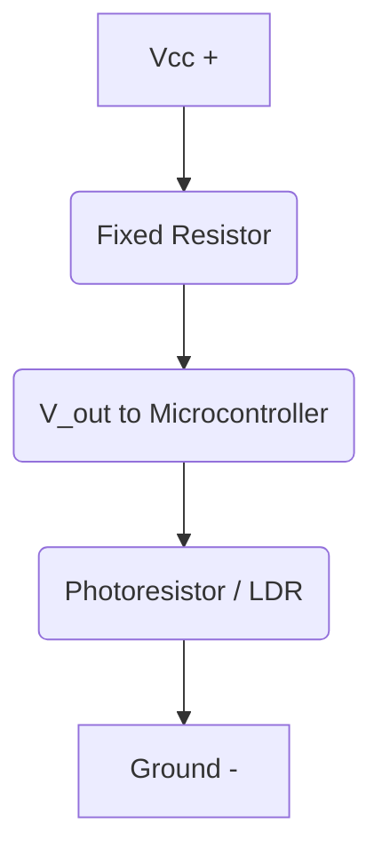

## 06-Sensors - Electrical Principles

Sensors are the robot's perception organs, allowing it to gather information about its environment and internal state. While the previous chapter introduced the general types of sensors, this chapter delves into the underlying electrical principles that enable them to convert physical phenomena into measurable electrical signals, which microcontrollers can then interpret.

### 6.1 Transduction: The Core Principle

At the heart of every sensor is a **transducer**, a device that converts one form of energy into another. For electrical sensors, this means converting a physical quantity (like temperature, distance, light, force) into an electrical signal (voltage, current, resistance, capacitance).

### 6.2 Resistive Sensors

Many sensors operate on the principle of changing resistance in response to a physical stimulus.

*   **Potentiometers:** A variable resistor used to measure angular or linear position. As the wiper moves, the resistance between the wiper and one end changes, creating a variable voltage when used in a voltage divider.
*   **Thermistors:** Temperature-sensitive resistors. Their resistance changes significantly with temperature.
    *   **NTC (Negative Temperature Coefficient):** Resistance decreases as temperature increases.
    *   **PTC (Positive Temperature Coefficient):** Resistance increases as temperature increases.
*   **Photoresistors (Light Dependent Resistors - LDRs):** Their resistance decreases as the intensity of light falling on them increases. Used for light detection.
*   **Strain Gauges:** Thin resistive wires or foils whose resistance changes when they are stretched or compressed (strained). Used to measure force, pressure, and weight.
*   **Force Sensitive Resistors (FSRs):** Resistance decreases as the force applied to their surface increases. Used for touch and pressure sensing.

**Diagram 6.1: Resistive Sensor (LDR) in a Voltage Divider**



*Description: A photoresistor (LDR) connected in a voltage divider configuration with a fixed resistor. As light intensity changes, the LDR's resistance changes, altering the V_out voltage that a microcontroller can read.*

### 6.3 Capacitive Sensors

These sensors rely on changes in capacitance due to a physical input.

*   **Proximity Sensors:** Detect the presence of nearby objects without physical contact. The object changes the dielectric constant or the effective plate area of a capacitor, altering its capacitance.
*   **Touch Sensors:** Many touchscreens and buttons use capacitive sensing. A finger acts as a conductor, increasing the capacitance of a small electrode.
*   **Humidity Sensors:** Some humidity sensors use changes in the dielectric properties of a material to detect moisture.

### 6.4 Inductive Sensors

Inductive sensors operate by detecting changes in inductance.

*   **Proximity Sensors:** Detect metallic objects by sensing changes in the magnetic field generated by a coil within the sensor. The presence of a metal object affects the coil's inductance.
*   **Linear Variable Differential Transformers (LVDTs):** Measure linear displacement using magnetic coupling between coils.

### 6.5 Optical Sensors

Optical sensors use light to detect physical quantities.

*   **Photodiodes/Phototransistors:** Convert light into current. Used in optical encoders, IR distance sensors, and light barriers.
*   **Infrared (IR) Sensors:**
    *   **IR Distance Sensors (e.g., Sharp GP2Y0A21YK):** Emit IR light and measure the reflection angle/intensity to determine distance.
    *   **IR Proximity/Line Follower Sensors:** Detect the presence of objects or lines by measuring reflected IR light.
*   **Encoders:** Often optical, using light passing through a slotted or patterned disk to measure rotation (rotary encoder) or linear position (linear encoder). Produce digital pulses.
*   **Cameras (CMOS/CCD):** Capture images by converting light into electrical signals (pixels), which are then processed digitally.

### 6.6 Hall Effect Sensors

Hall effect sensors detect the presence and strength of a magnetic field.

*   **Applications:** Measuring magnetic field strength, detecting rotational speed (in conjunction with a magnet), proximity sensing for metallic objects (if they influence a magnetic field).
*   **Motor Control:** Used in brushless DC motors for commutation (determining rotor position).

### 6.7 Piezoelectric Sensors

Piezoelectric materials generate an electric charge when subjected to mechanical stress (pressure, force, vibration) and vice-versa.

*   **Applications:** Force sensors, accelerometers, microphones, ultrasonic transducers (for sonar).

### 6.8 Microcontroller Interfacing

Once a sensor converts a physical quantity into an electrical signal, a microcontroller (MCU) reads and processes this signal.

*   **Analog-to-Digital Converter (ADC):** For analog sensors (potentiometers, thermistors, LDRs, FSRs), the MCU uses an ADC to convert the continuous analog voltage into a discrete digital value.
*   **Digital Input:** For digital sensors (buttons, simple optical switches, encoders producing pulses), the MCU reads the HIGH/LOW state directly.
*   **Serial Communication (I2C, SPI, UART):** Many modern, more complex sensors (e.g., IMUs, advanced environmental sensors) communicate with the MCU using digital serial protocols to send data efficiently.

Understanding the electrical principles behind these sensors allows a roboticist to select the right sensor for the job, connect it correctly, and interpret its data effectively to build intelligent and responsive robots.

---

### C++ Example: Simulating a Thermistor Reading (Resistive Sensor)

This C++ example simulates reading from a thermistor in a voltage divider, converting the resistance change to an estimated temperature.

```cpp
#include <iostream>
#include <cmath> // For log() and exp()
#include <limits> // Required for numeric_limits

// Function to clear input buffer
void clearInputBuffer() {
    std::cin.ignore(std::numeric_limits<std::streamsize>::max(), '\n');
}

// Steinhart-Hart Equation coefficients (example values for a specific NTC thermistor)
// These coefficients are usually provided in the thermistor's datasheet
const double A_COEFF = 0.001129148;
const double B_COEFF = 0.000234125;
const double C_COEFF = 0.0000000876741;

class ThermistorSensor {
public:
    ThermistorSensor(double fixed_resistor_ohms, double supply_voltage)
        : R_fixed_(fixed_resistor_ohms), V_supply_(supply_voltage) {
        std::cout << "Thermistor simulation initialized (R_fixed=" << R_fixed_ << " Ohm, V_supply=" << V_supply_ << "V)." << std::endl;
    }

    // Simulate reading the analog voltage from the voltage divider
    // Returns a value between 0 and 1023 (like Arduino's analogRead)
    int simulate_analog_read(double thermistor_resistance) const {
        // Calculate voltage across thermistor using voltage divider formula
        double V_thermistor = V_supply_ * (thermistor_resistance / (R_fixed_ + thermistor_resistance));
        // Convert voltage to analog reading (assuming 0-5V reference, 10-bit ADC)
        return static_cast<int>((V_thermistor / V_supply_) * 1023.0);
    }

    // Converts analog reading (0-1023) to thermistor resistance
    double analog_to_resistance(int adc_value) const {
        // If the ADC value is 0 or 1023, it might indicate open/short circuit or saturation
        if (adc_value == 0) return std::numeric_limits<double>::infinity(); // Very high resistance
        if (adc_value == 1023) return 0.0; // Very low resistance

        double V_out = (static_cast<double>(adc_value) / 1023.0) * V_supply_;
        // V_out = V_supply * (R_therm / (R_fixed + R_therm))
        // V_out * (R_fixed + R_therm) = V_supply * R_therm
        // V_out * R_fixed + V_out * R_therm = V_supply * R_therm
        // V_out * R_fixed = (V_supply - V_out) * R_therm
        // R_therm = (V_out * R_fixed) / (V_supply - V_out)
        if (V_supply_ - V_out == 0) return std::numeric_limits<double>::infinity(); // Avoid division by zero
        return (V_out * R_fixed_) / (V_supply_ - V_out);
    }

    // Converts thermistor resistance to temperature in Celsius using Steinhart-Hart equation
    // Temperature in Kelvin = 1 / (A + B*ln(R) + C*(ln(R))^3)
    double resistance_to_temperature_celsius(double thermistor_resistance) const {
        if (thermistor_resistance <= 0) return -273.15; // Absolute zero or error
        double lnR = std::log(thermistor_resistance);
        double temp_k = 1.0 / (A_COEFF + B_COEFF * lnR + C_COEFF * lnR * lnR * lnR);
        return temp_k - 273.15; // Convert Kelvin to Celsius
    }

    void process_reading(int simulated_adc_value) const {
        double R_therm = analog_to_resistance(simulated_adc_value);
        double temp_c = resistance_to_temperature_celsius(R_therm);
        std::cout << "ADC Value: " << simulated_adc_value << " -> Thermistor R: " << R_therm << " Ohm -> Temperature: " << temp_c << " °C" << std::endl;
    }
};

int main() {
    ThermistorSensor my_thermistor(10000.0, 5.0); // 10k Ohm fixed resistor, 5V supply

    std::cout << "\nSimulating different thermistor resistances (from varying temperatures):" << std::endl;
    std::map<double, double> temp_to_resistance = {
        {25.0, 10000.0}, // 10k at 25C (example NTC)
        {0.0, 30000.0},
        {50.0, 4000.0},
        {80.0, 1500.0}
    };

    for (auto const& [temp, resistance] : temp_to_resistance) {
        std::cout << "Simulating at " << temp << "C (R_therm = " << resistance << " Ohm):" << std::endl;
        int adc_val = my_thermistor.simulate_analog_read(resistance);
        my_thermistor.process_reading(adc_val);
    }

    return 0;
}
```

---

### Python Example: Simulating a Proximity Sensor (IR based)

This Python script simulates a simple IR proximity sensor, determining if an object is "near" based on a threshold of reflected light intensity.

```python
import random

class IRProximitySensor:
    def __init__(self, name="IR_Sensor", threshold=500):
        self.name = name
        self.detection_threshold = threshold # Analog value threshold
        self.last_reading = 0
        print(f"{self.name} initialized with detection threshold {self.detection_threshold}.")

    def read_analog_reflection(self, actual_distance_cm):
        """
        Simulates an analog reading from an IR proximity sensor.
        Closer objects typically result in higher analog values (more reflected IR).
        """
        # Inverse relationship: smaller distance -> higher reading (conceptual)
        # Add some noise
        base_reading = max(0, 1000 - (actual_distance_cm * 20)) 
        self.last_reading = int(base_reading + random.randint(-50, 50))
        self.last_reading = max(0, min(1023, self.last_reading)) # Cap between 0-1023
        return self.last_reading

    def is_object_detected(self):
        """Checks if an object is detected based on the last reading and threshold."""
        if self.last_reading > self.detection_threshold:
            return True
        return False

    def get_status(self, actual_distance_cm):
        analog_val = self.read_analog_reflection(actual_distance_cm)
        detected = self.is_object_detected()
        
        status_msg = f"[{self.name}] Distance: {actual_distance_cm}cm, Analog Reading: {analog_val}"
        if detected:
            status_msg += " -> OBJECT DETECTED!"
        else:
            status_msg += " -> Clear."
        print(status_msg)
        return detected

if __name__ == "__main__":
    sensor = IRProximitySensor(threshold=600)

    print("\n--- Simulating Object Detection ---")
    distances = [10, 20, 30, 5, 40, 15] # Distances in cm

    for dist in distances:
        sensor.get_status(dist)
        # A small delay to make output readable
        import time
        time.sleep(0.5)
```

---

### Arduino Example: Digital Input (Pushbutton) to Control LED (Digital Sensor)

This fundamental Arduino sketch reads the state of a digital input (a pushbutton) and uses it to toggle an LED. This shows how a simple digital sensor provides binary information.

```arduino
const int buttonPin = 2; // Digital input pin for the pushbutton
const int ledPin = 13;   // Digital output pin for the LED (onboard LED)

int buttonState = 0;     // Variable to store the current button state
bool ledOn = false;      // Variable to track LED state

void setup() {
  Serial.begin(9600);
  pinMode(ledPin, OUTPUT);
  // Set the button pin as an input with internal pull-up resistor.
  // This means the pin will be HIGH when the button is NOT pressed, and LOW when pressed.
  pinMode(buttonPin, INPUT_PULLUP); 
  Serial.println("Digital Input Sensor (Pushbutton) Control Ready.");
}

void loop() {
  // Read the state of the button
  int newButtonState = digitalRead(buttonPin);

  // Check if the button state has changed FROM HIGH TO LOW (button pressed)
  // This is a simple edge detection to avoid multiple toggles from a single press
  if (newButtonState != buttonState) {
    if (newButtonState == LOW) { // Button is pressed
      ledOn = !ledOn; // Toggle LED state
      if (ledOn) {
        digitalWrite(ledPin, HIGH); // Turn LED ON
        Serial.println("Button Pressed -> LED ON");
      } else {
        digitalWrite(ledPin, LOW);  // Turn LED OFF
        Serial.println("Button Pressed -> LED OFF");
      }
      delay(50); // Debounce delay
    }
  }
  buttonState = newButtonState; // Update the last button state
}
```

---

### Equations in LaTeX: Wheatstone Bridge (for Strain Gauges)

A **Wheatstone bridge** circuit is commonly used with resistive sensors like strain gauges to measure very small changes in resistance accurately. For a balanced bridge:

```latex
frac{R_{1}{R_{2} = frac{R_{3}{R_{4}
```

When one of the resistors (e.g., `R_{4}`) changes its value due to a physical strain (`Delta R_{4}`), the bridge becomes unbalanced, producing a small output voltage `V_{out}` (often amplified):

```latex
V_{out} = V_{in} left( frac{R_4 + Delta R_4}{R_3 + R_4 + Delta R_4} - frac{R_2}{R_{1} + R_{2} right)
```

---

### MCQs with Answers

1.  What is the primary function of a transducer within a sensor?
    a) To amplify electrical signals.
    b) To store energy in a magnetic field.
    c) To convert one form of energy into another.
    d) To generate light.
    *Answer: c) To convert one form of energy into another.*

2.  Which type of sensor changes its resistance significantly with temperature?
    a) Potentiometer
    b) Photoresistor (LDR)
    c) Strain Gauge
    d) Thermistor
    *Answer: d) Thermistor*

3.  An Analog-to-Digital Converter (ADC) is used by a microcontroller to:
    a) Convert digital signals to analog signals.
    b) Convert continuous analog voltages into discrete digital values.
    c) Generate digital pulses for motor control.
    d) Directly read the state of a digital button.
    *Answer: b) Convert continuous analog voltages into discrete digital values.*

---

### Practice Tasks

1.  **Sensor Selection:** You need to design a robot that can:
    *   Detect if it's getting too close to an object (10-30 cm range).
    *   Measure the ambient light level in a room.
    *   Determine the angle of a robotic arm's joint.
    For each requirement, suggest an appropriate type of sensor based on its electrical principle and explain why each is important.
2.  **Voltage Divider with LDR:** Design a voltage divider circuit using a photoresistor (LDR) and a fixed resistor to produce a higher voltage output when it's dark and a lower voltage output when it's bright. Specify the connection of the LDR and the fixed resistor relative to the output point.
3.  **Hall Effect Applications:** Research three distinct applications of Hall effect sensors in robotics or automotive systems (e.g., wheel speed detection, current sensing). Describe how the sensor works in each application.

---

### Notes for Teachers

*   **Sensor Exploration:** Provide a variety of common sensors (LDR, thermistor, pushbutton, potentiometer, ultrasonic, IR) for students to examine and test.
*   **Analog vs. Digital Reading:** Clearly distinguish between analog and digital sensor readings and how microcontrollers handle each (ADC vs. digitalRead).
*   **Troubleshooting:** Emphasize that understanding a sensor's electrical principle is key to troubleshooting why it might not be working correctly (e.g., incorrect wiring, wrong resistor in voltage divider).

### Notes for Students

*   **Data Sheets:** For any sensor you use, always consult its datasheet. It contains crucial information about wiring, operating voltage, output type, and measurement range.
*   **Calibration:** Many sensors require calibration to convert their raw electrical output into meaningful physical units (e.g., ADC value to distance in cm, resistance to temperature in Celsius).
*   **Signal Conditioning:** Real-world sensor signals are often noisy. You'll learn about techniques like filtering and amplification to get clean, reliable data.