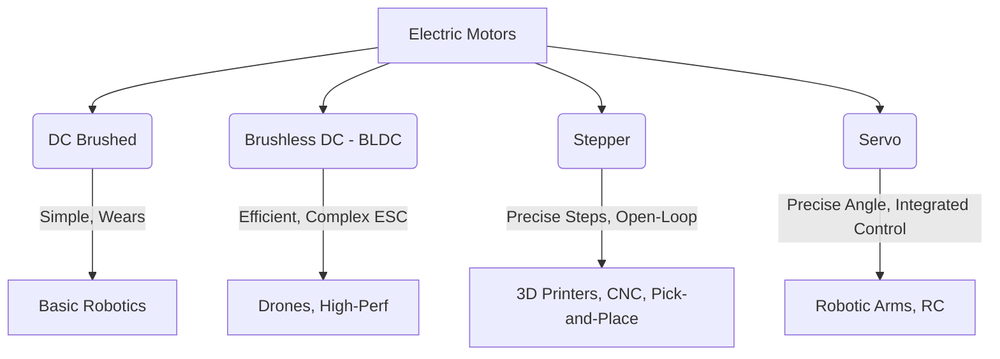

## 07-Actuators - Electrical Principles

Actuators are the components that enable a robot to move and interact with its physical environment. They convert electrical energy into mechanical motion, force, or other physical outputs. This chapter focuses on the electrical principles behind the most common types of actuators used in robotics, particularly motors.

### 7.1 Overview of Actuators

Actuators in robotics typically include:
*   **Electric Motors:** The most common type, converting electrical energy into rotational or linear mechanical energy.
*   **Hydraulic Actuators:** Use pressurized fluid to generate force.
*   **Pneumatic Actuators:** Use compressed air to generate force.
*   **Other Actuators:** Solenoids, shape memory alloys (SMAs), electroactive polymers (EAPs) for specialized applications.

For most hobby and small-to-medium scale robotics, electric motors are dominant due to their controllability, efficiency, and widespread availability.

### 7.2 Electric Motors

All electric motors operate on the principle of electromagnetism: a magnetic field interacting with an electric current to produce a force (Lorentz force), which in turn creates torque and rotation.

#### 7.2.1 DC Motors (Brushed)

*   **Principle:** A DC motor uses permanent magnets in the stator (stationary part) and electromagnets in the rotor (rotating part). Brushes and a commutator reverse the current direction in the rotor coils, causing continuous rotation.
*   **Characteristics:** Simple to control (speed proportional to voltage, torque proportional to current), inexpensive.
*   **Disadvantages:** Brushes wear out, generate electrical noise, less precise control without feedback.
*   **Control:** Speed is controlled by varying the input voltage (often using PWM). Direction is controlled by reversing polarity.

#### 7.2.2 Brushless DC (BLDC) Motors

*   **Principle:** No brushes. The permanent magnets are on the rotor, and the electromagnets are on the stator. Commutation (switching the current to the coils) is done electronically by an external controller (Electronic Speed Controller - ESC) based on rotor position feedback (often from Hall effect sensors or back-EMF).
*   **Characteristics:** Higher efficiency, longer lifespan, less noise, more power in a smaller package.
*   **Disadvantages:** More complex control circuitry (ESC required).
*   **Applications:** Drones, RC vehicles, high-performance robotics.

#### 7.2.3 Stepper Motors

*   **Principle:** Operate by moving in discrete steps. The stator has multiple coils, and the rotor has permanent magnets or soft iron teeth. By energizing the stator coils in a specific sequence, the rotor aligns with the magnetic field, moving one step at a time.
*   **Characteristics:** Excellent for precise open-loop position control (no feedback sensor needed unless steps are skipped), good holding torque.
*   **Disadvantages:** Can lose steps under heavy load or high acceleration, less efficient than BLDCs at high speeds.
*   **Control:** Requires a stepper motor driver to provide the correct pulse sequence to the coils.

#### 7.2.4 Servo Motors (DC Motor with Feedback)

*   **Principle:** A standard DC motor combined with a gearbox, a position sensor (potentiometer or encoder), and an integrated control circuit. The control circuit receives a command (usually a PWM signal) and drives the motor until the position sensor matches the command.
*   **Characteristics:** Excellent closed-loop position control (you tell it an angle, it goes there), compact, simple interface.
*   **Applications:** Robotic arms, steering mechanisms, pan/tilt camera systems.
*   **Control:** Controlled by a PWM signal (pulse width determines the target angle).

**Diagram 7.1: Motor Types Overview**



*Description: An overview of common electric motor types, their key characteristics, and typical applications in robotics.*

### 7.3 Motor Drivers (H-Bridges)

Motors, especially DC and stepper motors, often require more current or a different voltage than a microcontroller can directly supply. Also, DC motors need to reverse direction. **Motor drivers** bridge this gap.

*   **H-Bridge:** A common circuit configuration that allows a DC motor to be driven in both forward and reverse directions and to be braked. It consists of four switches (transistors or MOSFETs) arranged in an "H" shape.
    *   By closing specific pairs of switches, current can flow through the motor in one direction, then the other.
*   **Stepper Motor Drivers:** More complex ICs designed specifically to provide the precise pulse sequences and current control needed for stepper motors.
*   **Electronic Speed Controllers (ESCs):** Used for BLDC motors, they interpret signals from the microcontroller (often PWM), generate the correct three-phase AC waveform to commutate the motor, and control its speed.

### 7.4 Pulse Width Modulation (PWM)

**Pulse Width Modulation (PWM)** is a technique used to control the average power delivered to an electrical device by varying the "on" time of a pulse.

*   **Principle:** A square wave signal is generated where the frequency is constant, but the **duty cycle** (the ratio of "on" time to total period) can be varied.
*   **Applications:**
    *   **DC Motor Speed Control:** Higher duty cycle = higher average voltage = faster motor speed.
    *   **LED Brightness Control:** Higher duty cycle = brighter LED.
    *   **Servo Motor Position Control:** The width of the pulse (not the duty cycle percentage) determines the target angle for hobby servos.
    *   **Generating Analog Voltages (effectively):** While digital, very fast PWM can be smoothed by a capacitor to provide an average analog voltage.

**Diagram 7.2: Pulse Width Modulation (PWM) Principle**

```mermaid
graph LR
    A[Low Duty Cycle] --&gt; B(Less Power)
    B --&gt; C(e.g., Slower Motor)
    D[High Duty Cycle] --&gt; E(More Power)
    E --&gt; F(e.g., Faster Motor)
```

*Description: Illustrates the concept of PWM where varying the duty cycle (proportion of 'on' time) of a square wave directly controls the average power delivered, affecting motor speed or LED brightness.*

### 7.5 Current and Voltage Considerations

*   **Motor Stall Current:** When a motor is stalled (or first starts), it draws a very high current. Motor drivers and power supplies must be able to handle this.
*   **Back-EMF:** As a motor spins, it also acts as a generator, producing a "back electromotive force" (back-EMF) that opposes the applied voltage. This is used in BLDC commutation and can be measured to estimate speed.
*   **Flyback Diodes:** For inductive loads like motors, when power is suddenly cut, the collapsing magnetic field generates a large voltage spike (flyback voltage). A flyback diode (or "freewheeling diode") placed across the motor safely dissipates this energy, protecting the motor driver.

Understanding these electrical principles of actuators is crucial for effectively controlling robot movement, optimizing power consumption, and ensuring the longevity of components.

---

### C++ Example: Simulating a DC Motor with PWM Control

This C++ program conceptually simulates a DC motor's speed based on a PWM duty cycle input.

```cpp
#include <iostream>
#include <string>
#include <chrono>
#include <thread>
#include <limits> // Required for numeric_limits

// Function to clear input buffer
void clearInputBuffer() {
    std::cin.ignore(std::numeric_limits<std::streamsize>::max(), '\n');
}

class DCMotor {
public:
    DCMotor(std::string motor_id) : motor_id_(motor_id), speed_(0.0) {
        std::cout << "DC Motor '" << motor_id_ << "' initialized." << std::endl;
    }

    // Set motor speed based on PWM duty cycle (0-100%)
    void set_speed_pwm(int duty_cycle_percent) {
        if (duty_cycle_percent < 0) duty_cycle_percent = 0;
        if (duty_cycle_percent > 100) duty_cycle_percent = 100;

        // Simulate speed being proportional to duty cycle
        speed_ = static_cast<double>(duty_cycle_percent) * max_speed_ / 100.0;
        std::cout << "[" << motor_id_ << "] Setting speed with PWM: " << duty_cycle_percent 
                  << "% duty cycle -> Simulated Speed: " << speed_ << " RPM" << std::endl;
    }

    // Stop the motor
    void stop() {
        speed_ = 0.0;
        std::cout << "[" << motor_id_ << "] Motor stopped." << std::endl;
    }

    double get_current_speed() const {
        return speed_;
    }

private:
    std::string motor_id_;
    double speed_; // Simulated speed in RPM
    const double max_speed_ = 5000.0; // Example max speed in RPM
};

int main() {
    DCMotor drive_motor("Drive_Left");

    std::cout << "\nEnter PWM duty cycle (0-100) to control motor speed, or 's' to stop, 'q' to quit." << std::endl;
    std::string input_str;

    while (true) {
        std::cout << "Enter command: ";
        std::cin >> input_str;
        clearInputBuffer();

        if (input_str == "q" || input_str == "Q") {
            drive_motor.stop();
            break;
        } else if (input_str == "s" || input_str == "S") {
            drive_motor.stop();
        } else {
            try {
                int duty_cycle = std::stoi(input_str);
                drive_motor.set_speed_pwm(duty_cycle);
            } catch (const std::invalid_argument& e) {
                std::cerr << "Invalid input. Please enter a number (0-100), 's', or 'q'." << std::endl;
            } catch (const std::out_of_range& e) {
                std::cerr << "Input out of range. Please enter a number between 0-100." << std::endl;
            }
        }
        std::this_thread::sleep_for(std::chrono::milliseconds(100)); // Small delay
    }

    return 0;
}
```

---

### Python Example: Simulating a Servo Motor Controller

This Python script simulates a servo motor, taking an angle as input and "moving" to that position.

```python
import time

class ServoMotor:
    def __init__(self, name="Servo1", min_angle=0, max_angle=180, current_angle=90):
        self.name = name
        self.min_angle = min_angle
        self.max_angle = max_angle
        self.current_angle = current_angle
        print(f"Servo Motor '{self.name}' initialized (Range: {min_angle}-{max_angle} degrees, Current: {current_angle} degrees).")

    def set_angle(self, target_angle):
        if not (self.min_angle <= target_angle <= self.max_angle):
            print(f"[{self.name}] Warning: Target angle {target_angle} out of range ({self.min_angle}-{self.max_angle}). Clamping.")
            target_angle = max(self.min_angle, min(self.max_angle, target_angle))

        if target_angle == self.current_angle:
            print(f"[{self.name}] Already at target angle {target_angle} degrees.")
            return

        print(f"[{self.name}] Moving from {self.current_angle} to {target_angle} degrees...")
        
        # Simulate movement time based on angle difference
        angle_diff = abs(target_angle - self.current_angle)
        sim_time = angle_diff / 50.0 # 50 degrees per second roughly
        time.sleep(min(2.0, sim_time)) # Max 2 seconds for simulation

        self.current_angle = target_angle
        print(f"[{self.name}] Reached {self.current_angle} degrees.")

    def get_current_angle(self):
        return self.current_angle

if __name__ == "__main__":
    arm_servo = ServoMotor("Arm_Joint", 0, 180, 90) # Standard hobby servo
    
    arm_servo.set_angle(0)
    arm_servo.set_angle(180)
    arm_servo.set_angle(45)
    arm_servo.set_angle(90) # Move to center
    arm_servo.set_angle(200) # Out of range example
    arm_servo.set_angle(90) # Already at target
```

---

### Arduino Example: DC Motor Control with H-Bridge (L298N)

This Arduino sketch demonstrates how to control a DC motor's speed and direction using an L298N motor driver (an H-bridge module).

```arduino
// Motor A connections
const int enA = 9;   // Enable pin A (PWM for speed)
const int in1 = 8;   // Input 1 for motor A direction
const int in2 = 7;   // Input 2 for motor A direction

void setup() {
  Serial.begin(9600);
  // Set all the motor control pins as outputs
  pinMode(enA, OUTPUT);
  pinMode(in1, OUTPUT);
  pinMode(in2, OUTPUT);
  Serial.println("DC Motor Control with L298N H-Bridge Ready.");
}

void loop() {
  // Move Forward at half speed for 2 seconds
  Serial.println("Moving Forward (Half Speed)...");
  digitalWrite(in1, HIGH);  // Set direction
  digitalWrite(in2, LOW);
  analogWrite(enA, 127);    // Set speed (0-255, 127 is ~half speed)
  delay(2000);

  // Stop for 1 second
  Serial.println("Stopping...");
  digitalWrite(in1, LOW);
  digitalWrite(in2, LOW);
  analogWrite(enA, 0);      // Stop power to motor
  delay(1000);

  // Move Backward at full speed for 2 seconds
  Serial.println("Moving Backward (Full Speed)...");
  digitalWrite(in1, LOW);
  digitalWrite(in2, HIGH);  // Set opposite direction
  analogWrite(enA, 255);    // Set speed to full
  delay(2000);

  // Stop again for 1 second
  Serial.println("Stopping...");
  digitalWrite(in1, LOW);
  digitalWrite(in2, LOW);
  analogWrite(enA, 0);
  delay(1000);
}

/*
Connections for L298N:
- ENA (Enable A) to Arduino Digital Pin 9 (PWM)
- IN1 to Arduino Digital Pin 8
- IN2 to Arduino Digital Pin 7
- OUT1, OUT2 to DC Motor
- 12V supply (or appropriate motor voltage) to L298N's +12V terminal
- L298N's GND to Arduino's GND
- L298N's +5V terminal (if present and regulator used) can power Arduino, or leave unconnected and power Arduino separately.
*/
```

---

### Equations in LaTeX: DC Motor Torque and Speed

For a brushed DC motor, the generated torque `T` and back-EMF `E_b` are related to current `I_a` and angular velocity `omega` respectively:

```latex
T = K_t I_a
```
```latex
E_b = K_e omega
```

Where:
*   `K_t` is the torque constant (N·m/A).
*   `K_e` is the back-EMF constant (V/(rad/s)).
*   For ideal DC motors, `K_t = K_e` (when units are consistent).

The input voltage `V_a` is related by:

```latex
V_a = I_a R_a + E_b
```

Where `R_a` is the armature resistance.

---

### MCQs with Answers

1.  Which electric motor type is best suited for precise open-loop position control without requiring a feedback sensor for position?
    a) Brushed DC Motor
    b) Brushless DC (BLDC) Motor
    c) Stepper Motor
    d) Servo Motor
    *Answer: c) Stepper Motor*

2.  An H-bridge circuit is primarily used in robotics to:
    a) Step up voltage for sensors.
    b) Convert AC to DC.
    c) Control the speed and direction of a DC motor.
    d) Store electrical energy for a short period.
    *Answer: c) Control the speed and direction of a DC motor.*

3.  What technique is commonly used to control the average power delivered to a DC motor, thereby controlling its speed?
    a) Rectification
    b) Filtering
    c) Voltage Division
    d) Pulse Width Modulation (PWM)
    *Answer: d) Pulse Width Modulation (PWM)*

---

### Practice Tasks

1.  **Motor Selection:** You need to choose a motor for two different applications:
    *   A small drone propeller, requiring high efficiency and power-to-weight ratio.
    *   A linear actuator that needs to move to exact positions for a robotic arm gripper.
    Which type of motor would you select for each and why? Explain the electrical control requirements for each.
2.  **PWM Calculation:** If a motor is powered by a 5V supply and you want it to run at 75% of its maximum speed, what average voltage would you need to supply? If the PWM frequency is 1kHz, what would be the "on" time of the pulse for 75% duty cycle?
3.  **H-Bridge Logic:** Draw a simplified H-bridge circuit using four switches. Show which switches need to be closed to make the motor spin in one direction, and then in the opposite direction. Explain how you would stop the motor.

---

### Notes for Teachers

*   **Motor Demonstrations:** Show videos or actual examples of different motor types running and being controlled. Connect them to their respective drivers.
*   **PWM Importance:** Emphasize the versatility of PWM as a core concept in embedded systems and robotics for analog-like control using digital signals.
*   **Safety with Motors:** Discuss the high currents motors can draw, the need for proper power supplies/batteries, and the importance of flyback diodes to protect control circuitry.

### Notes for Students

*   **Motors are Powerful:** Treat motors with respect, especially larger ones. They can generate significant force and current.
*   **Drivers are Essential:** Remember that microcontrollers usually can't directly drive motors; you'll almost always need a motor driver.
*   **Feedback is Key (for precision):** While some motors can be controlled open-loop (stepper), precise control often requires feedback (servo, BLDC with position sensing).
*   **Don't Forget the Diode:** Always include flyback diodes for DC motors to protect your driver and microcontroller.