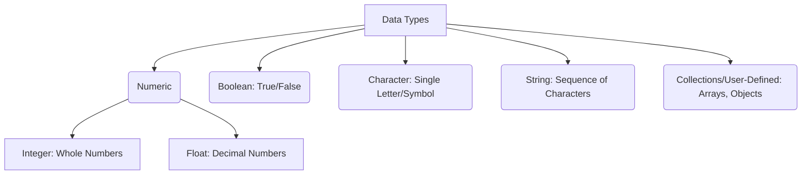

## 02-Variables, Data Types, and Operators

In any programming language, variables are used to store data, data types classify that data, and operators perform operations on it. These are fundamental concepts that form the basis of all programming logic, including the instructions given to robots. This chapter explores these core elements in the context of C++ and Python, two primary languages used in robotics.

### 2.1 Variables

A **variable** is a named storage location that holds a value. This value can change during the execution of a program. Think of it as a labeled box where you can put different items.

*   **Declaration:** In some languages (like C++), you must declare a variable before using it, specifying its data type.
    *   C++: `int sensorValue;`
*   **Assignment:** Giving a value to a variable.
    *   C++: `sensorValue = 100;`
    *   Python: `sensor_value = 100` (no explicit declaration needed, type is inferred)

### 2.2 Data Types

A **data type** classifies the kind of value a variable can hold, determining the operations that can be performed on it and how much memory it occupies.

#### 2.2.1 Numeric Types

*   **Integers:** Whole numbers (positive, negative, or zero).
    *   C++: `int` (typically 4 bytes), `short` (2 bytes), `long` (4 or 8 bytes), `long long` (8 bytes). Can be `unsigned` for positive values only.
    *   Python: `int` (arbitrary precision, limited only by memory).
*   **Floating-Point Numbers:** Numbers with decimal points.
    *   C++: `float` (single precision), `double` (double precision, more common).
    *   Python: `float` (double precision).

#### 2.2.2 Boolean Type

*   **Boolean:** Represents truth values: `true` or `false`.
    *   C++: `bool` (typically 1 byte).
    *   Python: `bool` (True or False).

#### 2.2.3 Character Type

*   **Character:** A single alphanumeric character.
    *   C++: `char` (typically 1 byte, ASCII character).
    *   Python: Not a distinct type; single characters are strings of length 1.

#### 2.2.4 String Type

*   **String:** A sequence of characters.
    *   C++: `std::string` (from `<string>` library).
    *   Python: `str` (immutable sequence of characters).

#### 2.2.5 Other Data Types (C++ specific examples)

*   **Arrays:** Collections of elements of the same data type.
*   **Pointers:** Variables that store memory addresses.
*   **Structures/Classes:** User-defined types that group related data and functions.

**Diagram 2.1: Common Data Types in Robotics Programming**



*Description: A hierarchical representation of common data types encountered in robotics programming, categorizing them by their nature.*

### 2.3 Operators

**Operators** are special symbols that perform operations on variables and values (operands).

#### 2.3.1 Arithmetic Operators

Perform mathematical calculations.

| Operator | Description    | C++ Example     | Python Example    |
| :------- | :------------- | :-------------- | :---------------- |
| `+`      | Addition       | `x + y`         | `x + y`           |
| `-`      | Subtraction    | `x - y`         | `x - y`           |
| `*`      | Multiplication | `x * y`         | `x * y`           |
| `/`      | Division       | `x / y`         | `x / y` (float)   |
| `//`     |                | N/A             | `x // y` (int div) |
| `%`      | Modulus        | `x % y`         | `x % y`           |
| `++`     | Increment      | `x++` (C++ only) | N/A               |
| `--`     | Decrement      | `x--` (C++ only) | N/A               |

#### 2.3.2 Assignment Operators

Assign values to variables.

| Operator | Example         | Equivalent to |
| :------- | :-------------- | :------------ |
| `=`      | `x = 5`         | `x = 5`       |
| `+=`     | `x += 5`        | `x = x + 5`   |
| `-=`     | `x -= 5`        | `x = x - 5`   |
| `*=`     | `x *= 5`        | `x = x * 5`   |
| `/=`     | `x /= 5`        | `x = x / 5`   |
| `%=`     | `x %= 5`        | `x = x % 5`   |

#### 2.3.3 Comparison (Relational) Operators

Compare two values, resulting in a `bool` (True/False).

| Operator | Description           | Example        |
| :------- | :-------------------- | :------------- |
| `==`     | Equal to              | `x == y`       |
| `!=`     | Not equal to          | `x != y`       |
| `>`      | Greater than          | `x > y`        |
| `<`      | Less than             | `x < y`        |
| `>=`     | Greater than or equal | `x >= y`       |
| `<=`     | Less than or equal    | `x <= y`       |

#### 2.3.4 Logical Operators

Combine boolean expressions, resulting in a `bool`.

| Operator | Description | C++ Example     | Python Example  |
| :------- | :---------- | :-------------- | :-------------- |
| `&&`     | Logical AND | `(x > 0) && (y < 10)` | `(x > 0) and (y < 10)` |
| `\|\|`   | Logical OR  | `(x == 5) \|\| (y == 7)` | `(x == 5) or (y == 7)` |
| `!`      | Logical NOT | `!(x == y)`     | `not (x == y)`  |

#### 2.3.5 Bitwise Operators (C++ specific, but also in Python)

Operate on individual bits of integer types. Useful for low-level hardware control (e.g., setting specific pins on a microcontroller).

| Operator | Description     | Example    |
| :------- | :-------------- | :--------- |
| `&`      | Bitwise AND     | `x & y`    |
| `\|`     | Bitwise OR      | `x \| y`   |
| `^`      | Bitwise XOR     | `x ^ y`    |
| `~`      | Bitwise NOT     | `~x`       |
| `<<`     | Left Shift      | `x << 2`   |
| `>>`     | Right Shift     | `x >> 2`   |

Understanding these fundamental building blocks is crucial for writing any program, especially in robotics where precise manipulation of data and logical decision-making are paramount.

---

### C++ Example: Sensor Data Processing with Variables and Operators

This C++ example reads an analog sensor value, converts it to a meaningful unit, and applies logical checks.

```cpp
#include <iostream>
#include <string>

int main() {
    // 1. Declare and initialize variables
    int rawSensorValue = 750; // Simulate an ADC reading (0-1023)
    float voltageRef = 5.0f;   // Reference voltage of ADC
    int adcMax = 1023;         // Maximum ADC reading

    std::string sensorName = "Distance_Sensor";
    bool objectDetected = false;
    float detectionThreshold_cm = 20.0f; // Threshold for object detection

    // 2. Perform calculations using arithmetic operators
    float sensorVoltage = (static_cast<float>(rawSensorValue) / adcMax) * voltageRef;

    // Simulate converting voltage to distance (example: 0.1V/cm)
    float distance_cm = sensorVoltage * 10.0f; // Simplified conversion

    // 3. Use comparison and logical operators
    if (distance_cm < detectionThreshold_cm) {
        objectDetected = true;
    } else {
        objectDetected = false;
    }

    // 4. Output results
    std::cout << sensorName << " Readings:" << std::endl;
    std::cout << "Raw ADC: " << rawSensorValue << std::endl;
    std::cout << "Voltage: " << sensorVoltage << " V" << std::endl;
    std::cout << "Distance: " << distance_cm << " cm" << std::endl;

    if (objectDetected) {
        std::cout << "STATUS: Object Detected!" << std::endl;
    } else {
        std::cout << "STATUS: No object in range." << std::endl;
    }

    // Example of assignment operators
    int robotSpeed = 50;
    robotSpeed += 10; // robotSpeed is now 60
    std::cout << "New robot speed: " << robotSpeed << std::endl;
    robotSpeed /= 2;  // robotSpeed is now 30
    std::cout << "Halved robot speed: " << robotSpeed << std::endl;

    return 0;
}
```

---

### Python Example: Robot Position Tracking

This Python example uses variables and operators to track a robot's 2D position.

```python
# 1. Initialize robot's state variables
robot_x = 0.0  # Current X position (float)
robot_y = 0.0  # Current Y position (float)
robot_heading = 90.0 # Current heading in degrees (0 = East, 90 = North) (float)
speed = 1.5 # meters per second (float)
dt = 0.1 # Time step in seconds (float)

# 2. Simulate movement for a few steps
print(f"Initial Position: ({robot_x:.2f}, {robot_y:.2f}), Heading: {robot_heading:.1f}°")

# Step 1: Move forward
print("\nMoving forward...")
# Convert heading to radians for trigonometric functions
heading_rad = (robot_heading * 3.14159 / 180.0) 
delta_x = speed * dt * (0 if robot_heading == 90 else (1 if robot_heading == 0 else (-1 if robot_heading == 180 else 0))) # Simplified, use sin/cos for general case
delta_y = speed * dt * (1 if robot_heading == 90 else (0 if robot_heading == 0 else (0 if robot_heading == 180 else 0))) # Simplified for 0, 90, 180

# More general for any angle
import math
delta_x = speed * dt * math.cos(math.radians(robot_heading))
delta_y = speed * dt * math.sin(math.radians(robot_heading))


robot_x += delta_x
robot_y += delta_y
print(f"Position after 1 step: ({robot_x:.2f}, {robot_y:.2f})")

# Step 2: Turn right and move
print("\nTurning right and moving...")
robot_heading -= 90 # Turn right
if robot_heading < 0:
    robot_heading += 360 # Keep heading positive

delta_x = speed * dt * math.cos(math.radians(robot_heading))
delta_y = speed * dt * math.sin(math.radians(robot_heading))

robot_x += delta_x
robot_y += delta_y
print(f"Position after turn and move: ({robot_x:.2f}, {robot_y:.2f}), Heading: {robot_heading:.1f}°")

# 3. Use logical operators for a check
obstacle_detected = False
battery_low = True

if obstacle_detected or battery_low:
    print("\nRobot needs attention: Obstacle detected OR Battery is low!")
else:
    print("\nRobot is operating normally.")

# 4. Example of integer division and modulo
total_distance_cm = 567 # Distance measured by encoder
cm_per_rotation = 20 # Distance covered per wheel rotation
full_rotations = total_distance_cm // cm_per_rotation
remaining_cm = total_distance_cm % cm_per_rotation
print(f"\nEncoder data: {total_distance_cm} cm is {full_rotations} full rotations and {remaining_cm} cm remaining.")
```

---

### Arduino Example: Digital Input Processing with Bitwise Operators

This Arduino sketch reads multiple digital inputs (representing sensor states or flags) and combines them using bitwise operators.

```arduino
// Define pins for hypothetical digital sensors/flags
const int sensorPin1 = 2; // e.g., Left Bumper
const int sensorPin2 = 3; // e.g., Right Bumper
const int sensorPin3 = 4; // e.g., Front Proximity
const int sensorPin4 = 5; // e.g., Target Detected

// Define LEDs for status indication
const int statusLedRed = 11;
const int statusLedGreen = 12;

byte sensorStates = 0; // Use a byte to store multiple sensor states (8 bits)

void setup() {
  Serial.begin(9600);
  pinMode(sensorPin1, INPUT_PULLUP);
  pinMode(sensorPin2, INPUT_PULLUP);
  pinMode(sensorPin3, INPUT_PULLUP);
  pinMode(sensorPin4, INPUT_PULLUP);
  pinMode(statusLedRed, OUTPUT);
  pinMode(statusLedGreen, OUTPUT);
  Serial.println("Arduino Digital Input Processing with Bitwise Operators Ready.");
}

void loop() {
  // Read each sensor state and combine them into sensorStates byte
  // Using bitwise OR (|) to set a specific bit if the sensor is LOW (pressed/detected)
  sensorStates = 0; // Clear all states
  if (digitalRead(sensorPin1) == LOW) { // If left bumper is pressed
    sensorStates = sensorStates | B00000001; // Set bit 0
  }
  if (digitalRead(sensorPin2) == LOW) { // If right bumper is pressed
    sensorStates = sensorStates | B00000010; // Set bit 1
  }
  if (digitalRead(sensorPin3) == LOW) { // If front proximity detects
    sensorStates = sensorStates | B00000100; // Set bit 2
  }
  if (digitalRead(sensorPin4) == LOW) { // If target detected
    sensorStates = sensorStates | B00001000; // Set bit 3
  }

  Serial.print("Sensor States (Binary): ");
  Serial.print(sensorStates, BIN); // Print as binary
  Serial.print(" (Decimal: ");
  Serial.print(sensorStates);
  Serial.println(")");

  // Check specific conditions using bitwise AND (&)
  if ((sensorStates & B00000011) > 0) { // Check if either left (bit 0) or right (bit 1) bumper is pressed
    Serial.println("  WARNING: Bumper triggered!");
    digitalWrite(statusLedRed, HIGH);
  } else {
    digitalWrite(statusLedRed, LOW);
  }

  if ((sensorStates & B00001000) == B00001000) { // Check if target detected (bit 3)
    Serial.println("  STATUS: Target Acquired!");
    digitalWrite(statusLedGreen, HIGH);
  } else {
    digitalWrite(statusLedGreen, LOW);
  }

  delay(100); // Small delay
}
```

---

### Equations in LaTeX: Data Conversion (Analog to Digital)

The conversion of an analog voltage `V_{in}` to a digital value `ADC_{val}` by an Analog-to-Digital Converter (ADC) can be represented as:

```latex
ADC_{val} = left lfloor frac{V_{in}{V_{ref} times (2^{N} - 1) right rfloor
```

Where:
*   `V_{in}` is the analog input voltage.
*   `V_{ref}` is the reference voltage of the ADC.
*   `N` is the resolution of the ADC (e.g., 10 for a 10-bit ADC).
*   `2^{N} - 1` is the maximum digital value (e.g., `2^{10} - 1 = 1023`).
*   `lfloor cdot rfloor` denotes the floor function (rounding down to the nearest integer).

---

### MCQs with Answers

1.  In C++, which data type would you typically use to store the raw reading from a 10-bit analog sensor (value from 0 to 1023)?
    a) `float`
    b) `bool`
    c) `int`
    d) `char`
    *Answer: c) `int`*

2.  Which Python operator performs integer division?
    a) `/`
    b) `%`
    c) `//`
    d) `*`
    *Answer: c) `//`*

3.  What is the purpose of the bitwise AND operator (`&`) in low-level programming for microcontrollers?
    a) To combine two boolean conditions.
    b) To set a specific bit to 1.
    c) To check if a specific bit is set to 1.
    d) To shift bits to the left.
    *Answer: c) To check if a specific bit is set to 1.*

---

### Practice Tasks

1.  **C++ Data Type Conversion:** Write a C++ program that takes a float temperature value (e.g., 25.75) and:
    *   Stores it in a `float` variable.
    *   Converts it to an `int` (truncating the decimal part).
    *   Prints both values, explaining any differences.
2.  **Python Operator Challenge:** Given two integer variables, `a = 15` and `b = 4`:
    *   Calculate `a + b`, `a - b`, `a * b`, `a / b`, `a // b`, `a % b`.
    *   Check if `a` is greater than `b` AND `a` is not equal to `10`.
    *   Check if `b` is less than `5` OR `a` is less than `10`.
    *   Perform a bitwise AND operation on `a` and `b`. Explain the result in binary.
3.  **Arduino Bitwise Flags:** Imagine you have 4 status flags for a robot: `MotorError`, `SensorFailure`, `LowBattery`, `ObstacleDetected`. Assign each to a specific bit position within a `byte` variable. Write Arduino code to:
    *   Set the `LowBattery` flag.
    *   Check if the `MotorError` flag is set.
    *   Clear the `ObstacleDetected` flag.
    *   Print the `byte` variable in binary after each operation.

---

### Notes for Teachers

*   **Syntax Differences:** Clearly highlight the syntax differences between C++ and Python for variable declaration, operators, and boolean values.
*   **Memory Management (C++):** Briefly introduce the concept of memory usage for different data types in C++ and its relevance for embedded systems.
*   **Bitwise Operators:** Emphasize the practical application of bitwise operators in microcontrollers for efficient control of registers and flags.

### Notes for Students

*   **Understand the "Why":** Don't just memorize syntax. Understand *why* a particular data type is chosen or *why* an operator works the way it does.
*   **Type Compatibility:** Be mindful of data type compatibility when performing operations, especially when mixing integers and floats.
*   **Read Error Messages:** Pay attention to compiler/interpreter error messages; they often point directly to issues with variables, types, or operators.
*   **Practice Low-Level:** For robotics, getting comfortable with bitwise operations and C++ memory concepts will be a significant advantage.