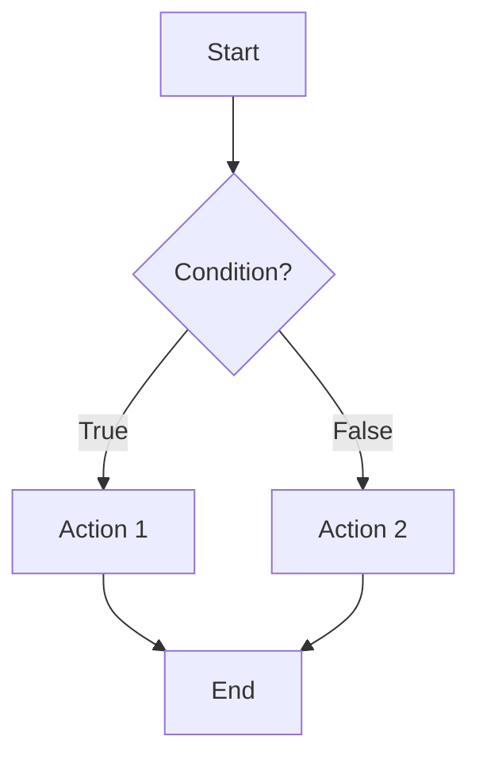
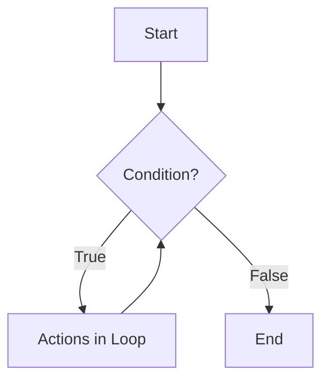

## 03-Control Flow - Conditionals and Loops

In programming, **control flow** refers to the order in which instructions are executed. Without control flow statements, a program would simply execute instructions sequentially from top to bottom. Conditionals (if/else) allow robots to make decisions, and loops enable them to repeat actions, both of which are crucial for any intelligent or autonomous behavior. This chapter covers these fundamental control flow mechanisms in C++ and Python.

### 3.1 Conditional Statements (Decision Making)

Conditional statements allow a program to execute different blocks of code based on whether a specified condition evaluates to `true` or `false`.

#### 3.1.1 `if` Statement

The `if` statement executes a block of code only if its condition is true.

*   **C++ Syntax:**
    ```cpp
    if (condition) {
        // code to execute if condition is true
    }
    ```
*   **Python Syntax:**
    ```python
    if condition:
        # code to execute if condition is true
    ```

#### 3.1.2 `if-else` Statement

The `if-else` statement executes one block of code if the condition is true and another block if it's false.

*   **C++ Syntax:**
    ```cpp
    if (condition) {
        // code if true
    } else {
        // code if false
    }
    ```
*   **Python Syntax:**
    ```python
    if condition:
        # code if true
    else:
        # code if false
    ```

#### 3.1.3 `if-elif-else` (Python) / `if-else if-else` (C++) Statement

Used for multiple conditions. It checks conditions sequentially and executes the block for the first true condition.

*   **C++ Syntax:**
    ```cpp
    if (condition1) {
        // code if condition1 is true
    } else if (condition2) {
        // code if condition2 is true
    } else {
        // code if no condition is true
    }
    ```
*   **Python Syntax:**
    ```python
    if condition1:
        # code if condition1 is true
    elif condition2:
        # code if condition2 is true
    else:
        # code if no condition is true
    ```

#### 3.1.4 `switch` Statement (C++ only)

The `switch` statement (not available in Python) allows a variable to be tested for equality against a list of values. It's often cleaner than a long `if-else if` chain for discrete integer or character values.

*   **C++ Syntax:**
    ```cpp
    switch (expression) {
        case value1:
            // code if expression == value1
            break;
        case value2:
            // code if expression == value2
            break;
        default:
            // code if no case matches
    }
    ```
    *Note: The `break` statement is crucial to exit the switch block after a match. Without it, execution "falls through" to the next case.*

**Diagram 3.1: Conditional Flow (If-Else)**



*Description: A flowchart illustrating the execution path of an if-else conditional statement, where a decision point branches the program flow.*

### 3.2 Loop Statements (Repetition)

Loop statements allow a block of code to be executed repeatedly. This is fundamental for tasks like reading sensor data continuously, iterating over data collections, or performing actions until a certain condition is met.

#### 3.2.1 `for` Loop

The `for` loop is typically used when you know in advance how many times you want to repeat a block of code, or when iterating over a sequence.

*   **C++ Syntax (Traditional):**
    ```cpp
    for (initialization; condition; update) {
        // code to repeat
    }
    // Example: for (int i = 0; i < 10; i++)
    ```
*   **C++ Syntax (Range-based for loop - C++11 and later):**
    ```cpp
    for (element_declaration : collection) {
        // code to repeat for each element
    }
    // Example: for (int val : myVector)
    ```
*   **Python Syntax:**
    ```python
    for item in sequence:
        # code to repeat for each item
    # Example: for i in range(10): or for sensor in sensors_list:
    ```

#### 3.2.2 `while` Loop

The `while` loop repeats a block of code as long as a specified condition remains true. It's useful when the number of repetitions is not known beforehand.

*   **C++ Syntax:**
    ```cpp
    while (condition) {
        // code to repeat as long as condition is true
    }
    ```
*   **Python Syntax:**
    ```python
    while condition:
        # code to repeat as long as condition is true
    ```

#### 3.2.3 `do-while` Loop (C++ only)

The `do-while` loop is similar to `while`, but it guarantees that the code block will be executed at least once before the condition is checked.

*   **C++ Syntax:**
    ```cpp
    do {
        // code to repeat
    } while (condition);
    ```

**Diagram 3.2: Loop Flow (While Loop)**



*Description: A flowchart illustrating the execution path of a while loop, showing how a block of actions is repeated as long as a condition holds true.*

### 3.3 Loop Control Statements

*   **`break`:** Terminates the loop immediately and transfers control to the statement immediately following the loop.
*   **`continue`:** Skips the rest of the current iteration of the loop and proceeds to the next iteration (checks the condition again for `while` and `for`, or performs the update for `for`).

Proper use of conditionals and loops allows robots to execute complex tasks, respond to dynamic environments, and perform calculations efficiently. They are fundamental tools in a robotics programmer's toolkit.

---

### C++ Example: Robot Obstacle Avoidance (Conditionals & Loops)

This C++ example combines conditionals and loops to simulate a robot's basic obstacle avoidance behavior.

```cpp
#include <iostream>
#include <vector>
#include <string>
#include <chrono>
#include <thread>
#include <random> // For std::random_device, std::mt19937, std::uniform_int_distribution

// Simulate a sensor reading function
int getDistanceSensorReading() {
    // Generate a random distance between 10cm and 100cm
    static std::random_device rd;
    static std::mt19937 gen(rd());
    static std::uniform_int_distribution<> distrib(10, 100);
    return distrib(gen);
}

// Simulate robot movement functions
void moveForward() {
    std::cout << "Robot: Moving Forward." << std::endl;
}

void turnLeft() {
    std::cout << "Robot: Turning Left." << std::endl;
    std::this_thread::sleep_for(std::chrono::milliseconds(300));
}

void turnRight() {
    std::cout << "Robot: Turning Right." << std::endl;
    std::this_thread::sleep_for(std::chrono::milliseconds(300));
}

void stopRobot() {
    std::cout << "Robot: STOPPED." << std::endl;
}

int main() {
    const int obstacleThreshold = 25; // cm
    int distance;
    int moveCount = 0;
    const int maxMoves = 10;

    std::cout << "Robot Obstacle Avoidance Simulation Started." << std::endl;

    // Loop for a fixed number of movements
    while (moveCount < maxMoves) {
        distance = getDistanceSensorReading();
        std::cout << "Sensor Reading: " << distance << " cm" << std::endl;

        if (distance < obstacleThreshold) {
            std::cout << "Obstacle detected! Distance: " << distance << " cm." << std::endl;
            stopRobot();
            // Randomly decide to turn left or right to avoid obstacle
            if (rand() % 2 == 0) {
                turnLeft();
            } else {
                turnRight();
            }
            std::cout << "Obstacle avoided. Resuming movement." << std::endl;
        } else {
            moveForward();
            moveCount++;
        }
        std::this_thread::sleep_for(std::chrono::milliseconds(500)); // Simulate movement time
    }

    std::cout << "Maximum moves reached. Robot stopping." << std::endl;
    stopRobot();
    return 0;
}
```

---

### Python Example: Robot Task Execution with Conditionals & Loops

This Python example simulates a robot performing a task, including checks for completion and error conditions using loops and conditionals.

```python
import time
import random

def check_battery_level():
    """Simulates checking battery level (returns percentage)."""
    return random.randint(10, 100)

def detect_object_in_gripper():
    """Simulates a sensor checking if an object is in the gripper."""
    return random.choice([True, False, False]) # 1/3 chance of object being present

def pick_up_object():
    """Simulates the robot attempting to pick up an object."""
    print("Robot: Attempting to pick up object...")
    time.sleep(1)
    return random.choice([True, True, False]) # 2/3 chance of successful pickup

def drop_object():
    """Simulates the robot dropping an object."""
    print("Robot: Dropping object...")
    time.sleep(0.5)

def move_to_location(location_name):
    """Simulates moving the robot to a specified location."""
    print(f"Robot: Moving to {location_name}...")
    time.sleep(1.5)
    return True # Always succeeds for simulation

if __name__ == "__main__":
    task_completed = False
    battery_critical_threshold = 20
    objects_processed = 0
    max_objects_to_process = 3

    print("Robot Task Execution Simulation Started.")

    while not task_completed:
        battery = check_battery_level()
        print(f"\nBattery Level: {battery}%")

        if battery < battery_critical_threshold:
            print("WARNING: Battery level critical! Returning to charging station.")
            move_to_location("Charging Station")
            task_completed = True # End simulation
            break # Exit the loop immediately

        if not detect_object_in_gripper():
            print("No object in gripper. Searching for object...")
            move_to_location("Pickup Zone")
            
            if pick_up_object():
                print("Object successfully picked up.")
                objects_processed += 1
            else:
                print("Failed to pick up object. Retrying...")
                # Continue will skip to the next iteration of the while loop
                continue 
        
        print("Object in gripper. Moving to drop-off.")
        move_to_location("Drop-off Zone")
        drop_object()

        if objects_processed >= max_objects_to_process:
            print(f"Processed {objects_processed} objects. Task completed!")
            task_completed = True
        else:
            print(f"Processed {objects_processed} of {max_objects_to_process} objects. Continuing task.")
        
        time.sleep(0.5) # Short pause before next iteration
```

---

### Arduino Example: State-Based Control with `switch-case`

This Arduino sketch uses a `switch-case` statement to implement a simple state machine for an LED sequence, demonstrating a common pattern for managing robot behaviors.

```arduino
// Define states for the LED sequence
enum {
  STATE_RED,
  STATE_YELLOW,
  STATE_GREEN,
  STATE_PAUSE
} currentLedState;

const int redLedPin = 8;
const int yellowLedPin = 9;
const int greenLedPin = 10;

unsigned long previousMillis = 0; // Will store last time LED was updated
const long intervalRed = 1000;    // Interval for red LED (1 second)
const long intervalYellow = 500;  // Interval for yellow LED (0.5 second)
const long intervalGreen = 2000;  // Interval for green LED (2 seconds)
const long intervalPause = 1000;  // Interval for pause (1 second)

void setup() {
  Serial.begin(9600);
  pinMode(redLedPin, OUTPUT);
  pinMode(yellowLedPin, OUTPUT);
  pinMode(greenLedPin, OUTPUT);

  // Initialize all LEDs off
  digitalWrite(redLedPin, LOW);
  digitalWrite(yellowLedPin, LOW);
  digitalWrite(greenLedPin, LOW);

  currentLedState = STATE_RED; // Start with the red LED state
  Serial.println("Arduino State Machine (LED Sequence) Started.");
}

void loop() {
  unsigned long currentMillis = millis(); // Get current time

  switch (currentLedState) {
    case STATE_RED:
      digitalWrite(redLedPin, HIGH);
      if (currentMillis - previousMillis >= intervalRed) {
        previousMillis = currentMillis;
        digitalWrite(redLedPin, LOW);
        currentLedState = STATE_YELLOW;
        Serial.println("State: Yellow");
      }
      break;

    case STATE_YELLOW:
      digitalWrite(yellowLedPin, HIGH);
      if (currentMillis - previousMillis >= intervalYellow) {
        previousMillis = currentMillis;
        digitalWrite(yellowLedPin, LOW);
        currentLedState = STATE_GREEN;
        Serial.println("State: Green");
      }
      break;

    case STATE_GREEN:
      digitalWrite(greenLedPin, HIGH);
      if (currentMillis - previousMillis >= intervalGreen) {
        previousMillis = currentMillis;
        digitalWrite(greenLedPin, LOW);
        currentLedState = STATE_PAUSE;
        Serial.println("State: Pause");
      }
      break;

    case STATE_PAUSE:
      if (currentMillis - previousMillis >= intervalPause) {
        previousMillis = currentMillis;
        currentLedState = STATE_RED; // Loop back to the beginning
        Serial.println("State: Red (Restarting Sequence)");
      }
      break;
  }
}
```

---

### Equations in LaTeX: Proportional-Integral (PI) Control Loop (Conceptual)

A PI controller adds an integral term to the proportional control, helping to eliminate steady-state errors. This is a common pattern within loops to achieve precise control.

```latex
u(t) = K_p e(t) + K_i int e(t) dt
```

Where:
*   `u(t)` is the control output.
*   `e(t)` is the error (difference between target and actual).
*   `K_p` is the proportional gain.
*   `K_i` is the integral gain.

---

### MCQs with Answers

1.  Which statement in C++ is used for testing a variable against a list of discrete values and is often an alternative to a long `if-else if` chain?
    a) `if`
    b) `while`
    c) `for`
    d) `switch`
    *Answer: d) `switch`*

2.  What is the primary use of a `while` loop in programming?
    a) To execute code a fixed number of times.
    b) To execute code at least once, then repeat if a condition is true.
    c) To repeat a block of code as long as a specified condition remains true.
    d) To iterate over elements in a collection.
    *Answer: c) To repeat a block of code as long as a specified condition remains true.*

3.  If you use a `break` statement inside a loop, what happens?
    a) It skips the rest of the current iteration and continues with the next.
    b) It immediately terminates the loop and continues execution after the loop.
    c) It causes an error in the program.
    d) It restarts the loop from the beginning.
    *Answer: b) It immediately terminates the loop and continues execution after the loop.*

---

### Practice Tasks

1.  **C++ Traffic Light Simulation:** Write a C++ program that simulates a simple traffic light sequence (Red for 5s, Yellow for 2s, Green for 5s). Use `if-else if` or `switch-case` and `std::this_thread::sleep_for` for timing.
2.  **Python Robot Navigation:** Write a Python program that simulates a robot trying to reach a target (e.g., coordinates (10, 10)). The robot starts at (0, 0) and can only move 1 unit per step. Use a `while` loop to continue moving until the target is reached. Inside the loop, use `if-elif-else` to decide whether to move along the X-axis or Y-axis to get closer to the target.
3.  **Arduino Button Counter:** Write an Arduino sketch that uses a button (connected to a digital input with `INPUT_PULLUP`) to increment a counter. Display the counter value on the serial monitor. When the counter reaches 5, turn on an LED and stop counting until the Arduino is reset. Use `if` statements and a `for` or `while` loop structure (if simulating multiple button presses).

---

### Notes for Teachers

*   **Flowcharts:** Use flowcharts extensively to visually explain conditional and loop logic before translating it into code.
*   **Infinite Loops:** Warn students about the dangers of infinite loops and how to avoid them (e.g., ensuring loop conditions eventually become false).
*   **Debugging with Print Statements:** Encourage students to use `Serial.print()` (Arduino) or `std::cout`/`print()` (C++/Python) to track variable values and program flow during debugging.

### Notes for Students

*   **Logical Thinking:** Conditionals and loops are about logical thinking. Break down problems into smaller decisions and repeated actions.
*   **Nested Structures:** You can nest `if` statements within `for` loops, `while` loops within `if` statements, etc., to create complex behaviors.
*   **Efficiency:** Consider how many times a loop will run. In robotics, inefficient loops can cause delays and poor performance.
*   **Readability:** Write clear, well-indented code so that the control flow is easy to understand.