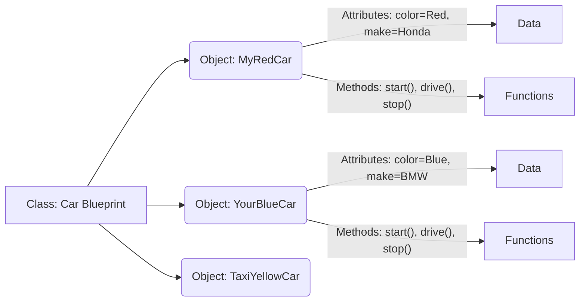

## 05-Object-Oriented Programming Concepts

**Object-Oriented Programming (OOP)** is a powerful programming paradigm that organizes software design around "objects" rather than "actions" or functions. In robotics, OOP is particularly well-suited for modeling the real-world components of a robot (sensors, motors, controllers) as independent, interacting entities. This chapter introduces the core concepts of OOP: classes, objects, encapsulation, inheritance, and polymorphism, with examples in C++ and Python.

### 5.1 Classes and Objects

#### 5.1.1 Class

A **class** is a blueprint or a template for creating objects. It defines the properties (data/attributes) and behaviors (functions/methods) that all objects of that type will have.

*   **C++ Syntax:**
    ```cpp
    class RobotArm {
    public:
        // Member variables (attributes)
        int numJoints;
        float currentAngle;

        // Member functions (methods)
        void moveJoint(float angle);
        float getAngle();
    };
    ```
*   **Python Syntax:**
    ```python
    class RobotArm:
        def __init__(self, num_joints):
            self.num_joints = num_joints
            self.current_angle = 0.0

        def move_joint(self, angle):
            # ... implementation ...
        
        def get_angle(self):
            # ... implementation ...
    ```

#### 5.1.2 Object (Instance)

An **object** is an instance of a class. When you create an object, you are creating a concrete entity based on the blueprint defined by the class. Each object has its own unique set of attribute values.

*   **C++ Syntax:**
    ```cpp
    RobotArm myRobotArm;         // Creates an object named myRobotArm
    myRobotArm.numJoints = 6;    // Access attributes
    myRobotArm.moveJoint(45.0f); // Call methods
    ```
*   **Python Syntax:**
    ```python
    my_robot_arm = RobotArm(6)     # Creates an object named my_robot_arm
    my_robot_arm.num_joints = 6    # Access attributes
    my_robot_arm.move_joint(45.0)  # Call methods
    ```
*   **Constructor:** A special method (e.g., `__init__` in Python, or a method with the same name as the class in C++) that is automatically called when an object is created. It typically initializes the object's attributes.

**Diagram 5.1: Class as a Blueprint, Objects as Instances**



*Description: Visualizing a class as a blueprint from which multiple distinct objects (instances) can be created, each sharing the same defined attributes and methods but with potentially different attribute values.*

### 5.2 Encapsulation

**Encapsulation** is the bundling of data (attributes) and the methods (functions) that operate on the data into a single unit (the class). It also involves restricting direct access to some of an object's components, meaning that internal state is hidden and only exposed through defined interfaces (public methods).

*   **Access Specifiers (C++):** `public`, `private`, `protected`.
    *   `public`: Accessible from anywhere.
    *   `private`: Accessible only from within the class itself.
    *   `protected`: Accessible within the class and by derived classes.
*   **Python Convention:** A single leading underscore (`_attribute`) indicates a convention for a "protected" member, while a double leading underscore (`__attribute`) triggers name mangling, making it harder to access from outside.

*Example:* A robot's motor class might have `private` attributes for internal motor state (e.g., current, temperature) and `public` methods (`setSpeed()`, `getSpeed()`) to safely interact with it.

### 5.3 Inheritance

**Inheritance** is a mechanism where a new class (derived/child class) can inherit properties and behaviors from an existing class (base/parent class). This promotes code reuse and establishes a hierarchical relationship between classes.

*   **`is-a` relationship:** A `WheeledRobot` *is a* `MobileRobot`.
*   **Example:** A `Robot` class could be a base class, with `MobileRobot` and `ManipulatorRobot` as derived classes, each adding specific functionalities.

*   **C++ Syntax:**
    ```cpp
    class MobileRobot : public Robot {
        // ... specific members for mobile robots ...
    };
    ```
*   **Python Syntax:**
    ```python
    class MobileRobot(Robot):
        # ... specific members for mobile robots ...
    ```

### 5.4 Polymorphism

**Polymorphism** means "many forms." In OOP, it allows objects of different classes to be treated as objects of a common base class. It often relies on method overriding (a derived class providing its own implementation of a method already defined in its base class) and virtual functions (C++).

*   **Example:** A `Robot` base class might have a `move()` method. A `WheeledRobot` and a `LeggedRobot` (both derived from `Robot`) could each implement their own `move()` method differently (e.g., `WheeledRobot.move()` uses wheels, `LeggedRobot.move()` uses legs). When you call `move()` on a `Robot` object, the appropriate specialized version is executed based on the actual type of the object.

### 5.5 Abstraction

**Abstraction** focuses on showing only essential information and hiding the complex implementation details. Classes provide a level of abstraction, allowing users to interact with objects through simple interfaces without needing to know the internal workings. In C++, abstract classes and pure virtual functions (`= 0`) are used to enforce abstraction. In Python, `abc` module (Abstract Base Classes) provides similar functionality.

### 5.6 Advantages of OOP in Robotics

*   **Modeling Real-World Systems:** Naturally maps robot components to objects, making design intuitive.
*   **Modularity:** Each component (sensor, motor) can be developed and tested independently.
*   **Reusability:** Common functionalities can be placed in base classes or utility classes.
    *   **Maintainability:** Easier to update or extend functionality without impacting other parts of the system.
*   **Collaboration:** Different teams can work on different classes/objects simultaneously.

OOP is a foundational paradigm for building scalable and robust robot software, especially as systems become more complex and sophisticated.

---

### C++ Example: Robot Component Hierarchy with OOP

This C++ example demonstrates classes, objects, inheritance, and polymorphism for robot components.

```cpp
#include <iostream>
#include <string>
#include <vector>
#include <memory> // For std::unique_ptr

// Base class for any robot component (Abstraction)
class RobotComponent {
protected: // Protected members are accessible by derived classes
    std::string name;
    bool isOperational;

public:
    RobotComponent(const std::string& componentName) : 
        name(componentName), isOperational(true) {}

    // Virtual function for polymorphism (allows derived classes to override)
    virtual void operate() const = 0; // Pure virtual function, makes RobotComponent abstract
    virtual void checkStatus() const {
        std::cout << name << " status: " << (isOperational ? "Operational" : "Faulty") << std::endl;
    }

    virtual ~RobotComponent() = default; // Virtual destructor for proper cleanup
};

// Derived class for Actuators
class Actuator : public RobotComponent {
protected:
    float currentCommand;

public:
    Actuator(const std::string& componentName) : 
        RobotComponent(componentName), currentCommand(0.0f) {}

    void setCommand(float command) {
        if (isOperational) {
            currentCommand = command;
            std::cout << name << ": Command set to " << currentCommand << std::endl;
        } else {
            std::cout << name << ": Cannot set command, component is faulty." << std::endl;
        }
    }

    // Override operate for Actuator
    void operate() const override {
        if (isOperational) {
            std::cout << name << ": Executing command " << currentCommand << std::endl;
        } else {
            std::cout << name << ": Cannot operate, component is faulty." << std::endl;
        }
    }
};

// Derived class for Sensors
class Sensor : public RobotComponent {
protected:
    int lastReading;

public:
    Sensor(const std::string& componentName) : 
        RobotComponent(componentName), lastReading(0) {}

    int readValue() {
        if (isOperational) {
            // Simulate reading
            lastReading = rand() % 100 + 1; // Random value 1-100
            std::cout << name << ": Reading value " << lastReading << std::endl;
            return lastReading;
        } else {
            std::cout << name << ": Cannot read, component is faulty." << std::endl;
            return -1; // Indicate error
        }
    }

    // Override operate for Sensor
    void operate() const override {
        if (isOperational) {
            std::cout << name << ": Actively sensing environment." << std::endl;
        } else {
            std::cout << name << ": Sensor is not active." << std::endl;
        }
    }
};

// Example of a specific actuator: Motor
class Motor : public Actuator {
public:
    Motor(const std::string& motorName) : Actuator(motorName) {}

    void operate() const override {
        Actuator::operate(); // Call base class operate
        std::cout << "  Motor " << name << " spinning at " << currentCommand * 100 << "% power." << std::endl;
    }
};

// Example of a specific sensor: Ultrasonic
class UltrasonicSensor : public Sensor {
public:
    UltrasonicSensor(const std::string& sensorName) : Sensor(sensorName) {}

    int getDistance() {
        return readValue(); // Use base class read functionality
    }

    void operate() const override {
        Sensor::operate(); // Call base class operate
        std::cout << "  Ultrasonic Sensor " << name << " sending/receiving pulses." << std::endl;
    }
};

int main() {
    std::vector<std::unique_ptr<RobotComponent>> robotParts;

    robotParts.push_back(std::make_unique<Motor>("LeftWheelMotor"));
    robotParts.push_back(std::make_unique<Motor>("RightWheelMotor"));
    robotParts.push_back(std::make_unique<UltrasonicSensor>("FrontSensor"));
    
    std::cout << "--- Initial Status ---" << std::endl;
    for (const auto& part : robotParts) {
        part->checkStatus();
    }

    // Demonstrate Actuator specific functionality
    Motor* leftMotor = static_cast<Motor*>(robotParts[0].get());
    if (leftMotor) {
        leftMotor->setCommand(0.75f);
    }

    // Demonstrate Sensor specific functionality
    UltrasonicSensor* frontSensor = static_cast<UltrasonicSensor*>(robotParts[2].get());
    if (frontSensor) {
        int dist = frontSensor->getDistance();
        std::cout << "Distance from FrontSensor: " << dist << std::endl;
    }

    std::cout << "\n--- Operating all components (Polymorphism) ---" << std::endl;
    for (const auto& part : robotParts) {
        part->operate();
    }

    return 0;
}
```

---

### Python Example: Robot Control System with OOP

This Python example uses OOP to model a robot's overall control system, including sensors and actuators.

```python
import time
import random

# Base class for a generic Robot Component
class RobotComponent:
    def __init__(self, name):
        self.name = name
        self._is_enabled = True # Encapsulated state
        print(f"Component '{self.name}' initialized.")

    def enable(self):
        self._is_enabled = True
        print(f"Component '{self.name}' enabled.")

    def disable(self):
        self._is_enabled = False
        print(f"Component '{self.name}' disabled.")

    def is_enabled(self):
        return self._is_enabled
    
    def operate(self):
        """Generic operation - to be overridden by subclasses."""
        if self._is_enabled:
            print(f"Component '{self.name}' performing generic operation.")
        else:
            print(f"Component '{self.name}' is disabled.")

# Sensor class (inherits from RobotComponent)
class Sensor(RobotComponent):
    def __init__(self, name, sensor_type):
        super().__init__(name) # Call parent class constructor
        self.sensor_type = sensor_type
        self.last_reading = None
        print(f"Sensor '{self.name}' ({self.sensor_type}) created.")

    def read_data(self):
        if self.is_enabled():
            self.last_reading = random.uniform(0.0, 100.0) # Simulate data
            print(f"Sensor '{self.name}' read: {self.last_reading:.2f}")
            return self.last_reading
        else:
            print(f"Sensor '{self.name}' is disabled, cannot read.")
            return None
            
    def operate(self): # Polymorphism: specialized operation
        self.read_data()

# Actuator class (inherits from RobotComponent)
class Actuator(RobotComponent):
    def __init__(self, name, actuator_type):
        super().__init__(name)
        self.actuator_type = actuator_type
        self._power_level = 0 # Encapsulated
        print(f"Actuator '{self.name}' ({self.actuator_type}) created.")

    def set_power(self, level):
        if self.is_enabled():
            if 0 <= level <= 100:
                self._power_level = level
                print(f"Actuator '{self.name}' set to {self._power_level}% power.")
            else:
                print(f"Error: Power level for '{self.name}' must be between 0 and 100.")
        else:
            print(f"Actuator '{self.name}' is disabled, cannot set power.")
            
    def operate(self): # Polymorphism: specialized operation
        if self.is_enabled():
            print(f"Actuator '{self.name}' is acting at {self._power_level}% power.")
        else:
            print(f"Actuator '{self.name}' is disabled.")


# Robot Controller class (orchestrates components)
class RobotController:
    def __init__(self, robot_id):
        self.robot_id = robot_id
        self.sensors = []
        self.actuators = []
        print(f"Robot Controller '{self.robot_id}' initialized.")

    def add_component(self, component):
        if isinstance(component, Sensor):
            self.sensors.append(component)
        elif isinstance(component, Actuator):
            self.actuators.append(component)
        else:
            print(f"Warning: Unknown component type added: {component.name}")
        print(f"Component '{component.name}' added to {self.robot_id}.")

    def run_cycle(self):
        print(f"\n--- {self.robot_id} Running Cycle ---")
        # Operate all sensors
        for sensor in self.sensors:
            sensor.operate() # Polymorphic call

        # Make decisions based on sensor data (simplified)
        front_distance = self.sensors[0].last_reading if self.sensors else 0
        if front_distance is not None and front_distance < 30:
            print(f"{self.robot_id}: Obstacle detected! Actuating avoidance.")
            for actuator in self.actuators:
                actuator.set_power(0) # Stop
                actuator.set_power(random.randint(40, 60)) # Turn (simulated)
                time.sleep(0.5)
                actuator.set_power(0)
        else:
            print(f"{self.robot_id}: Path clear. Moving forward.")
            for actuator in self.actuators:
                actuator.set_power(70) # Move forward

        # Operate all actuators
        for actuator in self.actuators:
            actuator.operate() # Polymorphic call
        
        time.sleep(1) # Simulate processing time

# Example usage
if __name__ == "__main__":
    my_robot = RobotController("ExplorerBot")

    # Create components
    ir_sensor = Sensor("IR_Front", "Proximity")
    wheel_motor_left = Actuator("Motor_Left", "Wheel")
    wheel_motor_right = Actuator("Motor_Right", "Wheel")

    # Add components to the robot
    my_robot.add_component(ir_sensor)
    my_robot.add_component(wheel_motor_left)
    my_robot.add_component(wheel_motor_right)

    # Run robot for a few cycles
    for _ in range(5):
        my_robot.run_cycle()

    # Demonstrate disabling a component
    print("\n--- Disabling sensor ---")
    ir_sensor.disable()
    my_robot.run_cycle() # Sensor will report disabled

    print("\n--- Enabling sensor ---")
    ir_sensor.enable()
    my_robot.run_cycle()

    print("\nRobot simulation complete.")
```

---

### Arduino Example: OOP for Simple Robot Modules

While Arduino C++ doesn't always lend itself to full-blown OOP for very small projects due to resource constraints, it's perfectly capable. This example shows a simple `LED` class.

```arduino
// LED.h (Header file for the LED class)
#ifndef LED_H
#define LED_H

class LED {
  private:
    int _pin; // Private attribute for the LED pin
    bool _isOn; // Private attribute for current state

  public:
    // Constructor
    LED(int pin);

    // Public methods
    void begin(); // Setup the pin
    void on();
    void off();
    void toggle();
    bool getState();
};

#endif
```

```arduino
// LED.cpp (Implementation file for the LED class)
#include "LED.h"
#include <Arduino.h> // Include Arduino core definitions

// Constructor implementation
LED::LED(int pin) {
  _pin = pin;
  _isOn = false; // Initialize LED as off
}

void LED::begin() {
  pinMode(_pin, OUTPUT);
  off(); // Ensure it starts off
}

void LED::on() {
  digitalWrite(_pin, HIGH);
  _isOn = true;
}

void LED::off() {
  digitalWrite(_pin, LOW);
  _isOn = false;
}

void LED::toggle() {
  if (_isOn) {
    off();
  } else {
    on();
  }
}

bool LED::getState() {
  return _isOn;
}
```

```arduino
// Arduino_OOP_LED_Demo.ino (Main Arduino Sketch)
#include "LED.h" // Include our custom LED class header

// Create LED objects (instances of the LED class)
LED redLed(8);
LED greenLed(9);

void setup() {
  Serial.begin(9600);
  redLed.begin();   // Initialize red LED
  greenLed.begin(); // Initialize green LED
  Serial.println("Arduino OOP LED Demo Started.");
}

void loop() {
  Serial.println("\nRed LED blinking...");
  for (int i = 0; i < 3; i++) {
    redLed.on();
    delay(200);
    redLed.off();
    delay(200);
  }

  Serial.println("Green LED toggling...");
  greenLed.toggle(); // Turn on if off, off if on
  delay(1000);
  greenLed.toggle();
  delay(1000);

  Serial.print("Red LED state: ");
  Serial.println(redLed.getState() ? "ON" : "OFF");
  Serial.print("Green LED state: ");
  Serial.println(greenLed.getState() ? "ON" : "OFF");
  
  delay(2000); // Pause before repeating
}
```

---

### Equations in LaTeX: Message Passing in OOP (Conceptual)

In an OOP system, objects communicate by sending messages (calling methods) to each other. Conceptually, a message `M` sent from object `O_A` to object `O_B` to invoke method `F` with arguments `Args`:

```latex
O_A xrightarrow{M(F, Args)} O_B
```

This represents the interaction: `O_B.F(Args)`.

---

### MCQs with Answers

1.  What is a "class" in Object-Oriented Programming?
    a) A specific instance of an object.
    b) A block of code that performs a single task.
    c) A blueprint or template for creating objects, defining their properties and behaviors.
    d) A collection of related functions.
    *Answer: c) A blueprint or template for creating objects, defining their properties and behaviors.*

2.  Which OOP principle involves a new class inheriting properties and behaviors from an existing class, promoting code reuse?
    a) Encapsulation
    b) Polymorphism
    c) Abstraction
    d) Inheritance
    *Answer: d) Inheritance*

3.  If a base class `Shape` has a `draw()` method, and derived classes `Circle` and `Square` each provide their own specific implementation of `draw()`, what OOP principle is being demonstrated?
    a) Encapsulation
    b) Polymorphism
    c) Inheritance
    d) Abstraction
    *Answer: b) Polymorphism*

---

### Practice Tasks

1.  **C++ Robot Arm Classes:** Design a set of C++ classes for a simple two-joint robotic arm:
    *   A `Joint` class (representing a single joint with current angle, min/max limits).
    *   A `RobotArm` class that contains two `Joint` objects.
    *   The `RobotArm` class should have methods like `setJointAngle(jointIndex, angle)` and `getCurrentAngles()`.
    Implement basic error checking for joint limits.
2.  **Python Sensor Abstraction:** Create a Python class hierarchy for different types of sensors:
    *   An abstract base class `Sensor` with methods like `read()` (which subclasses must implement) and attributes like `name`, `is_active`.
    *   Derived classes like `UltrasonicSensor` and `LightSensor`, each implementing `read()` to simulate reading their specific type of data.
    Then, create a list of these sensor objects and iterate through them, calling their `read()` method polymorphically.
3.  **Arduino LED Blinking Class Improvement:** Modify the provided Arduino `LED` class to include a `blink(times, delayMs)` method that performs the blinking pattern internally, making the main `loop()` even simpler.

---

### Notes for Teachers

*   **Real-World Mapping:** Always emphasize the analogy between OOP concepts and real-world robot components to make the concepts tangible.
*   **Encapsulation Benefits:** Discuss how `private` or `protected` members protect the integrity of an object's state, preventing accidental modification.
*   **UML Diagrams (Optional):** Introduce simple UML class diagrams to visually represent class relationships (inheritance) and members.

### Notes for Students

*   **Think in Objects:** When designing a robot program, start by identifying the main components that can be represented as objects.
*   **"Is-a" vs. "Has-a":** Understand the difference between inheritance ("is-a" relationship, e.g., a `Motor` is an `Actuator`) and composition ("has-a" relationship, e.g., a `Robot` has a `Motor`).
*   **Practice with Small Projects:** Start by applying OOP to small, manageable robot sub-systems before tackling the entire robot.
*   **Benefit from OOP:** OOP initially seems like more work, but for complex systems like robots, it quickly pays off in terms of organization and maintainability.