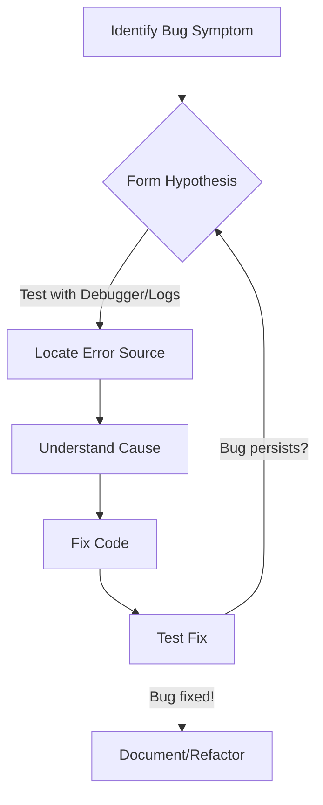

## 07-Debugging and Testing Strategies

Developing robust robot software requires more than just writing code; it demands effective strategies for finding and fixing errors (**debugging**) and verifying that the software behaves as expected (**testing**). In robotics, where software interacts directly with physical hardware and the real world, these practices are even more critical, as errors can lead to physical damage, safety hazards, or system failure. This chapter introduces essential debugging and testing techniques for robotics programming.

### 7.1 Understanding Bugs and Errors

*   **Syntax Errors:** Mistakes in the language's grammar rules. These are caught by the compiler (C++, Arduino) or interpreter (Python) and prevent the program from running. (e.g., missing semicolon, misspelled keyword).
*   **Runtime Errors:** Errors that occur while the program is running. They might crash the program or lead to unexpected behavior (e.g., division by zero, accessing invalid memory, sensor returning unexpected data).
*   **Logic Errors:** The program runs without crashing, but it produces incorrect results or doesn't do what it was intended to do (e.g., robot moves in the wrong direction, calculation is off). These are often the hardest to find.
*   **Hardware Errors:** Issues with the physical components (e.g., faulty sensor, loose wire, motor driver failure). Software debugging techniques often help diagnose these, but the fix is hardware-related.

### 7.2 Debugging Techniques

Debugging is the process of identifying, analyzing, and removing errors from software.

#### 7.2.1 Print/Log Statements

The simplest and most common debugging technique. Inserting `print()`, `std::cout`, or `Serial.print()` statements at various points in your code allows you to:
*   Track the flow of execution.
*   Display variable values at different stages.
*   Identify which parts of the code are being reached or skipped.

*   **Pros:** Easy to implement, works across all platforms.
*   **Cons:** Can clutter code, requires recompilation/reupload for changes, can affect timing.

#### 7.2.2 Debuggers

A **debugger** is a software tool that allows you to control the execution of your program, inspect its state, and set breakpoints.

*   **Breakpoints:** Pause program execution at a specific line of code.
*   **Step-by-step execution:** Execute code line by line.
*   **Variable inspection:** View the current values of variables.
*   **Call stack:** See the sequence of function calls that led to the current point.

*   **C++:** GDB (GNU Debugger) is command-line based; integrated into IDEs like VS Code, Eclipse, CLion. Hardware debuggers (e.g., J-Link, ST-Link) for microcontrollers.
*   **Python:** pdb (Python Debugger) is built-in; IDEs like PyCharm, VS Code have graphical debuggers.
*   **Arduino:** Limited built-in debugging. Serial printing is primary. Dedicated debugging probes (like Atmel-ICE) exist for advanced users.

#### 7.2.3 Error Handling

Implement code to gracefully handle expected errors or abnormal conditions.

*   **`try-except` (Python):** Catches exceptions.
*   **`try-catch` (C++):** Catches exceptions.
*   **Return codes/flags:** Functions can return specific values to indicate success or failure.
*   **Assertions:** Statements that check assumptions about program state. If an assertion fails, the program terminates.

#### 7.2.4 Visualization Tools

Especially important in robotics:
*   **ROS Visualization (RViz):** Visualizes sensor data, robot models, paths, and maps.
*   **Plotting Libraries (Matplotlib in Python):** Plot sensor data, motor commands over time.

**Diagram 7.1: Debugging Workflow**



*Description: A cyclical flowchart illustrating the typical steps involved in the debugging process, from identifying a symptom to fixing and verifying the error.*

### 7.3 Testing Strategies

Testing ensures that your code works correctly and reliably.

#### 7.3.1 Unit Testing

*   Tests individual, isolated units of code (e.g., a single function, a single class method) to verify their correctness.
*   **C++:** Google Test, Catch2.
*   **Python:** `unittest` module, `pytest`.
*   **Arduino:** Limited; often involves writing small test sketches.

#### 7.3.2 Integration Testing

*   Tests how different modules or components of the robot software interact with each other.
*   Ensures that interfaces between modules work as expected.

#### 7.3.3 System Testing (Hardware-in-the-Loop / Robot-in-the-Loop)

*   Tests the entire robot system, often involving physical hardware.
*   **Hardware-in-the-Loop (HIL):** Part of the system is simulated, while critical hardware components are real. (e.g., simulating robot environment, but using real flight controller).
*   **Robot-in-the-Loop (RIL):** The full physical robot operates in its intended environment. (e.g., running a navigation stack on a mobile robot).

#### 7.3.4 Simulation

*   Using virtual environments (e.g., Gazebo, Webots) to test robot code without the need for physical hardware.
*   **Pros:** Safe, repeatable, faster, cheaper, allows testing of dangerous scenarios.
*   **Cons:** Simulations are never perfect; real-world physics and sensor noise are hard to replicate fully.

#### 7.3.5 Regression Testing

*   Rerunning existing tests after code changes to ensure that new changes haven't introduced old bugs or broken existing functionality.

#### 7.3.6 Test-Driven Development (TDD)

*   A development methodology where you write tests *before* writing the actual code.
*   **Cycle:** Write a failing test -> Write just enough code to make the test pass -> Refactor the code.

Effective debugging and comprehensive testing are not optional in robotics; they are integral to building safe, reliable, and high-performing autonomous systems.

---

### C++ Example: Simple Unit Test with Assertions (Conceptual)

This C++ example conceptually shows a very basic unit test for a `calculateDistance` function using simple `if` statements for assertions. In a real project, a testing framework like Google Test would be used.

```cpp
#include <iostream>
#include <cmath> // For std::abs

// Function to be tested
float calculateDistance(float x1, float y1, float x2, float y2) {
    return std::sqrt(std::pow(x2 - x1, 2) + std::pow(y2 - y1, 2));
}

// Simple test function
void testCalculateDistance() {
    std::cout << "--- Running testCalculateDistance ---" << std::endl;

    // Test Case 1: Simple horizontal distance
    float result1 = calculateDistance(0, 0, 5, 0);
    if (std::abs(result1 - 5.0f) < 0.001f) {
        std::cout << "Test Case 1 (horizontal): PASSED" << std::endl;
    } else {
        std::cout << "Test Case 1 (horizontal): FAILED. Expected 5.0, Got " << result1 << std::endl;
    }

    // Test Case 2: Simple vertical distance
    float result2 = calculateDistance(0, 0, 0, 3);
    if (std::abs(result2 - 3.0f) < 0.001f) {
        std::cout << "Test Case 2 (vertical): PASSED" << std::endl;
    } else {
        std::cout << "Test Case 2 (vertical): FAILED. Expected 3.0, Got " << result2 << std::endl;
    }

    // Test Case 3: Diagonal distance (3-4-5 triangle)
    float result3 = calculateDistance(0, 0, 4, 3);
    if (std::abs(result3 - 5.0f) < 0.001f) {
        std::cout << "Test Case 3 (diagonal): PASSED" << std::endl;
    } else {
        std::cout << "Test Case 3 (diagonal): FAILED. Expected 5.0, Got " << result3 << std::endl;
    }
    
    // Test Case 4: Same point
    float result4 = calculateDistance(1, 1, 1, 1);
    if (std::abs(result4 - 0.0f) < 0.001f) {
        std::cout << "Test Case 4 (same point): PASSED" << std::endl;
    } else {
        std::cout << "Test Case 4 (same point): FAILED. Expected 0.0, Got " << result4 << std::endl;
    }

    std::cout << "--- Test complete ---" << std::endl;
}

int main() {
    testCalculateDistance();
    return 0;
}
```

---

### Python Example: Using `pdb` (Python Debugger) and `unittest`

This Python example demonstrates how to use the built-in `pdb` debugger and the `unittest` framework for testing.

```python
import pdb # Python Debugger
import unittest
import math

# Function with a potential bug (intentional for demo)
def calculate_robot_heading_correction(current_heading, target_heading):
    """
    Calculates the shortest angle to turn from current_heading to target_heading.
    Angles are in degrees (0-360).
    """
    # Intentional bug: Does not handle crossing 0/360 boundary efficiently
    # Example: current=350, target=10. Should turn +20, not -340.
    
    delta_heading = target_heading - current_heading
    
    # Corrected logic (uncomment this and comment out above for fix)
    # delta_heading = target_heading - current_heading
    # if delta_heading > 180:
    #     delta_heading -= 360
    # elif delta_heading < -180:
    #     delta_heading += 360

    return delta_heading

# --- Unit Tests ---
class TestRobotCalculations(unittest.TestCase):

    def test_calculate_distance(self):
        # A correct function
        def _calculate_distance(x1, y1, x2, y2):
            return math.sqrt((x2 - x1)**2 + (y2 - y1)**2)
        
        self.assertAlmostEqual(_calculate_distance(0, 0, 5, 0), 5.0)
        self.assertAlmostEqual(_calculate_distance(0, 0, 0, 3), 3.0)
        self.assertAlmostEqual(_calculate_distance(0, 0, 4, 3), 5.0)
        self.assertAlmostEqual(_calculate_distance(1, 1, 1, 1), 0.0)

    def test_heading_correction(self):
        # Test cases for the potentially buggy function
        self.assertEqual(calculate_robot_heading_correction(0, 45), 45)
        self.assertEqual(calculate_robot_heading_correction(90, 0), -90)
        self.assertEqual(calculate_robot_heading_correction(10, 350), -340) # Bug: Should be -20
        self.assertEqual(calculate_robot_heading_correction(350, 10), -340) # Bug: Should be +20
        self.assertEqual(calculate_robot_heading_correction(170, -170), -340) # Bug: Should be +20 (170 to 190)

if __name__ == "__main__":
    print("--- Running Python Debugger Demo ---")
    print("To use pdb, run: python -m pdb your_script.py")
    print("Type 'n' (next line), 's' (step into), 'c' (continue), 'p variable' (print variable).")
    
    # Example of using pdb for a specific function call
    print("\nBefore calling buggy function:")
    # Uncomment the line below to activate pdb at this point
    # pdb.set_trace() 
    
    # Calling the buggy function
    print(f"Correction for 10 deg to 350 deg: {calculate_robot_heading_correction(10, 350)}")
    print(f"Correction for 350 deg to 10 deg: {calculate_robot_heading_correction(350, 10)}")


    print("\n--- Running Unit Tests ---")
    unittest.main(argv=['first-arg-is-ignored'], exit=False)
    
    print("\nPython Debugging and Testing Demo Finished.")
```

---

### Arduino Example: Serial Plotter for Sensor Debugging

This Arduino example shows how to use `Serial.print()` to output data in a format suitable for the Arduino Serial Plotter, a powerful tool for visualizing sensor data in real-time.

```arduino
const int potentiometerPin = A0; // Analog input pin for potentiometer
const int lightSensorPin = A1;   // Analog input pin for LDR/photoresistor

void setup() {
  Serial.begin(9600); // Initialize serial communication
  Serial.println("Arduino Serial Plotter Demo Ready.");
  // Send header for plotter
  Serial.println("Potentiometer,LightSensor"); 
}

void loop() {
  int potValue = analogRead(potentiometerPin);   // Read potentiometer
  int lightValue = analogRead(lightSensorPin); // Read light sensor

  // Print values separated by a comma. Serial Plotter needs specific format.
  // The Plotter will automatically graph these values over time.
  Serial.print(potValue);
  Serial.print(",");
  Serial.println(lightValue);

  delay(50); // Small delay for stable readings and plotter update rate
}

/*
To use the Serial Plotter:
1. Upload this sketch to your Arduino.
2. Open the Serial Plotter from Tools > Serial Plotter in the Arduino IDE.
3. Ensure the baud rate matches (9600 in this case).
4. You should see two lines (one for potentiometer, one for light sensor)
   moving as you adjust the potentiometer and light conditions.
*/
```

---

### Equations in LaTeX: Mean Squared Error (MSE) for Performance Testing

When testing a robot's performance (e.g., how accurately it follows a path), Mean Squared Error (MSE) is a common metric.

```latex
MSE = frac{1}{N} sum_{i=1}^{N} (y_{i} - hat{y}_{i})^2
```

Where:
*   `N` is the number of data points.
*   `y_i` is the true (target) value.
*   `hat{y}_i` is the predicted or measured value.

---

### MCQs with Answers

1.  Which type of error occurs when a program runs without crashing but produces incorrect results?
    a) Syntax Error
    b) Runtime Error
    c) Logic Error
    d) Hardware Error
    *Answer: c) Logic Error*

2.  What is the primary purpose of a "breakpoint" in a debugger?
    a) To mark a line of code as commented out.
    b) To pause program execution at a specific line of code.
    c) To highlight syntax errors in the code.
    d) To restart the program from the beginning.
    *Answer: b) To pause program execution at a specific line of code.*

3.  Testing individual, isolated units of code (like a single function or class method) is known as:
    a) Integration Testing
    b) System Testing
    c) Unit Testing
    d) Regression Testing
    *Answer: c) Unit Testing*

---

### Practice Tasks

1.  **C++ Debugging Exercise:** Take the C++ `calculateDistance` function from the example. Introduce an intentional bug (e.g., forget `std::sqrt`). Then, using print statements, identify where the calculation goes wrong by printing intermediate values, and fix the bug.
2.  **Python Logic Error Hunt:** Write a Python function `is_safe_to_move(distance_front, distance_sides)` that should return `True` if `distance_front` is greater than 20cm AND `distance_sides` is greater than 10cm. Introduce a subtle logic error (e.g., use OR instead of AND, or wrong comparison operator). Write unit tests (using `unittest`) to catch this bug, and then fix it.
3.  **Arduino Sensor Visualization:** Connect an LDR (light sensor) to an analog input pin on your Arduino. Write a sketch that sends the LDR reading to the Serial Plotter. Experiment with different light conditions and observe the graph. Explain how this visualization helps in debugging sensor readings.

---

### Notes for Teachers

*   **Embrace Errors:** Frame debugging as a problem-solving challenge, not a sign of failure. It's an essential skill.
*   **Debugging Mindset:** Teach students a systematic approach to debugging: reproduce the bug, simplify the problem, localize the error, analyze the cause, test the fix.
*   **Pair Programming:** Encourage pair programming for debugging tasks; two sets of eyes can often spot errors faster.

### Notes for Students

*   **Be Patient:** Debugging can be frustrating, but patience and a systematic approach will yield results.
*   **Start Small:** When encountering a bug, try to simplify the code or isolate the problematic section.
*   **Document Bugs:** Keep a record of bugs you find, how you found them, and how you fixed them. This helps in future debugging and prevents recurring issues.
*   **Learn Your Tools:** Invest time in learning how to use your IDE's debugger and other testing tools effectively. They are powerful allies.