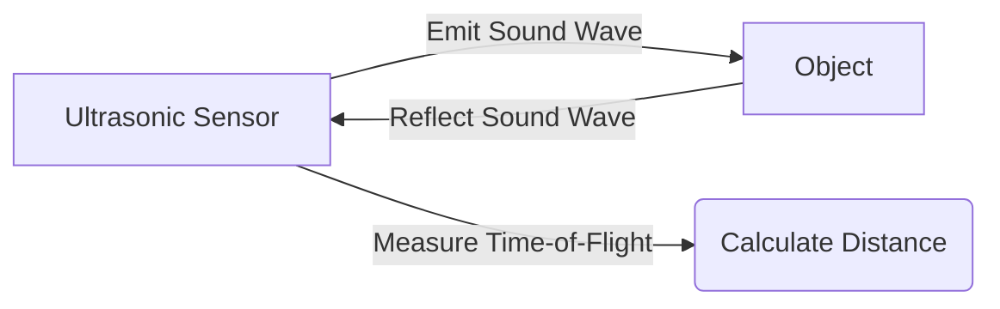

--- 
sidebar_position: 2
title: Proximity and Distance Sensors
---

## 02-Proximity and Distance Sensors

Proximity and distance sensors are crucial for robots to understand their immediate surroundings, detect obstacles, and navigate safely. While proximity sensors typically provide a binary output (object present/absent), distance sensors provide a quantitative measurement of how far away an object is. This chapter explores the working principles, applications, and characteristics of common proximity and distance sensing technologies used in robotics.

### 2.1 Types of Proximity and Distance Sensors

Sensors in this category operate using various physical principles, including sound, light, and electromagnetic fields.

#### 2.1.1 Ultrasonic Sensors

*   **Principle:** Emit high-frequency sound waves (ultrasound) and measure the time it takes for the echo to return (Time-of-Flight - ToF).
*   **Advantages:**
    *   Relatively inexpensive.
    *   Unaffected by color or transparency of objects.
    *   Works well in various lighting conditions.
*   **Disadvantages:**
    *   **Specularity:** Can struggle with soft, angled, or highly absorbent surfaces (e.g., foam, cloth).
    *   **Beam Angle:** Have a cone-shaped beam, leading to a wider detection area but less precise localization.
    *   **Slow Update Rate:** Sound travels relatively slowly.
    *   **Cross-talk:** Multiple ultrasonic sensors can interfere with each other if not synchronized.
*   **Applications:** Obstacle detection, basic navigation, liquid level sensing.
*   **Example:** HC-SR04, MaxBotix sensors.

**Diagram 2.1: Ultrasonic Sensor Working Principle**



*Description: Illustrates the Time-of-Flight principle for ultrasonic sensors, where emitted sound waves bounce off an object and return, allowing distance calculation.*

#### 2.1.2 Infrared (IR) Proximity/Distance Sensors

IR sensors use infrared light to detect objects.

*   **IR Proximity Sensors (Digital Output):**
    *   **Principle:** An IR LED emits IR light, and an IR photodiode/phototransistor detects reflections. If enough light reflects back, an object is detected (binary output).
    *   **Advantages:** Simple, fast, inexpensive.
    *   **Disadvantages:** Short range, highly affected by ambient light and object color (darker objects absorb more IR).
    *   **Applications:** Line following, edge detection, simple object presence.
*   **IR Distance Sensors (Analog Output):**
    *   **Principle:** Use triangulation. An IR emitter projects light, and a position-sensitive detector (PSD) measures the angle of the reflected light, which varies with distance.
    *   **Advantages:** More precise distance measurement than simple proximity, compact.
    *   **Disadvantages:** Affected by ambient light, object color/reflectivity, non-linear output, limited range.
    *   **Applications:** Obstacle avoidance, short-range mapping.
    *   **Example:** Sharp GP2Y0A21YK, GP2Y0A02YK.

#### 2.1.3 LiDAR (Light Detection and Ranging)

*   **Principle:** Emits laser pulses and measures the time-of-flight for each pulse to return after reflecting off objects. Builds a 2D or 3D map of the environment.
*   **Advantages:**
    *   Highly accurate and precise distance measurements.
    *   Creates dense point clouds for detailed mapping.
    *   Less affected by ambient light than IR sensors.
    *   Can work in total darkness.
*   **Disadvantages:**
    *   Expensive (especially 3D multi-layer LiDAR).
    *   Can be affected by fog, rain, or highly reflective/transparent surfaces.
    *   High data rates require significant processing power.
*   **Applications:** Autonomous vehicles, advanced mobile robotics, simultaneous localization and mapping (SLAM), 3D environment modeling.
*   **Example:** RPLIDAR, Velodyne, Ouster.

#### 2.1.4 Time-of-Flight (ToF) Cameras

*   **Principle:** Project modulated IR light and measure the phase shift or time delay of the reflected light to determine depth for each pixel. Creates a depth map.
*   **Advantages:** Provides a full depth image, good for close-range 3D perception.
*   **Disadvantages:** Limited range (typically shorter than LiDAR), affected by ambient IR light, lower resolution than standard cameras.
*   **Applications:** Object detection and tracking, gesture recognition, human-robot interaction, small-scale 3D mapping.
*   **Example:** Intel RealSense (some models), Microsoft Azure Kinect.

#### 2.1.5 Capacitive Proximity Sensors

*   **Principle:** Detect objects by sensing changes in an electrical field or capacitance. They work by generating an electrostatic field and detecting changes in that field caused by the presence of objects.
*   **Advantages:** Detects metallic and non-metallic objects, robust in dirty environments.
*   **Disadvantages:** Very short range, sensitive to humidity.
*   **Applications:** Industrial counting, liquid level detection (through non-metallic tanks), some touch interfaces.

### 2.2 Selecting the Right Sensor

Choosing the appropriate proximity or distance sensor involves considering several factors:
*   **Range:** Minimum and maximum distance to be measured.
*   **Accuracy & Precision:** How close to the true value and how repeatable the measurements are.
*   **Update Rate:** How frequently new measurements are needed.
*   **Environmental Robustness:** Performance in different lighting, temperature, dust, or humidity conditions.
*   **Cost:** Budget constraints.
*   **Power Consumption:** Battery life considerations for mobile robots.
*   **Field of View/Beam Angle:** How wide an area the sensor covers.
*   **Object Properties:** Will it need to detect transparent, dark, or soft objects?

Often, a combination of different sensor types is used to provide a more comprehensive and robust perception system, leveraging the strengths of each.

--- 

### C++ Example: Ultrasonic Sensor Data Filtering (Moving Average)

This C++ example demonstrates a basic moving average filter for ultrasonic sensor readings to reduce noise.

```cpp
#include <iostream>
#include <vector>
#include <numeric> // For std::accumulate
#include <deque>   // For std::deque (double-ended queue)
#include <string>
#include <random>
#include <chrono>
#include <thread>

// Simulate an ultrasonic sensor reading with noise
float getNoisyUltrasonicReading(float true_distance_cm) {
    static std::random_device rd;
    static std::mt19937 gen(rd());
    // Add Gaussian noise (mean 0, stddev 2.0)
    static std::normal_distribution&lt;&gt; d(0, 2.0); 
    // Add occasional "spikes" (e.g., from spurious reflections)
    static std::uniform_int_distribution<> spike_dist(0, 100); 

    float noisy_reading = true_distance_cm + d(gen);

    if (spike_dist(gen) < 5) { // 5% chance of a large spike
        noisy_reading += (spike_dist(gen) % 2 == 0 ? 1 : -1) * random.uniform(10, 20); // Add/subtract 10-20 cm
    }

    return std::max(0.0f, noisy_reading); // Ensure non-negative
}

class MovingAverageFilter {
private:
    std::deque<float> readings;
    size_t window_size;

public:
    MovingAverageFilter(size_t size) : window_size(size) {
        if (window_size == 0) window_size = 1; // Minimum window size of 1
    }

    float update(float new_reading) {
        readings.push_back(new_reading);
        if (readings.size() > window_size) {
            readings.pop_front();
        }
        
        float sum = std::accumulate(readings.begin(), readings.end(), 0.0f);
        return sum / readings.size();
    }

    void reset() {
        readings.clear();
    }
};

int main() {
    const float actual_object_distance = 60.0f; // cm
    MovingAverageFilter filter(5); // Use a window of 5 readings

    std::cout << "Ultrasonic Sensor Filtering Demo (Moving Average)" << std::endl;
    std::cout << "Actual Distance: " << actual_object_distance << " cm" << std::endl;
    std::cout << "Filter Window Size: " << 5 << "\n" << std::endl;

    for (int i = 0; i < 20; ++i) {
        float raw_reading = getNoisyUltrasonicReading(actual_object_distance);
        float filtered_reading = filter.update(raw_reading);

        std::cout << "Raw: " << raw_reading << " cm\tFiltered: " << filtered_reading << " cm"
                  << "\tError (Filtered): " << std::abs(filtered_reading - actual_object_distance) << " cm" << std::endl;
        
        std::this_thread::sleep_for(std::chrono::milliseconds(100));
    }

    return 0;
}
```

---

### Python Example: Simulating a LiDAR Scan and Object Detection

This Python example simulates a simple 2D LiDAR scan and identifies a basic "object" based on contiguous range readings within a certain threshold.

```python
import math
import random
import time

def simulate_lidar_scan(num_points=360, max_range=10.0, object_present=False, object_angle_start=120, object_angle_end=150, object_distance=2.0):
    """
    Simulates a 360-degree 2D LiDAR scan.
    Returns a list of distances, one for each degree.
    """
    scan_data = [max_range] * num_points # Initialize with max_range (no object)

    if object_present:
        # Simulate a circular object within a defined angular range
        for angle in range(object_angle_start, object_angle_end + 1):
            if 0 <= angle < num_points:
                # Add some small noise to the object distance
                noisy_distance = object_distance + random.uniform(-0.1, 0.1)
                scan_data[angle] = max(0.0, min(max_range, noisy_distance))
    
    # Add general background noise
    for i in range(num_points):
        if scan_data[i] == max_range: # Only add noise if no object already
            scan_data[i] += random.uniform(-0.05, 0.05)
            scan_data[i] = max(0.0, min(max_range, scan_data[i])) # Clamp

    return scan_data

def detect_objects_from_scan(scan_data, max_range_threshold=0.5, min_cluster_size=5):
    """
    Analyzes LiDAR scan data to detect potential objects.
    An object is a cluster of readings significantly less than max_range and close to each other.
    """
    objects = []
    current_cluster = []

    for i, distance in enumerate(scan_data):
        if distance < max_range_threshold: # A reading indicating something relatively close
            current_cluster.append((i, distance))
        else:
            if len(current_cluster) >= min_cluster_size:
                # Found a cluster that's large enough
                objects.append(current_cluster)
            current_cluster = []
    
    # Check for a cluster at the end of the scan
    if len(current_cluster) >= min_cluster_size:
        objects.append(current_cluster)

    return objects

if __name__ == "__main__":

    max_lidar_range = 5.0 # meters
    
    print("--- Simulating LiDAR Scan and Object Detection ---")

    # Scenario 1: No object
    print("\nScenario 1: No object in front.")
    scan_no_object = simulate_lidar_scan(max_range=max_lidar_range, object_present=False)
    detected_objects_no_obj = detect_objects_from_scan(scan_no_object, max_range_threshold=max_lidar_range - 0.1)
    if not detected_objects_no_obj:
        print("  No objects detected. (Correct)")
    else:
        print(f"  Unexpectedly detected {len(detected_objects_no_obj)} objects.")

    # Scenario 2: Object present between 120-150 degrees at 2.0m.
    print("\nScenario 2: Object present between 120-150 degrees at 2.0m.")
    scan_with_object = simulate_lidar_scan(max_range=max_lidar_range, object_present=True, object_angle_start=120, object_angle_end=150, object_distance=2.0)
    detected_objects_obj = detect_objects_from_scan(scan_with_object, max_range_threshold=max_lidar_range - 0.1)
    
    if detected_objects_obj:
        print(f"  Detected {len(detected_objects_obj)} objects.")
        for obj_idx, obj_cluster in enumerate(detected_objects_obj):
            angles = [p[0] for p in obj_cluster]
            distances = [p[1] for p in obj_cluster]
            avg_dist = sum(distances) / len(distances)
            print(f"    Object {obj_idx+1}: Angles {min(angles)}-{max(angles)} deg, Average Distance: {avg_dist:.2f}m")
    else:
        print("  No objects detected. (Incorrect, expected object)")
    
    # For visualization (conceptual)
    # import matplotlib.pyplot as plt
    # plt.figure(figsize=(8, 8))
    # plt.polar([math.radians(i) for i in range(360)], scan_with_object, 'b.')
    # plt.title("Simulated LiDAR Scan with Object")
    # plt.show()
```

---

### Arduino Example: IR Proximity Sensor for Line Following

This Arduino sketch uses two IR proximity sensors to detect a line, a common setup for simple line-following robots.

```arduino
// IR Sensor Pins
const int leftIrSensorPin = 2;  // Digital input for left IR sensor
const int rightIrSensorPin = 3; // Digital input for right IR sensor

// Motor Control Pins (simplified)
const int leftMotorPin = 6;  // PWM pin for left motor speed/control
const int rightMotorPin = 5; // PWM pin for right motor speed/control

// Sensor state variables
int leftSensorState = HIGH;  // HIGH = no line, LOW = line detected
int rightSensorState = HIGH; // HIGH = no line, LOW = line detected

void setup() {
  Serial.begin(9600);
  pinMode(leftIrSensorPin, INPUT_PULLUP);  // Use internal pull-up
  pinMode(rightIrSensorPin, INPUT_PULLUP); // Use internal pull-up
  pinMode(leftMotorPin, OUTPUT);
  pinMode(rightMotorPin, OUTPUT);

  Serial.println("Arduino Line Follower (IR Sensors) Demo Ready.");
  delay(1000); // Give time for setup and serial monitor to open
}

void loop() {
  leftSensorState = digitalRead(leftIrSensorPin);
  rightSensorState = digitalRead(rightIrSensorPin);

  Serial.print("Left: ");
  Serial.print(leftSensorState == LOW ? "LINE" : "   ");
  Serial.print(" | Right: ");
  Serial.print(rightSensorState == LOW ? "LINE" : "   ");

  if (leftSensorState == LOW && rightSensorState == LOW) {
    // Both sensors detect line - move straight
    Serial.println(" -> Straight");
    analogWrite(leftMotorPin, 150);
    analogWrite(rightMotorPin, 150);
  } else if (leftSensorState == LOW && rightSensorState == HIGH) {
    // Left sensor on line, right off - turn left
    Serial.println(" -> Turn Left");
    analogWrite(leftMotorPin, 0);   // Stop left motor
    analogWrite(rightMotorPin, 100); // Drive right motor
  } else if (leftSensorState == HIGH && rightSensorState == LOW) {
    // Right sensor on line, left off - turn right
    Serial.println(" -> Turn Right");
    analogWrite(leftMotorPin, 100); // Drive left motor
    analogWrite(rightMotorPin, 0);  // Stop right motor
  } else { // leftSensorState == HIGH && rightSensorState == HIGH
    // Both sensors off line - stop or search for line (simple stop for now)
    Serial.println(" -> Searching (Stopped)");
    analogWrite(leftMotorPin, 0);
    analogWrite(rightMotorPin, 0);
  }

  delay(50); // Small delay
}
```

---

### Equations in LaTeX: Time-of-Flight Distance Calculation

For ultrasonic and simple LiDAR sensors using Time-of-Flight (ToF), the distance `D` can be calculated as:

```latex
D = frac{v cdot t}{2}
```

Where:
*   `v` is the speed of the wave (sound for ultrasonic, light for LiDAR) in the medium.
*   `t` is the measured time-of-flight.
*   The factor of 2 accounts for the wave traveling to the object and back.

---

### MCQs with Answers

1.  Which type of sensor emits sound waves and measures the time for the echo to return to calculate distance?
    a) IR Proximity Sensor
    b) LiDAR Sensor
    c) Capacitive Proximity Sensor
    d) Ultrasonic Sensor
    *Answer: d) Ultrasonic Sensor*

2.  What is a major disadvantage of simple IR proximity sensors?
    a) They are very expensive.
    b) They are highly affected by ambient light and object color.
    c) They have an extremely long range.
    d) They can only detect metallic objects.
    *Answer: b) They are highly affected by ambient light and object color.*

3.  Which distance sensor technology provides highly accurate 2D or 3D point clouds of the environment using laser pulses?
    a) Ultrasonic Sensor
    b) IR Distance Sensor
    c) LiDAR Sensor
    d) ToF Camera
    *Answer: c) LiDAR Sensor*

---

### Practice Tasks

1.  **Sensor Comparison Table:** Create a table comparing Ultrasonic, IR Distance (Sharp GP2Y0Axx), and LiDAR sensors. Include columns for: Principle, Advantages, Disadvantages, Typical Range, and Ideal Use Case in a Mobile Robot.
2.  **Obstacle Avoidance Logic:** For a mobile robot equipped with three ultrasonic sensors (front, left, right), write pseudocode for an obstacle avoidance behavior. The robot should try to move forward. If an obstacle is detected in front, it should check its left and right sensors to decide which way to turn. If both are blocked, it should reverse.
3.  **Sensor Mounting Considerations:** Discuss the physical mounting considerations for an ultrasonic sensor on a robot. How might its position, angle, and surrounding structures affect its readings? Consider issues like beam interference and blind spots.

---

### Notes for Teachers

*   **Demonstrate Sensors:** If available, demonstrate the different types of sensors. Show their output on a serial monitor or oscilloscope.
*   **Real-World Data:** If possible, record actual sensor data (e.g., from an HC-SR04) and use it for hands-on filtering exercises.
*   **Trade-offs are Key:** Emphasize that there is no "perfect" sensor; each has trade-offs in terms of cost, performance, and environmental robustness.

### Notes for Students

*   **Understand Limitations:** Always be aware of the limitations of the sensors you are using. This helps in understanding unexpected robot behavior.
*   **Noise is Inevitable:** Expect sensor readings to be noisy. Learn to implement simple filtering techniques.
*   **Multiple Sensors are Better:** For robust perception, it's almost always better to use multiple sensors, often of different types, and fuse their data.
*   **Datasheets are Your Friend:** Consult the datasheet for any sensor you use to understand its specifications and how to interface with it correctly.
