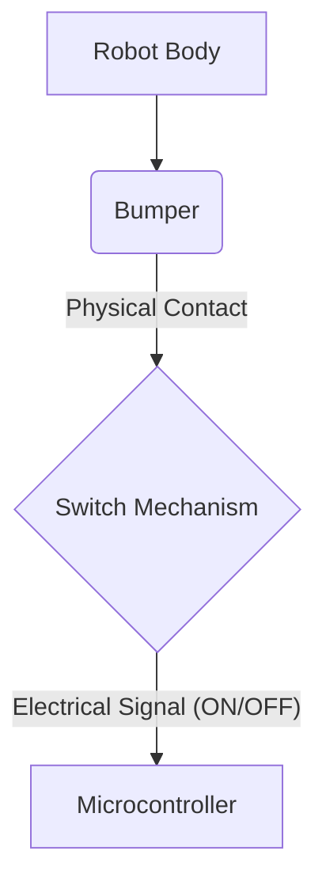

--- 
sidebar_position: 3
title: Contact Sensors
---

## 03-Contact Sensors

Contact sensors are fundamental to robots that need to interact physically with their environment or detect direct physical touch. Unlike proximity or distance sensors that detect objects without touching them, contact sensors require direct physical interaction. They are often simple in principle but provide critical information for safe operation, manipulation, and tactile feedback. This chapter explores various types of contact sensors and their applications in robotics.

### 3.1 Basic Contact Sensors (Switches)

The simplest form of a contact sensor is a mechanical switch.

*   **Limit Switches / Bumper Switches:**
    *   **Principle:** A physical button or lever that closes (or opens) an electrical circuit when pressed or actuated.
    *   **Output:** Typically digital (ON/OFF, HIGH/LOW).
    *   **Advantages:** Inexpensive, robust, simple to interface.
    *   **Disadvantages:** Only provides binary information (contact/no contact), requires physical deformation, can be susceptible to bouncing (multiple rapid open/close signals from a single press).
    *   **Applications:** Collision detection (bumpers on mobile robots), end-of-travel detection (limit switches on robotic arms to prevent over-extension), safety interlocks.

**Diagram 3.1: Bumper Switch (Conceptual)**



*Description: A conceptual diagram showing a robot bumper, which upon physical contact, actuates a switch to send an electrical signal to the microcontroller.*

### 3.2 Force and Pressure Sensors

These sensors provide more granular information than simple contact switches, measuring the magnitude of force or pressure applied.

*   **Force Sensitive Resistors (FSRs):**
    *   **Principle:** A polymer thick film that changes its electrical resistance when pressure is applied to its surface. Higher pressure leads to lower resistance.
    *   **Output:** Analog (resistance, which can be converted to voltage using a voltage divider).
    *   **Advantages:** Low cost, thin, flexible, can be integrated into various shapes.
    *   **Disadvantages:** Not highly accurate or repeatable for precise force measurement, prone to drift, sensitive to temperature.
    *   **Applications:** Simple touch input, grip force estimation (in grippers), pressure mapping for basic tactile sensing.
*   **Strain Gauges:**
    *   **Principle:** Measure strain (deformation) in an object, which is then related to applied force. Consists of a thin resistive wires or foils whose resistance changes when stretched or compressed. Typically used in a Wheatstone bridge configuration for accurate measurement of small resistance changes.
    *   **Output:** Analog (very small voltage change from Wheatstone bridge, requires amplification).
    *   **Advantages:** High accuracy and repeatability for force/weight measurement, robust.
    *   **Disadvantages:** More expensive, requires careful bonding to the surface, needs amplification and specialized electronics.
    *   **Applications:** Load cells (measuring weight), robotic joint torque sensing, material testing.
*   **Piezoelectric Sensors:**
    *   **Principle:** Generate an electric charge when subjected to mechanical stress (force, pressure).
    *   **Output:** Analog (voltage proportional to force/pressure).
    *   **Advantages:** Fast response time, self-generating (no external power required), can detect dynamic forces (vibrations).
    *   **Disadvantages:** Cannot measure static forces (charge dissipates), high impedance output requires careful signal conditioning.
    *   **Applications:** Impact sensing, vibration detection, microphones, some tactile arrays.

### 3.3 Tactile Sensors and Arrays

Tactile sensors aim to replicate a robot's sense of touch, providing information about contact, pressure, texture, and slip. They often consist of arrays of smaller sensing elements.

*   **Principle:** Can be based on FSRs, capacitive changes, or even optical principles. The goal is to provide spatially resolved pressure information, similar to human skin.
*   **Applications:**
    *   **Manipulation:** Detecting successful grasp, adjusting grip force, identifying object properties (shape, texture).
    *   **Human-Robot Interaction:** Safe physical collaboration, detecting human touch.
    *   **Gait Control:** For legged robots, sensing ground contact and pressure distribution.

### 3.4 Selecting and Interfacing Contact Sensors

*   **Output Type:** Digital (switches) vs. Analog (FSRs, strain gauges, piezo). Digital sensors are simple to connect, analog sensors require ADC inputs and often signal conditioning.
*   **Resolution/Accuracy:** How precise does the force/pressure measurement need to be?
*   **Durability:** How many cycles of contact can it withstand?
*   **Physical Form Factor:** Does it need to be flexible, small, or able to cover a large area?
*   **Interfacing:**
    *   **Switches:** Direct to digital input pins (often with internal pull-up/down resistors).
    *   **FSRs:** Typically in a voltage divider circuit, connected to an analog input pin.
    *   **Strain Gauges:** Require a Wheatstone bridge and an instrumentation amplifier for accurate readings, then to an analog input.
    *   **Piezoelectric:** May require a charge amplifier for dynamic force measurement.

Contact sensors, while sometimes overlooked in favor of more "exciting" vision or LiDAR systems, provide indispensable close-range interaction and safety information, crucial for reliable robotic operation in the real world.

--- 

### C++ Example: Bumper Switch Debouncing

This C++ example demonstrates how to debounce a bumper switch using a simple software algorithm, preventing multiple rapid triggers from a single physical press.

```cpp
#include <iostream>
#include <chrono>
#include <thread>
#include <string>

// Global "defines" for convenience, mirroring Arduino
const int LOW = 0;
const int HIGH = 1;

class BumperSwitch {
private:
    std::string name;
    int current_state;
    int last_state;
    long last_debounce_time;
    long debounce_delay_ms; // Milliseconds

public:
    BumperSwitch(const std::string& switch_name, long delay_ms = 50) : 
        name(switch_name), 
        current_state(HIGH), // Assume unpressed initially (e.g. with pull-up)
        last_state(HIGH),
        last_debounce_time(0),
        debounce_delay_ms(delay_ms) {}

    // Simulate reading the physical state of the switch (e.g., from a digital pin)
    int readPhysicalState() {
        // In a real system, this would be digitalRead(pin)
        // For simulation, simulate random presses
        static int press_chance = 0;
        press_chance = (press_chance + 1) % 100; // Increment chance slowly
        if (press_chance == 1) return LOW; // Simulate a press
        else if (press_chance == 5) return HIGH; // Simulate a release
        return last_state; // Otherwise, maintain last state
    }

    bool isPressed() {
        int reading = readPhysicalState();

        if (reading != last_state) {
            last_debounce_time = std::chrono::duration_cast<std::chrono::milliseconds>(
                                 std::chrono::high_resolution_clock::now().time_since_epoch()).count();
        }

        long current_time_ms = std::chrono::duration_cast<std::chrono::milliseconds>(
                                 std::chrono::high_resolution_clock::now().time_since_epoch()).count();

        if ((current_time_ms - last_debounce_time) > debounce_delay_ms) {
            if (reading != current_state) {
                current_state = reading;
                if (current_state == LOW) { // Assuming LOW means pressed
                    return true;
                }
            }
        }
        last_state = reading;
        return false;
    }
};

int main() {
    BumperSwitch frontBumper("Front Bumper", 75); // 75ms debounce delay

    std::cout << "Bumper Switch Debouncing Demo Started." << std::endl;
    std::cout << "Simulating button presses. Watch for 'Bumper Pressed!' output." << std::endl;

    for (int i = 0; i < 50; ++i) { // Simulate for a duration
        if (frontBumper.isPressed()) {
            std::cout << ">>>> Bumper Pressed! <<<<" << std::endl;
        } else {
            // std::cout << "Bumper released or stable." << std::endl; // Too verbose
        }
        std::this_thread::sleep_for(std::chrono::milliseconds(20)); // Check every 20ms
    }
    std::cout << "Demo Finished." << std::endl;

    return 0;
}
```

---

### Python Example: Force Sensitive Resistor (FSR) Interface Simulation

This Python example simulates reading an FSR and converting its analog value to a force estimate.

```python
import random
import time

class ForceSensitiveResistor:
    def __init__(self, name, voltage_supply=5.0, fixed_resistor_ohms=10000.0, max_force_kg=1.0):
        self.name = name
        self.voltage_supply = voltage_supply
        self.fixed_resistor_ohms = fixed_resistor_ohms # Resistor in voltage divider
        self.max_force_kg = max_force_kg
        print(f"FSR '{self.name}' initialized (Vcc={voltage_supply}V, R_fixed={fixed_resistor_ohms}Ω).")

    def _get_fsr_resistance(self, applied_force_kg):
        """
        Simulates FSR resistance based on applied force.
        FSRs typically have very high resistance when no force is applied (10M Ohm+)
        and resistance drops significantly with increasing force (to 100s Ohm or less).
        This is a highly simplified model.
        """
        if applied_force_kg <= 0:
            return 1e7 # Very high resistance for no force (10 M Ohm)
        
        # Logarithmic-like drop in resistance
        # R_fsr = R_no_force / (1 + k * force)
        k = 1e6 # Scaling factor
        resistance = 1e7 / (1 + k * (applied_force_kg / self.max_force_kg)**1.5)
        resistance += random.uniform(-500, 500) # Add some noise
        return max(100.0, resistance) # Clamp min resistance

    def read_analog_voltage(self, applied_force_kg):
        """
        Simulates reading the voltage from the voltage divider (FSR and fixed resistor).
        Output voltage is across the fixed resistor: V_out = Vcc * (R_fixed / (R_fixed + R_fsr))
        """
        fsr_resistance = self._get_fsr_resistance(applied_force_kg)
        
        if (self.fixed_resistor_ohms + fsr_resistance) == 0:
            return 0.0 # Avoid division by zero
        
        # Voltage across fixed resistor: V_out = Vcc * (R_fixed / (R_fixed + R_fsr))
        # This is commonly how FSRs are wired to ADC for reading
        voltage = self.voltage_supply * (self.fixed_resistor_ohms / (self.fixed_resistor_ohms + fsr_resistance))
        return voltage

    def get_force_estimate_kg(self, raw_voltage_reading):
        """
        Converts the raw voltage reading back to an estimated force.
        This inverse mapping is often complex and non-linear for real FSRs.
        This is a highly simplified, inverse of the simulation logic.
        """
        # Re-arrange: V_out = Vcc * (R_fixed / (R_fixed + R_fsr))
        # (R_fixed + R_fsr) = Vcc * R_fixed / V_out
        # R_fsr = (Vcc * R_fixed / V_out) - R_fixed
        if raw_voltage_reading == 0: # Avoid division by zero for max force (min resistance)
            return self.max_force_kg + random.uniform(0, 0.1) # Max force if voltage is zero (R_fsr is very small) 
        
        simulated_fsr_resistance = (self.voltage_supply * self.fixed_resistor_ohms / raw_voltage_reading) - self.fixed_resistor_ohms
        
        # Inverse of: R_fsr = 1e7 / (1 + k * (applied_force_kg / self.max_force_kg)**1.5)
        # (1 + k * (F/Fmax)^1.5) = 1e7 / R_fsr
        # k * (F/Fmax)^1.5 = (1e7 / R_fsr) - 1
        # (F/Fmax)^1.5 = ((1e7 / R_fsr) - 1) / k
        # F/Fmax = (((1e7 / R_fsr) - 1) / k)**(1/1.5)
        # F = Fmax * (((1e7 / R_fsr) - 1) / k)**(2/3)
        
        k = 1e6 # Must match simulation
        if simulated_fsr_resistance <= 0: return self.max_force_kg
        
        force_ratio_power_1_5 = ((1e7 / simulated_fsr_resistance) - 1) / k
        if force_ratio_power_1_5 <= 0: return 0.0 # No force
        
        estimated_force = self.max_force_kg * (force_ratio_power_1_5**(2/3))
        return max(0.0, min(self.max_force_kg, estimated_force)) # Clamp force


if __name__ == "__main__":
    gripper_fsr = ForceSensitiveResistor("GripperFSR", fixed_resistor_ohms=10000.0) # Using 10k fixed resistor

    print("\n--- FSR Force Estimation Demo ---")
    
    # Simulate various applied forces
    applied_forces = [0.0, 0.1, 0.2, 0.5, 0.8, 1.0, 0.3, 0.0] # kg

    for force in applied_forces:
        sim_voltage = gripper_fsr.read_analog_voltage(force)
        estimated_force = gripper_fsr.get_force_estimate_kg(sim_voltage)
        
        print(f"Applied Force: {force:.2f} kg, Simulated V_out: {sim_voltage:.3f}V, Estimated Force: {estimated_force:.2f} kg")
        time.sleep(0.5)
    
    print("\nDemo Complete.")
```

---

### Arduino Example: FSR with Voltage Divider

This Arduino sketch reads an FSR connected in a voltage divider and prints the raw analog value and an estimated force value.

```arduino
const int fsrAnalogPin = A0; // Analog pin connected to FSR voltage divider output
const float fsrVcc = 5.0;    // Arduino's supply voltage (Vcc)
const float fixedResistor = 10000.0; // The fixed resistor in the voltage divider (10k Ohm)

// Max resistance of FSR (when no force is applied)
// These values are rough estimates, consult FSR datasheet for accurate ones.
const float fsrMaxResistance = 1000000.0; // 1M Ohm (approx no force)
const float fsrMinResistance = 100.0;     // 100 Ohm (approx max force)

void setup() {
  Serial.begin(9600);
  Serial.println("Arduino FSR Reading Demo Ready.");
  Serial.println("Raw ADC Value,Estimated FSR Resistance,Estimated Force (0-100%)");
}

void loop() {
  int fsrRawValue = analogRead(fsrAnalogPin); // Read the analog value (0-1023)

  // Convert the raw ADC value to voltage at the analog pin
  float analogVoltage = fsrRawValue * (fsrVcc / 1023.0);

  // Calculate FSR resistance using voltage divider formula:
  // V_out = Vcc * (R_fixed / (R_fixed + R_fsr))
  // Solving for R_fsr: R_fsr = R_fixed * (Vcc / V_out - 1)
  float fsrResistance = fixedResistor * (fsrVcc / analogVoltage - 1);
  if (analogVoltage == 0) { // Avoid division by zero, indicates max force / min resistance
    fsrResistance = fsrMinResistance; 
  }
  if (fsrResistance < 0) fsrResistance = fsrMinResistance; // Clamp negative values
  
  // Map resistance to an estimated force percentage (0-100%)
  // This mapping is highly non-linear for real FSRs. A simple linear map is illustrative.
  // Higher resistance = lower force, lower resistance = higher force
  float forcePercentage = map(fsrResistance, fsrMaxResistance, fsrMinResistance, 0, 100);
  forcePercentage = constrain(forcePercentage, 0, 100); // Clamp to 0-100%

  Serial.print(fsrRawValue);
  Serial.print(",");
  Serial.print(fsrResistance);
  Serial.print(",");
  Serial.println(forcePercentage);

  delay(50); // Small delay
}
```

---

### Equations in LaTeX: Debouncing (RC Filter)

Hardware debouncing often uses an RC (Resistor-Capacitor) filter. The time constant `tau` of an RC circuit is:

```latex
tau = R times C
```

The time it takes for the capacitor to charge or discharge to approximately 63.2% of its final voltage. For effective debouncing, the time constant should be chosen to be longer than the typical bounce time of the switch.

--- 

### MCQs with Answers

1.  Which type of sensor primarily provides a binary output (contact/no contact) when a physical interaction occurs?
    a) Force Sensitive Resistor (FSR)
    b) Strain Gauge
    c) Bumper Switch
    d) Piezoelectric Sensor
    *Answer: c) Bumper Switch*

2.  What electrical property of an FSR changes when pressure is applied to its surface?
    a) Capacitance
    b) Inductance
    c) Resistance
    d) Voltage output (directly)
    *Answer: c) Resistance*

3.  Why is a Wheatstone bridge typically used with strain gauges?
    a) To amplify the digital signal.
    b) To convert the resistance change into a measurable voltage change.
    c) To power the strain gauge.
    d) To filter out electrical noise.
    *Answer: b) To convert the resistance change into a measurable voltage change.*

--- 

### Practice Tasks

1.  **Debouncing Algorithm Comparison:** Research two different software debouncing algorithms (e.g., simple delay, state machine with timeout). Describe their pros and cons. Implement one of them in pseudocode for a button press.
2.  **Gripper Tactile Sensing:** Imagine a robotic gripper designed to pick up delicate and irregularly shaped objects. What kind of contact or tactile sensors would you integrate into the robotic gripper's fingers? Explain how these sensors would provide feedback to the robot to ensure a gentle and secure grasp.
3.  **Strain Gauge Application:** Research a real-world application of strain gauges in robotics or industrial automation beyond load cells. Explain how it works and what advantages it provides over other sensing methods for that particular application.

--- 

### Notes for Teachers

*   **Physical Interaction:** Provide actual buttons, limit switches, and FSRs for students to experiment with. Connect them to an Arduino.
*   **Debouncing Demonstration:** Demonstrate the effect of switch bounce without debouncing and then show how software debouncing fixes it.
*   **Analog vs. Digital Output:** Clearly distinguish between sensors providing binary output (e.g., bumper) and those providing analog output (e.g., FSR), and how their interfacing differs.

### Notes for Students

*   **Don't Trust Raw Digital Input:** Always assume mechanical switches will bounce and implement debouncing in your code.
*   **Analog Requires Conversion:** Remember that analog contact sensors (FSR, strain gauge) provide a varying electrical signal that needs to be converted (usually by an ADC) into a digital value for the microcontroller.
*   **Signal Conditioning:** For very sensitive analog sensors like strain gauges, often specialized amplification and filtering circuits (signal conditioning) are necessary before connecting to an ADC.
*   **Safety First:** Contact sensors can be part of safety systems. Understand their reliability and failure modes.
