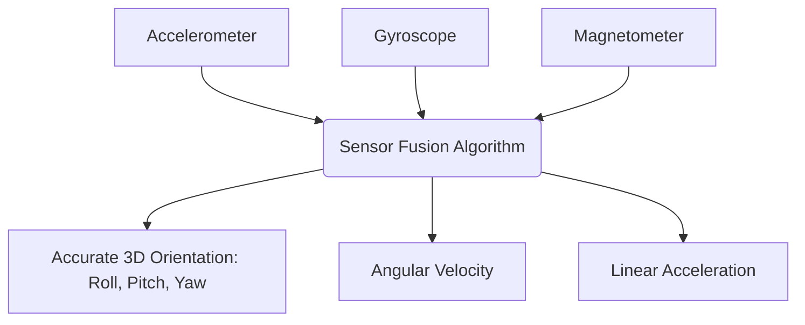
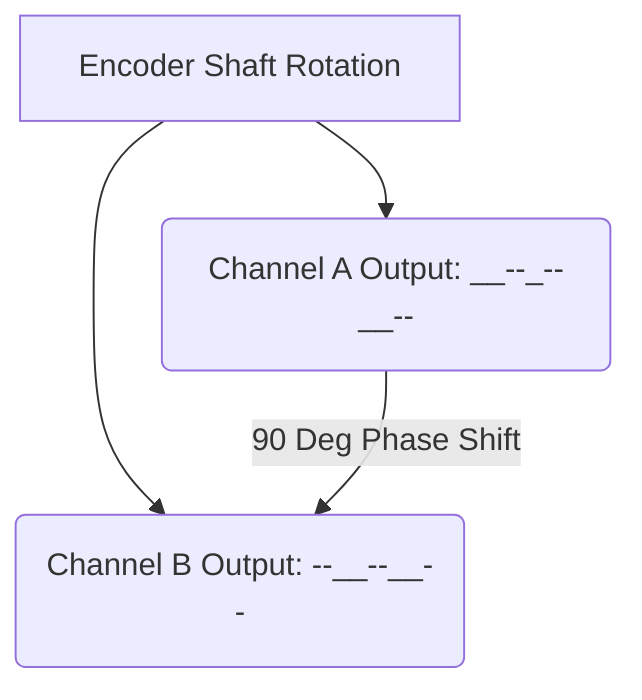

--- 
sidebar_position: 4
title: Inertial Measurement Units (IMU) and Encoders
---

## 04-Inertial Measurement Units (IMU) and Encoders

For a robot to navigate, move precisely, or even just maintain its balance, it needs to know its own motion and position. **Inertial Measurement Units (IMUs)** and **Encoders** are two fundamental types of proprioceptive sensors that provide this critical self-awareness. IMUs measure orientation and acceleration, while encoders measure position and speed of rotation.

### 4.1 Inertial Measurement Units (IMUs)

An IMU is an electronic device that measures and reports a body's specific force, angular rate, and sometimes the orientation of the body, using a combination of accelerometers, gyroscopes, and sometimes magnetometers.

#### 4.1.1 Accelerometers

*   **Principle:** Measure specific force (g-force) applied to the sensor. By extension, they can measure static acceleration due to gravity (providing tilt/pitch/roll relative to gravity) and dynamic acceleration due to motion.
*   **Output:** Typically 3-axis (X, Y, Z) acceleration values.
*   **Limitations:**
    *   **Noise:** Inherently noisy.
    *   **Drift:** Integrating acceleration to get velocity and position leads to rapid accumulation of errors (drift).
    *   **Vibration Sensitivity:** Susceptible to mechanical vibrations.
*   **Applications:** Measuring tilt, detecting impacts, basic motion detection.

#### 4.1.2 Gyroscopes

*   **Principle:** Measure angular velocity (rate of rotation) around an axis. Modern IMU gyroscopes are typically MEMS (Micro-Electro-Mechanical Systems) vibratory gyroscopes.
*   **Output:** Typically 3-axis (roll, pitch, yaw) angular velocity values.
*   **Limitations:**
    *   **Drift:** Integrating angular velocity to get angle (orientation) also leads to accumulation of errors over time.
    *   **Bias:** A persistent offset in the reading when the sensor is stationary.
*   **Applications:** Measuring rotation, maintaining orientation, balancing.

#### 4.1.3 Magnetometers (Electronic Compass)

*   **Principle:** Measure the strength and direction of magnetic fields. When compensated for local magnetic anomalies, they can be used as an electronic compass, indicating absolute heading relative to magnetic North.
*   **Output:** Typically 3-axis magnetic field strength.
*   **Limitations:** Highly susceptible to magnetic interference from motors, power lines, and other electronics.
*   **Applications:** Correcting gyroscope yaw drift (for absolute heading), aiding in orientation estimation.

#### 4.1.4 Sensor Fusion in IMUs (Attitude and Heading Reference Systems - AHRS)

A standalone accelerometer or gyroscope is limited. Modern IMUs combine their readings through sensor fusion algorithms (e.g., Complementary Filter, Kalman Filter, Mahony filter) to provide a more stable and accurate estimate of the robot's **orientation** (roll, pitch, yaw). These fused systems are often called **Attitude and Heading Reference Systems (AHRS)**.

*   **Accelerometer + Gyroscope:** Accelerometer provides a drift-free reference for roll and pitch (relative to gravity) in static conditions, while the gyroscope provides accurate short-term angular rate data. Fusion combines these to produce robust roll/pitch.
*   **Accelerometer + Gyroscope + Magnetometer (MARG sensor):** Adding a magnetometer helps to correct for the gyroscope's yaw drift, providing an absolute heading reference relative to magnetic North, resulting in a full 3D orientation estimate.

**Diagram 4.1: IMU Components and Sensor Fusion**



*Description: A block diagram showing how data from accelerometers, gyroscopes, and magnetometers are combined via sensor fusion algorithms to produce robust estimates of a robot's 3D orientation, angular velocity, and linear acceleration.*

### 4.2 Encoders

Encoders are electromechanical devices that convert angular or linear position into an electrical signal, typically digital pulses. They are crucial for measuring the position and velocity of motor shafts, wheels, or robotic joints.

#### 4.2.1 Types of Encoders

*   **Rotary Encoders:** Measure angular position/rotation.
    *   **Incremental Encoders:** Generate a series of pulses as the shaft rotates. By counting these pulses, a controller can track the relative position and direction of rotation.
        *   **Quadrature Encoding:** Most incremental encoders have two output channels (A and B) that are 90 degrees out of phase. This allows the controller to determine both direction and higher resolution.
    *   **Absolute Encoders:** Provide a unique digital code for each angular position, meaning they know the absolute position even after power cycling without needing to re-reference.
        *   **Single-Turn:** Reports absolute position within one revolution.
        *   **Multi-Turn:** Reports absolute position over multiple revolutions.
*   **Linear Encoders:** Measure linear position along a path.

#### 4.2.2 Encoder Interfacing

*   **Digital Inputs:** Incremental encoders are typically connected to digital input pins on a microcontroller.
*   **Interrupts:** For high-speed applications, encoder signals are often connected to interrupt pins to ensure that no pulses are missed.
*   **Counting:** The microcontroller counts the pulses and analyzes the phase relationship between channels (A and B) to determine direction.
*   **Frequency/Period Measurement:** For velocity, the frequency of pulses or the time between pulses is measured.

**Diagram 4.2: Incremental Rotary Encoder Output (Quadrature)**



*Description: Depicts the output signals of a quadrature incremental encoder, showing two square waves (Channel A and B) that are 90 degrees out of phase, allowing for direction and position tracking.*

### 4.3 Odometry

**Odometry** is the use of data from motion sensors (primarily encoders on wheels or legs) to estimate a robot's change in position and orientation over time.

*   **Principle:** By knowing the wheel diameter and the distance between wheels (for differential drive robots), and counting encoder pulses, the robot can calculate how far each wheel has traveled and then estimate its overall displacement and rotation.
*   **Limitations:**
    *   **Accumulated Error:** Odometry suffers from cumulative errors due to wheel slip, uneven surfaces, and sensor noise.
    *   **Environmental Factors:** Wheel diameter changes (wear, tire pressure) and floor conditions (carpet vs. tile) can introduce inaccuracies.
*   **Importance:** Provides relative positioning for short distances and high-frequency updates, which are often fused with global positioning systems (like GPS) or mapping data (like LiDAR) for more robust localization.

IMUs and encoders are indispensable for giving a robot a sense of its own movement, orientation, and speed, providing the critical self-awareness needed for autonomous operation.

---

### C++ Example: Simple Complementary Filter for Roll/Pitch (IMU Fusion)

This C++ example implements a basic complementary filter to combine accelerometer and gyroscope data for a more stable estimate of roll and pitch angles.

```cpp
#include <iostream>
#include <cmath> // For sin, cos, atan2, M_PI
#include <chrono>
#include <thread>
#include <vector>
#include <random> // For random number generation

// Define M_PI if not already defined (e.g., in some compilers/platforms)
#ifndef M_PI
#define M_PI 3.14159265358979323846
#endif

// Simulate IMU sensor readings with some noise
struct ImuData {
    float acc_x, acc_y, acc_z;
    float gyro_x, gyro_y, gyro_z;
};

ImuData getSimulatedImuData(float true_roll, float true_pitch, float true_yaw_rate) {
    static std::random_device rd;
    static std::mt19937 gen(rd());
    static std::normal_distribution<> acc_noise_dist(0, 0.05); // Accelerometer noise (g)
    static std::normal_distribution<> gyro_noise_dist(0, 0.02); // Gyro noise (rad/s)

    ImuData data;

    // Simulate accelerometer readings (assuming mostly gravity)
    // For roll/pitch estimation, acc_x = g*sin(pitch), acc_y = -g*sin(roll)*cos(pitch), acc_z = g*cos(roll)*cos(pitch)
    // Simplify: acc_x = g*sin(true_pitch), acc_y = -g*sin(true_roll)*cos(true_pitch), acc_z = g*cos(true_roll)*cos(true_pitch)
    // More accurate for simulation (assuming 1g vertical, if level)
    float g = 9.81f; // m/s^2

    // This part is simplified, real accelerometer readings are more complex.
    // For roll/pitch from accel, we use atan2(acc_y, acc_z) and atan2(-acc_x, sqrt(acc_y^2 + acc_z^2))
    // Let's simulate acc_x = -g * sin(pitch), acc_y = g * sin(roll) * cos(pitch), acc_z = g * cos(roll) * cos(pitch)
    // (This aligns with typical coordinate systems for roll/pitch from accelerometer)

    data.acc_x = -g * std::sin(true_pitch) + acc_noise_dist(gen);
    data.acc_y = g * std::sin(true_roll) * std::cos(true_pitch) + acc_noise_dist(gen);
    data.acc_z = g * std::cos(true_roll) * std::cos(true_pitch) + acc_noise_dist(gen);

    // Simulate gyroscope readings (angular velocity)
    data.gyro_x = (true_roll - 0) / 0.01 + gyro_noise_dist(gen); // Simulating roll rate
    data.gyro_y = (true_pitch - 0) / 0.01 + gyro_noise_dist(gen); // Simulating pitch rate
    data.gyro_z = true_yaw_rate + gyro_noise_dist(gen); // Actual yaw rate

    return data;
}


int main() {
    float roll_angle = 0.0f; // in radians
    float pitch_angle = 0.0f; // in radians

    // Complementary filter parameters
    const float alpha = 0.98f; // Weight for gyroscope (0.98 for gyro, 0.02 for accelerometer)
    const float dt = 0.01f; // Time step in seconds (100 Hz update rate)

    std::cout << "IMU Sensor Fusion (Complementary Filter) Demo." << std::endl;
    std::cout << "True Roll (degrees)\tTrue Pitch (degrees)\tFiltered Roll (degrees)\tFiltered Pitch (degrees)" << std::endl;

    for (int i = 0; i < 500; ++i) { // Simulate for 5 seconds (500 iterations * 0.01s)
        // Simulate a changing true orientation
        float true_roll_deg = 20.0f * std::sin(i * dt * 0.5f); // Oscillating roll
        float true_pitch_deg = 15.0f * std::cos(i * dt * 0.7f); // Oscillating pitch
        float true_roll_rad = true_roll_deg * M_PI / 180.0f;
        float true_pitch_rad = true_pitch_deg * M_PI / 180.0f;

        ImuData data = getSimulatedImuData(true_roll_rad, true_pitch_rad, 0.0f);

        // Calculate roll and pitch from accelerometer
        // atan2(Y-axis acc, Z-axis acc) for roll around X-axis
        float acc_roll = std::atan2(data.acc_y, data.acc_z);
        // atan2(X-axis acc, sqrt(Y-axis acc^2 + Z-axis acc^2)) for pitch around Y-axis
        float acc_pitch = std::atan2(-data.acc_x, std::sqrt(data.acc_y * data.acc_y + data.acc_z * data.acc_z));

        // Integrate gyroscope data
        roll_angle += data.gyro_x * dt;
        pitch_angle += data.gyro_y * dt;

        // Apply complementary filter
        roll_angle = alpha * (roll_angle + data.gyro_x * dt) + (1 - alpha) * acc_roll;
        pitch_angle = alpha * (pitch_angle + data.gyro_y * dt) + (1 - alpha) * acc_pitch;
        
        // Output in degrees for readability
        std::cout << true_roll_deg << "\t\t\t" << true_pitch_deg << "\t\t\t"
                  << roll_angle * 180.0f / M_PI << "\t\t\t" << pitch_angle * 180.0f / M_PI << std::endl;
        
        std::this_thread::sleep_for(std::chrono::milliseconds(static_cast<long>(dt * 1000)));
    }

    return 0;
}
```

---

### Python Example: Encoder Odometry for a Differential Drive Robot

This Python example simulates a differential drive robot using encoder readings to estimate its position and orientation (odometry).

```python
import math
import time

class DifferentialDriveRobot:
    def __init__(self, wheel_radius_m, wheel_base_m, initial_x=0.0, initial_y=0.0, initial_theta_rad=0.0):
        self.wheel_radius = wheel_radius_m
        self.wheel_base = wheel_base_m # Distance between wheels
        
        self.x = initial_x
        self.y = initial_y
        self.theta = initial_theta_rad # Orientation in radians (0 = X-axis, PI/2 = Y-axis)

        self.prev_left_encoder_ticks = 0
        self.prev_right_encoder_ticks = 0
        self.ticks_per_revolution = 360 # Example: 360 ticks per full wheel revolution

        print(f"Differential Drive Robot Initialized at ({self.x:.2f}, {self.y:.2f}), Heading: {math.degrees(self.theta):.1f}°")

    def update_odometry(self, current_left_encoder_ticks, current_right_encoder_ticks):
        """
        Updates the robot's position and orientation based on encoder readings.
        """
        # Calculate change in encoder ticks
        delta_left_ticks = current_left_encoder_ticks - self.prev_left_encoder_ticks
        delta_right_ticks = current_right_encoder_ticks - self.prev_right_encoder_ticks

        self.prev_left_encoder_ticks = current_left_encoder_ticks
        self.prev_right_encoder_ticks = current_right_encoder_ticks

        # Convert ticks to linear distance traveled by each wheel
        # Distance = (ticks / ticks_per_revolution) * (2 * pi * wheel_radius)
        delta_left_dist = (delta_left_ticks / self.ticks_per_revolution) * (2 * math.pi * self.wheel_radius)
        delta_right_dist = (delta_right_ticks / self.ticks_per_revolution) * (2 * math.pi * self.wheel_radius)

        # Calculate robot's linear and angular displacement
        delta_s = (delta_right_dist + delta_left_dist) / 2.0 # Average linear displacement
        delta_theta = (delta_right_dist - delta_left_dist) / self.wheel_base # Change in orientation

        # Update robot's position and orientation
        # This update rule assumes that delta_s is applied along the robot's current heading
        # For small delta_theta, approximations are often used. Here's a common one:
        if abs(delta_theta) < 1e-6: # If change in theta is very small (straight line)
            self.x += delta_s * math.cos(self.theta)
            self.y += delta_s * math.sin(self.theta)
        else: # If turning
            # The radius of curvature of the robot's path
            R = delta_s / delta_theta
            
            # Instantaneous Center of Curvature (ICC)
            ICC_x = self.x - R * math.sin(self.theta)
            ICC_y = self.y + R * math.cos(self.theta)
            
            # New position based on rotation around ICC
            self.x = ICC_x + R * math.sin(self.theta + delta_theta)
            self.y = ICC_y - R * math.cos(self.theta + delta_theta)

        self.theta += delta_theta
        
        # Normalize theta to be within -pi to pi or 0 to 2*pi
        self.theta = math.atan2(math.sin(self.theta), math.cos(self.theta)) 
        
        print(f"Odometry Update: dx_L={delta_left_dist:.2f}m, dx_R={delta_right_dist:.2f}m, d_theta={math.degrees(delta_theta):.1f}°")
        print(f"Robot State: X={self.x:.2f}m, Y={self.y:.2f}m, Theta={math.degrees(self.theta):.1f}°")


if __name__ == "__main__":
    robot = DifferentialDriveRobot(wheel_radius_m=0.05, wheel_base_m=0.2) # 5cm radius, 20cm wheelbase

    # Simulate encoder readings for moving straight
    print("\n--- Moving Straight ---")
    left_enc_straight = 100
    right_enc_straight = 100
    for i in range(3):
        robot.update_odometry(left_enc_straight * (i+1), right_enc_straight * (i+1))
        time.sleep(0.5)

    # Simulate encoder readings for turning left
    print("\n--- Turning Left ---")
    left_enc_turn = 50
    right_enc_turn = 150
    for i in range(2):
        robot.update_odometry(left_enc_straight*3 + left_enc_turn*(i+1), right_enc_straight*3 + right_enc_turn*(i+1))
        time.sleep(0.5)
        
    print("\nOdometry simulation complete.")
```

---

### Arduino Example: Reading a Rotary Encoder

This Arduino sketch demonstrates how to read an incremental rotary encoder using external interrupts to track rotation and direction.

```arduino
// Rotary Encoder Pins
// Connect Channel A to Digital Pin 2 (Interrupt 0 on Uno)
// Connect Channel B to Digital Pin 3 (Interrupt 1 on Uno)
const int encoderPinA = 2; 
const int encoderPinB = 3; 

volatile int encoderPos = 0; // Use 'volatile' as it's modified by an ISR
int lastEncoderPos = 0;

void setup() {
  Serial.begin(9600);
  pinMode(encoderPinA, INPUT_PULLUP); // Enable internal pull-up resistors
  pinMode(encoderPinB, INPUT_PULLUP);

  // Attach interrupts for encoder channels
  // Call updateEncoder on FALLING edge of encoderPinA 
  attachInterrupt(digitalPinToInterrupt(encoderPinA), updateEncoder, FALLING); 
  
  Serial.println("Arduino Rotary Encoder Demo Ready.");
}

void loop() {
  if (encoderPos != lastEncoderPos) {
    Serial.print("Encoder Position: ");
    Serial.println(encoderPos);
    lastEncoderPos = encoderPos;
  }
  // Other loop tasks can run here without blocking
}

// Interrupt Service Routine (ISR) for encoder
void updateEncoder() {
  // Read both pins quickly to determine direction
  int pinA_state = digitalRead(encoderPinA);
  int pinB_state = digitalRead(encoderPinB);

  // Determine direction based on quadrature encoding
  // If pinA went LOW, check state of pinB
  if (pinA_state == LOW) { 
    if (pinB_state == LOW) {
      encoderPos--; // Clockwise (or Counter-clockwise depending on wiring)
    } else {
      encoderPos++; // Counter-clockwise (or Clockwise)
    }
  }
  // You could also check for pinA_state == HIGH if using both edges
  // Or check for RISING edge and FALLING edge on different pins for higher accuracy
}
```

---

### Equations in LaTeX: Extended Kalman Filter (EKF) for State Estimation

The Extended Kalman Filter (EKF) is a widely used algorithm for sensor fusion and state estimation in robotics, particularly for non-linear systems like robot localization. It consists of two main steps:

1.  **Prediction Step:**

    `hat\{x\}_\{k|k-1\} = f(hat\{x\}_\{k-1|k-1\}, u_k)`
    
    `P_\{k|k-1\} = F_k P_\{k-1|k-1\} F_k^T + Q_k`
    
    Where `hat\{x\}` is the state estimate, `P` is the covariance matrix, `f` is the state transition function, `u_k` is the control input, `F_k` is the Jacobian of `f`, and `Q_k` is the process noise covariance.

2.  **Update Step:**

    `K_k = P_\{k|k-1\} H_k^T (H_k P_\{k|k-1\} H_k^T + R_k)^-1`
    
    `hat\{x\}_\{k|k\} = hat\{x\}_\{k|k-1\} + K_k (z_k - h(hat\{x\}_\{k|k-1\}))`
    
    `P_\{k|k\} = (I - K_k H_k) P_\{k|k-1\}`
    
    Where `K_k` is the Kalman gain, `z_k` is the measurement, `h` is the measurement function, `H_k` is the Jacobian of `h`, and `R_k` is the measurement noise covariance.

---

### MCQs with Answers

1.  Which IMU component measures angular velocity (rate of rotation)?
    a) Accelerometer
    b) Magnetometer
    c) Gyroscope
    d) Barometer
    *Answer: c) Gyroscope*

2.  What is the primary advantage of an *absolute encoder* over an *incremental encoder*?
    a) It is less expensive.
    b) It provides its exact position even after power cycling without needing to re-reference.
    c) It has fewer output wires.
    d) It is more resistant to magnetic interference.
    *Answer: b) It provides its exact position even after power cycling without needing to re-reference.*

3.  Odometry for a mobile robot primarily suffers from what limitation?
    a) Inability to detect obstacles.
    b) High cost of sensors.
    c) Accumulation of errors over time due to wheel slip and sensor noise.
    d) Difficulty in measuring linear speed.
    *Answer: c) Accumulation of errors over time due to wheel slip and sensor noise.*

---

### Practice Tasks

1.  **IMU Data Interpretation:** You receive the following accelerometer readings (in `g`) from a 3-axis accelerometer: `ax = 0.1, ay = 0.0, az = 1.0`. Describe the most likely orientation of the sensor. If the readings change to `ax = 0.0, ay = 1.0, az = 0.0`, what would that imply?
2.  **Encoder Resolution Calculation:** A robot wheel has a diameter of 10 cm. An encoder attached to the wheel's motor has 1000 ticks per revolution. If the robot moves forward and the encoder counts 5000 ticks, how far (in meters) has the robot traveled?
3.  **IMU vs. Encoder for Specific Tasks:** For each of the following robotic tasks, determine whether an IMU, an encoder, or both would be most appropriate, and explain why:
    *   Maintaining a drone's level flight.
    *   Precisely controlling the angle of a robotic arm joint.
    *   Estimating the total distance traveled by a wheeled robot.
    *   Detecting if a robot has been bumped or tilted.

---

### Notes for Teachers

*   **Visual Aids:** Use 3D models or animations to explain roll, pitch, yaw, and how accelerometers/gyroscopes relate to these rotations.
*   **Drift Demonstration:** Demonstrate gyroscope drift by showing how integrating its raw output over time leads to significant error. Then introduce complementary filter concept.
*   **Hands-on with Encoders:** If possible, provide rotary encoders and have students interface them with an Arduino to count pulses and detect direction.

### Notes for Students

*   **Understand Drift:** Acknowledge that IMU sensors are inherently prone to drift, and fusion algorithms are crucial for overcoming this.
*   **Coordinate Systems:** Be very careful with coordinate systems (sensor frame vs. robot frame vs. world frame) when working with IMU data.
*   **Interrupts for Encoders:** For reliable encoder readings, especially at higher speeds, using interrupts is highly recommended on microcontrollers.
*   **Odometry Limitations:** Always remember that odometry provides relative position and is prone to accumulating errors. It's often combined with other localization methods.
