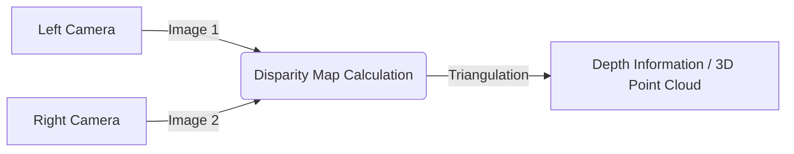

--- 
sidebar_position: 5
title: Vision Sensors (Cameras, Computer Vision Basics)
---

## 05-Vision Sensors (Cameras, Computer Vision Basics)

Vision is arguably the most powerful sense for many autonomous systems, providing rich, detailed information about the environment. **Vision sensors**, primarily cameras, enable robots to "see" their surroundings, recognize objects, understand scenes, and navigate complex environments. This chapter introduces the basics of vision sensors and the fundamental concepts of computer vision in robotics.

### 5.1 Cameras as Vision Sensors

Cameras capture light from the environment and convert it into digital images or video streams.

*   **Image Formation:** Light rays from the scene pass through a lens, which focuses them onto an image sensor (CCD or CMOS). The sensor converts light intensity at each pixel into an electrical signal, which is then digitized.
*   **Types of Cameras:**
    *   **Monocular Cameras (2D):** Standard cameras that capture 2D images. Provide color (RGB) or grayscale information.
    *   **Stereo Cameras (3D):** Two monocular cameras spaced a known distance apart, mimicking human binocular vision. By comparing images from both cameras, depth information can be calculated using triangulation.
    *   **RGB-D Cameras (3D):** Provide both color (RGB) and depth (D) information directly. They often use technologies like structured light (projecting a known pattern and analyzing its deformation) or Time-of-Flight (ToF).
        *   **Examples:** Intel RealSense, Microsoft Azure Kinect, Orbbec.
    *   **Event Cameras:** A newer type of camera that only records changes in pixel intensity, offering very high temporal resolution and low latency, ideal for fast motion.

**Diagram 5.1: Stereo Camera Principle (Conceptual)**



*Description: Illustrates the conceptual principle of stereo vision, where two cameras capture images from slightly different viewpoints, and the disparity between corresponding points is used to calculate depth through triangulation.*

### 5.2 Basic Concepts in Computer Vision

**Computer vision (CV)** is an interdisciplinary field that deals with how computers can gain high-level understanding from digital images or videos.

#### 5.2.1 Image Representation

*   **Pixels:** The smallest units of an image, arranged in a grid. Each pixel has a value representing its color and/or intensity.
*   **Resolution:** The number of pixels (width x height) in an image (e.g., 640x480, 1920x1080). Higher resolution means more detail but also more data to process.
*   **Color Models:**
    *   **RGB (Red, Green, Blue):** Most common, representing colors by combining varying intensities of these three primary colors.
    *   **Grayscale:** Represents intensity only (0 for black, 255 for white, for 8-bit images).
    *   **HSV (Hue, Saturation, Value):** Often useful for color-based object detection, as hue is invariant to light changes.

#### 5.2.2 Image Preprocessing

Before analysis, images are often preprocessed:
*   **Grayscale Conversion:** Reduces data for some algorithms.
*   **Noise Reduction:** Applying filters (e.g., Gaussian blur, median filter) to remove random variations.
*   **Edge Detection:** Identifying boundaries of objects (e.g., Canny, Sobel filters).
*   **Thresholding:** Converting a grayscale image into a binary (black and white) image based on a pixel intensity threshold.

#### 5.2.3 Feature Extraction

Identifying distinctive points, lines, or regions in an image that can be used for tasks like object recognition or tracking.
*   **Corners/Keypoints:** (e.g., Harris corners, SIFT, SURF, ORB)
*   **Descriptors:** Mathematical representations of image features.

#### 5.2.4 Object Detection and Recognition

*   **Object Detection:** Identifying the presence and location (bounding box) of specific objects in an image.
*   **Object Recognition:** Identifying *what* the detected object is (e.g., "this is a coffee cup").
*   **Techniques:** Traditional methods (e.g., Haar cascades) and modern deep learning-based methods (e.g., YOLO, SSD, Faster R-CNN).

#### 5.2.5 Semantic Segmentation

*   Assigning a label (e.g., "road," "person," "sky") to *every pixel* in an image, providing a pixel-level understanding of the scene.

### 5.3 Applications of Vision in Robotics

*   **Navigation:** Obstacle avoidance, lane keeping, visual odometry, SLAM (Simultaneous Localization and Mapping).
*   **Manipulation:** Object grasping, pick-and-place tasks, quality inspection.
*   **Human-Robot Interaction:** Gesture recognition, facial recognition, emotion detection.
*   **Surveillance and Monitoring:** Anomaly detection, security.
*   **Agriculture:** Crop monitoring, fruit picking.
*   **Autonomous Vehicles:** Traffic sign recognition, pedestrian detection, lane detection.

### 5.4 Computer Vision Libraries and Tools

*   **OpenCV (Open Source Computer Vision Library):** A comprehensive, open-source library for computer vision, machine learning, and image processing. Available for C++, Python, Java.
*   **PCL (Point Cloud Library):** For processing 3D point cloud data (often from LiDAR or RGB-D cameras).
*   **Deep Learning Frameworks:** TensorFlow, PyTorch for developing neural networks for vision tasks.

Vision sensors and computer vision algorithms empower robots with a rich understanding of their environment, enabling a wide range of complex and intelligent behaviors that are crucial for truly autonomous operation.

--- 

### C++ Example: Basic Image Processing (Grayscale and Thresholding - Conceptual)

This C++ example conceptually shows how image processing operations like grayscale conversion and thresholding would be applied to a simulated image. In reality, you'd use a library like OpenCV.

```cpp
#include <iostream>
#include <vector>
#include <string>
#include <algorithm> // For std::min, std::max

// Simulate a very small grayscale image (e.g., 5x5 pixels)
// Values 0-255 (0=black, 255=white)
const int IMAGE_WIDTH = 5;
const int IMAGE_HEIGHT = 5;

// Function to print a simulated image
void printImage(const std::vector<std::vector<int>>& image, const std::string& title) {
    std::cout << "\n--- " << title << " ---" << std::endl;
    for (const auto& row : image) {
        for (int pixel : row) {
            // Represent pixel intensity with characters
            if (pixel < 50) std::cout << "##";
            else if (pixel < 150) std::cout << "==";
            else std::cout << "  ";
        }
        std::cout << std::endl;
    }
}

// Simulate converting an RGB image to grayscale (just using green channel as a proxy)
std::vector<std::vector<int>> convertToGrayscale(const std::vector<std::vector<int>>& rgb_image) {
    // In a real scenario, RGB to Grayscale is: 0.299*R + 0.587*G + 0.114*B
    // For this simple simulation, we assume input is already a single channel intensity
    // So, this function effectively copies but highlights the step.
    return rgb_image; 
}

// Simulate applying a binary threshold
std::vector<std::vector<int>> applyThreshold(const std::vector<std::vector<int>>& grayscale_image, int threshold) {
    std::vector<std::vector<int>> binary_image(IMAGE_HEIGHT, std::vector<int>(IMAGE_WIDTH));
    for (int r = 0; r < IMAGE_HEIGHT; ++r) {
        for (int c = 0; c < IMAGE_WIDTH; ++c) {
            binary_image[r][c] = (grayscale_image[r][c] > threshold) ? 255 : 0; // White if above threshold, Black otherwise
        }
    }
    return binary_image;
}

int main() {
    // Simulated input image (grayscale directly for simplicity)
    // Represents an object (e.g., a dark blob) in the middle
    std::vector<std::vector<int>> original_image = {
        {200, 200, 210, 200, 200},
        {200, 180, 100, 180, 200},
        {210, 100, 20, 100, 210},
        {200, 180, 100, 180, 200},
        {200, 200, 210, 200, 200}
    };

    printImage(original_image, "Original Grayscale Image");

    // Grayscale conversion (conceptual, as input is already grayscale)
    std::vector<std::vector<int>> grayscale_image = convertToGrayscale(original_image);
    // printImage(grayscale_image, "Grayscale Image"); // Same as original in this sim

    // Apply threshold
    int threshold_value = 120;
    std::vector<std::vector<int>> binary_image = applyThreshold(grayscale_image, threshold_value);
    printImage(binary_image, "Binary Image (Threshold = " + std::to_string(threshold_value) + ")");

    std::cout << "\nConceptual image processing demo complete." << std::endl;
    std::cout << "In real applications, libraries like OpenCV are used for efficiency and robust algorithms." << std::endl;

    return 0;
}
```

---

### Python Example: OpenCV Object Detection Pipeline (Conceptual)

This Python example outlines a conceptual object detection pipeline using OpenCV, showing the typical sequence of steps.

```python
import numpy as np
# import cv2 # Uncomment to run with actual OpenCV
import time

def conceptual_object_detection_pipeline(image_filename="robot_feed.jpg"):
    print(f"--- Conceptual Object Detection Pipeline for '{image_filename}' ---")

    # Step 1: Image Acquisition
    # In a real robot, this would come from a camera feed (e.g., cap = cv2.VideoCapture(0))
    # For this conceptual example, we simulate an image.
    try:
        # img = cv2.imread(image_filename) # Actual OpenCV
        # if img is None:
        #     raise FileNotFoundError(f"Image '{image_filename}' not found.")
        print("1. Image acquired (simulated).")
        # For simulation, imagine a 640x480 image with a red object
        simulated_img = np.zeros((480, 640, 3), dtype=np.uint8) 
        simulated_img[200:250, 100:150] = [0, 0, 255] # BGR format (Blue, Green, Red)
        img_width, img_height = 640, 480

    except Exception as e:
        print(f"Error during image acquisition: {e}")
        return None

    # Step 2: Preprocessing (e.g., Gaussian Blur for noise reduction)
    # In reality: blurred_img = cv2.GaussianBlur(img, (5, 5), 0)
    print("2. Image preprocessed (e.g., noise reduction, conceptually).")

    # Step 3: Color Space Conversion (e.g., BGR to HSV for color-based detection)
    # In reality: hsv_img = cv2.cvtColor(img, cv2.COLOR_BGR2HSV)
    print("3. Converted to HSV color space (conceptually).")

    # Step 4: Define Color Range (e.g., for a red object)
    lower_red = np.array([0, 100, 100])
    upper_red = np.array([10, 255, 255])
    print(f"4. Defined color range for detection (e.g., Red: {lower_red}-{upper_red}).")

    # Step 5: Create a Mask (isolate desired color)
    # In reality: mask = cv2.inRange(hsv_img, lower_red, upper_red)
    # For simulation, assume the red blob is detected
    simulated_mask = np.zeros((img_height, img_width), dtype=np.uint8)
    simulated_mask[200:250, 100:150] = 255
    print("5. Created binary mask (conceptually).")

    # Step 6: Find Contours (boundaries of detected objects)
    # In reality: contours, _ = cv2.findContours(mask, cv2.RETR_TREE, cv2.CHAIN_APPROX_SIMPLE)
    print("6. Found contours (conceptually).")
    
    # Simulate finding one large contour for the red object
    simulated_contours_found = True
    simulated_contour_area = 50 * 50 # Area of the simulated object

    # Step 7: Filter and Process Contours
    detected_objects = []
    if simulated_contours_found: # if contours are found
        # Iterate through contours (simulated)
        if simulated_contour_area > 100: # Filter small noise contours
            # x, y, w, h = cv2.boundingRect(contour) # Bounding box
            # object_center_x, object_center_y = x + w//2, y + h//2
            object_center_x, object_center_y = 125, 225
            detected_objects.append({
                "center": (object_center_x, object_center_y),
                "size": (50, 50),
                "color": "red"
            })
            print(f"7. Detected object at {object_center_x}, {object_center_y} (conceptually).")
    
    # Step 8: Visualization (conceptual)
    # In reality: cv2.rectangle(img, (x, y), (x+w, y+h), (0, 255, 0), 2)
    # cv2.imshow("Detected Objects", img)
    # cv2.waitKey(0)
    # cv2.destroyAllWindows()
    print("8. Object visualized (conceptually).")

    return detected_objects

if __name__ == "__main__":
    objects = conceptual_object_detection_pipeline()
    if objects:
        print(f"\nRobot Action: Found {len(objects)} objects. First object at {objects[0]['center']}.")
    else:
        print("\nRobot Action: No objects found. Continue searching.")
```

---

### Arduino Example: Basic Camera Interface (Conceptual with OV7670)

Directly interfacing and processing video from a camera on a standard Arduino Uno/Mega is highly resource-intensive and often not feasible due to limited RAM and processing power. This example is highly conceptual, showing typical pinouts for a camera module like OV7670, but without actual image processing code, which would be too complex for a basic Arduino. It focuses on setup.

```arduino
// --- VERY CONCEPTUAL ARDUINO CAMERA INTERFACE (OV7670) ---
// Note: Actual image processing on basic Arduinos (Uno/Mega)
// is NOT practical due to severe RAM/CPU limitations.
// This sketch only shows pin connections and basic initialization concepts.
// For real camera applications, consider ESP32-CAM, Teensy, or Raspberry Pi.

// OV7670 PCLK, VSYNC, HREF, XCLK, SCCB (I2C) signals often need to be connected to specific
// pins capable of fast interrupts or hardware timers, or directly to a parallel port.

// SCCB (I2C) Pins for camera configuration
const int SIOD = A4; // SDA
const int SIOC = A5; // SCL

// Parallel Data Pins (D0-D7) - typically connected to a PORT (e.g., PORTD, PORTB) for speed
const int PCDATA_0 = 4; // Example, real connections would be D0-D7
const int PCDATA_1 = 5;
const int PCDATA_2 = 6;
const int PCDATA_3 = 7;
const int PCDATA_4 = 8;
const int PCDATA_5 = 9;
const int PCDATA_6 = 10;
const int PCDATA_7 = 11;

// Control Signals
const int VSYNC_PIN = 3; // Vertical Sync (typically interrupt pin)
const int HREF_PIN = 2;  // Horizontal Reference (typically interrupt pin)
const int PCLK_PIN = 12; // Pixel Clock

// XCLK (External Clock) - often generated by a timer or dedicated crystal
const int XCLK_PIN = 13; // Example, not always necessary or on a digital pin

void setup() {
  Serial.begin(115200); // Higher baud rate for potential data
  Serial.println("Conceptual OV7670 Camera Initialization.");
  Serial.println("WARNING: Real image capture/processing on ATmega328P/2560 is not practical.");
  Serial.println("This demo only sets up pins. No actual image data will be read.");

  // Set up SCCB (I2C) pins
  pinMode(SIOD, OUTPUT);
  pinMode(SIOC, OUTPUT);
  // (In real code, Wire.begin() would be used, and camera registers configured via I2C)

  // Set up Data Pins (as inputs for reading pixel data)
  pinMode(PCDATA_0, INPUT);
  pinMode(PCDATA_1, INPUT);
  pinMode(PCDATA_2, INPUT);
  pinMode(PCDATA_3, INPUT);
  pinMode(PCDATA_4, INPUT);
  pinMode(PCDATA_5, INPUT);
  pinMode(PCDATA_6, INPUT);
  pinMode(PCDATA_7, INPUT);

  // Set up Control Pins (as inputs for reading sync signals)
  pinMode(VSYNC_PIN, INPUT);
  pinMode(HREF_PIN, INPUT);
  pinMode(PCLK_PIN, INPUT);
  // (In real code, attachInterrupt would be used for VSYNC and HREF)

  // (Optional: Setup XCLK if needed and not driven by external oscillator)
  // pinMode(XCLK_PIN, OUTPUT);
  // Set XCLK to a specific frequency (e.g., using Timer2 on ATmega)

  Serial.println("Pin modes set. Camera module would now be configured via SCCB (I2C).");
  Serial.println("Then, interrupt routines would read pixel data triggered by PCLK, HREF, VSYNC.");
}

void loop() {
  // Nothing happens in loop for this conceptual demo as actual image capture
  // and processing is outside the scope of a basic Arduino's capabilities.
  // In a real application, ISRs would populate a frame buffer,
  // and loop() might process that buffer or send it elsewhere.
  delay(1000); // Just wait
  Serial.println("Still waiting... (No image processing on basic Arduino)");
}
```

---

### Equations in LaTeX: Pinhole Camera Model (Projection)

The simple **pinhole camera model** describes the mathematical relationship between a 3D world point be `P = (X, Y, Z)` and its 2D image point be `p = (x, y)`.
Assuming the focal length is `f`, and the camera is at the origin looking down the Z-axis, the projection is:

```latex
x = f frac{X}{Z}
```
```latex
y = f frac{Y}{Z}
```

More complex models include camera intrinsics (principal point, distortion coefficients) and extrinsics (rotation, translation relative to world origin).

---

### MCQs with Answers

1. Which type of camera uses two cameras spaced a known distance apart to calculate depth information?
    a) Monocular Camera
    b) RGB-D Camera
    c) Stereo Camera
    d) Event Camera
    *Answer: c) Stereo Camera*

2. In computer vision, what is the process of identifying the presence and location (bounding box) of specific objects in an image called?
    a) Image Preprocessing
    b) Feature Extraction
    c) Semantic Segmentation
    d) Object Detection
    *Answer: d) Object Detection*

3. What is the purpose of converting an image from RGB to HSV color space in object detection?
    a) To reduce the image resolution.
    b) To reduce the amount of data for processing.
    c) To make color-based detection more robust to changes in lighting.
    d) To detect edges more effectively.
    *Answer: c) To make color-based detection more robust to changes in lighting.*

---

### Practice Tasks

1.  **Robot Vision Application:** Choose a real-world robotic task (e.g., picking fruit, navigating a crowded room, inspecting a factory floor). Describe how computer vision would be used to enable the robot to perform this task, outlining the key visual information it would need to extract and what types of CV algorithms might be involved.
2.  **Stereo Vision Challenges:** Research two specific challenges or limitations of stereo vision systems in robotics (e.g., textureless regions, computational cost). Explain why these are problems and how they might be mitigated.
3.  **Image Filter Application:** Research the purpose of a "Gaussian blur" filter in image processing. Explain how it works at a conceptual level (e.g., what happens to a pixel's value) and why it might be used before edge detection.

---

### Notes for Teachers

*   **Visual Examples:** Show plenty of images and videos demonstrating different computer vision tasks (object detection, segmentation, depth maps).
*   **OpenCV Introduction:** Guide students on installing and running a very basic "Hello World" example with OpenCV in Python to see it in action.
*   **Data Volume:** Emphasize the sheer volume of data generated by cameras and the computational challenge of processing it in real-time.

### Notes for Students

*   **Pixels are Numbers:** Remember that to a computer, an image is just a grid of numbers. All computer vision algorithms operate on these numbers.
*   **Experiment with Tools:** If possible, try out an image processing tool (e.g., GIMP, Photoshop, or even a simple online editor) to see the effects of different filters and operations.
*   **Abstraction is Key:** Computer vision libraries like OpenCV abstract away much of the complex mathematics, allowing you to focus on the application.
*   **Computational Cost:** Be mindful that many advanced computer vision algorithms are computationally intensive and require powerful processors.
