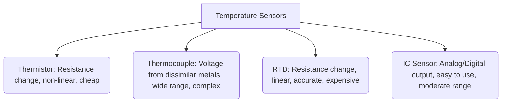

--- 
sidebar_position: 6
title: Environmental Sensors
---

## 06-Environmental Sensors

Robots often operate in environments where understanding ambient conditions is crucial for safety, efficiency, or even task execution. **Environmental sensors** allow robots to perceive non-physical aspects of their surroundings, such as temperature, humidity, atmospheric pressure, and light levels. This chapter explores common types of environmental sensors and their relevance in robotics.

### 6.1 Temperature Sensors

Measuring temperature is a common requirement for robots, from monitoring component health to adapting behavior based on ambient conditions.

*   **Thermistors:**
    *   **Principle:** As discussed in Chapter 2 (Electronic Components) and Chapter 6 (Sensors - Electrical Principles), these are resistors whose resistance changes significantly with temperature.
    *   **Advantages:** Inexpensive, robust, wide range.
    *   **Disadvantages:** Non-linear output (requires lookup table or Steinhart-Hart equation), requires external resistor for voltage divider.
    *   **Applications:** Basic temperature monitoring, over-temperature protection for motors/electronics.
*   **Thermocouples:**
    *   **Principle:** Two dissimilar metals joined at one end. A temperature difference between the junction and the free ends creates a small voltage (Seebeck effect).
    *   **Advantages:** Wide temperature range (up to 2000°C), robust, self-powered.
    *   **Disadvantages:** Requires specialized amplification and cold-junction compensation circuitry, non-linear output, low voltage output.
    *   **Applications:** High-temperature industrial robotics (e.g., furnaces, welding).
*   **RTDs (Resistance Temperature Detectors):**
    *   **Principle:** Resistance changes with temperature, typically using platinum wire (Pt100, Pt1000). Highly linear.
    *   **Advantages:** Highly accurate, stable, linear response.
    *   **Disadvantages:** More expensive than thermistors, requires current source and precise measurement circuitry.
    *   **Applications:** High-precision temperature measurement.
*   **Semiconductor-based (IC) Temperature Sensors (e.g., LM35, DS18B20, DHT11/22):**
    *   **Principle:** Integrated circuits that produce an output (analog voltage or digital data) directly proportional to temperature.
    *   **Advantages:** Easy to use, often pre-calibrated, linear output, some provide digital output (simpler interfacing).
    *   **Disadvantages:** Limited temperature range compared to thermocouples, can be sensitive to electrical noise.
    *   **Applications:** Ambient temperature monitoring, simple component temperature sensing, weather stations on outdoor robots.

**Diagram 6.1: Temperature Sensor Types and Characteristics**



*Description: A categorization of different temperature sensor types, highlighting their working principle, typical output, and key characteristics.*

### 6.2 Humidity Sensors

Measuring humidity (the amount of water vapor in the air) is important for robots operating in environments where moisture can affect electronics or impact materials.

*   **Capacitive Humidity Sensors:**
    *   **Principle:** A capacitor with a dielectric material that absorbs moisture. As humidity changes, the dielectric constant changes, altering the capacitance.
    *   **Advantages:** Good accuracy, stable, low hysteresis.
    *   **Disadvantages:** Can be affected by contaminants, requires complex measurement circuitry.
    *   **Applications:** HVAC robotics, environmental monitoring, agriculture.
*   **Resistive Humidity Sensors:**
    *   **Principle:** The electrical resistance of a conductive polymer changes with humidity.
    *   **Advantages:** Simple, inexpensive.
    *   **Disadvantages:** Less accurate, prone to drift, slower response.
*   **Integrated DHTxx Series (e.g., DHT11, DHT22):** Combine a thermistor and a capacitive humidity sensor with an internal ADC and microcontroller, providing digital output for both temperature and humidity.
    *   **Advantages:** Very easy to interface with microcontrollers, low cost, dual measurement.
    *   **Disadvantages:** Slower sample rate, can be less accurate than standalone sensors.

### 6.3 Barometric Pressure Sensors

Measuring atmospheric pressure can provide altitude information (as pressure changes with altitude) or help predict weather changes.

*   **Principle:** MEMS (Micro-Electro-Mechanical Systems) based sensors measure the force exerted by air pressure on a diaphragm.
*   **Output:** Digital (often via I2C or SPI).
*   **Advantages:** Small size, high precision, low power.
*   **Disadvantages:** Sensitive to temperature changes (often have integrated temperature compensation).
*   **Applications:** Drone altitude control, weather monitoring, robotics operating at varying altitudes.
*   **Example:** BMP180, BMP280, BME280 (adds humidity).

### 6.4 Light Sensors

Robots may need to measure ambient light levels for various reasons:
*   **Photoresistors (LDRs):** As discussed, their resistance changes with light intensity. Simple and cheap, but non-linear.
*   **Photodiodes/Phototransistors:** Produce a current proportional to light intensity, faster and more linear than LDRs.
*   **Digital Light Sensors (e.g., BH1750, TSL2561):** Integrated circuits that provide calibrated digital readings of ambient light (often in Lux).
    *   **Advantages:** Easy to use, high accuracy, pre-calibrated.
    *   **Applications:** Adjusting camera exposure, energy management, smart lighting robots.

### 6.5 Air Quality Sensors

Detecting specific gases or particulate matter in the air is important for robots operating in potentially hazardous or sensitive environments.

*   **MQ Series Gas Sensors (e.g., MQ-2, MQ-7):**
    *   **Principle:** Semiconductor gas sensors whose resistance changes in the presence of specific gases (e.g., CO, methane, alcohol, smoke).
    *   **Output:** Analog (resistance, converted to voltage).
    *   **Advantages:** Inexpensive, broad range of detectable gases.
    *   **Disadvantages:** Requires calibration, prone to drift, high power consumption (heater), not highly selective to a single gas.
    *   **Applications:** Basic gas leak detection, air quality monitoring robots.
*   **PM (Particulate Matter) Sensors:** Detect dust and airborne particles.
    *   **Applications:** Air quality monitoring, indoor navigation (some laser PM sensors can map).

### 6.6 Importance in Robotics

Environmental sensors enable robots to:
*   **Adapt to Conditions:** Adjust motor performance based on temperature, modify navigation strategy based on weather.
*   **Monitor Internal Health:** Detect overheating in components.
*   **Perform Specialized Tasks:** E.g., agricultural robots monitoring soil moisture and temperature, inspection robots detecting gas leaks.
*   **Enhance Human Safety:** Alert humans to hazardous environmental conditions.

Combining data from these environmental sensors often requires calibration and sensor fusion techniques to provide a comprehensive and reliable understanding of the operational environment.

--- 

### C++ Example: Reading a Combined Environmental Sensor (Conceptual) 

This C++ example conceptually simulates reading from a combined environmental sensor (like a BME280) that provides temperature, humidity, and pressure.

```cpp
#include <iostream>
#include <string>
#include <random> // For std::random_device, std::mt19937, std::uniform_real_distribution
#include <chrono>
#include <thread>
#include <iomanip> // For std::fixed, std::setprecision

// Simulate reading a combined environmental sensor (e.g., BME280)
// In a real scenario, this would involve I2C/SPI communication to the sensor IC.
struct EnvironmentalData {
    float temperature_c;
    float humidity_percent;
    float pressure_hPa;
};

EnvironmentalData readEnvironmentalSensor() {
    static std::random_device rd;
    static std::mt19937 gen(rd());
    // Simulate typical indoor conditions with some natural variation/noise
    static std::uniform_real_distribution<> temp_dist(20.0, 25.0); // 20-25 deg C
    static std::uniform_real_distribution<> hum_dist(40.0, 60.0);   // 40-60% RH
    static std::uniform_real_distribution<> press_dist(1000.0, 1020.0); // 1000-1020 hPa

    EnvironmentalData data;
    data.temperature_c = temp_dist(gen) + std::uniform_real_distribution<>(-0.5, 0.5)(gen); // Add small noise
    data.humidity_percent = hum_dist(gen) + std::uniform_real_distribution<>(-1.0, 1.0)(gen);
    data.pressure_hPa = press_dist(gen) + std::uniform_real_distribution<>(-0.2, 0.2)(gen);

    // Clamp values to realistic ranges
    data.temperature_c = std::max(0.0f, std::min(50.0f, data.temperature_c));
    data.humidity_percent = std::max(0.0f, std::min(100.0f, data.humidity_percent));
    data.pressure_hPa = std::max(900.0f, std::min(1100.0f, data.pressure_hPa));

    return data;
}

int main() {
    std::cout << "Robot Environmental Sensor Monitoring Demo." << std::endl;
    std::cout << "Reading simulated Temperature, Humidity, and Pressure:\n" << std::endl;

    // Set output precision
    std::cout << std::fixed << std::setprecision(2);

    for (int i = 0; i < 10; ++i) {
        EnvironmentalData current_env = readEnvironmentalSensor();
        std::cout << "Reading " << i + 1 << ":" << std::endl;
        std::cout << "  Temperature: " << current_env.temperature_c << " °C" << std::endl;
        std::cout << "  Humidity:    " << current_env.humidity_percent << " %RH" << std::endl;
        std::cout << "  Pressure:    " << current_env.pressure_hPa << " hPa" << std::endl;
        
        // Example logic: warn if temperature is high
        if (current_env.temperature_c > 30.0f) {
            std::cout << "  WARNING: High temperature detected!" << std::endl;
        }

        std::this_thread::sleep_for(std::chrono::milliseconds(1000)); // Read every second
    }

    std::cout << "\nDemo Finished." << std::endl;
    return 0;
}
```

--- 

### Python Example: Air Quality Sensor (Conceptual Logic)

This Python example conceptually simulates an air quality sensor detecting high levels of a gas and triggering a response.

```python
import random
import time

class AirQualitySensor:
    def __init__(self, name, gas_type="CO", warning_threshold_ppm=50):
        self.name = name
        self.gas_type = gas_type
        self.warning_threshold_ppm = warning_threshold_ppm
        self.last_reading_ppm = 0
        print(f"Air Quality Sensor '{self.name}' ({self.gas_type}) initialized (Warning > {self.warning_threshold_ppm} ppm).")

    def read_gas_level_ppm(self, actual_level_ppm):
        """
        Simulates reading gas level with some noise and occasional false positives.
        """
        noise = random.uniform(-5, 5)
        # Simulate occasional spikes (false positives or real but brief events)
        if random.randint(0, 100) < 5: # 5% chance of a spike
            noise += random.uniform(20, 50) * (1 if random.randint(0,1) else -1)
        
        self.last_reading_ppm = max(0, actual_level_ppm + noise)
        return self.last_reading_ppm

    def check_status(self, actual_level_ppm=0):
        current_reading = self.read_gas_level_ppm(actual_level_ppm)
        
        print(f"  [{self.name}] {self.gas_type} Level: {current_reading:.1f} ppm")
        
        if current_reading > self.warning_threshold_ppm:
            print(f"  !!! WARNING: HIGH {self.gas_type} LEVEL DETECTED ({current_reading:.1f} ppm) !!!")
            return True
        else:
            return False

if __name__ == "__main__":
    co_sensor = AirQualitySensor("CO_Monitor", gas_type="Carbon Monoxide", warning_threshold_ppm=35)
    smoke_sensor = AirQualitySensor("Smoke_Detector", gas_type="Smoke Particles", warning_threshold_ppm=100) # Use different threshold for smoke

    print("\n--- Air Quality Monitoring Demo ---")

    # Simulate periods of normal and elevated gas levels
    scenarios = [
        ("Normal Air", 0, 3), # 3 cycles of normal air (0 ppm actual)
        ("Small Leak", 20, 2), # 2 cycles of small leak (20 ppm actual)
        ("Major Leak", 60, 3), # 3 cycles of major leak (60 ppm actual)
        ("Normal Air", 0, 2)  # 2 cycles of normal air again
    ]

    for description, actual_co_level, num_cycles in scenarios:
        print(f"\nScenario: {description} (Actual CO: {actual_co_level} ppm)")
        for _ in range(num_cycles):
            co_alert = co_sensor.check_status(actual_co_level)
            smoke_alert = smoke_sensor.check_status(random.uniform(0,5)) # Smoke is always low unless simulated
            
            if co_alert or smoke_alert:
                print("  ROBOT ACTION: Initiating emergency protocol (e.g., evacuate, open vents)!")
            time.sleep(1)
    
    print("\nDemo Complete.")
```

--- 

### Arduino Example: DHT11 Temperature and Humidity Sensor

This Arduino sketch reads temperature and humidity from a DHT11 sensor and prints it to the Serial Monitor. It uses the `DHT sensor library` (available in Arduino Library Manager).

```arduino
// DHT11 Temperature and Humidity Sensor Example
// Requires DHT sensor library by Adafruit (or similar)

#include <DHT.h> 
#include <DHT_U.h> // Optional: Unified Sensor System library (if using)

#define DHTPIN 4     // Digital pin connected to the DHT sensor (e.g., D4)
#define DHTTYPE DHT11 // DHT 11 sensor (can be DHT22 or DHT21)

DHT dht(DHTPIN, DHTTYPE); // Initialize DHT sensor

void setup() {
  Serial.begin(9600);
  Serial.println("DHT11 Temperature & Humidity Sensor Demo Ready.");
  dht.begin(); // Start DHT sensor
}

void loop() {
  // Wait a few seconds between measurements.
  delay(2000); // DHT11 can only be read every ~2 seconds

  // Read humidity
  float h = dht.readHumidity();
  // Read temperature as Celsius (the default)
  float t = dht.readTemperature();
  // Read temperature as Fahrenheit (isFahrenheit = true)
  // float f = dht.readTemperature(true);

  // Check if any reads failed and exit early (to try again).
  if (isnan(h) || isnan(t)) {
    Serial.println("Failed to read from DHT sensor!");
    return;
  }

  // Compute heat index in Celsius (or Fahrenheit)
  // float hic = dht.computeHeatIndex(t, h, false); // false for Celsius
  // float hif = dht.computeHeatIndex(f, h); // true for Fahrenheit

  Serial.print("Humidity: "); 
  Serial.print(h);
  Serial.print(" %\t");
  Serial.print("Temperature: "); 
  Serial.print(t);
  Serial.println(" *C ");
  // Serial.print("Heat index: ");
  // Serial.print(hic);
  // Serial.println(" *C ");
}
```

--- 

### Equations in LaTeX: Altitude from Barometric Pressure

The approximate relationship between atmospheric pressure `P` and altitude `h` can be modeled by the barometric formula, or more simply, assuming a standard atmosphere:

```latex
h = 44330 left[ 1 - left( frac{P}{P_0} right)^{frac{1}{5.255} right]
```

Where:
*   `h` is the altitude above sea level in meters.
*   `P` is the measured atmospheric pressure in Pascals (Pa).
*   `P_0` is the standard atmospheric pressure at sea level (101325 Pa).

--- 

### MCQs with Answers

1.  Which type of temperature sensor provides a digital output for both temperature and humidity, making it easy to interface with microcontrollers?
    a) Thermistor
    b) Thermocouple
    c) RTD
    d) DHT11/DHT22
    *Answer: d) DHT11/DHT22*

2.  What is the primary advantage of a capacitive humidity sensor over a resistive one?
    a) Lower cost
    b) Simpler interfacing
    c) Better accuracy and stability
    d) Faster response to temperature changes
    *Answer: c) Better accuracy and stability*

3.  How can a barometric pressure sensor be used in robotics?
    a) To measure light intensity.
    b) To detect specific gases.
    c) To determine altitude or predict weather changes.
    d) To measure grip force.
    *Answer: c) To determine altitude or predict weather changes.*

--- 

### Practice Tasks

1.  **Sensor Module Selection:** You are building an outdoor agricultural robot that needs to monitor soil moisture, air temperature, and air humidity. Propose a specific sensor module (or combination of modules) for these tasks, justifying your choices based on cost, accuracy, and ease of interfacing.
2.  **Overheating Protection:** Write pseudocode for a robot's internal temperature monitoring system. If a motor's temperature (read from a simulated sensor) exceeds a critical threshold, the robot should stop the motor, alert the user, and wait for the temperature to drop before resuming operation.
3.  **Digital Light Sensor Logic:** A digital light sensor measures ambient light in Lux. Design a simple logic for a robot that uses this sensor to automatically turn on its headlights if the light level drops below 50 Lux and turn them off if it rises above 100 Lux.

--- 

### Notes for Teachers

*   **Environmental Factors:** Discuss how environmental factors (temperature, humidity) can affect the performance and lifespan of electronic components and mechanical systems in robots.
*   **Sensor Calibration:** Briefly mention that many environmental sensors (especially gas sensors) require calibration for accurate readings.
*   **Integrated Sensors:** Highlight the convenience of integrated sensor modules (like DHTxx, BME280) that combine multiple measurements and simplify interfacing.

### Notes for Students

*   **Units are Important:** Always pay attention to the units of measurement (e.g., Celsius, Fahrenheit, %RH, hPa, ppm, Lux) and convert them if necessary.
*   **Read Sensor Datasheets:** Datasheets provide crucial information about a sensor's operating range, accuracy, response time, and how to interface with it.
*   **Signal Conditioning:** Remember that some analog environmental sensors may require signal conditioning (amplification, filtering) before their output can be accurately read by an ADC.
*   **Applications Beyond Measurement:** Think about how environmental data can be used to make intelligent decisions or adapt robot behavior, not just display a reading.
```
