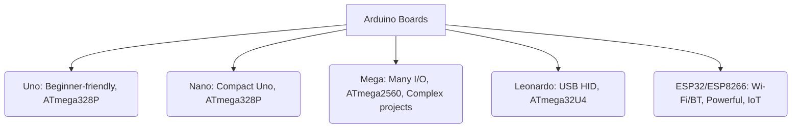

--- 
sidebar_position: 2
title: Arduino Ecosystem (Boards, IDE, Libraries)
---

## 02-Arduino Ecosystem (Boards, IDE, Libraries)

The Arduino ecosystem provides a friendly and powerful environment for both beginners and experienced users to build electronic projects, particularly in robotics. It's a combination of open-source hardware, a user-friendly software IDE, and a rich collection of libraries. This chapter explores the key components of the Arduino ecosystem.

### 2.1 Arduino Boards

Arduino boards are the hardware component of the ecosystem. They are microcontrollers mounted on a printed circuit board (PCB) with convenient pin headers, a power supply, and a USB interface for programming.

#### 2.1.1 Common Arduino Boards

*   **Arduino Uno:**
    *   **Microcontroller:** ATmega328P.
    *   **Features:** 14 digital I/O pins (6 with PWM), 6 analog input pins, USB-B connector.
    *   **Use Case:** The most popular and recommended board for beginners due to its simplicity, robustness, and extensive community support. Great for learning basics, small robots.
*   **Arduino Nano:**
    *   **Microcontroller:** ATmega328P (same as Uno).
    *   **Features:** Smaller form factor than Uno, often uses Mini-B USB or Micro-USB.
    *   **Use Case:** Ideal for projects where space is limited (e.g., smaller robots, wearables).
*   **Arduino Mega 2560:**
    *   **Microcontroller:** ATmega2560.
    *   **Features:** Many more I/O pins (54 digital, 16 analog), more Flash memory, more SRAM.
    *   **Use Case:** Complex projects requiring numerous sensors, actuators, or extensive code (e.g., multi-joint robotic arms, drones).
*   **Arduino Leonardo:**
    *   **Microcontroller:** ATmega32U4.
    *   **Features:** Can act as a USB HID (Human Interface Device) like a keyboard or mouse.
    *   **Use Case:** Projects needing direct computer interaction (e.g., custom game controllers, USB-controlled robot).
*   **ESP32 / ESP8266 (ESP-based boards):**
    *   **Microcontroller:** ESP32/ESP8266 (not official Arduino, but fully supported by Arduino IDE).
    *   **Features:** Built-in Wi-Fi and Bluetooth (ESP32), powerful CPU, more memory.
    *   **Use Case:** IoT robotics, projects requiring wireless communication, web servers, cloud connectivity. (More details in a later chapter).

**Diagram 2.1: Arduino Board Comparison (Conceptual)**



*Description: A conceptual comparison of popular Arduino-compatible boards, highlighting their key characteristics and typical applications.*

#### 2.1.2 Arduino Clones and Compatibles

Due to its open-source nature, many manufacturers produce Arduino-compatible boards that offer similar functionality, sometimes with added features or at a lower cost. These typically work seamlessly with the Arduino IDE.

### 2.2 The Arduino IDE (Integrated Development Environment)

The Arduino IDE is the software component used to write, compile, and upload programs ("sketches") to Arduino boards.

#### 2.2.1 Key Features

*   **Code Editor:** A text editor for writing C++ code.
*   **Compiler:** Translates your C++ code into machine code that the microcontroller understands.
*   **Uploader:** Sends the compiled code (firmware) to the Arduino board via USB.
*   **Serial Monitor:** A built-in terminal for sending and receiving text data from the Arduino board (useful for debugging and user interaction).
*   **Serial Plotter:** A tool to visualize numerical data from the Arduino in real-time graphs (excellent for sensor debugging).
*   **Board Manager:** Allows easy installation of support packages for various Arduino and third-party boards (e.g., ESP32, ESP8266).
*   **Library Manager:** Simplifies the discovery, installation, and updating of libraries.

### 2.3 The Arduino Language and Core Libraries

The Arduino programming language is based on C++, with simplified functions and a core set of libraries designed for hardware interaction.

#### 2.3.1 Core Functions

These functions abstract away low-level register manipulation, making it easier to control hardware:
*   `setup()`: Runs once at startup.
*   `loop()`: Runs continuously after `setup()`.
*   `pinMode()`: Configures a pin as input or output.
*   `digitalRead()`, `digitalWrite()`: Read/write digital pins.
*   `analogRead()`, `analogWrite()`: Read analog inputs, write PWM outputs.
*   `delay()`, `millis()`, `micros()`: Time control.
*   `Serial.begin()`, `Serial.print()`, `Serial.println()`: Serial communication.

#### 2.3.2 Standard Arduino Libraries

The Arduino IDE comes with several built-in libraries:
*   **`Wire.h`:** For I2C (Inter-Integrated Circuit) communication.
*   **`SPI.h`:** For SPI (Serial Peripheral Interface) communication.
*   **`Servo.h`:** For controlling hobby servo motors.
*   **`LiquidCrystal.h`:** For interfacing with LCD displays.
*   **`EEPROM.h`:** For reading and writing data to the microcontroller's EEPROM.
*   **`SoftwareSerial.h`:** Allows any digital pins to be used for serial communication.

### 2.4 Third-Party Libraries

The vast Arduino community contributes thousands of third-party libraries, significantly extending the platform's capabilities. These libraries often provide:
*   **Sensor Drivers:** For specific sensors (e.g., DHT for temperature/humidity, Adafruit_BME280 for environmental).
*   **Actuator Control:** For motor drivers, stepper motors, advanced servos.
*   **Communication:** For Bluetooth, Wi-Fi, Ethernet, GPS, LoRa.
*   **Specialized Functions:** For data logging, display control, mathematical operations.

#### 2.4.1 Installing Third-Party Libraries

*   **Library Manager:** The easiest way is through the Arduino IDE's `Sketch > Include Library > Manage Libraries...` option.
*   **ZIP File:** Download the library as a ZIP file and use `Sketch > Include Library > Add .ZIP Library...`.

The Arduino ecosystem is designed to be accessible, making it an excellent starting point for learning embedded programming and developing prototypes for robotics.

---

### C++ Example: Conceptual Arduino Sketch for Compilation

This C++ example provides a "pseudo-code" sketch structure that mimics how an Arduino sketch is translated and compiled by the Arduino IDE.

```cpp
// --- This is NOT runnable C++ code as-is. It's conceptual to show Arduino compilation logic. ---

// Preprocessor directives that Arduino IDE adds
#include <Arduino.h> // Includes core Arduino functions and types

// User's global variables and function declarations
// (e.g., from .ino files and automatically generated function prototypes)
const int LED_PIN = 13;
void myCustomFunction();

// The user's setup() function
void setup() {
    pinMode(LED_PIN, OUTPUT);
    Serial.begin(9600);
    Serial.println("Arduino Setup Complete.");
    myCustomFunction();
}

// The user's loop() function
void loop() {
    digitalWrite(LED_PIN, HIGH);
    delay(1000);
    digitalWrite(LED_PIN, LOW);
    delay(1000);
    Serial.println("LED blinking.");
}

// User's custom functions
void myCustomFunction() {
    Serial.println("Custom function called during setup.");
}

// --- Behind the scenes: What the Arduino IDE does ---
// 1. It finds all .ino files, concatenates them into a single .cpp file.
// 2. It generates function prototypes for all functions defined in the sketch (if not already present).
// 3. It adds #include <Arduino.h> and potentially other necessary headers.
// 4. It wraps the sketch in a main() function:
/*
int main(void) {
    init(); // Arduino core initialization
    initVariant(); // Board-specific initialization

#if defined(USBCON)
    USBDevice.attach();
#endif

    setup(); // Call user's setup

    for (;;) { // Infinite loop for user's loop
        loop();
        if (serialEventRun) serialEventRun();
    }
    return 0; // Never reached
}
*/
```

---

### Python Example: Simulating Arduino-like Communication with PySerial

This Python example uses the `pyserial` library to simulate interaction with an Arduino board. While `pyserial` is a standard Python library, its functionality here directly mirrors the communication typical within the Arduino ecosystem.

```python
import serial
import time
import random

# Mock Arduino behavior for testing without physical hardware
class MockArduino:
    def __init__(self, port, baudrate):
        self.port = port
        self.baudrate = baudrate
        self.simulated_led_state = False
        self.simulated_sensor_value = 0
        self.buffer = []
        print(f"MockArduino on {self.port} initialized.")

    def write_line(self, data):
        self.buffer.append(data)
        if "light_on" in data:
            self.simulated_led_state = True
        elif "light_off" in data:
            self.simulated_led_state = False
        elif "get_status" in data:
            self.buffer.append(f"LED: {'ON' if self.simulated_led_state else 'OFF'}, Sensor: {self.simulated_sensor_value}")
        elif "read_sensor" in data:
            self.simulated_sensor_value = random.randint(0, 1023)
            self.buffer.append(f"SENSOR_VAL:{self.simulated_sensor_value}")

    def read_line(self):
        if self.buffer:
            return self.buffer.pop(0)
        return ""

# This function would interact with a real Arduino
def communicate_with_arduino(port_name, baud_rate):
    """
    Communicates with a physical Arduino using PySerial.
    Ensure 'pyserial' is installed (`pip install pyserial`).
    """
    try:
        # ser = serial.Serial(port_name, baud_rate, timeout=1)
        # time.sleep(2) # Wait for connection
        
        # For demonstration without physical hardware, use MockArduino
        ser = MockArduino(port_name, baud_rate) # Replace with actual serial.Serial for real hw

        print(f"Connected to {port_name} (simulated) at {baud_rate} baud.")
        
        # Arduino setup messages
        ser.write_line("Arduino Ready.")

        commands_to_send = ["light_on", "get_status", "read_sensor", "light_off", "get_status", "read_sensor"]
        for cmd in commands_to_send:
            print(f"\nPython Sending: {cmd}")
            # ser.write(cmd.encode('utf-8') + b'\n') # For real hardware
            ser.write_line(cmd) # For mock
            time.sleep(1)
            
            # Read all available lines from Arduino
            # while ser.in_waiting > 0: # For real hardware
            #    line = ser.readline().decode('utf-8').strip()
            line = ser.read_line() # For mock
            if line:
                print(f"Arduino Responded: {line}")
        
        # ser.close() # For real hardware
        print("\nCommunication simulation finished.")

    except Exception as e:
        print(f"An error occurred: {e}")

if __name__ == "__main__":
    # Change 'COM3' to your Arduino's actual serial port (e.g., 'COMx' on Windows, '/dev/ttyACM0' on Linux)
    # And have an Arduino sketch loaded that responds to 'light_on', 'light_off', 'get_status', 'read_sensor'
    communicate_with_arduino('COM_PORT_OF_ARDUINO', 9600)
```

---

### Arduino Example: Using a Servo Library

This Arduino sketch demonstrates how to use the built-in `Servo.h` library to control a hobby servo motor.

```arduino
#include <Servo.h>  // Include the Servo library

Servo myServo;  // Create a servo object to control a servo

const int servoPin = 9; // Digital pin 9 (PWM) is commonly used for servos

void setup() {
  Serial.begin(9600);
  myServo.attach(servoPin); // Attaches the servo object to the pin
  Serial.println("Arduino Servo Control Demo Ready.");
}

void loop() {
  Serial.println("Moving servo to 0 degrees...");
  myServo.write(0); // Tell servo to go to 0 degrees
  delay(1000);      // Wait for 1 second

  Serial.println("Moving servo to 90 degrees...");
  myServo.write(90); // Tell servo to go to 90 degrees
  delay(1000);      // Wait for 1 second

  Serial.println("Moving servo to 180 degrees...");
  myServo.write(180); // Tell servo to go to 180 degrees
  delay(1000);      // Wait for 1 second
}
```

---

### Equations in LaTeX: PWM for Servo Control (Conceptual)

Hobby servo motors are typically controlled by a specific type of Pulse Width Modulation (PWM) signal. The **pulse width** (the duration of the HIGH signal) determines the angle of the servo.

*   A typical pulse duration of 1000 microseconds (1ms) might correspond to 0 degrees.
*   A pulse duration of 1500 microseconds (1.5ms) might correspond to 90 degrees.
*   A pulse duration of 2000 microseconds (2ms) might correspond to 180 degrees.

The Arduino `Servo.write()` function handles this conversion automatically.

---

### MCQs with Answers

1.  Which Arduino board is generally recommended for beginners due to its simplicity and extensive community support?
    a) Arduino Nano
    b) Arduino Mega 2560
    c) Arduino Uno
    d) ESP32 Dev Module
    *Answer: c) Arduino Uno*

2.  What is the primary function of the Arduino IDE's "Serial Monitor"?
    a) To compile sketches.
    b) To upload sketches to the board.
    c) To send and receive text data from the Arduino board for debugging.
    d) To manage installed libraries.
    *Answer: c) To send and receive text data from the Arduino board for debugging.*

3.  The `Servo.h` library in Arduino is used for:
    a) Reading analog sensor values.
    b) Controlling hobby servo motors.
    c) Performing serial communication.
    d) Managing Wi-Fi connections.
    *Answer: b) Controlling hobby servo motors.*

---

### Practice Tasks

1.  **Arduino Board Selection:** You need to build a robot that has 8 servo motors, 12 digital sensors, 4 analog sensors, and needs to control 2 DC motors. Which official Arduino board (Uno, Nano, Mega) would you choose, and why? What are the key limitations you might face with other boards?
2.  **Library Exploration:** Search the Arduino Library Manager for a library that interfaces with an I2C OLED display (e.g., Adafruit SSD1306). Install it and look at its example sketches. Briefly describe one key function from the library and what it does.
3.  **Arduino IDE Feature Practice:**
    *   Open the Arduino IDE.
    *   Open the "Blink" example (`File > Examples > 01.Basics > Blink`).
    *   Verify the sketch (`Sketch > Verify/Compile`).
    *   Open the Serial Monitor and Serial Plotter. Describe what you see in both when the "Blink" sketch is running (conceptually, as it doesn't print data to serial by default). Modify the "Blink" sketch to print "LED ON" and "LED OFF" messages to the Serial Monitor.

---

### Notes for Teachers

*   **Hands-on imperative:** Practical experience with Arduino boards is crucial. Provide students with boards, components, and clear wiring diagrams for exercises.
*   **Encourage Experimentation:** The Arduino ecosystem is designed for experimentation. Encourage students to try different sensors and actuators.
*   **Community Resources:** Guide students to the official Arduino website, forums, and GitHub for community support and examples.

### Notes for Students

*   **Start with Examples:** The examples provided with the Arduino IDE and libraries are an excellent starting point for learning.
*   **Breadboard First:** Always prototype your circuits on a breadboard before making permanent connections.
*   **Check Connections:** Most common issues in Arduino projects are due to incorrect wiring. Double-check all connections.
*   **Baud Rate:** Ensure the baud rate in your sketch matches the baud rate set in the Serial Monitor.
*   **Learn to Debug:** Use `Serial.print()` extensively to debug your code and understand what your robot is doing.
```