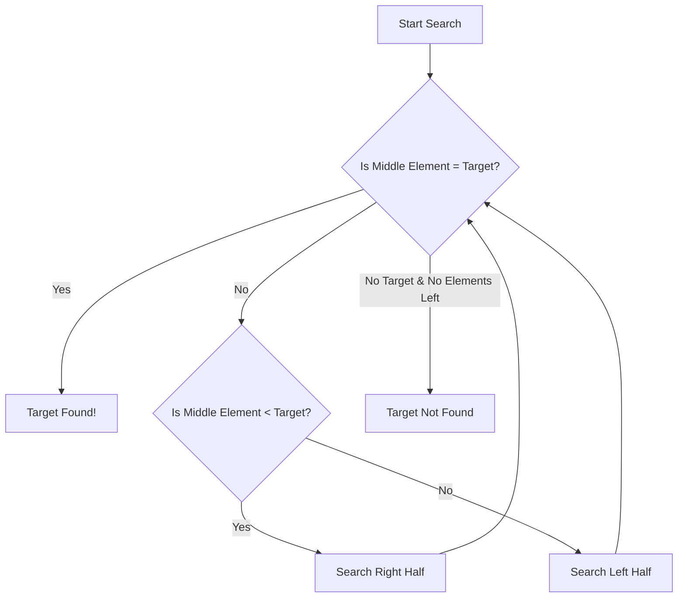
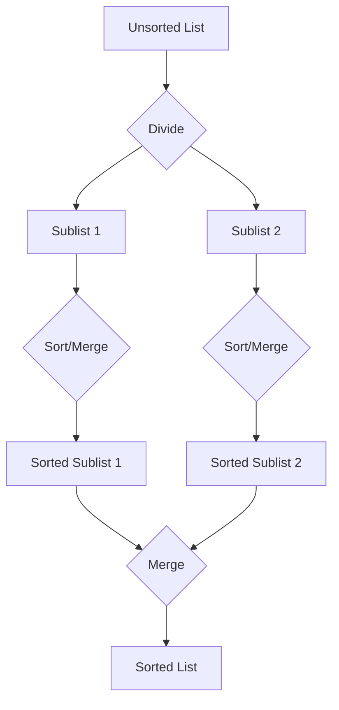

--- 
sidebar_position: 2
title: Sorting and Searching Algorithms
---

## 02-Sorting and Searching Algorithms

Sorting and searching are fundamental tasks in computer science and play a crucial role in various aspects of robotics. Whether a robot is processing sensor data, managing its task list, or querying a map, efficient sorting and searching algorithms are essential for quick data retrieval and processing. This chapter introduces several common sorting and searching algorithms, discussing their principles, efficiency, and applications.

### 2.1 Searching Algorithms

Searching algorithms are used to find a specific item within a collection of data.

#### 2.1.1 Linear Search (Sequential Search)

*   **Principle:** Iterates through each element of the collection one by one until the target item is found or the end of the collection is reached.
*   **Efficiency:**
    *   **Time Complexity:** O(N) – in the worst case (item at the end or not present), it must check every element.
    *   **Space Complexity:** O(1) – uses a constant amount of extra memory.
*   **Advantages:** Simple to implement, works on unsorted data.
*   **Disadvantages:** Inefficient for large collections.
*   **Applications:** Small lists of sensor IDs, configuration parameters.

#### 2.1.2 Binary Search

*   **Principle:** Requires the data collection to be **sorted**. It repeatedly divides the search interval in half. If the value of the search key is less than the item in the middle of the interval, it narrows the interval to the lower half. Otherwise, it narrows it to the upper half.
*   **Efficiency:**
    *   **Time Complexity:** O(log N) – significantly faster than linear search for large datasets.
    *   **Space Complexity:** O(1) (iterative) or O(log N) (recursive) – due to call stack.
*   **Advantages:** Very efficient for large, sorted datasets.
*   **Disadvantages:** Requires the data to be sorted first.
*   **Applications:** Searching for a specific sensor reading in a sorted log, finding a target location in a sorted list of map waypoints.

**Diagram 2.1: Binary Search Principle**



*Description: A flowchart depicting the binary search algorithm, showing how the search space is repeatedly halved until the target is found or eliminated.*

### 2.2 Sorting Algorithms

Sorting algorithms arrange elements in a collection into a specific order (e.g., ascending or descending).

#### 2.2.1 Bubble Sort

*   **Principle:** Repeatedly steps through the list, compares adjacent elements, and swaps them if they are in the wrong order. Passes through the list are repeated until no swaps are needed, indicating the list is sorted.
*   **Efficiency:**
    *   **Time Complexity:** O(N^2) – highly inefficient for large datasets.
    *   **Space Complexity:** O(1).
*   **Advantages:** Simple to understand and implement.
*   **Disadvantages:** Very slow, rarely used in practice for performance-critical applications.
*   **Applications:** Primarily for educational purposes or extremely small datasets.

#### 2.2.2 Selection Sort

*   **Principle:** Divides the list into a sorted and an unsorted part. It repeatedly finds the minimum element from the unsorted part and puts it at the beginning of the sorted part.
*   **Efficiency:**
    *   **Time Complexity:** O(N^2).
    *   **Space Complexity:** O(1).
*   **Advantages:** Simple to implement, performs fewer swaps than bubble sort.
*   **Disadvantages:** Inefficient for large datasets.
*   **Applications:** Educational purposes, small datasets.

#### 2.2.3 Insertion Sort

*   **Principle:** Builds the final sorted array (or list) one item at a time. It iterates through the input elements and at each iteration, it removes one element from the input data, finds the location it belongs within the sorted list, and inserts it there.
*   **Efficiency:**
    *   **Time Complexity:** O(N^2) in worst case, O(N) in best case (already sorted).
    *   **Space Complexity:** O(1).
*   **Advantages:** Simple, efficient for small datasets, adaptive (efficient for data that is already substantially sorted).
*   **Disadvantages:** Inefficient for large, unsorted datasets.
*   **Applications:** Sorting nearly sorted data, small data streams (e.g., keeping a small buffer of sensor readings sorted).

#### 2.2.4 Quick Sort

*   **Principle:** A highly efficient, comparison-based sorting algorithm. It works by selecting a 'pivot' element from the array and partitioning the other elements into two sub-arrays, according to whether they are less than or greater than the pivot. The sub-arrays are then sorted recursively.
*   **Efficiency:**
    *   **Time Complexity:** O(N log N) on average, O(N^2) in worst case (rare with good pivot selection).
    *   **Space Complexity:** O(log N) (recursive call stack).
*   **Advantages:** Very fast, widely used.
*   **Disadvantages:** Worst-case O(N^2) performance if pivot selection is poor, recursive nature can consume stack space.

#### 2.2.5 Merge Sort

*   **Principle:** A divide-and-conquer algorithm. It divides the unsorted list into N sublists, each containing one element (a list of one element is considered sorted). Then, it repeatedly merges sublists to produce new sorted sublists until there is only one sorted list remaining.
*   **Efficiency:**
    *   **Time Complexity:** O(N log N) in all cases (worst, average, best).
    *   **Space Complexity:** O(N) – requires auxiliary space for merging.
*   **Advantages:** Stable sort, guaranteed O(N log N) performance, good for external sorting.
*   **Disadvantages:** Requires additional memory.
*   **Applications:** General-purpose sorting where stable and guaranteed performance is needed.

**Diagram 2.2: Merge Sort Principle**



*Description: A simplified diagram illustrating the divide-and-conquer principle of Merge Sort, where a list is recursively divided, sorted, and then merged back together.*

### 2.3 Applications in Robotics

*   **Sensor Data Processing:** Sorting sensor readings (e.g., from LiDAR) by distance for efficient processing, searching for specific data points.
*   **Path Planning:** Sorting nodes in a search algorithm by cost (e.g., A* algorithm uses a priority queue, which relies on sorting concepts).
*   **Object Recognition:** Efficiently searching through databases of known objects or features.
*   **Task Scheduling:** Sorting tasks by priority or deadline.
*   **Data Analysis:** Organizing large datasets for analysis and visualization.

Choosing the right sorting and searching algorithm is a critical design decision in robotics, directly impacting the responsiveness and efficiency of the entire system.

--- 

### C++ Example: Binary Search Implementation

This C++ example implements a binary search algorithm to find an element in a sorted array of sensor IDs.

```cpp
#include <iostream>
#include <vector>
#include <algorithm> // For std::sort

// Binary search algorithm (iterative)
int binarySearch(const std::vector<int>& arr, int target) {
    int low = 0;
    int high = arr.size() - 1;

    while (low <= high) {
        int mid = low + (high - low) / 2; // Prevent overflow for very large (low+high)

        // Check if target is present at mid
        if (arr[mid] == target) {
            return mid; // Return index of target
        }

        // If target is greater, ignore left half
        if (arr[mid] < target) {
            low = mid + 1;
        }
        // If target is smaller, ignore right half
        else {
            high = mid - 1;
        }
    }

    // If target was not present in array
    return -1;
}

int main() {
    std::vector<int> sensorIDs = {101, 105, 112, 99, 108, 100, 115, 103};
    std::cout << "Original Sensor IDs: ";
    for (int id : sensorIDs) {
        std::cout << id << " ";
    }
    std::cout << std::endl;

    // Binary search requires a sorted array
    std::sort(sensorIDs.begin(), sensorIDs.end());
    std::cout << "Sorted Sensor IDs:   ";
    for (int id : sensorIDs) {
        std::cout << id << " ";
    }
    std::cout << std::endl;

    int target1 = 108;
    int result1 = binarySearch(sensorIDs, target1);
    if (result1 != -1) {
        std::cout << "Sensor ID " << target1 << " found at index " << result1 << "." << std::endl;
    } else {
        std::cout << "Sensor ID " << target1 << " not found." << std::endl;
    }

    int target2 = 110;
    int result2 = binarySearch(sensorIDs, target2);
    if (result2 != -1) {
        std::cout << "Sensor ID " << target2 << " found at index " << result2 << "." << std::endl;
    } else {
        std::cout << "Sensor ID " << target2 << " not found." << std::endl;
    }

    return 0;
}
```

---

### Python Example: Quick Sort Implementation

This Python example implements the Quick Sort algorithm, a widely used efficient sorting algorithm, demonstrating its recursive nature.

```python
def quick_sort(arr):
    """
    Implements the Quick Sort algorithm.
    """
    if len(arr) <= 1:
        return arr
    else:
        pivot = arr[len(arr) // 2] # Choose middle element as pivot
        left = [x for x in arr if x < pivot]
        middle = [x for x in arr if x == pivot]
        right = [x for x in arr if x > pivot]
        return quick_sort(left) + middle + quick_sort(right)

if __name__ == "__main__":
    sensor_readings = [23, 15, 42, 8, 101, 35, 15, 7, 50]
    print("Original Sensor Readings:", sensor_readings)

    sorted_readings = quick_sort(sensor_readings)
    print("Sorted Sensor Readings:  ", sorted_readings)

    task_priorities = [5, 1, 8, 2, 5, 0, 9, 3]
    print("\nOriginal Task Priorities:", task_priorities)
    sorted_priorities = quick_sort(task_priorities)
    print("Sorted Task Priorities:  ", sorted_priorities)
```

---

### Arduino Example: Bubble Sort (Small Data Set)

This Arduino sketch demonstrates the Bubble Sort algorithm, often used for educational purposes due to its simplicity, particularly for very small datasets where its inefficiency is negligible.

```arduino
// Bubble Sort Example for a small array of sensor readings

void bubbleSort(int arr[], int n) {
  for (int i = 0; i < n - 1; i++) {
    // Last i elements are already in place
    for (int j = 0; j < n - i - 1; j++) {
      // Traverse the array from 0 to n-i-1
      // Swap if the element found is greater than the next element
      if (arr[j] > arr[j + 1]) {
        int temp = arr[j];
        arr[j] = arr[j + 1];
        arr[j + 1] = temp;
      }
    }
  }
}

void printArray(int arr[], int n) {
  for (int i = 0; i < n; i++) {
    Serial.print(arr[i]);
    Serial.print(" ");
  }
  Serial.println();
}

void setup() {
  Serial.begin(9600);
  Serial.println("Arduino Bubble Sort Demo Ready.");

  int sensorValues[] = {64, 34, 25, 12, 22, 11, 90};
  int n = sizeof(sensorValues) / sizeof(sensorValues[0]);

  Serial.print("Original array: ");
  printArray(sensorValues, n);

  bubbleSort(sensorValues, n);

  Serial.print("Sorted array:   ");
  printArray(sensorValues, n);
}

void loop() {
  // Nothing to do in loop for this simple example
}
```

---

### Equations in LaTeX: Logarithmic Growth (`log N`)

The logarithmic growth of an algorithm (e.g., binary search) is significantly slower than linear growth. If N doubles, `log_2 N` only increases by 1.

For example, if N = 1024:
*   `log_2 N = 10`
*   `N = 1024`
*   `N^2 = 1,048,576`

This illustrates why `O(log N)` is much more efficient than `O(N)` for large datasets.

---

### MCQs with Answers

1.  Which searching algorithm requires the data collection to be sorted before it can be applied efficiently?
    a) Linear Search
    b) Binary Search
    c) Bubble Search
    d) Sequential Search
    *Answer: b) Binary Search*

2.  What is the average time complexity of the Quick Sort algorithm?
    a) O(N)
    b) O(N log N)
    c) O(N^2)
    d) O(log N)
    *Answer: b) O(N log N)*

3.  If a robot needs to find the highest priority task from a small unsorted list of 10 tasks, which searching algorithm would be simplest and sufficient?
    a) Binary Search
    b) Quick Sort
    c) Linear Search
    d) Merge Sort
    *Answer: c) Linear Search (since N is very small, simplicity outweighs efficiency gains of others)*

--- 

### Practice Tasks

1.  **Implement Selection Sort:** Write a Python function that implements the Selection Sort algorithm. Test it with a list of random sensor readings (e.g., 10-20 numbers).
2.  **Searching Sensor Log:** You have a C++ `std::vector` containing 1000 sorted timestamps from sensor events. You want to quickly check if a specific timestamp (e.g., `1678886400`) exists in this vector. Which search algorithm would you use, and why? Implement it.
3.  **Arduino Sensor Data Smoothing (Median Filter):** For noisy sensor data, a median filter can be effective. This involves taking a small window of readings (e.g., 5 readings), sorting them, and then picking the middle value. Write an Arduino sketch that reads an analog sensor, stores the last 5 readings in an array, sorts the array (using Bubble Sort or Insertion Sort), and prints the median value.

--- 

### Notes for Teachers

*   **Visualizations:** Use online sorting/searching algorithm visualizations (e.g., on YouTube or websites like Visualgo) to help students understand how these algorithms work step-by-step.
*   **Performance Comparison:** Encourage students to implement a simple sorting algorithm and time its execution for different input sizes to empirically see the difference between O(N) and O(N^2) or O(N log N).
*   **Standard Library Functions:** Point out that in real-world C++/Python, one would use standard library sort functions (`std::sort`, `list.sort()`) as they are highly optimized, but understanding the underlying algorithms is crucial.

### Notes for Students

*   **Choose Wisely:** The choice of sorting/searching algorithm depends on the characteristics of your data (sorted/unsorted, size) and the performance requirements.
*   **Pre-sorted Data:** Remember that Binary Search is only efficient if your data is already sorted.
*   **Efficiency vs. Simplicity:** For very small datasets, the simplicity of algorithms like Linear Search or Bubble Sort might be acceptable, but for larger datasets, more efficient algorithms are necessary.
*   **Built-in Functions:** While implementing these algorithms from scratch is good for learning, use the highly optimized built-in functions in real projects (e.g., `std::sort` in C++, `list.sort()` in Python).
