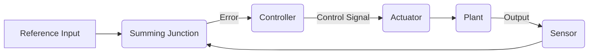

--- 
sidebar_position: 5
title: Control Algorithms (PID, State Space)
---

## 05-Control Algorithms (PID, State Space)

Control algorithms are the heart of robot behavior, enabling them to execute desired movements, maintain stability, and interact precisely with their environment. They take sensor feedback, compare it to a desired state, and generate commands for actuators to reduce any discrepancies. This chapter explores two fundamental approaches to control: PID (Proportional-Integral-Derivative) control and State Space control.

### 5.1 Introduction to Control Systems

A control system generally consists of:
*   **Plant:** The system to be controlled (e.g., a robot joint, a motor, a mobile robot).
*   **Sensor:** Measures the actual output of the plant.
*   **Reference Input/Setpoint:** The desired output or target state.
*   **Controller:** Calculates the error between the reference and actual output, and then generates a control signal to the plant.
*   **Actuator:** Receives the control signal and influences the plant.

Most robot control systems are **closed-loop feedback systems**, meaning they continuously measure the output and use that information to adjust the input.

**Diagram 5.1: Basic Closed-Loop Control System**



*Description: A block diagram of a basic closed-loop feedback control system, showing the flow of information from reference input, through the controller, plant, and sensor feedback loop to minimize error.*

### 5.2 PID Control

**PID (Proportional-Integral-Derivative) Control** is the most common feedback control algorithm used in industrial control systems and robotics. It's simple, robust, and effective for a wide range of applications.

#### 5.2.1 The PID Equation

The control output `u(t)` is a sum of three terms: proportional, integral, and derivative.

```latex
u(t) = K_p e(t) + K_i int e(t) dt + K_d frac{de(t)}{dt}
```

Where:
*   `e(t) = text{setpoint}(t) - text{actual_value}(t)` is the **error** at time `t`.
*   `K_p`: **Proportional gain**.
*   `K_i`: **Integral gain**.
*   `K_d`: **Derivative gain**.

#### 5.2.2 Components of PID

*   **Proportional (P) Term (`K_p e(t)`):**
    *   **Effect:** Generates control output proportional to the current error.
    *   **Behavior:** Reduces error quickly, but can cause oscillations and often results in a **steady-state error** (offset).
    *   **Tuning:** Increasing `K_p` makes the system respond faster but can lead to instability.
*   **Integral (I) Term (`K_i int e(t) dt`):
    *   **Effect:** Accumulates past errors over time.
    *   **Behavior:** Eliminates steady-state error (offset).
    *   **Tuning:** Increasing `K_i` removes offset but can make the system slower and more prone to overshoot. Can lead to "integral windup" if not handled (controller output saturates).
*   **Derivative (D) Term (`K_d frac{de(t)}{dt}`):
    *   **Effect:** Responds to the rate of change of the error. Predicts future error.
    *   **Behavior:** Dampens oscillations, improves stability, reduces overshoot, speeds up response. Acts like a brake.
    *   **Tuning:** Increasing `K_d` improves stability but can make the system very sensitive to noise.

#### 5.2.3 Tuning PID Controllers

Tuning the `K_p, K_i, K_d` gains is often an iterative process, usually done empirically:
1.  Set `K_i` and `K_d` to zero.
2.  Increase `K_p` until the output oscillates around the setpoint.
3.  Slowly increase `K_d` to dampen oscillations.
4.  Slowly increase `K_i` to eliminate steady-state error.
*   **Ziegler-Nichols method** is a common systematic tuning approach.

#### 5.2.4 Applications in Robotics

*   **Motor Speed Control:** Maintain a desired motor RPM.
*   **Joint Position Control:** Move a robotic arm joint to a specific angle.
*   **Mobile Robot Velocity Control:** Achieve desired linear and angular velocities.
*   **Temperature Control:** Maintain a constant temperature in an environment or system.

### 5.3 State Space Control

**State Space control** is a more advanced and powerful approach to control system design, particularly for complex, multi-input, multi-output (MIMO) systems common in robotics. It provides a comprehensive mathematical model of the system.

#### 5.3.1 Principle

Instead of focusing only on the error, state space control models the entire system using a set of internal variables called **state variables**. These variables completely describe the system's behavior at any given time.

#### 5.3.2 State Space Representation

For a continuous-time linear system, the state-space representation is:
```latex
dot{x}(t) = Ax(t) + Bu(t)
```
```latex
y(t) = Cx(t) + Du(t)
```
Where:
*   `x(t)` is the **state vector** (e.g., position, velocity, acceleration for each joint).
*   `dot{x}(t)` is the derivative of the state vector (rate of change of states).
*   `u(t)` is the **input vector** (e.g., motor torques, forces).
*   `y(t)` is the **output vector** (what is measured by sensors).
*   `A`: **System matrix** (describes internal dynamics).
*   `B`: **Input matrix** (describes how inputs affect states).
*   `C`: **Output matrix** (describes how states affect outputs).
*   `D`: **Feedthrough matrix** (describes direct input to output effect).

#### 5.3.3 Advantages

*   **Handles MIMO Systems:** Naturally extends to systems with multiple inputs and outputs.
*   **Provides Internal State Information:** Gives insight into the system's internal behavior, not just its output.
*   **More Robust Design:** Can design controllers for stability, optimality, and disturbance rejection more systematically.
*   **Optimal Control:** Forms the basis for advanced optimal control techniques (e.g., LQR - Linear Quadratic Regulator).

#### 5.3.4 Disadvantages

*   More mathematically complex.
*   Requires a good model of the system dynamics (matrices A, B, C, D).
*   Computationally more intensive than simple PID for single-variable systems.

#### 5.3.5 Applications in Robotics

*   **Multi-joint Robotic Manipulators:** Controlling the coordinated motion of multiple joints.
*   **Unmanned Aerial Vehicles (UAVs):** Flight control for attitude, altitude, and position.
*   **Balancing Robots:** Maintaining an upright position (e.g., inverted pendulum robots).
*   **Autonomous Vehicles:** Complex path following and motion control.

Both PID and state space control are powerful tools in a roboticist's arsenal, chosen based on the complexity of the system, performance requirements, and available computational resources. PID offers simplicity and widespread applicability, while state space provides a deeper, more systematic approach for complex systems.

---

### C++ Example: Discrete PID Controller Implementation

This C++ example implements a discrete PID controller for controlling a robot's motor speed. It provides the framework, but actual motor speed measurement (e.g., from an encoder) and motor control (e.g., PWM output) would need to be added.

```cpp
#include <iostream>
#include <chrono>
#include <thread>
#include <vector>
#include <random> // For random number generation
#include <iomanip> // For std::fixed, std::setprecision
#include <limits> // For std::numeric_limits

class DiscretePIDController {
private:
    float Kp, Ki, Kd;       // PID gains
    float setpoint;         // Desired value
    float integral;         // Integral sum
    float prev_error;       // Previous error
    float dt;               // Time step for discrete calculation
    float max_integral;     // Max value for integral term (anti-windup)
    float min_output, max_output; // Output clamping

public:
    DiscretePIDController(float p, float i, float d, float time_step, float max_int = 100.0f, float min_out = -255.0f, float max_out = 255.0f) : 
        Kp(p), Ki(i), Kd(d), dt(time_step), 
        setpoint(0.0f), integral(0.0f), prev_error(0.0f), 
        max_integral(max_int), min_output(min_out), max_output(max_out) {}

    void setSetpoint(float sp) {
        setpoint = sp;
        // Optionally reset integral and prev_error when setpoint changes significantly
        // integral = 0.0f;
        // prev_error = 0.0f;
    }

    float compute(float feedback_value) {
        float error = setpoint - feedback_value;

        // Proportional term
        float Pout = Kp * error;

        // Integral term with anti-windup
        integral += error * dt;
        integral = std::max(-max_integral, std::min(integral, max_integral)); // Clamp integral term
        float Iout = Ki * integral;

        // Derivative term
        float derivative = (error - prev_error) / dt;
        float Dout = Kd * derivative;

        // Calculate total output
        float output = Pout + Iout + Dout;

        // Clamp output
        output = std::max(min_output, std::min(output, max_output));

        // Store error for next iteration
        prev_error = error;

        return output;
    }

    void resetIntegral() {
        integral = 0.0f;
    }
};

// Simulate a motor with some inertia and noise
float simulateMotor(float control_input, float current_speed) {
    static std::random_device rd;
    static std::mt19937 gen(rd());
    static std::normal_distribution<> noise(0, 0.2); // Smaller noise for better observation

    // Simple motor model: speed changes based on control input, with some damping
    // Assume control_input is PWM-like, max 255. Speed max 100 RPM
    float motor_response_factor = control_input / 255.0f;
    float new_speed = current_speed + (motor_response_factor * 2.0f) - (current_speed * 0.05f) + noise(gen); // Control vs. Damping
    
    // Clamp speed to realistic limits (0-100 RPM)
    return std::max(0.0f, std::min(100.0f, new_speed));
}

int main() {
    const float dt = 0.05f; // PID loop runs every 50ms (20 Hz) 
    DiscretePIDController motorPID(5.0f, 0.8f, 0.2f, dt, 50.0f, 0.0f, 255.0f); // Kp, Ki, Kd, dt, max_int, min_out, max_out
    
    float current_motor_speed = 0.0f; // Initial speed in RPM
    motorPID.setSetpoint(60.0f); // Target speed is 60 RPM

    std::cout << "PID Motor Speed Control Simulation" << std::endl;
    std::cout << "Time\tSetpoint\tCurrent Speed\tError\t\tOutput\t\t" << std::endl;
    std::cout << std::fixed << std::setprecision(2);

    for (int i = 0; i < 200; ++i) { // Simulate for 10 seconds (200 iterations * 0.05s)
        float time_sec = i * dt;
        
        float control_output = motorPID.compute(current_motor_speed);
        
        // Use control_output (PWM value) to update motor speed
        current_motor_speed = simulateMotor(control_output, current_motor_speed);

        float error = motorPID.setpoint - current_motor_speed;

        std::cout << time_sec << "\t" << motorPID.setpoint << "\t\t" << current_motor_speed << "\t\t"
                  << error << "\t\t" << control_output << "\t\t" << std::endl;
        
        std::this_thread::sleep_for(std::chrono::milliseconds(static_cast<long>(dt * 1000)));

        // Change setpoint after a few seconds
        if (time_sec > 4.0f && motorPID.setpoint == 60.0f) {
            motorPID.setSetpoint(30.0f);
            std::cout << "\n--- Setpoint changed to 30 RPM ---" << std::endl;
            motorPID.resetIntegral(); // Reset integral for faster response to new setpoint
        }
    }
    std::cout << "\nSimulation finished." << std::endl;

    return 0;
}
```

---

### Python Example: State Space Control (Conceptual) for a Simple Mass-Spring-Damper

This Python example conceptually outlines state space control for a simple mass-spring-damper system. In a real application, a more sophisticated linear algebra library would be used (e.g., NumPy, SciPy).

```python
import numpy as np
import matplotlib.pyplot as plt # For plotting
import time

# --- System Definition (Mass-Spring-Damper) ---
# State vector x = [position; velocity]
# Input u = [force]
# Output y = [position]
# Equations:
# m*ddx + c*dx + k*x = u
# ddx = (1/m) * u - (c/m)*dx - (k/m)*x

# Let x1 = position, x2 = velocity
# dx1 = x2
# dx2 = (1/m)*u - (c/m)*x2 - (k/m)*x1

# State Space Matrices (A, B, C, D)
# A = [[0, 1], [-k/m, -c/m]]
# B = [[0], [1/m]]
# C = [[1, 0]] # Measure position
# D = [[0]]

def simulate_system(A, B, C, D, initial_state, control_input_func, num_steps, dt):
    """
    Simulates a linear system in state-space.
    A, B, C, D: System matrices
    initial_state: Initial state vector (numpy array)
    control_input_func: Function to get control input u(t) for each step
    num_steps: Number of simulation steps
    dt: Time step
    """
    history_x = [initial_state.flatten()] # Store flattened states
    history_u = []
    history_y = []

    current_state = initial_state
    
    for k in range(num_steps):
        # Get control input
        u_k = control_input_func(k, current_state)
        history_u.append(u_k)

        # Update state: x(k+1) = (I + A*dt)*x(k) + B*dt*u(k) (Euler integration for discrete)
        # More accurately: x_dot = A*x + B*u
        # For discrete time: x(k+1) = Ad*x(k) + Bd*u(k)
        # Here we use a simplified Euler integration for continuous time system
        
        # Continuous time derivatives
        x_dot = A @ current_state + B @ u_k

        # Update state using Euler integration
        current_state = current_state + x_dot * dt
        
        history_x.append(current_state.flatten())
        
        # Calculate output
        y_k = C @ current_state + D @ u_k
        history_y.append(y_k)

    return np.array(history_x), np.array(history_u), np.array(history_y)

if __name__ == "__main__":
    print("--- State Space Control Simulation (Conceptual) ---")

    # System parameters (Mass-Spring-Damper)
    m = 1.0  # kg
    c = 0.5  # Ns/m (damping coefficient)
    k = 2.0  # N/m (spring constant)

    # State Space Matrices
    A = np.array([[0.0, 1.0], [-k/m, -c/m]])
    B = np.array([[0.0], [1.0/m]])
    C = np.array([[1.0, 0.0]]) # Measure position
    D = np.array([[0.0]])

    # Simulation parameters
    dt = 0.01  # Time step (seconds)
    simulation_duration = 10.0 # seconds
    num_steps = int(simulation_duration / dt)

    # Initial state: [position=1.0m, velocity=0.0m/s]
    initial_state = np.array([[1.0], [0.0]])

    # Control input function (e.g., a simple controller trying to bring position to 0)
    # This could be a sophisticated LQR or other state-feedback controller
    def simple_control_input(k_step, current_state):
        target_position = 0.0
        kp_force = -5.0 # Proportional gain for force
        
        position_error = target_position - current_state[0,0]
        force = kp_force * position_error
        
        # Clamp force
        max_force = 10.0
        return np.array([[max(-max_force, min(max_force, force))]])

    # Run simulation
    states_history, inputs_history, outputs_history = simulate_system(
        A, B, C, D, initial_state, simple_control_input, num_steps, dt
    )

    time_points = np.arange(0, simulation_duration + dt, dt)

    print(f"\nSimulation complete for {simulation_duration} seconds.")
    print("Plotting position and control input...")

    # Plotting (requires matplotlib)
    plt.figure(figsize=(12, 6))

    plt.subplot(2, 1, 1)
    plt.plot(time_points[:len(states_history)], states_history[:, 0], label='Position (x)')
    plt.plot(time_points[:len(states_history)], states_history[:, 1], label='Velocity (dx/dt)')
    plt.axhline(y=0, color='r', linestyle='--', label='Target Position')
    plt.title('Mass-Spring-Damper System Response (State Space Control)')
    plt.xlabel('Time (s)')
    plt.ylabel('State Value')
    plt.legend()
    plt.grid(True)

    plt.subplot(2, 1, 2)
    plt.plot(time_points[:len(inputs_history)], inputs_history[:, 0], label='Control Input (Force)')
    plt.title('Control Input')
    plt.xlabel('Time (s)')
    plt.ylabel('Force (N)')
    plt.legend()
    plt.grid(True)

    plt.tight_layout()
    plt.show()
    print("Plot displayed. Close plot to end script.")
```

---

### Arduino Example: Basic PID for Motor Speed Control (Conceptual)

This Arduino sketch demonstrates how to implement a basic PID controller for motor speed control. It provides the framework, but actual motor speed measurement (e.g., from an encoder) and motor control (e.g., PWM output) would need to be added.

```arduino
// Basic PID Controller for Motor Speed Control (Conceptual)
// This sketch provides the PID logic. 
// You would need to add:
// 1. Encoder reading for motor speed feedback.
// 2. PWM motor control output.
// 3. A fixed time interval (dt) for PID computation (e.g., using millis() or a Timer).

// PID Gains (Tune these for your specific motor)
float Kp = 5.0;
float Ki = 0.8;
float Kd = 0.2;

// PID Variables
float setpoint = 0.0;     // Desired motor speed (e.g., RPM)
float feedback = 0.0;     // Actual motor speed (from encoder)
float error = 0.0;
float integral = 0.0;
float prevError = 0.0;

// PID output
float output = 0.0;       // Value to send to motor (e.g., PWM 0-255)

// Timing for PID calculation (important for derivative and integral terms)
unsigned long lastPidTime = 0;
const long pidInterval = 50; // PID runs every 50ms (20 Hz)

// Output limits
const float minOutput = 0;   // Minimum PWM value
const float maxOutput = 255; // Maximum PWM value

void setup() {
  Serial.begin(9600);
  Serial.println("Arduino PID Motor Speed Control Demo Ready.");
  
  // Set initial desired speed
  setpoint = 60; // Desired RPM
  Serial.print("Setpoint: "); Serial.println(setpoint);
  
  // You would initialize motor pins here
  // pinMode(MOTOR_PWM_PIN, OUTPUT);
}

void loop() {
  unsigned long currentTime = millis();
  float deltaTime = (float)(currentTime - lastPidTime) / 1000.0; // Convert to seconds

  if (deltaTime >= (float)pidInterval / 1000.0) { // Check if it's time to run PID
    // 1. Read Actual Motor Speed (Feedback)
    // For now, simulate feedback that approaches setpoint with some noise
    feedback = feedback + (setpoint - feedback) * 0.1 + random(-5, 5); // Example simulation
    feedback = constrain(feedback, 0, 100); // Clamp feedback
    
    // In a real robot:
    // feedback = readEncoderSpeed();

    // 2. Calculate Error
    error = setpoint - feedback;

    // 3. Proportional Term
    float P = Kp * error;

    // 4. Integral Term (with anti-windup)
    integral += error * deltaTime;
    // Anti-windup: limit integral contribution to prevent overshooting
    integral = constrain(integral, -100.0, 100.0); // Adjust limits as needed
    float I = Ki * integral;

    // 5. Derivative Term
    derivative = (error - prevError) / deltaTime;
    float D = Kd * derivative;

    // 6. Total Output
    output = P + I + D;

    // 7. Clamp Output to actuator limits
    output = constrain(output, minOutput, maxOutput);

    // 8. Send Output to Motor
    // For example: analogWrite(MOTOR_PWM_PIN, (int)output);
    
    Serial.print("Set: "); Serial.print(setpoint);
    Serial.print("\tFb: "); Serial.print(feedback);
    Serial.print("\tErr: "); Serial.print(error);
    Serial.print("\tOut: "); Serial.println(output);

    // 9. Update for next iteration
    prevError = error;
    lastPidTime = currentTime;
  }
  
  // Other non-blocking tasks can run here
  // For example: read other sensors, process communication
}
```

---

### Equations in LaTeX: Discrete PID Control

For a discrete-time PID controller, where calculations are performed at regular intervals `Delta t`:

```latex
u_k = K_p e_k + K_i sum_{j=0}^{k} e_j Delta t + K_d frac{e_k - e_{k-1}{Delta t}
```

Where:
*   `u_k` is the control output at time step `k`.
*   `e_k` is the error at time step `k`.
*   `e_{k-1}` is the error at the previous time step `k-1`.
*   `sum e_j Delta t` is the discrete approximation of the integral term.
*   `frac{e_k - e_{k-1}{Delta t}` is the discrete approximation of the derivative term.

--- 

### MCQs with Answers

1.  In a PID controller, which term is primarily responsible for eliminating steady-state error (offset) by accumulating past errors?
    a) Proportional (P) term
    b) Integral (I) term
    c) Derivative (D) term
    d) Feedforward term
    *Answer: b) Integral (I) term*

2.  What is the main role of the Derivative (D) term in a PID controller?
    a) To make the system respond faster to error.
    b) To eliminate steady-state error.
    c) To dampen oscillations and predict future error.
    d) To act as a filter for sensor noise.
    *Answer: c) To dampen oscillations and predict future error.*

3.  Which control approach is generally more suitable for complex, multi-input, multi-output (MIMO) systems and provides a comprehensive mathematical model of the system's internal variables?
    a) PID Control
    b) Bang-Bang Control
    c) State Space Control
    d) On-Off Control
    *Answer: c) State Space Control*

--- 

### Practice Tasks

1.  **PID Tuning (Conceptual):** You are tuning a PID controller for a robot's wheeled motor speed. Describe the likely behavior you would observe if you only used a large `K_p` gain, and what adjustments you would then make to `K_d` and `K_i` to achieve a stable and accurate speed control.
2.  **PID for a Robotic Arm Joint:** Outline how you would apply a PID controller to move a robotic arm joint to a desired angle. What would be the `setpoint`, `feedback`, and `output` in this system? What sensors and actuators would be involved?
3.  **State Space for Balancing Robot (Conceptual):** Imagine a simple 1-DOF balancing robot (like an inverted pendulum on wheels). What state variables (`x`) would you choose to completely describe its state? What would be the input (`u`) and output (`y`) for such a system?

--- 

### Notes for Teachers

*   **Real-world Analogies:** Use analogies like driving a car (P for pressing accelerator, D for braking) or heating a room (I for turning up thermostat if it's consistently cold) to explain PID terms.
*   **PID Tuning Demo:** If possible, demonstrate PID tuning on a real system (e.g., a simple motor, an inverted pendulum simulator) to show the effect of each gain.
*   **Math vs. Intuition:** For state space, provide the mathematical framework but also build intuition about how it models the system's "inner workings."

### Notes for Students

*   **PID is Universal:** PID is incredibly widespread. Understanding it thoroughly will serve you well in many engineering disciplines.
*   **Tuning is an Art:** PID tuning often requires experimentation. Don't be afraid to adjust the gains and observe the system's response.
*   **Derivative and Noise:** Be aware that the derivative term is very sensitive to noise in the feedback signal.
*   **Integral Windup:** Understand integral windup and how anti-windup strategies (like clamping the integral sum) prevent it.
*   **Model Matters (State Space):** For state space control, the accuracy of your system model (A, B, C, D matrices) directly impacts the controller's performance.
