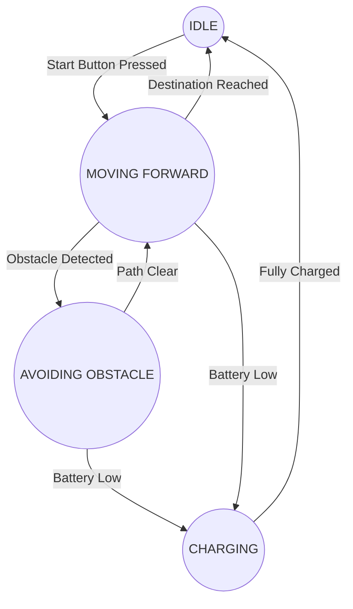

--- 
sidebar_position: 6
title: Decision Making and State Machines
---

## 06-Decision Making and State Machines

Robots are constantly faced with decisions: Should I move forward or turn? Am I at my destination? Is there an obstacle? **Decision-making algorithms** enable robots to choose appropriate actions based on their current perception and goals. A powerful and widely used framework for structuring these decisions and managing complex robot behaviors is the **Finite State Machine (FSM)**.

### 6.1 Introduction to Decision Making

Robot decision making can range from simple reactive behaviors to complex, deliberative planning.

*   **Reactive Decision Making:** Simple "if-then-else" rules that trigger immediate actions based on current sensor readings (e.g., "IF obstacle detected THEN turn"). Fast but lacks foresight.
*   **Deliberative Decision Making:** Involves planning, reasoning, and searching through possible actions to achieve a long-term goal (e.g., pathfinding, task scheduling). Slower but more intelligent.
*   **Hybrid Approaches:** Combine reactive and deliberative elements for robust and efficient behavior.

### 6.2 Finite State Machines (FSMs)

A **Finite State Machine (FSM)** is a mathematical model of computation. It is an abstract machine that can be in exactly one of a finite number of **states** at any given time. The FSM can change from one state to another in response to some **inputs**; the change from one state to another is called a **transition**.

#### 6.2.1 Key Components of an FSM

1.  **States:** A finite number of distinct situations or modes the robot can be in (e.g., `IDLE`, `MOVING_FORWARD`, `AVOIDING_OBSTACLE`, `CHARGING`).
2.  **Transitions:** Rules that define how the robot moves from one state to another. A transition is triggered by an **event** or **condition** (input).
3.  **Events/Conditions:** External or internal occurrences that can cause a state transition (e.g., `obstacle_detected`, `destination_reached`, `battery_low`, `button_pressed`).
4.  **Actions:** Operations performed by the robot, often associated with entering a state, exiting a state, or during a transition.

#### 6.2.2 Types of FSMs

*   **Mealy Machine:** Output is associated with the **transitions** (depends on current state and input).
*   **Moore Machine:** Output is associated with the **states** (depends only on the current state). Most robot FSMs are often closer to Moore machines for simplicity, where state implies action.

**Diagram 6.1: Simple Robot Behavior State Machine (Moore-like)**



*Description: A state machine diagram illustrating a robot's possible states (IDLE, MOVING FORWARD, AVOIDING OBSTACLE, CHARGING) and the events that trigger transitions between these states.*

### 6.3 Implementing FSMs in Code

FSMs can be implemented using `switch-case` statements (in C++/Arduino) or `if-elif-else` structures, often with an `enum` for states.

*   **Advantages:**
    *   **Clarity:** Provides a clear, organized way to define complex behaviors.
    *   **Modularity:** Each state can encapsulate specific logic.
    *   **Debugging:** Easier to debug as the robot's behavior is explicitly defined.
    *   **Predictability:** Robot behavior is well-defined for all possible inputs.

*   **Disadvantages:**
    *   Can become very complex ("state explosion") if there are too many states or transitions.
    *   Not ideal for highly dynamic or unpredictable environments where behavior needs to be fluid.

### 6.4 Hierarchical State Machines (HSMs)

To manage complexity, **Hierarchical State Machines (HSMs)** or **Statecharts** introduce nested states. A state can contain substates, and transitions can occur at different levels of the hierarchy. This allows for cleaner representation of common behaviors or exceptions.

*   **Example:** A `MOVING` state might have substates like `MOVING_FORWARD`, `TURNING_LEFT`, `TURNING_RIGHT`. An `OBSTACLE_DETECTED` event could transition from *any* `MOVING` substate directly to `AVOIDING_OBSTACLE`, simplifying transitions.

### 6.5 Behavior Trees (BTs)

**Behavior Trees (BTs)** are an alternative to FSMs, particularly popular in game AI and increasingly in robotics. They offer a more modular and reactive way to define complex behaviors.

*   **Principle:** A tree-like structure of tasks. The root asks its children to execute, and they return a status (`SUCCESS`, `FAILURE`, `RUNNING`). The parent then decides what to do next based on the child's status.
*   **Nodes:** 
    *   **Control Flow Nodes:** 
        *   **Sequence (`->`):** Executes children in order until one fails, then returns `FAILURE`. If all succeed, returns `SUCCESS`.
        *   **Selector (`?`):** Executes children in order until one succeeds, then returns `SUCCESS`. If all fail, returns `FAILURE`.
    *   **Leaf Nodes:** 
        *   **Conditions:** Check a condition (e.g., `IsBatteryLow?`). Returns `SUCCESS` or `FAILURE`.
        *   **Actions:** Perform an action (e.g., `MoveForward`). Returns `SUCCESS`, `FAILURE`, or `RUNNING`.
*   **Advantages:** Highly modular, easy to add/remove behaviors, very reactive, better for parallel behaviors than simple FSMs.
*   **Disadvantages:** Can be harder to optimize for strict temporal guarantees.

**Diagram 6.2: Simple Behavior Tree**

```mermaid
graph TD
    A[Root Selector (?)] --> B(Sequence (->))
    B --> C(Condition: IsBatteryLow?)
    B --> D(Action: ChargeBattery)
    A --> E(Sequence (->))
    E --> F(Condition: ObstacleAhead?)
    E --> G(Action: AvoidObstacle)
    A --> H(Action: MoveForward)
```

*Description: A simple behavior tree diagram with a root selector node that checks battery, then obstacles, then moves forward. Sequence nodes execute children sequentially, while the selector tries children until one succeeds.*

### 6.6 Applications in Robotics

*   **Autonomous Navigation:** Managing states like `EXPLORING`, `PATH_FOLLOWING`, `LOCALIZATION_LOST`, `DOCKING`.
*   **Human-Robot Interaction:** States for `WAITING_COMMAND`, `LISTENING`, `SPEAKING`, `EXECUTING_TASK`.
*   **Task Execution:** Sequencing complex tasks (e.g., `PICKING_OBJECT`, `TRANSPORTING_OBJECT`, `DROPPING_OBJECT`).
*   **Error Handling:** States for `ERROR_STATE`, `RECOVERY`, `EMERGENCY_STOP`.

FSMs and Behavior Trees provide the structured frameworks necessary for designing predictable, robust, and intelligent decision-making capabilities in robots.

---

### C++ Example: Simple Finite State Machine (FSM)

This C++ example implements a simple robot FSM using a `switch-case` structure, demonstrating state transitions based on simulated events.

```cpp
#include <iostream>
#include <string>
#include <chrono>
#include <thread>
#include <random> // For random number generation

// Define robot states
enum RobotState { IDLE, MOVING_FORWARD, AVOIDING_OBSTACLE, CHARGING, TASK_COMPLETE };

// Simulate sensor readings/events
bool detectObstacle() {
    static std::random_device rd;
    static std::mt19937 gen(rd());
    static std::uniform_int_distribution<> distrib(0, 100);
    return distrib(gen) < 10; // 10% chance of detecting an obstacle
}

bool detectBatteryLow() {
    static std::random_device rd;
    static std::mt19937 gen(rd());
    static std::uniform_int_distribution<> distrib(0, 100);
    return distrib(gen) < 3; // 3% chance of battery low
}

bool isFullyCharged() {
    static std::random_device rd;
    static std::mt19937 gen(rd());
    static std::uniform_int_distribution<> distrib(0, 100);
    return distrib(gen) < 20; // 20% chance of being fully charged (simulated)
}

bool reachedDestination() {
    static std::random_device rd;
    static std::mt19937 gen(rd());
    static std::uniform_int_distribution<> distrib(0, 100);
    return distrib(gen) < 5; // 5% chance of reaching destination
}

// Global variable for current state
RobotState currentRobotState = IDLE;

// Function to print state names
std::string getStateName(RobotState state) {
    switch (state) {
        case IDLE: return "IDLE";
        case MOVING_FORWARD: return "MOVING_FORWARD";
        case AVOIDING_OBSTACLE: return "AVOIDING_OBSTACLE";
        case CHARGING: return "CHARGING";
        case TASK_COMPLETE: return "TASK_COMPLETE";
        default: return "UNKNOWN";
    }
}

void processRobotBehavior() {
    // Print current state
    std::cout << "Current State: " << getStateName(currentRobotState);

    // Decision-making logic based on current state and events
    switch (currentRobotState) {
        case IDLE:
            std::cout << " (Waiting for command...)";
            // Simulate start command
            if (std::chrono::steady_clock::now().time_since_epoch().count() % 10 < 2) { // Random start
                currentRobotState = MOVING_FORWARD;
                std::cout << " -> Transition to MOVING_FORWARD (Start Command)" << std::endl;
            } else { std::cout << std::endl; }
            break;

        case MOVING_FORWARD:
            std::cout << " (Moving towards destination...)";
            if (detectObstacle()) {
                currentRobotState = AVOIDING_OBSTACLE;
                std::cout << " -> Transition to AVOIDING_OBSTACLE (Obstacle Detected)" << std::endl;
            } else if (detectBatteryLow()) {
                currentRobotState = CHARGING;
                std::cout << " -> Transition to CHARGING (Battery Low)" << std::endl;
            } else if (reachedDestination()) {
                currentRobotState = IDLE;
                std::cout << " -> Transition to IDLE (Destination Reached)" << std::endl;
            } else { std::cout << std::endl; }
            break;

        case AVOIDING_OBSTACLE:
            std::cout << " (Executing avoidance maneuver...)";
            // Simulate avoidance time
            static int avoidanceCounter = 0;
            avoidanceCounter++;
            if (avoidanceCounter > 5) { // After 5 cycles, assume obstacle avoided
                avoidanceCounter = 0;
                currentRobotState = MOVING_FORWARD;
                std::cout << " -> Transition to MOVING_FORWARD (Path Clear)" << std::endl;
            } else { std::cout << std::endl; }
            break;

        case CHARGING:
            std::cout << " (Charging battery...)";
            if (isFullyCharged()) {
                currentRobotState = IDLE;
                std::cout << " -> Transition to IDLE (Fully Charged)" << std::endl;
            } else { std::cout << std::endl; }
            break;
            
        case TASK_COMPLETE:
            std::cout << " (Robot has finished all tasks.)" << std::endl;
            break;
    }
}

int main() {
    std::cout << "--- Robot Finite State Machine Simulation ---" << std::endl;
    // Seed random number generator
    srand(time(NULL)); 

    for (int i = 0; i < 30; ++i) { // Simulate for a number of steps
        processRobotBehavior();
        if (currentRobotState == TASK_COMPLETE) { break; }
        std::this_thread::sleep_for(std::chrono::milliseconds(200));
    }

    std::cout << "\nSimulation finished." << std::endl;
    return 0;
}
```

---

### Python Example: Behavior Tree Implementation (Conceptual)

This Python example implements a very basic conceptual Behavior Tree for a robot's decision-making.

```python
import time
import random

# --- Node Statuses ---
SUCCESS = "SUCCESS"
FAILURE = "FAILURE"
RUNNING = "RUNNING"

# --- Base Node Class ---
class Node:
    def __init__(self, name):
        self.name = name
    
    def tick(self):
        """Execute the node's logic and return a status."""
        raise NotImplementedError

# --- Control Flow Nodes ---
class Selector(Node):
    """Executes children in order until one succeeds. Returns SUCCESS or FAILURE."""
    def __init__(self, name, children):
        super().__init__(name)
        self.children = children
    
    def tick(self):
        print(f"  Ticking Selector: {self.name}")
        for child in self.children:
            status = child.tick()
            if status == SUCCESS:
                return SUCCESS
            elif status == RUNNING:
                return RUNNING
        return FAILURE

class Sequence(Node):
    """Executes children in order until one fails. Returns SUCCESS or FAILURE."""
    def __init__(self, name, children):
        super().__init__(name)
        self.children = children
    
    def tick(self):
        print(f"  Ticking Sequence: {self.name}")
        for child in self.children:
            status = child.tick()
            if status == FAILURE:
                return FAILURE
            elif status == RUNNING:
                return RUNNING
        return SUCCESS

# --- Leaf Nodes ---
class Condition(Node):
    def __init__(self, name, condition_func):
        super().__init__(name)
        self.condition_func = condition_func
    
    def tick(self):
        result = self.condition_func()
        print(f"    Condition: {self.name} -> {'True' if result else 'False'}")
        return SUCCESS if result else FAILURE

class Action(Node):
    def __init__(self, name, action_func):
        super().__init__(name)
        self.action_func = action_func
        self.is_running = False
    
    def tick(self):
        if not self.is_running:
            print(f"    Action: {self.name} STARTING")
            self.is_running = True
        
        status = self.action_func()
        
        if status == RUNNING:
            print(f"    Action: {self.name} RUNNING")
        else:
            print(f"    Action: {self.name} {'SUCCESS' if status == SUCCESS else 'FAILURE'}")
            self.is_running = False
        return status

# --- Robot Simulation ---
# Global robot state
robot_battery_level = 100
robot_obstacle_ahead = False
robot_destination_reached = False

def is_battery_low_func():
    return robot_battery_level < 20

def charge_battery_func():
    global robot_battery_level
    robot_battery_level += random.randint(5, 15)
    robot_battery_level = min(100, robot_battery_level)
    print(f"      Charging: Battery at {robot_battery_level}%")
    return RUNNING if robot_battery_level < 100 else SUCCESS

def is_obstacle_ahead_func():
    return robot_obstacle_ahead

def avoid_obstacle_func():
    print("      Avoiding Obstacle...")
    # Simulate turning, backing up etc.
    if random.randint(0, 100) < 80: # 80% chance to clear obstacle
        global robot_obstacle_ahead
        robot_obstacle_ahead = False
        return SUCCESS
    return RUNNING

def move_forward_func():
    print("      Moving Forward...")
    # Simulate movement
    if random.randint(0, 100) < 5: # 5% chance to reach destination
        global robot_destination_reached
        robot_destination_reached = True
        return SUCCESS
    if random.randint(0, 100) < 10: # 10% chance to encounter obstacle
        global robot_obstacle_ahead
        robot_obstacle_ahead = True
    global robot_battery_level
    robot_battery_level -= random.randint(1, 5) # Battery drain
    return RUNNING

# --- Build the Behavior Tree ---
if __name__ == "__main__":
    print("--- Robot Behavior Tree Simulation ---")

    # Actions
    charge_action = Action("Charge Battery", charge_battery_func)
    avoid_action = Action("Avoid Obstacle", avoid_obstacle_func)
    move_action = Action("Move Forward", move_forward_func)

    # Conditions
    battery_low_condition = Condition("Is Battery Low?", is_battery_low_func)
    obstacle_ahead_condition = Condition("Is Obstacle Ahead?", is_obstacle_ahead_func)

    # Sequences for handling specific situations
    emergency_charge_sequence = Sequence("Emergency Charge", [battery_low_condition, charge_action])
    obstacle_avoidance_sequence = Sequence("Obstacle Avoidance", [obstacle_ahead_condition, avoid_action])

    # Root Selector: Prioritize charging, then avoiding, then moving
    root = Selector("Robot Main Behavior", [
        emergency_charge_sequence,
        obstacle_avoidance_sequence,
        move_action # If neither above is needed, move forward
    ])

    print("\nStarting robot loop...")
for i in range(20):
        print(f"\n--- Tick {i+1} ---")
        if robot_destination_reached:
            print("Robot: Destination reached! Halting.")
            break

        status = root.tick()
        print(f"Overall BT Status: {status}")
        
        # Simulate battery drain if not charging
        if status != RUNNING or root.children[0].tick() != RUNNING: # If not charging
            robot_battery_level -= 1 # General drain
            if robot_battery_level < 0: robot_battery_level = 0
            
        print(f"Current Battery: {robot_battery_level}%")
        time.sleep(0.5)

    print("\nSimulation finished.")
```

---

### Arduino Example: Simple Menu with State Machine

This Arduino sketch demonstrates a conceptual state machine for navigating a simple menu, reacting to button presses.

```arduino
// Simple Menu Navigation using a State Machine

// Define menu states
enum MenuState { STATE_MAIN_MENU, STATE_ROBOT_CONTROL, STATE_SENSOR_DATA, STATE_SETTINGS };

MenuState currentMenuState = STATE_MAIN_MENU;

// Simulate button inputs
const int buttonUpPin = 2;
const int buttonDownPin = 3;
const int buttonSelectPin = 4;

// Global variables for debouncing (simplified)
unsigned long lastButtonPressTime = 0;
const long debounceDelay = 100; // ms

int readButton(int pin) { return digitalRead(pin); } // Assume INPUT_PULLUP and LOW is pressed

void setup() {
  Serial.begin(9600);
  pinMode(buttonUpPin, INPUT_PULLUP);
  pinMode(buttonDownPin, INPUT_PULLUP);
  pinMode(buttonSelectPin, INPUT_PULLUP);
  Serial.println("Arduino Menu State Machine Demo Ready.");
  displayMenu();
}

void loop() {
  // Read buttons
  bool upPressed = (readButton(buttonUpPin) == LOW);
  bool downPressed = (readButton(buttonDownPin) == LOW);
  bool selectPressed = (readButton(buttonSelectPin) == LOW);

  unsigned long currentTime = millis();

  // Basic debouncing
  if (currentTime - lastButtonPressTime > debounceDelay) {
    if (selectPressed) { handleSelect(); lastButtonPressTime = currentTime; }
    else if (upPressed) { handleUp(); lastButtonPressTime = currentTime; }
    else if (downPressed) { handleDown(); lastButtonPressTime = currentTime; }
  }
}

void displayMenu() {
  Serial.println("\n--- MENU ---");
  switch (currentMenuState) {
    case STATE_MAIN_MENU:
      Serial.println("> 1. Robot Control");
      Serial.println("  2. Sensor Data");
      Serial.println("  3. Settings");
      break;
    case STATE_ROBOT_CONTROL:
      Serial.println("  Main Menu");
      Serial.println("> Robot Control: (Move, Stop)");
      // Add more options here if desired
      break;
    case STATE_SENSOR_DATA:
      Serial.println("  Main Menu");
      Serial.println("> Sensor Data: (Read All, Calibrate)");
      // Add more options here
      break;
    case STATE_SETTINGS:
      Serial.println("  Main Menu");
      Serial.println("> Settings: (WiFi, Motors)");
      // Add more options here
      break;
  }
  Serial.println("--------------------");
}

void handleSelect() {
  switch (currentMenuState) {
    case STATE_MAIN_MENU:
      // In a real menu, you'd navigate to the selected item (e.g., Robot Control)
      Serial.println("Selected: Robot Control (Conceptual, always selects first)");
      currentMenuState = STATE_ROBOT_CONTROL; // Go to first option
      break;
    case STATE_ROBOT_CONTROL:
      Serial.println("Executing Robot Control action (e.g., Move Forward)");
      // Add actual robot control commands here
      break;
    case STATE_SENSOR_DATA:
      Serial.println("Displaying Sensor Data (Conceptual)");
      // Add sensor reading display here
      break;
    case STATE_SETTINGS:
      Serial.println("Entering Settings (Conceptual)");
      // Add settings logic here
      break;
  }
  displayMenu(); // Update display after action/transition
}

void handleUp() {
  Serial.println("Up button pressed (conceptual - no actual item selection logic for now)");
  // In a real menu, you'd change the selected item within the current state
  // For now, it could represent a "back" or "previous" action
  if (currentMenuState != STATE_MAIN_MENU) {
    currentMenuState = STATE_MAIN_MENU; // Go back to main menu
  }
  displayMenu();
}

void handleDown() {
  Serial.println("Down button pressed (conceptual - no actual item selection logic for now)");
  // In a real menu, you'd change the selected item within the current state
  // For now, it could represent a "next" action, but we'll keep it simple
  if (currentMenuState == STATE_MAIN_MENU) {
    // Simulate cycling through main menu options
    // This logic is simplified; a real menu would track a cursor.
    // Here, just selecting the next "main" state.
    if (currentMenuState == STATE_MAIN_MENU) currentMenuState = STATE_ROBOT_CONTROL;
    else if (currentMenuState == STATE_ROBOT_CONTROL) currentMenuState = STATE_SENSOR_DATA;
    else if (currentMenuState == STATE_SENSOR_DATA) currentMenuState = STATE_SETTINGS;
    else currentMenuState = STATE_MAIN_MENU; // Wrap around
  }
  displayMenu();
}
```

---

### Equations in LaTeX: Utility Function for Decision Making

In more complex decision-making, a robot might evaluate the "utility" of different actions. A simple additive utility function `U(A)` for an action `A` could be:

```latex
U(A) = sum_{i=1}^{n} w_i cdot V_i(A)
```

Where:
*   `w_i` are weights representing the importance of different criteria.
*   `V_i(A)` are values representing how well action `A` achieves criterion `i`.
*   The robot chooses the action `A` that maximizes this `U(A)`.

---

### MCQs with Answers

1.  In a Finite State Machine (FSM), what causes a transition from one state to another?
    a) A fixed time interval.
    b) An external or internal event or condition.
    c) A random number generator.
    d) A change in the robot's power supply.
    *Answer: b) An external or internal event or condition.*

2.  What is a primary advantage of using a **Behavior Tree** over a simple Finite State Machine for complex robot behaviors?
    a) Behavior Trees are always faster to execute.
    b) Behavior Trees are purely reactive and cannot plan.
    c) Behavior Trees offer more modularity and are better for parallel or opportunistic behaviors.
    d) Behavior Trees are limited to only two states.
    *Answer: c) Behavior Trees offer more modularity and are better for parallel or opportunistic behaviors.*

3.  If a robot's `MOVING_FORWARD` state transitions directly to `CHARGING` upon detecting a `battery_low` event, regardless of current speed or other factors, this is an example of what?
    a) An invalid state transition.
    b) A reactive decision.
    c) A deliberative decision.
    d) A purely random behavior.
    *Answer: b) A reactive decision.*

--- 

### Practice Tasks

1.  **FSM Design for a Robotic Cleaner:** Design a Finite State Machine for a simple robotic vacuum cleaner. Consider states like `IDLE`, `CLEANING`, `DOCKING_FOR_CHARGE`, `CHARGING`, `OBSTACLE_AVOIDANCE`. List the states and the events that would trigger transitions between them.
2.  **Behavior Tree for Object Grasping:** Outline a conceptual Behavior Tree for a robot trying to grasp an object. Include nodes for conditions (e.g., `IsObjectDetected?`, `IsGripperOpen?`) and actions (e.g., `DetectObject`, `ApproachObject`, `OpenGripper`, `CloseGripper`). Use Sequence and Selector nodes to structure the behavior.
3.  **Implement a Simple FSM in Arduino:** Extend the provided Arduino menu example to include actual navigation between the main menu options (Robot Control, Sensor Data, Settings) using the Up/Down buttons, and a Select button to "enter" a sub-menu or execute an action.

--- 

### Notes for Teachers

*   **State Machine Diagrams:** Emphasize drawing clear state machine diagrams before coding, as they are crucial for visualizing behavior.
*   **BT vs. FSM Comparison:** Provide clear examples of when an FSM is suitable and when a Behavior Tree might be a better choice, highlighting their respective strengths and weaknesses.
*   **Debugging FSMs:** Discuss how printing the current state to the serial monitor is an excellent way to debug FSM logic.

### Notes for Students

*   **Define States Clearly:** Ensure your states are distinct and well-defined, representing unique phases of your robot's behavior.
*   **Handle All Transitions:** Consider all possible events and how they should trigger transitions from each state.
*   **Avoid State Explosion:** For complex systems, explore Hierarchical State Machines or Behavior Trees to manage complexity.
*   **Test Each State:** Test the logic of each state independently to ensure it behaves as expected.
