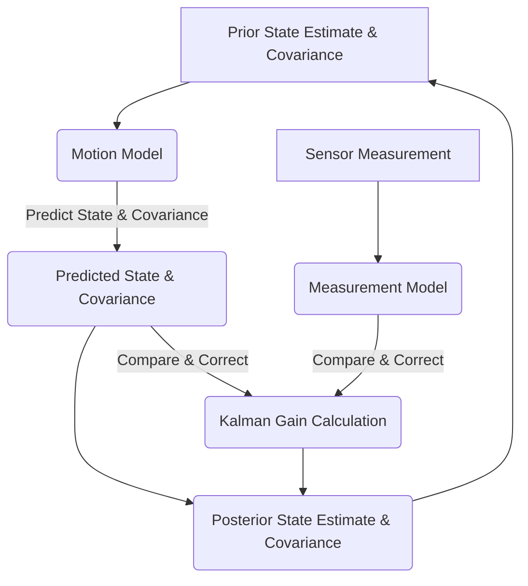

## 07-Localization Algorithms (Kalman Filter, Particle Filter)

For a robot to navigate and operate autonomously, it must continuously answer the fundamental question: "Where am I?" This is the problem of **localization**. Localization algorithms combine data from various sensors (odometry, IMU, GPS, LiDAR, cameras) with a map of the environment to estimate the robot's position and orientation. This chapter delves into two of the most important and widely used probabilistic localization algorithms: the Kalman Filter family and Particle Filters.

### 7.1 The Localization Problem

The localization problem can be challenging due to:
*   **Sensor Noise:** All sensor measurements are imperfect and contain noise.
*   **Odometry Drift:** Odometry (from encoders) provides relative motion but accumulates errors over time.
*   **Dynamic Environments:** The world can change, and objects may move.
*   **Ambiguity:** Similar-looking environments can lead to ambiguous position estimates.

Probabilistic localization approaches aim to estimate the robot's pose (position and orientation) as a **probability distribution** rather than a single point, representing the uncertainty in the estimate.

### 7.2 Kalman Filter (KF) Family

The Kalman Filter is an optimal recursive data processing algorithm that combines measurements with a prediction of the robot's state to produce an estimate that is statistically more accurate than either alone. It assumes linear system dynamics and Gaussian noise.

#### 7.2.1 Core Idea

The Kalman Filter operates in a continuous **predict-update cycle**:

1.  **Predict (Time Update):**
    *   Use the robot's motion model and control inputs (e.g., motor commands) to predict its new state (position, velocity) and the uncertainty (covariance) of this prediction.
2.  **Update (Measurement Update):**
    *   Take a new sensor measurement (e.g., GPS, landmark observation).
    *   Compare the measurement to the predicted measurement.
    *   Use the difference (innovation) and the uncertainty of both the prediction and the measurement to correct the state estimate and reduce its uncertainty.

#### 7.2.2 Extended Kalman Filter (EKF)

*   **Purpose:** Extends the KF to handle **non-linear** system dynamics and measurement models, which are typical in robotics (e.g., robot motion, sensor models).
*   **Mechanism:** It linearizes the non-linear functions around the current state estimate using **Jacobian matrices**.
*   **Limitations:** The linearization introduces approximations, which can lead to inaccuracies if the non-linearities are strong.

#### 7.2.3 Unscented Kalman Filter (UKF)

*   **Purpose:** Another extension for non-linear systems that avoids linearization.
*   **Mechanism:** Uses a deterministic sampling technique (unscented transform) to pick a set of "sigma points" that capture the mean and covariance of the state distribution. These points are then propagated through the actual non-linear functions, without explicit linearization.
*   **Advantages:** More accurate for strongly non-linear systems than EKF, often more robust.
*   **Disadvantages:** Can be more computationally intensive than EKF for high-dimensional systems.

#### 7.2.4 Applications of Kalman Filters

*   **Mobile Robot Localization:** Fusing odometry (encoders) with GPS, IMU, or landmark observations.
*   **Object Tracking:** Tracking the position and velocity of moving objects (e.g., other robots, targets).
*   **UAV Navigation:** Estimating drone pose by fusing IMU, GPS, and altimeter data.

**Diagram 7.1: Kalman Filter Predict-Update Cycle**



*Description: A cyclical flow diagram illustrating the iterative process of a Kalman Filter, starting from a prior estimate, predicting the next state, incorporating new measurements, and updating to a more accurate posterior estimate.*

### 7.3 Particle Filters (PF) / Monte Carlo Localization (MCL)

Particle Filters are non-parametric, non-linear filters particularly well-suited for situations where the robot's position probability distribution is multi-modal (the robot could be in several places at once) or highly non-Gaussian. Monte Carlo Localization (MCL) is a common application of particle filters for global robot localization.

#### 7.3.1 Core Idea

1.  **Represent State:** The robot's belief about its state is represented by a set of random samples (particles), each representing a possible pose of the robot. Each particle has a weight, indicating how likely that pose is.
2.  **Predict (Motion Update):**
    *   For each particle, apply the robot's motion model (based on control inputs) and add random noise to simulate motion uncertainty. This moves the particles to new predicted locations.
3.  **Update (Measurement Update):**
    *   For each particle, calculate how well its predicted sensor readings match the actual sensor measurements.
    *   Assign a weight to each particle, where higher weights indicate better matches.
4.  **Resample:**
    *   Create a new set of particles by resampling from the current set, choosing particles with higher weights more often. This focuses the particles in areas of high probability, effectively "killing off" unlikely poses.

#### 7.3.2 Advantages

*   **Handles Non-Linear and Non-Gaussian Distributions:** Can track complex probability distributions, making it excellent for global localization (kidnapped robot problem).
*   **Robust to Sensor Noise:** Can handle large sensor noise or temporary sensor outages.
*   **No Linearization Required:** Unlike EKF, it does not linearize system models.

#### 7.3.3 Disadvantages

*   **Computationally Intensive:** Requires a large number of particles for accurate representation, especially in large environments, leading to high computational cost.
*   **"Particle Depletion" / "Degeneracy":** If particles become too concentrated too early, or if there are too few, the filter can lose track of the true pose.

#### 7.3.4 Applications of Particle Filters

*   **Global Localization:** Estimating the robot's initial position without prior knowledge.
*   **Robust Localization:** In environments with strong sensor noise or where motion is highly uncertain.
*   **Robot Tracking in Dynamic Environments:** Tracking other agents.

### 7.4 Map Representation for Localization

Localization algorithms rely on a map of the environment:
*   **Occupancy Grid Map:** Represents the environment as a grid of cells, each indicating the probability of being occupied by an obstacle.
*   **Feature Map:** Stores the locations of distinct, recognizable features (landmarks) in the environment.

Choosing the right localization algorithm depends on the robot's environment, sensor suite, computational resources, and the required accuracy and robustness. Often, a combination of these techniques is employed within a larger navigation system.

---

### C++ Example: Simple 1D Particle Filter (Conceptual)

This C++ example demonstrates a conceptual 1D Particle Filter for estimating a robot's position, fusing noisy motion updates with noisy measurements.

```cpp
#include <iostream>
#include <vector>
#include <random>
#include <numeric> // For std::accumulate
#include <algorithm> // For std::max_element, std::discrete_distribution
#include <iomanip> // For std::fixed, std::setprecision

// ---
Particle Structure ---
struct Particle {
    float position;
    float weight;
};

// ---
Particle Filter Class ---
class ParticleFilter1D {
private:
    std::vector<Particle> particles;
    int num_particles;
    float map_size; // Example: map from 0 to map_size
    
    std::default_random_engine generator;
    std::normal_distribution<float> motion_noise_dist;
    std::normal_distribution<float> measurement_noise_dist;

public:
    ParticleFilter1D(int n_particles, float map_dim, float motion_noise_std, float meas_noise_std) :
        num_particles(n_particles), map_size(map_dim),
        motion_noise_dist(0.0f, motion_noise_std),
        measurement_noise_dist(0.0f, meas_noise_std) {
        
        // Initialize particles uniformly across the map
        std::uniform_real_distribution<float> map_dist(0.0f, map_size);
        for (int i = 0; i < num_particles; ++i) {
            particles.push_back({map_dist(generator), 1.0f / num_particles});
        }
    }

    // ---
Prediction Step (Motion Update) ---
    void predict(float odometry_distance) {
        for (auto& p : particles) {
            // Apply odometry with motion noise
            p.position += odometry_distance + motion_noise_dist(generator);
            // Wrap around or clamp to map size if needed
            if (p.position < 0) p.position += map_size;
            if (p.position >= map_size) p.position -= map_size;
        }
    }

    // ---
Update Step (Measurement Update) ---
    // Simulate a sensor measurement to a known landmark at landmark_pos
    void update(float measurement_from_landmark, float landmark_pos) {
        float total_weight = 0.0f;
        for (auto& p : particles) {
            // Calculate expected measurement from this particle's pose to the landmark
            float expected_measurement = std::abs(landmark_pos - p.position);
            // This is a simplified likelihood model. Real sensors have more complex likelihoods.
            float likelihood = std::exp(-0.5f * std::pow(measurement_from_landmark - expected_measurement, 2) / std::pow(measurement_noise_dist.stddev(), 2));
            
            p.weight *= likelihood;
            total_weight += p.weight;
        }

        // Normalize weights
        if (total_weight > 0) {
            for (auto& p : particles) {
                p.weight /= total_weight;
            }
        } else { // Handle case where all weights are zero (lost localization)
            std::cout << "Particle filter lost localization (all weights zero)! Re-initializing." << std::endl;
            std::uniform_real_distribution<float> map_dist(0.0f, map_size);
            for(auto& p : particles) {
                p.position = map_dist(generator);
                p.weight = 1.0f / num_particles;
            }
        }
    }

    // ---
Resampling Step ---
    void resample() {
        std::vector<Particle> new_particles;
        new_particles.reserve(num_particles);

        std::vector<float> weights;
        for (const auto& p : particles) {
            weights.push_back(p.weight);
        }

        // Use discrete distribution for weighted random selection
        std::discrete_distribution<int> distribution(weights.begin(), weights.end());

        for (int i = 0; i < num_particles; ++i) {
            int index = distribution(generator);
            new_particles.push_back({particles[index].position, 1.0f / num_particles}); // Reset weights
        }
        particles = new_particles;
    }

    // ---
Get Estimated Pose ---
    float getEstimatedPosition() const {
        float weighted_sum_pos = 0.0f;
        for (const auto& p : particles) {
            weighted_sum_pos += p.position * p.weight;
        }
        return weighted_sum_pos;
    }

    void printParticles() const {
        std::cout << "[Particles] ";
        for (int i = 0; i < std::min(num_particles, 10); ++i) { // Print up to 10 particles
            std::cout << "(" << std::fixed << std::setprecision(1) << particles[i].position << "," << particles[i].weight << ") ";
        }
        if (num_particles > 10) std::cout << "...";
        std::cout << std::endl;
    }
};

int main() {
    std::cout << "---
1D Particle Filter Simulation ---" << std::endl;

    const float map_size = 100.0f; // Map from 0 to 100
    const float motion_noise_std = 0.5f; // Uncertainty in robot's movement
    const float meas_noise_std = 2.0f; // Uncertainty in sensor measurement
    const float landmark_pos = 25.0f; // Known landmark position
    
    ParticleFilter1D pf(100, map_size, motion_noise_std, meas_noise_std); // 100 particles

    float true_robot_pos = map_size / 2.0f; // Start robot in middle
    float odometry_movement = 2.0f; // Robot commands to move 2 units

    std::cout << std::fixed << std::setprecision(2);
    std::cout << "True Pos\tOdometry Meas\tSensor Meas\tEstimated Pos" << std::endl;

    for (int i = 0; i < 20; ++i) { // Simulate 20 steps
        // 1. Robot moves (True position update)
        true_robot_pos += odometry_movement;
        if (true_robot_pos >= map_size) true_robot_pos -= map_size;
        if (true_robot_pos < 0) true_robot_pos += map_size;
        
        // 2. Particle Filter Prediction
        pf.predict(odometry_movement);

        // 3. Simulate Noisy Sensor Measurement
        // Robot measures distance to landmark
        float true_dist_to_landmark = std::abs(landmark_pos - true_robot_pos);
        float sensor_measurement = true_dist_to_landmark + pf.measurement_noise_dist(pf.generator);
        sensor_measurement = std::max(0.0f, sensor_measurement); // Distance cannot be negative

        // 4. Particle Filter Update
        pf.update(sensor_measurement, landmark_pos);
        
        // 5. Resample
        pf.resample();

        // 6. Get Estimate
        float estimated_pos = pf.getEstimatedPosition();
        
        std::cout << true_robot_pos << "\t\t" << true_robot_pos + motion_noise_std << "\t\t" // Approx odometry meas
                  << sensor_measurement << "\t\t" << estimated_pos << std::endl;
        
        // pf.printParticles(); // Uncomment to see particle distribution
        std::this_thread::sleep_for(std::chrono::milliseconds(200));
    }

    std::cout << "\nSimulation finished." << std::endl;
    return 0;
}
```

---

### Python Example: Extended Kalman Filter (EKF) for 1D Robot Localization

This Python example outlines an EKF for a 1D robot that moves and measures its position. It's simplified as EKF typically deals with covariance matrices.

```python
import numpy as np
import matplotlib.pyplot as plt # For plotting
import random
import math

class Robot1DEKF:
    def __init__(self, initial_pos, initial_vel, dt, process_noise_pos, process_noise_vel, measurement_noise_std):
        self.dt = dt
        
        # State vector x = [position; velocity]
        self.x = np.array([[initial_pos], [initial_vel]]) 
        
        # Covariance matrix P (initial uncertainty)
        self.P = np.array([[100.0, 0.0], [0.0, 100.0]]) # Large initial uncertainty

        # Process noise covariance Q (how much noise is in our motion model)
        self.Q = np.array([[process_noise_pos**2, 0.0], [0.0, process_noise_vel**2]])

        # Measurement noise covariance R (how noisy is our sensor)
        self.R = np.array([[measurement_noise_std**2]])

        # State transition matrix F (for linear part) and its Jacobian for prediction
        self.F = np.array([[1.0, self.dt], [0.0, 1.0]]) # For linear constant velocity model
        
        # Measurement matrix H and its Jacobian for update (we only measure position)
        self.H = np.array([[1.0, 0.0]]) # Measures only position
        
        # No explicit non-linear functions for 1D, so F and H are used directly as Jacobians.
        # For true EKF, f and h would be non-linear functions and F and H their Jacobians.

    def predict(self, control_input=0.0): # Control input is acceleration for 1D model
        # State prediction: x_hat = F @ self.x + B * u
        # For constant velocity model, B * u is simplified or integrated into F
        # Here, control_input is assumed to be an acceleration, affecting velocity
        
        # Define the non-linear motion model f(x, u)
        # x_k+1 = x_k + v_k * dt + 0.5 * a_k * dt^2
        # v_k+1 = v_k + a_k * dt
        
        # For simplicity, assuming control_input affects only velocity and is not always zero
        # If no control input, it's a constant velocity model.
        # This is a linear motion model for this 1D case.
        
        # x_predicted = F @ self.x + np.array([[0.5 * control_input * self.dt**2], [control_input * self.dt]])
        x_predicted = self.F @ self.x # For constant velocity (u=0 implicitly)

        # Covariance prediction: P = F @ P @ F.T + Q
        P_predicted = self.F @ self.P @ self.F.T + self.Q
        
        self.x = x_predicted
        self.P = P_predicted
        
def update(self, measurement):
        # Measurement prediction (linear for this 1D case): z_hat = H @ x_predicted
        z_hat = self.H @ self.x

        # Innovation (measurement residual): y = z - z_hat
        y = measurement - z_hat

        # Innovation (or residual) covariance: S = H @ P @ H.T + R
        S = self.H @ self.P @ self.H.T + self.R
        
        # Kalman Gain: K = P @ H.T @ S.INV
        K = self.P @ self.H.T @ np.linalg.inv(S)

        # Updated state estimate: x_updated = x_predicted + K @ y
        self.x = self.x + K @ y

        # Updated covariance: P_updated = (I - K @ H) @ P
        I = np.eye(self.x.shape[0]) # Identity matrix
        self.P = (I - K @ self.H) @ self.P

    def get_state(self):
        return self.x.flatten() # Return as 1D array for easier access

# Simulate noisy sensor measurement
def get_noisy_position_measurement(true_pos, std_dev):
    return true_pos + random.normalvariate(0, std_dev)

if __name__ == "__main__":
    print("---
1D Extended Kalman Filter (EKF) Simulation ---")

    # Simulation parameters
    dt = 0.1 # seconds
    true_velocity = 2.0 # m/s
    simulation_duration = 10.0 # seconds
    num_steps = int(simulation_duration / dt)

    # EKF parameters
    initial_robot_pos = 0.0
    initial_robot_vel = 0.0
    process_noise_std_pos = 0.1 # How much our model might be wrong (for pos)
    process_noise_std_vel = 0.1 # How much our model might be wrong (for vel)
    measurement_noise_std = 1.0 # How noisy our sensor is

    ekf = Robot1DEKF(initial_robot_pos, initial_robot_vel, dt, 
                     process_noise_std_pos, process_noise_std_vel, measurement_noise_std)

    # History tracking
    true_positions = []
    measurements = []
    estimated_positions = []
    estimated_velocities = []

    current_true_pos = initial_robot_pos
    current_true_vel = true_velocity

    print("Step | True Pos | Meas Pos | Est Pos | Est Vel")
    print("-" * 50)

    for i in range(num_steps):
        # True state update
        current_true_pos += current_true_vel * dt
        
        # Get noisy measurement
        measurement = get_noisy_position_measurement(current_true_pos, measurement_noise_std)

        # EKF steps
        ekf.predict()
        ekf.update(np.array([[measurement]]))

        # Store results
        true_positions.append(current_true_pos)
        measurements.append(measurement)
        estimated_positions.append(ekf.get_state()[0])
        estimated_velocities.append(ekf.get_state()[1])

        print(f"{i+1:4d} | {current_true_pos:8.2f} | {measurement:8.2f} | {ekf.get_state()[0]:7.2f} | {ekf.get_state()[1]:7.2f}")
        
    print("\nSimulation complete. Plotting results...")

    # Plotting (requires matplotlib)
    time_points = np.arange(0, simulation_duration, dt)
    plt.figure(figsize=(12, 6))
    
    plt.plot(time_points, true_positions, label='True Position', color='green')
    plt.plot(time_points, measurements, 'x', label='Measurements', color='red', alpha=0.6)
    plt.plot(time_points, estimated_positions, label='Estimated Position (EKF)', color='blue')
    
    plt.title('1D Robot Localization using EKF')
    plt.xlabel('Time (s)')
    plt.ylabel('Position (m)')
    plt.legend()
    plt.grid(True)
    plt.show()

    print("Plot displayed. Close plot to end script.")
```

---

### Arduino Example: Simple Sensor Averaging (Conceptual Localization)

This Arduino sketch demonstrates a very basic form of localization by simply averaging sensor readings from a "landmark" to get a more stable estimate of position, akin to a rudimentary fusion.

```arduino
// Simple Sensor Averaging for Localization (Conceptual)
// This simulates a robot trying to localize itself by measuring
// its distance to a known landmark using a noisy sensor.
// Averaging multiple readings is a very basic form of data fusion.

const int sensorPin = A0; // Analog pin for distance sensor
const float landmarkPosition = 50.0; // Known position of a landmark on a 1D line

const int numReadings = 10; // Number of readings to average
float readings[numReadings]; // Array to store readings
int readIndex = 0;           // The index of the current reading
float total = 0;             // The running total
float average = 0;           // The average

void setup() {
  Serial.begin(9600);
  Serial.println("Arduino Simple Sensor Averaging for Localization Demo Ready.");
  // Initialize all readings to zero
  for (int i = 0; i < numReadings; i++) {
    readings[i] = 0;
  }
}

void loop() {
  // Simulate reading from a noisy distance sensor to the landmark
  // Assume true robot position varies slightly around the landmark
  static float robotCurrentPosition = 45.0; // Initial robot position
  robotCurrentPosition += random(-10, 10) / 100.0; // Small random movement
  robotCurrentPosition = constrain(robotCurrentPosition, 0, 100); // Keep within bounds

  float trueDistanceFromLandmark = abs(landmarkPosition - robotCurrentPosition);
  
  // Simulate sensor noise
  float sensorNoise = random(-50, 50) / 10.0; // Add noise in cm
  float currentSensorReading = trueDistanceFromLandmark + sensorNoise;
  currentSensorReading = constrain(currentSensorReading, 0, 100); // Distance cannot be negative

  // Subtract the old reading from the total
  total = total - readings[readIndex];
  // Add the new reading to the total
  readings[readIndex] = currentSensorReading;
  total = total + readings[readIndex];
  // Advance to the next position in the array
  readIndex = readIndex + 1;
  // If we're at the end of the array, wrap around to the beginning
  if (readIndex >= numReadings) {
    readIndex = 0;
  }

  // Calculate the average
  average = total / numReadings;

  Serial.print("True Pos: "); Serial.print(robotCurrentPosition);
  Serial.print("\tTrue Dist: "); Serial.print(trueDistanceFromLandmark);
  Serial.print("\tSensor Read: "); Serial.print(currentSensorReading);
  Serial.print("\tAvg Dist: "); Serial.println(average);

  delay(100); // Simulate sensor reading interval
}
```

---

### Equations in LaTeX: Gaussian Probability Distribution

Probabilistic localization often assumes sensor noise and motion uncertainties follow a **Gaussian (Normal) distribution**. A 1D Gaussian probability density function is:

```latex
p(x) = frac{1}{sigma sqrt{2pi} e^{-frac{(x-mu)^2}{2sigma^2}
``` 

Where:
*   `mu` is the mean (expected value).
*   `sigma` is the standard deviation.
*   `sigma^2` is the variance.

This formula describes the likelihood of observing a particular measurement `x` given a true mean `mu` and uncertainty `sigma`.

---

### MCQs with Answers

1.  What is the primary challenge that makes localization problems difficult for robots?
    a) Robots cannot store maps in their memory.
    b) All sensor measurements are perfectly accurate.
    c) Sensor noise and odometry drift lead to uncertainty.
    d) Robots cannot execute motion commands precisely.
    *Answer: c) Sensor noise and odometry drift lead to uncertainty.*

2.  Which filter is a non-parametric, non-linear filter that represents the robot's state as a set of weighted random samples (particles)?
    a) Kalman Filter
    b) Extended Kalman Filter (EKF)
    c) Complementary Filter
    d) Particle Filter
    *Answer: d) Particle Filter*

3.  The Extended Kalman Filter (EKF) handles non-linear system dynamics and measurement models by:
    a) Ignoring the non-linearities.
    b) Using a very large number of particles.
    c) Linearizing the non-linear functions around the current state estimate using Jacobian matrices.
    d) Assuming all noise is non-Gaussian.
    *Answer: c) Linearizing the non-linear functions around the current state estimate using Jacobian matrices.*

---

### Practice Tasks

1.  **EKF vs. PF Scenario:** Consider a robot operating in two different environments:
    *   **Environment A:** A long, straight, featureless corridor with small, consistent odometry noise.
    *   **Environment B:** A large, open, symmetric room where the robot might get "lost" initially (kidnapped robot problem), and sensor measurements are very noisy.
    Which localization algorithm (EKF or Particle Filter) would likely perform better in each environment, and why?
2.  **Particle Filter Resampling:** Describe the purpose of the "resampling" step in a Particle Filter. What would happen to the particle distribution if this step were omitted?
3.  **Sensor Fusion for Localization:** Imagine a mobile robot with wheel encoders (odometry) and a camera that can detect known landmarks (e.g., QR codes on walls). How would you conceptually combine the information from these two sensors to localize the robot, considering the strengths and weaknesses of each sensor?

---

### Notes for Teachers

*   **Probabilistic Nature:** Emphasize that these algorithms deal with probability distributions, not just point estimates, which is crucial for handling uncertainty.
*   **Intuition Over Math:** While the math can be complex, focus on building an intuitive understanding of the predict-update cycle for Kalman Filters and the particle propagation/resampling for Particle Filters.
*   **Real-world Examples:** Use examples of how these filters are used in self-driving cars, drones, and mobile robots.

### Notes for Students

*   **Odometry Error:** Always remember that odometry accumulates error, making it unreliable for long-term absolute localization alone.
*   **Kalman for Linear, Particle for Non-Gaussian:** Understand the fundamental difference in when to apply Kalman-based filters versus Particle Filters.
*   **Process and Measurement Noise:** Recognize the importance of accurately modeling your system's process noise (how much your robot's motion model deviates) and measurement noise (how noisy your sensors are).
*   **Computational Cost:** Be aware that Particle Filters can be computationally expensive due to the large number of particles required.