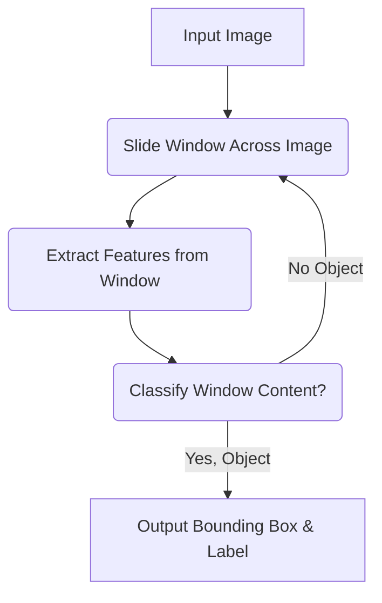

--- 
sidebar_position: 4
title: Object Detection and Recognition
---

## 04-Object Detection and Recognition

For a robot to intelligently interact with its environment, it must not only "see" but also "understand" what it sees. **Object detection** answers the question "Where are the objects of interest?", while **object recognition (or classification)** answers "What is this object?". These are foundational tasks in computer vision for robotics, enabling robots to identify, locate, and categorize items in their surroundings. This chapter explores both traditional and modern (deep learning-based) approaches to these critical perception capabilities.

### 4.1 Object Detection vs. Object Recognition (Classification)

*   **Object Recognition (Classification):** Given an image, determine what single object is present in the image (or classify the entire scene). Outputs a class label (e.g., "cat", "dog", "car").
*   **Object Detection:** Given an image, identify *all* instances of *multiple* objects, locate each one with a bounding box, and assign a class label to each. Outputs bounding boxes and class labels (e.g., "car at [x,y,w,h]", "person at [x,y,w,h]").
*   **Object Segmentation:** Goes a step further, identifying the exact pixel-level boundaries of each object (e.g., "all these pixels belong to the car").

### 4.2 Traditional Object Detection (Before Deep Learning)

Before the deep learning revolution, object detection often involved hand-crafted features and classical machine learning.

*   **Steps:**
    1.  **Sliding Window:** A window of a fixed size slides across the image.
    2.  **Feature Extraction:** For each window, extract discriminative features (e.g., Haar-like features, HOG - Histograms of Oriented Gradients).
    3.  **Classifier:** A classifier (e.g., Support Vector Machine - SVM, AdaBoost) predicts if the window contains an object.
*   **Haar Cascades:**
    *   **Principle:** Uses Haar-like features (differences in sums of pixels over rectangular regions) and a cascade of boosted classifiers (AdaBoost).
    *   **Advantages:** Very fast once trained, widely used for real-time face detection.
    *   **Disadvantages:** Requires careful feature engineering, not robust to large variations in viewpoint or illumination, prone to false positives, performs poorly on complex objects.
*   **HOG (Histograms of Oriented Gradients):**
    *   **Principle:** Captures local object appearance and shape by counting occurrences of gradient orientation in localized portions of an image. Often combined with SVM for classification.
    *   **Advantages:** Robust to photometric and minor geometric changes.
    *   **Disadvantages:** Still requires sliding window (slow), not robust to major viewpoint changes.

**Diagram 4.1: Sliding Window Approach**



*Description: A flowchart illustrating the traditional sliding window approach to object detection, where a window is scanned across an image, features are extracted, and a classifier determines if an object is present within that window.*

### 4.3 Deep Learning for Object Detection

Deep Learning, especially Convolutional Neural Networks (CNNs), has dramatically improved the accuracy and speed of object detection. These methods learn features directly from data, eliminating the need for manual feature engineering.

#### 4.3.1 Two-Stage Detectors

*   **Principle:** First, propose a sparse set of "regions of interest" (RoIs) that might contain objects. Second, classify these proposed regions and refine their bounding boxes.
*   **Examples:** R-CNN, Fast R-CNN, Faster R-CNN.
*   **Advantages:** High accuracy.
*   **Disadvantages:** Typically slower due to the two-stage process.

#### 4.3.2 One-Stage Detectors

*   **Principle:** Treat object detection as a single regression problem, directly predicting bounding boxes and class probabilities from full image features.
*   **Examples:**
    *   **YOLO (You Only Look Once):** Divides the image into a grid and has each grid cell predict bounding boxes and class probabilities.
    *   **SSD (Single Shot Detector):** Uses multiple feature maps of different scales to detect objects at various sizes.
*   **Advantages:** Very fast, suitable for real-time applications (e.g., autonomous driving, robotic manipulation).
*   **Disadvantages:** Can be slightly less accurate than two-stage detectors, especially for small objects.

#### 4.3.3 Training Deep Learning Models

*   Requires vast amounts of **labeled data** (images with bounding box annotations and class labels).
*   Uses **GPUs** for efficient training.
*   **Transfer Learning:** Often, pre-trained models on large datasets (e.g., ImageNet, COCO) are fine-tuned on smaller, specific datasets for robotic applications.

### 4.4 Applications in Robotics

*   **Autonomous Navigation:** Detecting pedestrians, vehicles, traffic signs, lane lines, movable obstacles.
*   **Object Manipulation:** Identifying objects to pick, placing them, inspecting their state.
*   **Inventory Management:** Counting items, locating specific products in warehouses.
*   **Quality Control:** Detecting defects in manufactured goods.
*   **Security & Surveillance:** Detecting intruders, suspicious objects.
*   **Human-Robot Collaboration:** Recognizing human tools, identifying human intentions through gaze or posture.

Object detection and recognition empower robots with a profound understanding of their visual environment, transforming them from simple manipulators into intelligent agents capable of complex tasks and adaptive behavior.

---

### C++ Example: Conceptual Object Detection with Bounding Boxes (Simulated)

This C++ example conceptually simulates an object detection algorithm that outputs bounding boxes and class labels. In a real scenario, you'd use a deep learning framework integrated with OpenCV.

```cpp
#include <iostream>
#include <vector>
#include <string>
#include <random> // For random number generation
#include <chrono> // For std::this_thread::sleep_for
#include <thread> // For std::this_thread::sleep_for
#include <iomanip> // For std::fixed, std::setprecision

// --- Detected Object Structure ---
struct DetectedObject {
    std::string className;
    float confidence; // Probability of correct classification (0.0 to 1.0)
    int x, y, width, height; // Bounding box coordinates

    void print() const {
        std::cout << "Class: " << className 
                  << ", Confidence: " << std::fixed << std::setprecision(2) << confidence
                  << ", BBox: [x=" << x << ", y=" << y << ", w=" << width << ", h=" << height << "]" << std::endl;
    }
};

// --- Simulated Object Detector Function ---
std::vector<DetectedObject> runObjectDetector_sim(const std::string& image_path) {
    std::cout << "[Detector] Processing image: " << image_path << std::endl;
    std::vector<DetectedObject> detections;

    // Simulate detection based on random chance
    std::random_device rd;
    std::mt19937 gen(rd());
    std::uniform_int_distribution<> num_objects_dist(0, 3); // Detect 0 to 3 objects
    std::uniform_real_distribution<float> confidence_dist(0.7f, 0.99f);
    std::uniform_int_distribution<> xy_dist(0, 500); // Image size 640x480
    std::uniform_int_distribution<> wh_dist(50, 200);

    int num_detected = num_objects_dist(gen);
    std::vector<std::string> possible_classes = {"robot", "box", "tool", "person"};

    for (int i = 0; i < num_detected; ++i) {
        std::string className = possible_classes[std::uniform_int_distribution<>(0, possible_classes.size()-1)(gen)];
        float confidence = confidence_dist(gen);
        int x = xy_dist(gen);
        int y = xy_dist(gen);
        int w = wh_dist(gen);
        int h = wh_dist(gen);

        detections.push_back({className, confidence, x, y, w, h});
    }

    if (detections.empty()) {
        std::cout << "[Detector] No objects detected." << std::endl;
    } else {
        std::cout << "[Detector] Detected " << detections.size() << " objects." << std::endl;
    }
    return detections;
}

int main() {
    std::cout << "--- Conceptual Object Detection Demo (C++) ---" << std::endl;

    for (int i = 0; i < 3; ++i) { // Simulate a few frames
        std::cout << "\n--- Processing Frame " << i + 1 << " ---" << std::endl;
        std::vector<DetectedObject> detected_objects = runObjectDetector_sim("camera_feed_frame_" + std::to_string(i) + ".jpg");

        if (!detected_objects.empty()) {
            std::cout << "Robot's Perception: " << std::endl;
            for (const auto& obj : detected_objects) {
                obj.print();
                // Robot can now act based on this information
                if (obj.className == "box" && obj.confidence > 0.85f) {
                    std::cout << "  [Robot Action] Found a HIGH CONFIDENCE BOX! Planning to pick it up." << std::endl;
                }
            }
        }
        std::this_thread::sleep_for(std::chrono::milliseconds(1000));
    }

    std::cout << "\nConceptual object detection demo finished." << std::endl;
    return 0;
}
```

---

### Python Example: YOLO (You Only Look Once) Conceptual Logic

This Python example conceptually outlines the core idea of a YOLO-like (You Only Look Once) object detection system, without implementing the deep learning model itself.

```python
import numpy as np
# import cv2 # Uncomment to run with actual OpenCV
import time

def conceptual_yolo_pipeline(image_filename="robot_scene.jpg"):
    print(f"--- Conceptual YOLO-like Object Detection Pipeline for '{image_filename}' ---")

    # Step 1: Input Image
    # In reality: img = cv2.imread(image_filename)
    print("1. Input image acquired (simulated 416x416).")
    input_image_size = (416, 416) # Common YOLO input size

    # Step 2: Resize and Normalize (for CNN input)
    # In reality: img_resized = cv2.resize(img, input_image_size)
    #             img_normalized = img_resized / 255.0
    print("2. Image resized and normalized (conceptually, for CNN input).")

    # Step 3: Pass through CNN (The "You Only Look Once" part)
    # This is the core deep learning model where features are extracted and predictions made.
    # The CNN directly predicts bounding boxes and class probabilities for a grid.
    # In reality, this would involve a complex neural network inference.
    
    # Simulate the output of a YOLO-like CNN
    # YOLO typically divides the image into an S x S grid (e.g., 13x13 or 7x7)
    # Each grid cell predicts B bounding boxes, each with 5 + C values:
    # (x, y, w, h, confidence, class1_prob, class2_prob, ..., classC_prob)
    grid_size = 13
    num_boxes_per_cell = 5 # Anchor boxes
    num_classes = 3 # e.g., 'person', 'car', 'bike'

    # Simulated raw output from CNN (e.g., for a single grid cell)
    # These would be tensors/arrays
    print("3. Passed through CNN (conceptually).")
    print("   CNN directly outputs predictions for grid cells.")

    # Step 4: Interpret and Decode Predictions (Post-processing)
    # For each grid cell, and for each anchor box:
    # - Decode bounding box coordinates (x, y, w, h)
    # - Calculate objectness confidence (from raw CNN output)
    # - Calculate class probabilities (softmax over class scores)
    # - Threshold by objectness confidence and class probability

    simulated_predictions = [] # List of (x, y, w, h, confidence, class_label)
    
    # Simulate a few good detections
    possible_classes = ["person", "car", "bike"]
    
    # Detection 1: A car
    simulated_predictions.append({
        "bbox": [100, 150, 80, 70], # x, y, w, h
        "confidence": 0.95,
        "class_probs": [0.02, 0.90, 0.08], # Probabilities for ["person", "car", "bike"]
        "grid_cell": (5, 6)
    })
    # Detection 2: A person
    simulated_predictions.append({
        "bbox": [300, 100, 40, 120],
        "confidence": 0.88,
        "class_probs": [0.85, 0.10, 0.05],
        "grid_cell": (8, 3)
    })
    # Detection 3: A weak, low-confidence detection
    simulated_predictions.append({
        "bbox": [50, 50, 30, 30],
        "confidence": 0.30,
        "class_probs": [0.1, 0.1, 0.8],
        "grid_cell": (1, 1)
    })
    print("4. Interpreted and decoded raw predictions (conceptually).")

    # Step 5: Non-Maximum Suppression (NMS)
    # Multiple bounding boxes might be predicted for the same object. NMS removes duplicates.
    # It selects the bounding box with the highest confidence and suppresses overlapping boxes.
    
    final_detections = []
    detection_threshold = 0.5 # Minimum confidence to keep a detection
    
    for pred in simulated_predictions:
        if pred["confidence"] > detection_threshold:
            class_idx = np.argmax(pred["class_probs"])
            class_label = possible_classes[class_idx]
            
            # This is where NMS would typically filter out close overlaps
            # For this conceptual example, we just keep the high-confidence ones.
            final_detections.append({
                "bbox": pred["bbox"],
                "confidence": pred["confidence"],
                "class": class_label
            })
    
    print("5. Applied Non-Maximum Suppression (conceptually).")

    # Step 6: Output Detections
    print("\n--- Final Detections ---")
    if not final_detections:
        print("No objects detected above threshold.")
    for obj in final_detections:
        x, y, w, h = obj["bbox"]
        print(f"  Object: {obj['class']} (Confidence: {obj['confidence']:.2f}) at BBox: ({x},{y},{w},{h})")
        # In a real application, draw bounding boxes on image
    
    print("\nConceptual YOLO-like pipeline finished.")

if __name__ == "__main__":
    conceptual_yolo_pipeline()
```

---

### Arduino Example: Face Detection (Conceptual with ESP32-CAM)

While computationally intensive for a traditional Arduino, face detection *can* be done on more powerful microcontrollers like the ESP32-CAM using pre-trained models. This example is highly conceptual, outlining the process for an ESP32-CAM.

```cpp
// --- VERY CONCEPTUAL ESP32-CAM FACE DETECTION ---
// Note: This code is a conceptual outline. Full implementation requires:
// 1. ESP-IDF framework or specific Arduino libraries for ESP32-CAM (e.g., esp32-camera, esp_face_recognition).
// 2. Pre-trained face detection models (e.g., from ESP-WHO project) loaded onto the ESP32's flash.
// 3. Significant understanding of the ESP32's camera and AI capabilities.
// This example only sketches the high-level steps.

#include <Arduino.h> // For basic Arduino functions
// #include <esp_camera.h> // Actual ESP32 camera library
// #include <esp_face_detection.h> // Actual ESP32 face detection library
// #include <WiFi.h> // For sending results

// Define camera pins (specific to your ESP32-CAM module, e.g., AI-Thinker)
// camera_config_t config; // Defined in esp_camera.h
// fill in config.pin_pwdn, config.pin_reset, config.pin_xclk, etc.

void setup() {
  Serial.begin(115200);
  Serial.println("Conceptual ESP32-CAM Face Detection Demo Ready.");

  // --- Step 1: Initialize Camera (Conceptual) ---
  // In real code:
  // esp_err_t err = esp_camera_init(&config);
  // if (err != ESP_OK) { Serial.printf("Camera init failed with error 0x%x", err); while(1); }
  Serial.println("1. Simulated Camera initialized.");

  // --- Step 2: Initialize Face Detection Model (Conceptual) ---
  // In real code:
  // face_detector_init(); // Initialize face detection
  Serial.println("2. Simulated Face Detection Model loaded.");
}

void loop() {
  // --- Step 3: Capture Frame (Conceptual) ---
  // In real code:
  // camera_fb_t *fb = esp_camera_fb_get();
  // if (!fb) { Serial.println("Camera capture failed"); return; }
  Serial.println("\n3. Simulated Frame Captured (e.g., 320x240 RGB565).");

  // --- Step 4: Run Face Detection (Conceptual) ---
  // In real code:
  // std::vector<face_info_t> faces = face_detector_run(fb);
  // esp_camera_fb_return(fb); // Return frame buffer
  
  // Simulate face detection result
  static int frame_count = 0;
  frame_count++;
  bool face_detected_sim = (frame_count % 3 == 0); // Detect face every 3 frames

  Serial.println("4. Simulated Face Detection Running...");

  if (face_detected_sim) {
    Serial.println("   !!! Face Detected !!!");
    // Simulate bounding box
    int x = random(50, 200);
    int y = random(30, 100);
    int w = random(60, 120);
    int h = random(80, 150);
    Serial.print("   Bounding Box: (x="); Serial.print(x);
    Serial.print(", y="); Serial.print(y);
    Serial.print(", w="); Serial.print(w);
    Serial.print(", h="); Serial.print(h); Serial.println(")");

    // --- Step 5: Take Action / Report (Conceptual) ---
    Serial.println("   [Robot Action] Responding to detected face (e.g., greet, track, trigger alarm).");
    // e.g., WiFiClient client; client.print("Face detected!");
  } else {
    Serial.println("   No face detected.");
  }

  delay(2000); // Simulate processing time (2 seconds per frame)
}
```

---

### Equations in LaTeX: Intersection over Union (IoU)

**Intersection over Union (IoU)** is a widely used metric to evaluate the accuracy of an object detector's predicted bounding box against a ground truth (actual) bounding box.

```latex
text{IoU} = frac{text{Area of Intersection}{text{Area of Union}
```

*   A higher IoU value (closer to 1) indicates a better overlap between the predicted and ground truth boxes.
*   It is used in Non-Maximum Suppression (NMS) to remove redundant bounding boxes and as a performance metric.

---

### MCQs with Answers

1.  What is the main difference between **object recognition (classification)** and **object detection**?
    a) Object recognition uses deep learning, while object detection uses traditional methods.
    b) Object recognition identifies a single object's class, while object detection identifies and locates multiple objects with bounding boxes.
    c) Object recognition is always faster than object detection.
    d) Object detection only works in grayscale images.
    *Answer: b) Object recognition identifies a single object's class, while object detection identifies and locates multiple objects with bounding boxes.*

2.  Which deep learning-based object detector is known for its speed, processing entire images to predict bounding boxes and class probabilities in a single pass?
    a) Faster R-CNN
    b) Support Vector Machine (SVM)
    c) YOLO (You Only Look Once)
    d) Haar Cascades
    *Answer: c) YOLO (You Only Look Once)*

3.  What is **transfer learning** in the context of deep learning for object detection?
    a) Training a model from scratch on a very large dataset.
    b) Using a pre-trained model on a large generic dataset and fine-tuning it on a smaller, specific dataset.
    c) Transferring data from one robot to another.
    d) Converting a deep learning model into a traditional algorithm.
    *Answer: b) Using a pre-trained model on a large generic dataset and fine-tuning it on a smaller, specific dataset.*

---

### Practice Tasks

1.  **Robot Manipulation with Object Detection:** A robot arm is tasked with picking up specific colored blocks from a bin. Describe how an object detection system (e.g., using a camera and a YOLO-like model) would work in this scenario. What information would the robot need from the vision system to successfully grasp a block?
2.  **Trade-offs in Object Detection:** Compare and contrast the strengths and weaknesses of traditional object detection methods (e.g., Haar Cascades for faces) versus modern deep learning methods (e.g., YOLO) for a robot operating in a dynamic environment. Consider factors like accuracy, speed, robustness to variations, and training data requirements.
3.  **IoU Calculation:** Given a ground truth bounding box (x=10, y=10, width=50, height=50) and a predicted bounding box (x=15, y=15, width=40, height=40), calculate the Intersection over Union (IoU) between them.

---

### Notes for Teachers

*   **Deep Learning Revolution:** Highlight the paradigm shift brought by deep learning in computer vision.
*   **Practical Tools:** Emphasize that actual implementation will involve powerful libraries like OpenCV and deep learning frameworks (TensorFlow, PyTorch).
*   **Data Requirements:** Stress the importance of large, high-quality, labeled datasets for training deep learning models.

### Notes for Students

*   **GPUs are Your Friend:** Deep learning for computer vision often requires GPU acceleration for both training and efficient inference.
*   **Pre-trained Models:** Don't always start from scratch! Leverage pre-trained models and fine-tune them for your specific robot's tasks.
*   **Understand Metrics:** Learn evaluation metrics like IoU, Precision, Recall, and mAP (mean Average Precision) to assess your object detector's performance.
*   **Computational Cost:** Be mindful that running deep learning inference on embedded systems requires careful optimization or specialized hardware (e.g., NVIDIA Jetson, Google Coral).
