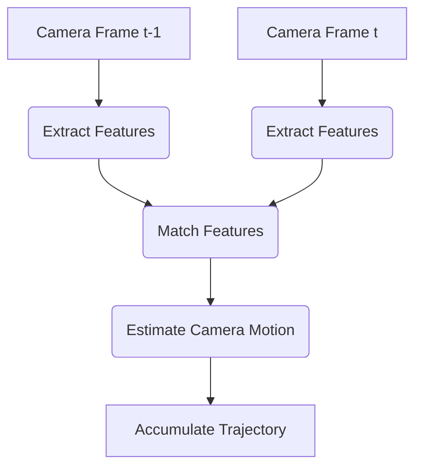

--- 
sidebar_position: 5
title: Visual Odometry and SLAM (Visual Aspects)
---

## 05-Visual Odometry and SLAM (Visual Aspects)

For autonomous robots, knowing "where am I?" and "what does my environment look like?" are fundamental. **Visual Odometry (VO)** and **Simultaneous Localization and Mapping (SLAM)** are powerful computer vision techniques that address these questions, enabling robots to navigate and operate in unknown environments. This chapter focuses on the visual aspects of these algorithms.

### 5.1 Visual Odometry (VO)

**Visual Odometry** is the process of estimating the egomotion (self-motion) of a robot by analyzing a sequence of camera images. It provides an estimate of how far and in what direction the camera (and thus the robot) has moved from one frame to the next.

#### 5.1.1 Principle

1.  **Feature Detection & Tracking:** Identify robust visual features (e.g., ORB, SIFT keypoints) in the current camera frame.
2.  **Feature Matching:** Match these features to corresponding features in the previous camera frame.
3.  **Motion Estimation:** Use the 2D-to-2D correspondences of features (and knowledge of camera intrinsics) to calculate the 3D rigid body transformation (rotation and translation) of the camera between the two frames. This is often done using algorithms like the **Eight-Point Algorithm** (for monocular) or **Essential Matrix** / **Fundamental Matrix** calculation.
4.  **Scaling (Monocular VO):** For monocular cameras, the translation is inherently ambiguous (up to a scale factor). This scale factor must be recovered from other sensors (e.g., IMU, wheel odometry) or known scene geometry. Stereo and RGB-D cameras provide direct depth, eliminating this ambiguity.
5.  **Accumulation:** Concatenate these relative transformations over time to estimate the robot's trajectory.

#### 5.1.2 Types of Visual Odometry

*   **Monocular VO:** Uses a single camera. Inherently scale-ambiguous.
*   **Stereo VO:** Uses two cameras. Can recover scale from known camera baseline.
*   **RGB-D VO:** Uses a depth camera. Provides direct depth for each pixel.

#### 5.1.3 Limitations

*   **Drift:** Like wheel odometry, VO accumulates errors over time, leading to drift in the estimated trajectory.
*   **Feature Poor Environments:** Fails in environments with insufficient visual features (e.g., white wall, dark corridor).
*   **Dynamic Environments:** Moving objects can confuse feature matching.
*   **Illumination Changes:** Drastic lighting changes can make feature matching difficult.

**Diagram 5.1: Visual Odometry Principle**



*Description: A flow diagram showing the steps involved in Visual Odometry, from extracting and matching features in consecutive camera frames to estimating and accumulating robot motion.*

### 5.2 Simultaneous Localization and Mapping (SLAM)

**SLAM** is the computational problem of building a map of an unknown environment while simultaneously keeping track of the robot's location within that map. It is the holy grail of mobile robotics.

#### 5.2.1 Why SLAM is Hard

*   **The Chicken-and-Egg Problem:** You need an accurate map to localize, but you need accurate localization to build a map. Errors in one affect the other.
*   **Accumulated Error:** Both localization and mapping components suffer from accumulated errors.
*   **Data Association:** Deciding if a newly observed feature corresponds to an already mapped feature (loop closure).

#### 5.2.2 Key Components of Visual SLAM

1.  **Frontend (Visual Odometry):**
    *   Processes raw sensor data (images/depth) to estimate robot motion between consecutive frames.
    *   Performs feature detection, matching, and short-term motion estimation.
    *   Produces a local, noisy trajectory estimate.
2.  **Backend (Optimization / Loop Closure):**
    *   Takes the noisy motion estimates from the frontend and refines them globally.
    *   **Loop Closure Detection:** Recognizes when the robot has returned to a previously visited location. This is crucial for correcting accumulated drift.
    *   **Graph Optimization:** Builds a graph of robot poses and observations. When a loop closure is detected, the graph is optimized to distribute the error and correct the entire map and trajectory.
    *   **Bundle Adjustment:** A powerful optimization technique that simultaneously refines 3D positions of features and camera poses to minimize reprojection error.
3.  **Mapping:**
    *   Constructs a representation of the environment.
    *   **Sparse Maps:** Collections of distinctive features (e.g., keypoints) used for localization.
    *   **Dense Maps:** Pixel-level 3D reconstructions (e.g., point clouds, mesh models), useful for navigation and interaction.

#### 5.2.3 Types of Visual SLAM

*   **Feature-based SLAM:** Uses sparse, distinctive features (e.g., ORB-SLAM).
*   **Direct SLAM:** Directly uses pixel intensities (or photometric consistency) to estimate motion, avoiding explicit feature extraction (e.g., LSD-SLAM, DSO).
*   **Semi-direct SLAM:** Combines elements of both.

#### 5.2.4 Sensor Modalities for SLAM

While "Visual SLAM" primarily uses cameras, it's often combined with other sensors for robustness:
*   **Visual-Inertial Odometry (VIO) / SLAM:** Fuses camera data with IMU data. IMU provides high-frequency motion updates and helps resolve scale ambiguity in monocular systems.
*   **Visual-LiDAR SLAM:** Combines camera (texture, color) with LiDAR (precise depth, long range) for robust performance in diverse environments.

### 5.3 Applications in Robotics

*   **Autonomous Driving:** Building high-definition maps, localizing vehicles, real-time obstacle avoidance.
*   **Mobile Robots (Warehousing, Service, Exploration):** Navigating unknown indoor/outdoor environments.
*   **Drones (UAVs):** Autonomous flight in GPS-denied environments.
*   **Augmented/Virtual Reality:** Tracking user position in real-world environments.
*   **Robotic Manipulation:** Accurate pose estimation of objects and robot arm for grasping.

Visual Odometry and SLAM are foundational technologies that empower robots to perceive, understand, and navigate the spatial world, driving the future of autonomous systems.

---

### C++ Example: Conceptual Visual Odometry (Feature Tracking)

This C++ example conceptually simulates feature tracking between two frames for Visual Odometry. In a real application, you'd use OpenCV functions like `cv::goodFeaturesToTrack` and `cv::calcOpticalFlowPyrLK`.

```cpp
#include <iostream>
#include <vector>
#include <string>
#include <random> // For random number generation
#include <chrono>
#include <thread>
#include <cmath> // For std::sqrt

// --- Simulated Feature Point ---
struct Point2f {
    float x, y;
};

// --- Simulated Image Frame ---
struct SimulatedFrame {
    std::string name;
    std::vector<Point2f> features; // Keypoints in this frame
};

// --- Simulated Feature Tracker (e.g., Lucas-Kanade Optical Flow) ---
// This function attempts to find the new positions of features from prev_frame in current_frame
SimulatedFrame trackFeatures_sim(const SimulatedFrame& prev_frame, const std::string& current_frame_name, const Point2f& camera_motion_offset) {
    std::cout << "[SimVO] Tracking features from " << prev_frame.name << " to " << current_frame_name << std::endl;
    SimulatedFrame current_frame = {current_frame_name};
    
    // Simulate tracking features with some motion and noise
    std::random_device rd;
    std::mt19937 gen(rd());
    std::normal_distribution<float> noise_dist(0.0f, 0.5f); // 0.5 pixel noise
    
    for (const auto& feature_prev : prev_frame.features) {
        Point2f feature_curr;
        feature_curr.x = feature_prev.x + camera_motion_offset.x + noise_dist(gen);
        feature_curr.y = feature_prev.y + camera_motion_offset.y + noise_dist(gen);
        current_frame.features.push_back(feature_curr);
    }
    std::cout << "[SimVO] Tracked " << current_frame.features.size() << " features." << std::endl;
    return current_frame;
}

// --- Simulated Motion Estimator ---
// Estimates average motion based on feature correspondences
Point2f estimateMotion_sim(const SimulatedFrame& prev_frame, const SimulatedFrame& current_frame) {
    if (prev_frame.features.empty() || current_frame.features.empty() || prev_frame.features.size() != current_frame.features.size()) {
        std::cerr << "[SimVO] Error: Mismatch in feature count for motion estimation." << std::endl;
        return {0.0f, 0.0f};
    }

    float sum_dx = 0.0f;
    float sum_dy = 0.0f;
    for (size_t i = 0; i < prev_frame.features.size(); ++i) {
        sum_dx += (current_frame.features[i].x - prev_frame.features[i].x);
        sum_dy += (current_frame.features[i].y - prev_frame.features[i].y);
    }
    return {sum_dx / prev_frame.features.size(), sum_dy / prev_frame.features.size()};
}

int main() {
    std::cout << "--- Conceptual Visual Odometry Simulation (C++) ---" << std::endl;

    // Initial frame (simulated features)
    SimulatedFrame prev_frame = {"Frame_000"};
    std::random_device rd;
    std::mt19937 gen(rd());
    std::uniform_real_distribution<float> feature_pos_dist(100.0f, 500.0f); // Image coordinates
    for (int i = 0; i < 20; ++i) {
        prev_frame.features.push_back({feature_pos_dist(gen), feature_pos_dist(gen)});
    }
    std::cout << "Initial frame '" << prev_frame.name << "' with " << prev_frame.features.size() << " features." << std::endl;

    // Simulated robot motion for each step
    std::vector<Point2f> true_robot_motion = {
        {5.0f, 0.0f}, // Move right
        {4.0f, 1.0f}, // Move slightly up-right
        {3.0f, -0.5f}, // Move slightly down-right
        {0.0f, 5.0f}  // Move up
    };

    Point2f estimated_robot_position = {0.0f, 0.0f};

    for (size_t i = 0; i < true_robot_motion.size(); ++i) {
        std::string current_frame_name = "Frame_00" + std::to_string(i + 1);
        
        std::cout << "\n--- Processing " << current_frame_name << " ---" << std::endl;

        // Track features to the current frame
        SimulatedFrame current_frame = trackFeatures_sim(prev_frame, current_frame_name, true_robot_motion[i]);

        // Estimate camera motion
        Point2f estimated_motion = estimateMotion_sim(prev_frame, current_frame);

        // Accumulate trajectory
        estimated_robot_position.x += estimated_motion.x;
        estimated_robot_position.y += estimated_motion.y;

        std::cout << "  True Motion (dx, dy): (" << true_robot_motion[i].x << ", " << true_robot_motion[i].y << ")" << std::endl;
        std::cout << "  Estimated Motion (dx, dy): (" << estimated_motion.x << ", " << estimated_motion.y << ")" << std::endl;
        std::cout << "  Estimated Robot Position: (" << estimated_robot_position.x << ", " << estimated_robot_position.y << ")" << std::endl;

        prev_frame = current_frame; // Current frame becomes previous for next iteration
        std::this_thread::sleep_for(std::chrono::milliseconds(500));
    }

    std::cout << "\nConceptual visual odometry demo finished." << std::endl;
    return 0;
}
```

---

### Python Example: Conceptual SLAM Loop Closure

This Python example conceptually illustrates the idea of loop closure in SLAM, where returning to a previously visited place helps correct accumulated errors.

```python
import numpy as np
import math
import random

def conceptual_slam_loop_closure():
    print("--- Conceptual SLAM Loop Closure Demonstration ---")

    # Simulate robot's noisy odometry path
    path_len = 10
    noisy_path = [(0.0, 0.0)]
    current_x, current_y = 0.0, 0.0
    for i in range(path_len):
        # Simulate moving forward with some noise
        current_x += 1.0 + random.uniform(-0.1, 0.1)
        current_y += random.uniform(-0.05, 0.05)
        noisy_path.append((current_x, current_y))

    # Simulate returning to start, but odometry is still noisy
    # Target to return to near (0,0)
    current_x += -1.0 * path_len + random.uniform(-0.5, 0.5)
    current_y += -1.0 + random.uniform(-0.5, 0.5)
    noisy_path.append((current_x, current_y)) # End of noisy path

    print("\n1. Robot's Estimated Trajectory (Noisy Odometry):")
    for i, (x, y) in enumerate(noisy_path):
        print(f"  Step {i}: ({x:.2f}, {y:.2f})")
    
    # Calculate accumulated error before loop closure
    initial_x, initial_y = noisy_path[0]
    final_x, final_y = noisy_path[-1]
    accumulated_error = math.sqrt((final_x - initial_x)**2 + (final_y - initial_y)**2)
    print(f"\n   -> Accumulated Odometry Error (from start to end): {accumulated_error:.2f} units.")
    
    # Simulate Loop Closure Detection
    # The robot 'recognizes' it's back at the starting point
    # This involves feature matching against old map parts, or visual place recognition
    loop_closure_detected = True
    loop_closure_correction_x = initial_x - final_x # How much to shift to correct
    loop_closure_correction_y = initial_y - final_y
    
    print("\n2. Loop Closure Detected!")
    print(f"   Robot recognizes it's returned to the starting location (estimated final position: ({final_x:.2f}, {final_y:.2f}))")
    print(f"   Required Correction: (dx={loop_closure_correction_x:.2f}, dy={loop_closure_correction_y:.2f})")

    # Apply Correction (Global Optimization / Graph Optimization)
    # In a real SLAM system, this correction is not just applied to the last point,
    # but distributed throughout the entire trajectory and map using graph optimization (e.g., Ceres, g2o)
    
    corrected_path = []
    for x, y in noisy_path:
        corrected_path.append((x + loop_closure_correction_x, y + loop_closure_correction_y))
    
    print("\n3. Trajectory Corrected (Conceptually via global optimization):")
    for i, (x, y) in enumerate(corrected_path):
        print(f"  Step {i}: ({x:.2f}, {y:.2f})")
    
    final_x_corrected, final_y_corrected = corrected_path[-1]
    corrected_error = math.sqrt((final_x_corrected - initial_x)**2 + (final_y_corrected - initial_y)**2)
    print(f"\n   -> Error after loop closure: {corrected_error:.2f} units.")

    print("\nConceptual SLAM loop closure demo finished.")

if __name__ == "__main__":
    conceptual_slam_loop_closure()
```

---

### Arduino Example: Basic Visual Odometry (Conceptual Encoder to Image)

This Arduino sketch demonstrates a very simplified concept of how visual odometry might aid or confirm wheel odometry. It doesn't process images but uses a conceptual "visual displacement" input.

```arduino
// Basic Visual Odometry (Conceptual Aid to Wheel Odometry)
// This sketch simulates a simplified mobile robot using wheel odometry (encoders)
// and a conceptual "visual displacement" from a camera system to get a more robust estimate.

// Robot parameters
const float WHEEL_RADIUS = 0.03; // meters
const float WHEEL_BASE = 0.15;   // meters

// Wheel encoder simulation
long leftEncoderTicks = 0;
long rightEncoderTicks = 0;
const int TICKS_PER_REVOLUTION = 1000; // Example encoder resolution

// Odometry state
float odo_x = 0.0;
float odo_y = 0.0;
float odo_theta = 0.0; // Radians

// Visual Odometry (VO) aid
float vo_dx = 0.0; // Conceptual displacement from visual features
float vo_dy = 0.0; // Conceptual displacement from visual features
float vo_dtheta = 0.0; // Conceptual rotation from visual features

// Fused state
float fused_x = 0.0;
float fused_y = 0.0;
float fused_theta = 0.0;

// Fusion weights (simple average for this conceptual demo)
const float ODO_WEIGHT = 0.7; // Trust odometry more for short term
const float VO_WEIGHT = 0.3;  // Trust visual odometry less (more noisy?)

unsigned long lastUpdateTime = 0;
const long updateInterval = 100; // Update every 100ms

void setup() {
  Serial.begin(9600);
  Serial.println("Arduino Conceptual Visual Odometry Aid Demo Ready.");
  Serial.println("Time(s), Odo_X, Odo_Y, Odo_Theta(deg), Fused_X, Fused_Y, Fused_Theta(deg)");
}

void loop() {
  unsigned long currentTime = millis();
  if (currentTime - lastUpdateTime >= updateInterval) {
    float dt = (float)(currentTime - lastUpdateTime) / 1000.0;

    // --- 1. Simulate Wheel Odometry ---
    // Simulate robot moving forward and slightly turning
    long simulated_left_delta_ticks = (long)(50 * (1 + sin(millis() / 5000.0) * 0.1));
    long simulated_right_delta_ticks = (long)(50 * (1 - sin(millis() / 5000.0) * 0.1));

    leftEncoderTicks += simulated_left_delta_ticks;
    rightEncoderTicks += simulated_right_delta_ticks;

    // Calculate linear distances
    float delta_left_dist = (float)simulated_left_delta_ticks / TICKS_PER_REVOLUTION * (2 * PI * WHEEL_RADIUS);
    float delta_right_dist = (float)simulated_right_delta_ticks / TICKS_PER_REVOLUTION * (2 * PI * WHEEL_RADIUS);

    float delta_s_odo = (delta_right_dist + delta_left_dist) / 2.0;
    float delta_theta_odo = (delta_right_dist - delta_left_dist) / WHEEL_BASE;

    odo_x += delta_s_odo * cos(odo_theta + delta_theta_odo / 2.0);
    odo_y += delta_s_odo * sin(odo_theta + delta_theta_odo / 2.0);
    odo_theta += delta_theta_odo;

    // --- 2. Simulate Visual Odometry ---
    // VO often gives relative displacement (dx, dy, dtheta)
    // Add noise to true motion, and maybe some drift compared to odometry
    float true_robot_speed = 0.1; // m/s
    float true_robot_omega = 0.05; // rad/s (slight turn) 
    
    vo_dx = (true_robot_speed * dt * cos(fused_theta)) + random(-2, 2) / 1000.0; // X displacement with noise
    vo_dy = (true_robot_speed * dt * sin(fused_theta)) + random(-2, 2) / 1000.0; // Y displacement with noise
    vo_dtheta = (true_robot_omega * dt) + random(-5, 5) / 1000.0; // Rotation with noise

    // --- 3. Simple Fusion (e.g., weighted average) ---
    // This is highly simplified; a Kalman filter would be used in reality.
    float fused_delta_x = ODO_WEIGHT * (delta_s_odo * cos(odo_theta + delta_theta_odo / 2.0)) + VO_WEIGHT * vo_dx;
    float fused_delta_y = ODO_WEIGHT * (delta_s_odo * sin(odo_theta + delta_theta_odo / 2.0)) + VO_WEIGHT * vo_dy;
    float fused_delta_theta = ODO_WEIGHT * delta_theta_odo + VO_WEIGHT * vo_dtheta;

    fused_x += fused_delta_x;
    fused_y += fused_delta_y;
    fused_theta += fused_delta_theta;
    
    // Normalize angle
    fused_theta = fmod(fused_theta, 2 * PI);
    if (fused_theta > PI) fused_theta -= 2 * PI;
    if (fused_theta < -PI) fused_theta += 2 * PI;

    Serial.print((float)currentTime / 1000.0); Serial.print(", ");
    Serial.print(odo_x); Serial.print(", ");
    Serial.print(odo_y); Serial.print(", ");
    Serial.print(odo_theta * 180.0 / PI); Serial.print(", ");
    Serial.print(fused_x); Serial.print(", ");
    Serial.print(fused_y); Serial.print(", ");
    Serial.println(fused_theta * 180.0 / PI);

    lastUpdateTime = currentTime;
  }
}
```

---

### Equations in LaTeX: Reprojection Error

In visual SLAM and bundle adjustment, the **reprojection error** is a key quantity to minimize. It measures the difference between a 3D feature point projected onto an image and the actual observed 2D location of that feature in the image.

```latex
E_{reproj} = sum_{i} | p_{ij} - pi(T_{i} cdot P_{j}) |^2
```

Where:
*   `p_{ij}` is the observed 2D position of feature `j` in image `i`.
*   `P_j` is the 3D position of feature `j`.
*   `T_i` is the camera pose (rotation and translation) for image `i`.
*   `pi(cdot)` is the projection function (mapping 3D to 2D using camera intrinsics).
*   The sum is over all observed features in all images.

---

### MCQs with Answers

1.  What is the primary goal of **Visual Odometry (VO)**?
    a) To build a global map of the environment without tracking robot motion.
    b) To estimate the robot's egomotion (self-motion) by analyzing a sequence of camera images.
    c) To perform precise object detection and recognition.
    d) To generate control commands for robot manipulators.
    *Answer: b) To estimate the robot's egomotion (self-motion) by analyzing a sequence of camera images.*

2.  What is the "chicken-and-egg problem" in SLAM?
    a) The need to distinguish between chickens and eggs in an image.
    b) The challenge of building an accurate map and localizing within it simultaneously, as errors in one affect the other.
    c) The difficulty of tracking features that move.
    d) The problem of calibrating multiple cameras without a known reference.
    *Answer: b) The challenge of building an accurate map and localizing within it simultaneously, as errors in one affect the other.*

3.  What is the function of **loop closure detection** in SLAM?
    a) To close open loops in electrical circuits.
    b) To optimize the robot's path to be a perfect circle.
    c) To recognize when the robot has returned to a previously visited location, correcting accumulated drift.
    d) To quickly detect new features in the environment.
    *Answer: c) To recognize when the robot has returned to a previously visited location, correcting accumulated drift.*

---

### Practice Tasks

1.  **VO vs. Wheel Odometry:** Compare Visual Odometry with wheel odometry for a mobile robot. Discuss their respective strengths, weaknesses, and common error sources. In what scenarios would you prefer one over the other, or combine them?
2.  **SLAM Backend (Graph Optimization):** Research the concept of "graph optimization" (or "pose graph optimization") in the context of SLAM. Explain how detecting a loop closure can significantly reduce the accumulated error in a robot's estimated trajectory and map.
3.  **Monocular VO Scale Ambiguity:** Explain why monocular visual odometry cannot inherently determine the true scale of its estimated motion. Suggest one practical method a robot could use to resolve this scale ambiguity (e.g., using another sensor or prior knowledge).

---

### Notes for Teachers

*   **Real-world Applications:** Show videos of robots (e.g., autonomous cars, drones, mobile robots) performing VO and SLAM in action.
*   **Intuition for Drift:** Use a simple drawing or analogy to explain how small errors accumulate in odometry (both visual and wheel-based) over time.
*   **SLAM Challenges:** Emphasize the complexity and research challenges within SLAM, particularly the data association and loop closure problems.

### Notes for Students

*   **Features are Key:** Robust feature detection and matching are foundational for visual odometry and SLAM.
*   **Sensor Fusion is Essential:** Pure VO or SLAM often benefits greatly from fusing camera data with other sensors (IMU, LiDAR).
*   **Mapping for Localization:** Understanding the different map representations (sparse vs. dense, feature-based vs. occupancy grid) and their role in localization.
*   **Computational Intensity:** Be aware that VO and SLAM are computationally intensive and often require powerful processing units (GPUs, dedicated processors) for real-time performance.
