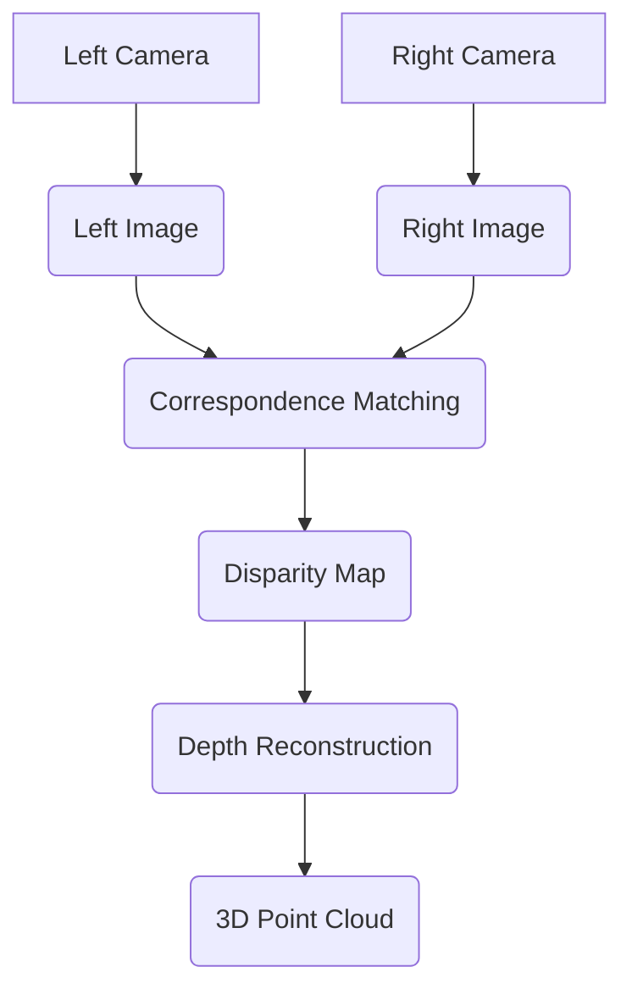

--- 
sidebar_position: 6
title: Depth Sensing with Stereo and RGB-D Cameras
---

## 06-Depth Sensing with Stereo and RGB-D Cameras

While 2D cameras provide rich visual information about color and texture, robots often need to understand the 3D geometry of their environment—how far away objects are, their shapes, and their relative positions. **Depth sensing** technologies, particularly **Stereo Cameras** and **RGB-D Cameras**, provide this crucial 3D information, enabling tasks like obstacle avoidance, grasping, and 3D mapping. This chapter explores the principles and applications of these depth-sensing modalities.

### 6.1 The Need for Depth Information

Depth information is vital for robotics because:
*   **Obstacle Avoidance:** Knowing distance to objects is critical for safe navigation.
*   **Manipulation:** Accurate 3D pose of objects is needed for grasping.
*   **3D Mapping:** Building detailed models of the environment for navigation and planning.
*   **Human-Robot Interaction:** Understanding the distance and relative position of humans for safe collaboration.
*   **Path Planning:** Differentiating traversable areas from obstacles.

### 6.2 Stereo Cameras

**Stereo cameras** mimic human binocular vision by using two (or more) standard 2D cameras placed a known distance apart (the **baseline**). By finding corresponding points in the left and right images, the depth of these points can be calculated using **triangulation**.

#### 6.2.1 Principle of Stereopsis (Triangulation)

1.  **Rectification:** Images from both cameras are "rectified" to align their scan lines horizontally, simplifying the correspondence search.
2.  **Correspondence Matching:** For each pixel in one image, its corresponding pixel in the other image is found. This is the most computationally intensive step. Algorithms often search along horizontal epipolar lines.
3.  **Disparity Calculation:** The difference in the horizontal position of corresponding pixels in the rectified images is called **disparity**. Pixels from objects closer to the camera will have a larger disparity than those farther away.
4.  **Depth Reconstruction:** Depth (`Z`) is inversely proportional to disparity (`d`), and directly proportional to the camera's focal length (`f`) and baseline (`B`). 

```latex
Z = frac{f cdot B}{d}
```

#### 6.2.2 Advantages

*   Can work outdoors in various lighting conditions (passive stereo, relies on ambient light).
*   Can generate high-resolution color images in addition to depth.
*   Relatively inexpensive compared to some active depth sensors.

#### 6.2.3 Disadvantages

*   **Requires Texture:** Struggles with textureless surfaces (e.g., plain white wall) where correspondence matching is difficult.
*   **Computational Cost:** Correspondence matching is computationally intensive, requiring dedicated hardware (e.g., FPGAs, GPUs) for real-time performance.
*   **Baseline Limits:** Small baseline limits long-range accuracy; large baseline limits short-range accuracy and can cause occlusion.
*   **Ambiguity:** Can produce erroneous depth values (artifacts) due to repetitive patterns or occlusions.

**Diagram 6.1: Stereo Vision Principle**



*Description: A flow diagram showing the steps involved in stereo vision, from two camera images, through correspondence matching and disparity calculation, to 3D depth reconstruction.*

### 6.3 RGB-D Cameras (Active Depth Sensing)

**RGB-D cameras** (Color + Depth) provide both a standard 2D color image and a per-pixel depth map. They typically use **active sensing** techniques, projecting their own light source into the scene.

#### 6.3.1 Principles

*   **Structured Light:**
    *   **Principle:** Projects a known pattern (e.g., infrared dots, lines, or grids) onto the scene. A separate IR camera captures the distorted pattern. The distortion of the pattern indicates the 3D shape of the objects.
    *   **Examples:** Original Microsoft Kinect, Intel RealSense D400 series.
    *   **Advantages:** High depth accuracy at close ranges, works well in low-texture environments.
    *   **Disadvantages:** Sensitive to ambient IR light (can struggle outdoors), multiple structured light sensors can interfere, limited range.
*   **Time-of-Flight (ToF):**
    *   **Principle:** Emits modulated light (e.g., IR) and measures the phase shift or actual time taken for the light to return to the sensor for each pixel. Similar to LiDAR, but for a whole image.
    *   **Examples:** Newer Microsoft Kinect Azure, some Intel RealSense L500 series, iPhone Face ID (front ToF).
    *   **Advantages:** Works well in low light, less sensitive to texture, can have longer range than structured light.
    *   **Disadvantages:** Susceptible to ambient light (especially sunlight), lower spatial resolution than structured light, can be affected by multi-path interference.

#### 6.3.2 Advantages of RGB-D

*   **Direct Depth Measurement:** No complex correspondence matching needed (depth is usually pre-computed by the sensor hardware/firmware).
*   **Works in Low Texture:** Active projection allows depth estimation even on featureless surfaces.
*   **Simpler Software:** Software development is simpler as it receives processed depth information.

#### 6.3.3 Disadvantages of RGB-D

*   **Interference:** Active sensors can interfere with each other if not synchronized.
*   **Ambient Light Sensitivity:** Often struggle in strong sunlight (especially IR-based structured light/ToF).
*   **Range Limits:** Typically have a specific optimal depth range.
*   **Cost:** Generally more expensive than basic stereo cameras.

### 6.4 Point Clouds

Both stereo and RGB-D cameras can generate **3D point clouds**. A point cloud is a collection of 3D data points (`x, y, z`), where each point represents a single measurement from the sensor. Point clouds are crucial for 3D mapping, object recognition, and collision checking.

### 6.5 Applications in Robotics

*   **Obstacle Avoidance & Navigation:** Detecting, locating, and sizing obstacles in 3D.
*   **Object Picking & Grasping:** Determining the 3D pose of objects for robotic manipulators.
*   **3D Mapping & Scene Reconstruction:** Building accurate 3D models of environments (e.g., for SLAM).
*   **Human-Robot Interaction:** Tracking human pose, gesture recognition, ensuring safe collaborative spaces.
*   **Volume Measurement:** Calculating the volume of objects or materials.

Depth sensing technologies are transforming the capabilities of robots, enabling them to understand and interact with the complex three-dimensional world in ways that were previously impossible.

---

### C++ Example: Conceptual Stereo Depth Calculation

This C++ example conceptually simulates calculating depth from disparity values obtained from a stereo camera system.

```cpp
#include <iostream>
#include <vector>
#include <string>
#include <random> // For random number generation
#include <iomanip> // For std::fixed, std::setprecision

// --- Stereo Camera Parameters ---
const float FOCAL_LENGTH_PX = 400.0f; // Camera focal length in pixels
const float BASELINE_M = 0.10f;     // Distance between left and right cameras in meters (10 cm)

// Simulate a disparity map (values in pixels)
// A smaller 2D array representing disparity values
const int DISPARITY_WIDTH = 10;
const int DISPARITY_HEIGHT = 5;

// Function to calculate depth from disparity
float calculateDepthFromDisparity(float disparity_px) {
    if (disparity_px <= 0.0f) { // Disparity must be positive
        return std::numeric_limits<float>::infinity(); // Cannot calculate or at infinite depth
    }
    // Z = (f * B) / d
    return (FOCAL_LENGTH_PX * BASELINE_M) / disparity_px;
}

// Function to simulate a disparity map with varying depths
std::vector<std::vector<float>> simulateDisparityMap() {
    std::vector<std::vector<float>> disparity_map(DISPARITY_HEIGHT, std::vector<float>(DISPARITY_WIDTH));
    std::random_device rd;
    std::mt19937 gen(rd());
    std::uniform_real_distribution<float> dist_noise(0.0f, 0.5f); // Small noise for disparity

    // Simulate different objects/depths
    // Background far away (small disparity)
    for(int r = 0; r < DISPARITY_HEIGHT; ++r) {
        for(int c = 0; c < DISPARITY_WIDTH; ++c) {
            disparity_map[r][c] = 5.0f + dist_noise(gen); // 5 pixels disparity
        }
    }
    // Closer object in middle (larger disparity)
    disparity_map[2][4] = 20.0f + dist_noise(gen);
    disparity_map[2][5] = 18.0f + dist_noise(gen);
    disparity_map[3][4] = 19.0f + dist_noise(gen);
    disparity_map[3][5] = 19.5f + dist_noise(gen);
    
    return disparity_map;
}

void printDepthMap(const std::vector<std::vector<float>>& depth_map, const std::string& title) {
    std::cout << "\n--- " << title << " ---" << std::endl;
    for (const auto& row : depth_map) {
        for (float depth_val : row) {
            if (depth_val > 100.0f) std::cout << " Inf"; // Far away
            else if (depth_val > 5.0f) std::cout << std::fixed << std::setprecision(1) << depth_val << "m ";
            else if (depth_val > 0.0f) std::cout << std::fixed << std::setprecision(1) << depth_val << "m ";
            else std::cout << " Err"; // Error or very close
        }
        std::cout << std::endl;
    }
}


int main() {
    std::cout << "--- Conceptual Stereo Depth Sensing Demo (C++) ---" << std::endl;
    std::cout << std::fixed << std::setprecision(2);
    std::cout << "Focal Length: " << FOCAL_LENGTH_PX << " px, Baseline: " << BASELINE_M << " m" << std::endl;

    std::vector<std::vector<float>> simulated_disparity = simulateDisparityMap();
    std::cout << "\nSimulated Disparity Map (pixels):" << std::endl;
    for (const auto& row : simulated_disparity) {
        for (float disp_val : row) {
            std::cout << std::setw(5) << disp_val;
        }
        std::cout << std::endl;
    }


    std::vector<std::vector<float>> depth_map(DISPARITY_HEIGHT, std::vector<float>(DISPARITY_WIDTH));

    for (int r = 0; r < DISPARITY_HEIGHT; ++r) {
        for (int c = 0; c < DISPARITY_WIDTH; ++c) {
            depth_map[r][c] = calculateDepthFromDisparity(simulated_disparity[r][c]);
        }
    }

    printDepthMap(depth_map, "Calculated Depth Map (meters)");

    std::cout << "\nConceptual stereo depth sensing demo finished." << std::endl;
    return 0;
}
```

---

### Python Example: RGB-D Point Cloud Visualization (Conceptual)

This Python example conceptually outlines how an RGB-D camera generates a 3D point cloud and shows how it might be visualized. It uses `matplotlib` for 3D plotting.

```python
import numpy as np
# import cv2 # Uncomment if using actual OpenCV for image processing
import matplotlib.pyplot as plt
from mpl_toolkits.mplot3d import Axes3D # For 3D plotting

def conceptual_rgbd_point_cloud():
    print("--- Conceptual RGB-D Point Cloud Visualization ---")

    # Step 1: Simulate RGB-D Camera Output
    # Imagine a small 3x3 pixel region with RGB and Depth values
    # Depth is in meters
    simulated_rgb = np.array([
        [[255, 0, 0], [0, 255, 0], [0, 0, 255]], # Red, Green, Blue
        [[255, 255, 0], [0, 255, 255], [255, 0, 255]], # Yellow, Cyan, Magenta
        [[128, 128, 128], [64, 64, 64], [192, 192, 192]] # Grays
    ], dtype=np.uint8)
    
    # Simulate a depth map (values in meters)
    # A flat wall far away, with a closer object in the middle
    simulated_depth = np.array([
        [3.0, 3.1, 3.0],
        [3.2, 1.5, 3.1], # 1.5m is the closer object
        [3.0, 3.0, 3.2]
    ], dtype=np.float32)

    img_height, img_width = simulated_rgb.shape[0], simulated_rgb.shape[1]

    print("1. Simulated RGB and Depth frames acquired.")
    print("\n  Simulated RGB (First Row):", simulated_rgb[0,0], simulated_rgb[0,1], simulated_rgb[0,2])
    print("  Simulated Depth Map (meters):\n", simulated_depth)

    # Step 2: Camera Intrinsics (Conceptual)
    # Focal length (fx, fy), principal point (cx, cy)
    fx, fy = 300.0, 300.0 # Pixels
    cx, cy = img_width / 2.0, img_height / 2.0 # Principal point (center of image) 
    
    print(f"\n2. Camera Intrinsics (focal_x={fx}, focal_y={fy}, center_x={cx}, center_y={cy}) defined.")

    # Step 3: Convert to 3D Point Cloud
    # For each pixel (u, v) with depth Z:
    # X = (u - cx) * Z / fx
    # Y = (v - cy) * Z / fy
    # Z = Depth
    
    point_cloud_points = []
    point_cloud_colors = []

    for v in range(img_height):
        for u in range(img_width):
            Z = simulated_depth[v, u]
            if Z == 0: # Invalid depth measurement
                continue
            
            X = (u - cx) * Z / fx
            Y = (v - cy) * Z / fy
            
            point_cloud_points.append([X, Y, Z])
            point_cloud_colors.append(simulated_rgb[v, u] / 255.0) # Normalize RGB to 0-1

    point_cloud_points = np.array(point_cloud_points)
    point_cloud_colors = np.array(point_cloud_colors)

    print("\n3. Converted to 3D Point Cloud.")
    print(f"   Generated {len(point_cloud_points)} points.")

    # Step 4: Visualize Point Cloud
    fig = plt.figure(figsize=(8, 8))
    ax = fig.add_subplot(111, projection='3d')
    
    ax.scatter(point_cloud_points[:, 0], point_cloud_points[:, 1], point_cloud_points[:, 2], 
               c=point_cloud_colors, marker='o', s=50) # s is size of points

    ax.set_xlabel('X (meters)')
    ax.set_ylabel('Y (meters)')
    ax.set_zlabel('Z (meters, depth)')
    ax.set_title('Conceptual RGB-D Point Cloud')
    ax.set_xlim([-0.5, 0.5])
    ax.set_ylim([-0.5, 0.5])
    ax.set_zlim([0, 5])
    
    # Invert Y-axis for typical camera coordinate system (y-down) if preferred
    ax.view_init(elev=20, azim=45) # Adjust viewing angle

    plt.show()
    print("\nConceptual RGB-D point cloud visualization finished. Close plot to continue.")

if __name__ == "__main__":
    conceptual_rgbd_point_cloud()
```

---

### Arduino Example: Time-of-Flight (ToF) Sensor (Conceptual)

This Arduino sketch demonstrates conceptual interaction with a Time-of-Flight (ToF) distance sensor (e.g., VL53L0X, VL53L1X). It provides the basic structure for reading distance and reacting.

```arduino
// Conceptual Time-of-Flight (ToF) Sensor Example
// This sketch simulates reading distance from a ToF sensor
// and reacting to nearby objects.
// Actual implementation would use a specific library (e.g., Adafruit_VL53L0X)
// and I2C communication.

// --- ToF Sensor Library (Conceptual) ---
// In a real project, you would include a library like:
// #include <Adafruit_VL53L0X.h> 
// Adafruit_VL53L0X lox = Adafruit_VL53L0X();

// Simulated ToF sensor distance
float simulatedDistanceCm = 0.0;
const int obstacleThresholdCm = 20; // cm

// LED for visual feedback
const int ledPin = 13; // Onboard LED

// Function to simulate reading from a ToF sensor
float readToFSensor_sim() {
  // Simulate a distance reading with some noise
  static float trueDistance = 50.0; // Starts at 50cm
  
  // Simulate object moving closer/farther occasionally
  if (random(0, 100) < 5) { // 5% chance of changing true distance
    trueDistance = random(10, 100);
  }
  
  float noise = random(-20, 20) / 10.0; // Add +/- 2cm noise
  
  return constrain(trueDistance + noise, 0, 200); // Clamp distance
}

void setup() {
  Serial.begin(9600);
  pinMode(ledPin, OUTPUT);
  randomSeed(analogRead(A0)); // Seed random generator

  Serial.println("Arduino Conceptual ToF Sensor Demo Ready.");
  
  // In real code, you would initialize the ToF sensor here:
  // if (!lox.begin()) {
  //   Serial.println(F("Failed to boot VL53L0X"));
  //   while(1);
  // }
  // Serial.println(F("VL53L0X API Simple Ranging example\n\n"));
}

void loop() {
  simulatedDistanceCm = readToFSensor_sim();

  Serial.print("ToF Distance: ");
  Serial.print(simulatedDistanceCm);
  Serial.println(" cm");

  if (simulatedDistanceCm < obstacleThresholdCm) {
    Serial.println("!!! OBSTACLE AHEAD !!!");
    digitalWrite(ledPin, HIGH); // Turn on LED
  } else {
    digitalWrite(ledPin, LOW);  // Turn off LED
  }
  
  delay(500); // Read every 0.5 seconds
}
```

---

### Equations in LaTeX: Pinhole Camera Model (Projection from 3D to 2D)

To project a 3D point `P_c = (X_c, Y_c, Z_c)` (in camera coordinates) onto a 2D image plane at pixel coordinates `(u, v)`, the pinhole camera model is used:

```latex
u = f_{x} frac{X_{c}{Z_{c} + c_{x}
```
```latex
v = f_{y} frac{Y_{c}{Z_{c} + c_{y}
```

Where:
*   `f_x, f_y` are the focal lengths in pixels (often `f_x = f_y = f`).
*   `c_x, c_y` are the coordinates of the principal point (optical center) in pixels.
*   These parameters are part of the **camera intrinsic matrix**.

---

### MCQs with Answers

1.  What is the primary method used by **stereo cameras** to calculate depth information?
    a) By emitting modulated light and measuring phase shift.
    b) By measuring the time it takes for sound waves to return.
    c) By comparing corresponding points in two images and using triangulation based on disparity.
    d) By detecting changes in an electrical field.
    *Answer: c) By comparing corresponding points in two images and using triangulation based on disparity.*

2.  Which active depth sensing principle relies on projecting a known infrared pattern onto a scene and capturing its distortion to determine 3D shape?
    a) Time-of-Flight (ToF)
    b) Stereopsis
    c) Structured Light
    d) Monocular Vision
    *Answer: c) Structured Light*

3.  What is a major disadvantage of **stereo cameras** when operating in certain environments?
    a) They cannot work in direct sunlight.
    b) They struggle with textureless surfaces.
    c) They are generally less expensive than other depth sensors.
    d) They require very low computational power.
    *Answer: b) They struggle with textureless surfaces.*

---

### Practice Tasks

1.  **Depth Sensor Selection:** You need to equip a robot for two different tasks:
    *   **Task A:** Precisely grasping small, untextured objects on a workbench (within 50cm range).
    *   **Task B:** Navigating a large, outdoor construction site, avoiding large obstacles (up to 10m range).
    For each task, recommend whether a Stereo Camera, Structured Light RGB-D, or ToF RGB-D camera would be most suitable, and justify your choice based on their characteristics.
2.  **Point Cloud Usage:** Describe two distinct ways a robot could use a 3D point cloud (generated by a depth sensor) for navigation or manipulation tasks.
3.  **Depth Map Resolution:** Explain the concept of depth resolution (or range resolution) for depth sensors. Why might a structured light sensor have very high resolution at close range but degrade significantly at longer ranges?

---

### Notes for Teachers

*   **Visual Demos:** Show videos of robots using different depth sensors and their resulting depth maps/point clouds. Compare the quality.
*   **Active vs. Passive:** Clearly distinguish between active (projects own light) and passive (relies on ambient light) depth sensing.
*   **Computational Cost:** Emphasize that processing 3D data (disparity maps, point clouds) is computationally intensive and often requires specialized hardware.

### Notes for Students

*   **Depth is Crucial:** Realize that for truly intelligent robots, 3D understanding of the world is often more important than just 2D color information.
*   **Trade-offs Exist:** There is no single "best" depth sensor; each has its strengths, weaknesses, and optimal use cases.
*   **Accuracy vs. Robustness:** Sometimes a less accurate but more robust sensor (e.g., Stereo outdoors) is preferred over a highly accurate but fragile one (e.g., Structured Light outdoors).
*   **Point Clouds are Raw:** Remember that point clouds are raw data. They often need filtering, segmentation, and processing to extract meaningful information.
