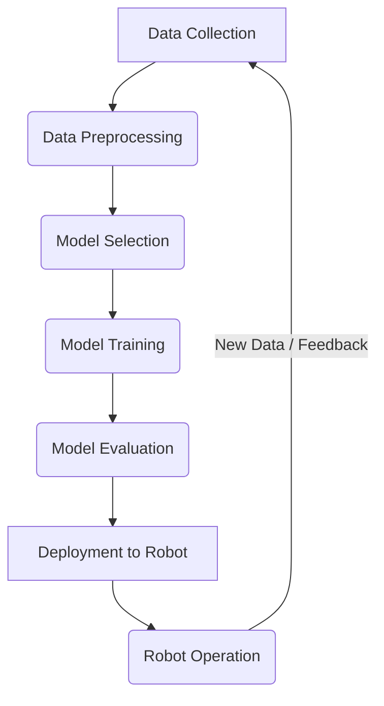

# Part 8: AI in Robotics

## 01-Introduction to AI and Machine Learning in Robotics

Artificial Intelligence (AI) and Machine Learning (ML) are rapidly transforming the field of robotics, moving robots beyond pre-programmed automation towards intelligent, adaptive, and autonomous systems. By enabling robots to learn from data, perceive complex environments, make sophisticated decisions, and interact more naturally with humans, AI is pushing the boundaries of what robots can achieve. This chapter introduces the fundamental concepts of AI and ML and their profound impact on modern robotics.

### 1.1 What is Artificial Intelligence (AI)?

**Artificial Intelligence** refers to the simulation of human intelligence in machines that are programmed to think like humans and mimic their actions. The term can also be applied to any machine that exhibits traits associated with a human mind, such as learning, problem-solving, understanding language, and perception.

*   **Strong AI (Artificial General Intelligence - AGI):** Hypothetical AI that can successfully perform any intellectual task that a human being can.
*   **Weak AI (Artificial Narrow Intelligence - ANI):** AI systems designed and trained for a particular task (e.g., Siri, self-driving cars, chess programs). Most current AI falls into this category.

### 1.2 What is Machine Learning (ML)?

**Machine Learning** is a subset of AI that focuses on building systems that can learn from data without being explicitly programmed. Instead of following rigid, pre-defined rules, ML algorithms identify patterns in data and use these patterns to make predictions or decisions.

*   **Learning from Data:** The core idea is to train a model on a dataset, and this model then generalizes to new, unseen data.
*   **Performance Improvement:** The model's performance typically improves with more data and better algorithms.

### 1.3 Why AI and ML are Essential for Robotics

Traditional robotics often relies on precise models and explicit programming, which can be brittle in the face of real-world complexity. AI and ML address these limitations by enabling robots to:

*   **Perceive Unstructured Environments:** Recognize objects, people, and scenes from noisy sensor data in dynamic, unpredictable settings (Computer Vision, Natural Language Processing).
*   **Adapt to Changes:** Learn from experience and adapt their behavior to new situations, unexpected events, or changes in their own hardware (Reinforcement Learning).
*   **Make Complex Decisions:** Reason about goals, plan actions, and make decisions under uncertainty, far beyond what simple rules can achieve.
*   **Interact Naturally:** Understand human commands (speech, gestures), intent, and even emotions (Human-Robot Interaction).
*   **Handle Data Deluge:** Process vast amounts of sensor data efficiently to extract meaningful insights.

### 1.4 The AI/ML Workflow in Robotics

A typical workflow for integrating AI/ML into a robot includes:

1.  **Data Collection:** Gathering relevant sensor data (images, LiDAR, joint angles, force readings) and corresponding labels or rewards.
2.  **Data Preprocessing:** Cleaning, normalizing, and transforming raw data into a suitable format for ML algorithms.
3.  **Model Selection:** Choosing an appropriate ML algorithm (e.g., neural network, support vector machine, decision tree, Q-learning).
4.  **Training:** Feeding the preprocessed data to the algorithm to "learn" patterns and adjust the model's parameters.
5.  **Evaluation:** Assessing the trained model's performance on unseen data.
6.  **Deployment:** Integrating the trained model onto the robot's hardware and software stack.
7.  **Testing & Iteration:** Continuously testing, refining, and retraining the model in real-world scenarios.

**Diagram 1.1: AI/ML Workflow for Robotics**



*Description: A cyclical flow diagram illustrating the iterative process of developing and deploying AI/ML models in robotics, from data collection to robot operation and back.*

### 1.5 Subfields of ML and Their Robotic Applications

*   **Supervised Learning:** Learning from labeled examples.
    *   **Applications:** Object detection/recognition, speech recognition (for voice commands), predictive maintenance (identifying component failures).
*   **Unsupervised Learning:** Finding patterns in unlabeled data.
    *   **Applications:** Anomaly detection, data compression, discovering optimal grasping points for unknown objects.
*   **Reinforcement Learning (RL):** Learning optimal actions through trial and error, based on rewards and penalties.
    *   **Applications:** Robot locomotion (learning to walk), complex manipulation tasks, autonomous navigation strategies.
*   **Deep Learning:** Neural networks with many layers, particularly powerful for learning complex features from raw data.
    *   **Applications:** Advanced computer vision (SLAM, object detection, semantic segmentation), natural language understanding, complex control policies.

AI and ML are transforming robots from tools that execute pre-defined tasks into intelligent agents capable of learning, adapting, and interacting autonomously in the dynamic and complex real world. The following chapters will delve into each of these ML paradigms and their specific applications in robotics.

---

### C++ Example: Simple Linear Regression (Conceptual Supervised Learning)

This C++ example provides a conceptual illustration of simple linear regression, a basic supervised learning algorithm, for estimating a robot's battery discharge rate based on usage time.

```cpp
#include <iostream>
#include <vector>
#include <numeric> // For std::accumulate
#include <iomanip> // For std::fixed, std::setprecision

// Function to perform simple linear regression
// y = mx + b
struct LinearRegressionModel {
    float m; // Slope
    float b; // Y-intercept
};

LinearRegressionModel trainLinearRegression(const std::vector<float>& x_data, const std::vector<float>& y_data) {
    if (x_data.size() != y_data.size() || x_data.empty()) {
        std::cerr << "Error: Data size mismatch or empty data." << std::endl;
        return {0.0f, 0.0f};
    }

    float n = static_cast<float>(x_data.size());

    float sum_x = std::accumulate(x_data.begin(), x_data.end(), 0.0f);
    float sum_y = std::accumulate(y_data.begin(), y_data.end(), 0.0f);
    float sum_xy = 0.0f;
    float sum_x_sq = 0.0f;

    for (size_t i = 0; i < n; ++i) {
        sum_xy += x_data[i] * y_data[i];
        sum_x_sq += x_data[i] * x_data[i];
    }

    float numerator_m = (n * sum_xy) - (sum_x * sum_y);
    float denominator_m = (n * sum_x_sq) - (sum_x * sum_x);

    LinearRegressionModel model;
    if (denominator_m == 0) {
        std::cerr << "Error: Denominator for slope is zero. Cannot compute slope." << std::endl;
        model.m = 0.0f; // Prevent division by zero
    } else {
        model.m = numerator_m / denominator_m;
    }
    
    model.b = (sum_y - (model.m * sum_x)) / n;

    return model;
}

int main() {
    std::cout << "--- Conceptual Linear Regression (Supervised Learning) ---" << std::endl;

    // Simulated training data for robot battery discharge
    // X-data: Usage time in hours
    std::vector<float> usage_time_hours = {1.0f, 2.0f, 3.0f, 4.0f, 5.0f};
    // Y-data: Remaining battery percentage
    std::vector<float> battery_percent = {90.0f, 80.0f, 70.0f, 60.0f, 50.0f};

    std::cout << "Training data:" << std::endl;
    for (size_t i = 0; i < usage_time_hours.size(); ++i) {
        std::cout << "  Usage: " << usage_time_hours[i] << "h, Battery: " << battery_percent[i] << "%" << std::endl;
    }

    LinearRegressionModel model = trainLinearRegression(usage_time_hours, battery_percent);

    std::cout << std::fixed << std::setprecision(2);
    std::cout << "\nLearned Model: Battery(%) = " << model.m << " * Usage(h) + " << model.b << std::endl;

    // Make predictions
    std::cout << "\nPredictions:" << std::endl;
    float new_usage_1 = 2.5f;
    float predicted_battery_1 = model.m * new_usage_1 + model.b;
    std::cout << "  Usage: " << new_usage_1 << "h -> Predicted Battery: " << predicted_battery_1 << "%" << std::endl;

    float new_usage_2 = 6.0f;
    float predicted_battery_2 = model.m * new_usage_2 + model.b;
    std::cout << "  Usage: " << new_usage_2 << "h -> Predicted Battery: " << predicted_battery_2 << "%" << std::endl;

    std::cout << "\nConceptual linear regression demo finished." << std::endl;
    return 0;
}
```

---

### Python Example: K-Means Clustering (Conceptual Unsupervised Learning)

This Python example uses `scikit-learn` to demonstrate K-Means clustering, a conceptual unsupervised learning algorithm for grouping similar sensor data.

```python
import numpy as np
import matplotlib.pyplot as plt # For plotting
from sklearn.cluster import KMeans # For K-Means clustering
from sklearn.preprocessing import StandardScaler # For scaling data
import random

def conceptual_k_means_clustering():
    print("--- Conceptual K-Means Clustering (Unsupervised Learning) ---")

    # Step 1: Generate Simulated Sensor Data (unlabeled)
    # Imagine a robot's environment where it encounters different types of terrain
    # Features could be: (Roughness, Slope)
    # We'll simulate 3 types of terrain: Flat, Rocky, Hilly
    
    # Flat terrain
    flat_data = np.random.normal(loc=[0.1, 0.05], scale=[0.05, 0.02], size=(50, 2))
    # Rocky terrain
    rocky_data = np.random.normal(loc=[0.8, 0.1], scale=[0.1, 0.05], size=(50, 2))
    # Hilly terrain
    hilly_data = np.random.normal(loc=[0.3, 0.7], scale=[0.1, 0.15], size=(50, 2))

    # Combine all data
    X = np.vstack((flat_data, rocky_data, hilly_data))
    
    # Add some random noise to data (general sensor noise)
    X += np.random.normal(loc=0, scale=0.01, size=X.shape)

    print("1. Simulated unlabeled sensor data generated (Roughness, Slope).")

    # Step 2: Preprocess Data (Scaling)
    # Scaling is often important for clustering algorithms
    scaler = StandardScaler()
    X_scaled = scaler.fit_transform(X)
    print("2. Sensor data scaled.")

    # Step 3: Apply K-Means Clustering
    # We tell K-Means that we expect 3 clusters (k=3)
    k = 3
    kmeans = KMeans(n_clusters=k, random_state=42, n_init=10)
    kmeans.fit(X_scaled)
    
    # Get cluster labels for each data point
    labels = kmeans.labels_
    # Get the coordinates of the cluster centroids
    centroids = kmeans.cluster_centers_

    print(f"3. K-Means clustering applied with k={k}.")
    print("   Learned cluster centroids (scaled features):\n", centroids)

    # Step 4: Visualize Results
    # Plotting (requires matplotlib)
    plt.figure(figsize=(8, 6))
    
    # Plot data points, colored by cluster
    for i in range(k):
        plt.scatter(X_scaled[labels == i, 0], X_scaled[labels == i, 1], label=f'Cluster {i}')
    
    # Plot centroids
    plt.scatter(centroids[:, 0], centroids[:, 1], s=300, c='red', marker='X', label='Centroids')
    
    plt.title(f'K-Means Clustering of Robot Terrain Sensor Data (k={k})')
    plt.xlabel('Scaled Roughness')
    plt.ylabel('Scaled Slope')
    plt.legend()
    plt.grid(True)
    plt.show()

    print("\nConceptual K-Means clustering demo finished. Close plot to continue.")
    print("   Interpretation: The robot can now categorize new terrain it encounters into these 3 learned types.")

if __name__ == "__main__":
    conceptual_k_means_clustering()
```

---

### Arduino Example: Basic Reinforcement Learning (Conceptual with LED)

This Arduino sketch conceptually simulates a very basic reinforcement learning agent trying to learn to keep an LED on by "choosing" actions. This is a highly simplified illustration of the RL feedback loop.

```arduino
// Basic Reinforcement Learning (Conceptual)
// This sketch simulates a very simple agent trying to learn to keep an LED ON.
// It uses a conceptual Q-table (action values) and updates them based on rewards.

const int ledPin = 13; // Onboard LED

// Simplified Q-table (State: always 0 for this demo)
// Actions: 0 = "Do Nothing", 1 = "Turn LED ON", 2 = "Turn LED OFF"
float qTable[3] = {0.0, 0.0, 0.0}; // Q-values for each action

// RL Parameters
const float learningRate = 0.1; // Alpha
const float discountFactor = 0.9; // Gamma (not used much in this stateless demo)
const float explorationRate = 0.2; // Epsilon (for epsilon-greedy policy)

// Current state (simplified: always 0, meaning we just want to keep LED on)
const int currentState = 0; 

void setup() {
  Serial.begin(9600);
  pinMode(ledPin, OUTPUT);
  randomSeed(analogRead(A0)); // Seed random generator
  Serial.println("Arduino Conceptual Reinforcement Learning Demo Ready.");
  Serial.println("Q-Table Initial: " + String(qTable[0]) + ", " + String(qTable[1]) + ", " + String(qTable[2]));
}

void loop() {
  // 1. Choose an action (Epsilon-Greedy Policy)
  int chosenAction;
  if (random(0, 100) < (explorationRate * 100)) {
    // Explore: Choose a random action
    chosenAction = random(0, 3);
    Serial.print("Explore: ");
  } else {
    // Exploit: Choose the action with the highest Q-value
    if (qTable[0] >= qTable[1] && qTable[0] >= qTable[2]) chosenAction = 0;
    else if (qTable[1] >= qTable[0] && qTable[1] >= qTable[2]) chosenAction = 1;
    else chosenAction = 2;
    Serial.print("Exploit: ");
  }

  // 2. Perform the action
  int reward = 0;
  if (chosenAction == 0) { // Do Nothing
    Serial.println("Action: Do Nothing");
    // LED state remains as is. If LED is ON, reward for staying ON. else reward = -1;
    if (digitalRead(ledPin) == HIGH) reward = 1; else reward = -1;
  } else if (chosenAction == 1) { // Turn LED ON
    digitalWrite(ledPin, HIGH);
    Serial.println("Action: Turn LED ON");
    reward = 5; // High reward for turning it ON
  } else { // Turn LED OFF
    digitalWrite(ledPin, LOW);
    Serial.println("Action: Turn LED OFF");
    reward = -5; // High penalty for turning it OFF
  }

  // 3. Observe Reward (and next state, not used here)
  Serial.print("Observed Reward: "); Serial.println(reward);

  // 4. Update Q-value
  // Q(s,a) = Q(s,a) + alpha * (reward + gamma * max(Q(s',a')) - Q(s,a))
  // Simplified for stateless: Q(a) = Q(a) + alpha * (reward - Q(a))
  qTable[chosenAction] = qTable[chosenAction] + learningRate * (reward - qTable[chosenAction]);

  Serial.print("Q-Table Updated: ");
  Serial.print(qTable[0]); Serial.print(", ");
  Serial.print(qTable[1]); Serial.print(", ");
  Serial.println(qTable[2]);

  delay(1000); // Allow time to observe learning
}
```

---

### Equations in LaTeX: Q-Learning Update Rule

The core of many Reinforcement Learning algorithms is the Q-learning update rule, which iteratively updates the Q-value for a state-action pair `(s, a)`:

```latex
Q(s, a) leftarrow Q(s, a) + alpha left[ R_{t+1} + gamma max_{a'} Q(s_{t+1}, a') - Q(s, a) right]
``` 

Where:
*   `Q(s, a)` is the estimated maximum discounted future reward achievable by taking action `a` in state `s`.
*   `alpha` is the **learning rate** (how much new information overrides old information).
*   `R_{t+1}` is the immediate **reward** received after taking action `a` in state `s`.
*   `gamma` is the **discount factor** (how much future rewards are valued compared to immediate rewards).
*   `s_{t+1}` is the new state after taking action `a`.
*   `max_{a'} Q(s_{t+1}, a')` is the maximum Q-value for the new state `s_{t+1}` over all possible next actions `a'`.

---

### MCQs with Answers

1.  Which branch of Machine Learning focuses on building systems that learn optimal actions through trial and error, based on rewards and penalties?
    a) Supervised Learning
    b) Unsupervised Learning
    c) Reinforcement Learning
    d) Deep Learning
    *Answer: c) Reinforcement Learning*

2.  A robot is trained on a dataset of images, where each image is labeled with the object it contains (e.g., "chair", "table"). This is an example of what type of Machine Learning?
    a) Supervised Learning (Classification)
    b) Unsupervised Learning (Clustering)
    c) Reinforcement Learning
    d) Dimensionality Reduction
    *Answer: a) Supervised Learning (Classification)*

3.  What is the primary purpose of **unsupervised learning**?
    a) To predict a continuous output value.
    b) To categorize data into predefined classes.
    c) To find hidden patterns or structures in unlabeled data.
    d) To learn optimal actions through reward signals.
    *Answer: c) To find hidden patterns or structures in unlabeled data.*

---

### Practice Tasks

1.  **ML Paradigm for Robot Task:** For each of the following robot tasks, suggest which Machine Learning paradigm (Supervised, Unsupervised, or Reinforcement Learning) would be most suitable and briefly explain why:
    *   Learning to sort different types of screws into separate bins.
    *   Discovering optimal grasping strategies for objects it has never seen before.
    *   Identifying common "clusters" of sensor readings that correspond to different terrain types.
2.  **Linear Regression for Sensor Calibration:** You have a new type of distance sensor whose readings (`Y`) are not perfectly linear with the actual distance (`X`). You collect pairs of (Actual Distance, Sensor Reading) data. How could you use linear regression to create a calibration model for this sensor?
3.  **K-Means for Anomaly Detection:** Explain how K-Means clustering could be conceptually used by a robot for anomaly detection. For example, in a factory setting, how could it detect unusual patterns in motor vibration data?

---

### Notes for Teachers

*   **No Labels Required:** Emphasize the key difference: unsupervised learning doesn't need a "teacher" or labeled data.
*   **Intuition for Clusters:** Use simple 2D or 3D plots to explain how clustering algorithms work.
*   **PCA as Projection:** Explain PCA as finding the "best fit line/plane" to project data onto, capturing maximum variance.

### Notes for Students

*   **Explore Your Data:** Unsupervised learning is excellent for exploring and understanding the underlying structure of your data.
*   **Hyperparameter Tuning:** Be aware that many unsupervised algorithms (like K-Means with 'k') require tuning of hyperparameters.
*   **Preprocessing is Key:** Data scaling and normalization are often crucial for unsupervised learning algorithms to perform well.
*   **Interpretation is Important:** The output of unsupervised learning algorithms (clusters, principal components) often requires human interpretation to be meaningful.
