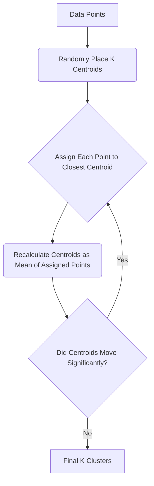

--- 
sidebar_position: 3
title: Unsupervised Learning (Clustering, Dimensionality Reduction)
---

## 03-Unsupervised Learning (Clustering, Dimensionality Reduction)

Unlike supervised learning, which relies on labeled data, **unsupervised learning** deals with unlabeled data. Its goal is to discover hidden patterns, structures, or relationships within the data without any prior knowledge of what the output should be. In robotics, unsupervised learning is invaluable for tasks such as anomaly detection, discovering optimal operational parameters, and making sense of vast amounts of raw sensor data. This chapter focuses on two primary applications of unsupervised learning: clustering and dimensionality reduction.

### 3.1 The Unsupervised Learning Process

1.  **Data Collection:** Gather a dataset of input features, but without any corresponding output labels.
2.  **Training:** An algorithm is used to analyze the inherent structure of the data, identifying similarities, groupings, or simpler representations.
3.  **Pattern Discovery:** The algorithm outputs patterns (e.g., clusters, principal components) that were not explicitly programmed.
4.  **Interpretation:** A human (or another AI system) interprets these discovered patterns to derive insights or make decisions.

### 3.2 Clustering

**Clustering** is the task of grouping a set of objects in such a way that objects in the same group (called a cluster) are more similar to each other than to those in other groups.

#### 3.2.1 K-Means Clustering

*   **Principle:** An iterative algorithm that partitions data points into 'k' distinct clusters.
    1.  **Initialization:** Randomly select 'k' data points as initial cluster centroids.
    2.  **Assignment:** Assign each data point to the closest centroid (based on distance, usually Euclidean).
    3.  **Update:** Recalculate the centroids as the mean of all data points assigned to that cluster.
    4.  **Repeat:** Repeat steps 2 and 3 until the centroids no longer move significantly or a maximum number of iterations is reached.
*   **Advantages:** Simple to understand, computationally efficient, works well with spherical-shaped clusters.
*   **Disadvantages:** Requires specifying the number of clusters 'k' beforehand, sensitive to initial centroid placement, struggles with non-spherical clusters or varying cluster densities.
*   **Applications:** Anomaly detection, data segmentation, customer segmentation (if robots sold services).

#### 3.2.2 Hierarchical Clustering

*   **Principle:** Builds a hierarchy of clusters.
    *   **Agglomerative (Bottom-Up):** Starts with each data point as its own cluster, then iteratively merges the closest pairs of clusters until only one large cluster remains.
    *   **Divisive (Top-Down):** Starts with all data points in one cluster, then recursively splits clusters until each data point is its own cluster.
*   **Advantages:** Does not require specifying 'k' beforehand (can cut the tree at any level), provides a visual dendrogram of cluster relationships.
*   **Disadvantages:** Computationally more expensive for large datasets.

#### 3.2.3 DBSCAN (Density-Based Spatial Clustering of Applications with Noise)

*   **Principle:** Groups together data points that are closely packed together, marking as outliers those points that lie alone in low-density regions.
*   **Advantages:** Does not require specifying 'k', can find arbitrarily shaped clusters, robust to outliers (noise).
*   **Disadvantages:** Struggles with varying densities within clusters, performance degrades with high dimensionality.

#### 3.2.4 Applications in Robotics

*   **Anomaly Detection:** Grouping normal sensor readings, then identifying new readings that don't belong to any group (e.g., motor overheating, unusual vibration patterns).
*   **Environmental Segmentation:** Clustering similar regions in sensor data (e.g., LiDAR point clouds) to identify distinct objects or terrain types.
*   **Grasping Point Discovery:** Grouping stable grasp configurations for unknown objects.
*   **Robot Behavior Discovery:** Clustering observed human or other robot behaviors to identify patterns.

**Diagram 3.1: K-Means Clustering Conceptual Flow**



*Description: A flowchart illustrating the iterative process of K-Means clustering, showing how data points are assigned to centroids and centroids are updated until convergence.*

### 3.3 Dimensionality Reduction

**Dimensionality reduction** is the process of reducing the number of random variables under consideration by obtaining a set of principal variables. It's about finding a lower-dimensional representation of your data that retains most of the important information.

#### 3.3.1 Why Reduce Dimensionality?

*   **Curse of Dimensionality:** In high-dimensional spaces, data becomes sparse, and distances between points become less meaningful, making ML algorithms struggle.
*   **Visualization:** Easier to visualize data in 2D or 3D.
*   **Computational Efficiency:** Faster training/inference for subsequent ML algorithms.
*   **Noise Reduction:** Can help remove redundant or noisy features.

#### 3.3.2 Principal Component Analysis (PCA)

*   **Principle:** A linear transformation technique that identifies the directions (principal components) along which the data varies the most. It projects the high-dimensional data onto a lower-dimensional subspace defined by these principal components.
*   **Advantages:** Widely used, easy to understand, computationally efficient.
*   **Disadvantages:** Assumes linear relationships in the data, can lose important non-linear information.
*   **Applications:** Feature extraction, noise reduction, data compression.

#### 3.3.3 t-SNE (t-Distributed Stochastic Neighbor Embedding)

*   **Principle:** A non-linear dimensionality reduction technique primarily used for visualizing high-dimensional datasets. It maps high-dimensional data points to a lower-dimensional space (e.g., 2D or 3D) such that similar points remain close together and dissimilar points remain far apart.
*   **Advantages:** Excellent for visualizing complex, high-dimensional data structures.
*   **Disadvantages:** Computationally expensive for large datasets, results can vary significantly with parameter tuning.

#### 3.3.4 Applications in Robotics

*   **Sensor Data Compression:** Reducing the dimensionality of high-dimensional sensor data (e.g., image features, LiDAR scans) for efficient storage or faster processing.
*   **Feature Extraction:** Extracting the most important features from raw sensor data to feed into other ML algorithms.
*   **Anomaly Detection:** Anomalies often stand out in reduced-dimensional space.
*   **Robot State Representation:** Learning a compact representation of complex robot states.
*   **Visualization of High-Dimensional Data:** Helping human operators understand complex robot sensor inputs.

Unsupervised learning techniques enable robots to discover insights and patterns from raw, unlabeled data, making them more autonomous in data interpretation and robust to novel situations without constant human supervision.

---

### C++ Example: Simple PCA (Conceptual)

This C++ example conceptually illustrates Principal Component Analysis (PCA) by finding the principal components of a simple 2D dataset. For real applications, you'd use a linear algebra library like Eigen.

```cpp
#include <iostream>
#include <vector>
#include <numeric> // For std::accumulate
#include <algorithm> // For std::transform
#include <cmath>     // For std::sqrt
#include <iomanip>   // For std::fixed, std::setprecision

// --- Mockup for Eigen-like Vector and Matrix (for conceptual demo) ---
// In a real application, you would use Eigen library.
// This mockup is for demonstration purposes only and provides very limited functionality.
struct Vector2D {
    float x, y;
    Vector2D operator+(const Vector2D& other) const { return {x + other.x, y + other.y}; }
    Vector2D operator-(const Vector2D& other) const { return {x - other.x, y - other.y}; }
    Vector2D operator*(float scalar) const { return {x * scalar, y * scalar}; }
    float dot(const Vector2D& other) const { return x * other.x + y * other.y; }
    float magnitude() const { return std::sqrt(x * x + y * y); }
};

struct Matrix2x2 {
    float m[2][2];
    Matrix2x2 operator*(const Matrix2x2& other) const {
        Matrix2x2 result = {};
        result.m[0][0] = m[0][0] * other.m[0][0] + m[0][1] * other.m[1][0];
        result.m[0][1] = m[0][0] * other.m[0][1] + m[0][1] * other.m[1][1];
        result.m[1][0] = m[1][0] * other.m[0][0] + m[1][1] * other.m[1][0];
        result.m[1][1] = m[1][0] * other.m[0][1] + m[1][1] * other.m[1][1];
        return result;
    }
    Matrix2x2 inverse() const {
        float det = m[0][0] * m[1][1] - m[0][1] * m[1][0];
        if (det == 0) return {}; // Handle singular matrix
        return {{{m[1][1] / det, -m[0][1] / det}, {-m[1][0] / det, m[0][0] / det}}};
    }
};

// --- Actual PCA Logic ---
void conceptual_pca(const std::vector<Vector2D>& data) {
    if (data.empty()) {
        std::cerr <<