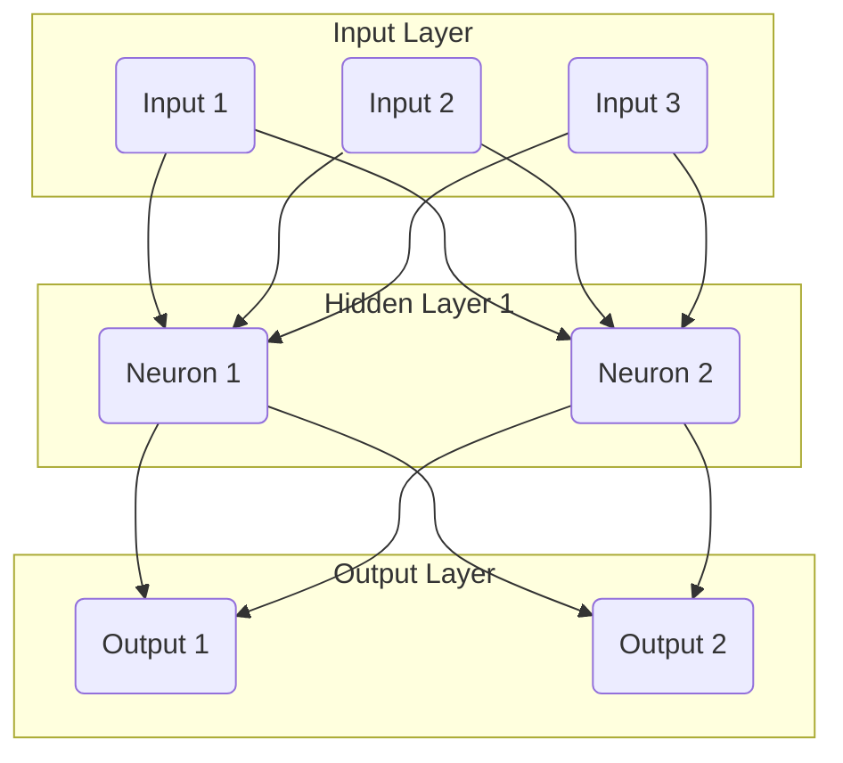

--- 
sidebar_position: 5
title: Neural Networks and Deep Learning (Overview)
---

## 05-Neural Networks and Deep Learning (Overview)

**Neural Networks (NNs)** and **Deep Learning (DL)** are at the forefront of modern Artificial Intelligence, providing powerful tools for robots to process complex sensor data, make sophisticated decisions, and learn highly intricate patterns. Inspired by the structure and function of the human brain, these techniques have revolutionized fields like computer vision, natural language processing, and reinforcement learning, all of which are integral to advanced robotics.

### 5.1 What are Neural Networks?

A **Neural Network** is a computational model inspired by the structure and functions of biological neural networks. It consists of interconnected processing units called **neurons** (or nodes), organized in layers.

*   **Neurons:** Each neuron receives input signals, computes a weighted sum of these inputs, adds a bias, and then passes the result through an **activation function** to produce an output.
*   **Weights and Biases:** These are the parameters of the network that are adjusted during the training process. They determine the strength of connections between neurons and the activation threshold.
*   **Layers:** Neurons are typically organized into:
    *   **Input Layer:** Receives the raw data (e.g., pixel values from an image, sensor readings).
    *   **Hidden Layers:** Intermediate layers that perform computations and extract features. A network with more than one hidden layer is considered a "deep" neural network.
    *   **Output Layer:** Produces the final result (e.g., class probabilities, predicted value, control action).

**Diagram 5.1: Basic Feedforward Neural Network**



*Description: A simple feedforward neural network showing an input layer, a single hidden layer, and an output layer, with connections between neurons representing weighted inputs.*

### 5.2 Deep Learning

**Deep Learning** refers to neural networks with a large number of hidden layers (hence "deep"). The increased depth allows these networks to automatically learn hierarchical features from raw data, going from low-level features (e.g., edges in an image) to high-level semantic features (e.g., object parts, entire objects).

#### 5.2.1 Training Process

1.  **Forward Propagation:** Input data is fed through the network, layer by layer, to produce an output prediction.
2.  **Loss Function:** The output prediction is compared to the true label/target using a **loss function** (e.g., Mean Squared Error for regression, Cross-Entropy for classification), which quantifies the error.
3.  **Backpropagation:** The error is propagated backward through the network, from the output layer to the input layer. This process calculates the **gradients** of the loss with respect to each weight and bias in the network.
4.  **Optimization (e.g., Gradient Descent):** An optimizer (e.g., Adam, SGD) uses these gradients to adjust the weights and biases in a way that minimizes the loss function.
5.  **Iteration:** Steps 1-4 are repeated thousands or millions of times over the training dataset until the model's performance converges.

### 5.3 Types of Neural Networks for Robotics

*   **Feedforward Neural Networks (FNNs) / Multi-Layer Perceptrons (MLPs):**
    *   The simplest type, where information flows in one direction from input to output.
    *   **Applications:** Basic classification/regression tasks (e.g., mapping sensor inputs to simple robot actions), function approximation.
*   **Convolutional Neural Networks (CNNs):**
    *   **Designed for:** Processing grid-like data, particularly images.
    *   **Key Idea:** Use convolutional layers that apply filters (kernels) to local regions of the input, learning spatial hierarchies of features.
    *   **Applications:** Object detection and recognition, semantic segmentation, visual odometry, SLAM, depth estimation from stereo.
*   **Recurrent Neural Networks (RNNs) / LSTMs (Long Short-Term Memory):**
    *   **Designed for:** Processing sequential data, where the output depends on previous inputs in the sequence. They have internal memory.
    *   **Applications:** Time-series prediction (e.g., robot trajectory prediction), natural language understanding (for robot voice commands), motor control sequences.
*   **Generative Adversarial Networks (GANs):**
    *   **Designed for:** Generating new data samples that resemble the training data.
    *   **Applications:** Simulating realistic sensor data, creating synthetic training data for other models, robot design generation.
*   **Deep Reinforcement Learning (DRL):**
    *   **Combines:** Deep Neural Networks with Reinforcement Learning. The NN acts as the policy or value function approximator.
    *   **Applications:** Learning complex robot locomotion, manipulation, and navigation policies in high-dimensional state spaces.

### 5.4 Challenges and Considerations in Robotics

*   **Data Requirements:** Deep learning models require vast amounts of labeled data, which can be expensive and time-consuming to collect for robots.
*   **Computational Resources:** Training deep networks is computationally intensive (requires GPUs). Inference on embedded robot platforms needs optimized models or specialized hardware (e.g., NVIDIA Jetson, Google Coral).
*   **Safety & Reliability:** Ensuring the robustness and safety of DL models in safety-critical robotic applications is a major challenge. Explainability of decisions is often limited.
*   **Generalization:** Models trained in one environment may not generalize well to novel, unseen environments.
*   **Sim-to-Real Transfer:** Bridging the gap between models trained in simulation and performance on real robots is a significant challenge.

Neural networks and deep learning are fundamental to the next generation of intelligent robots, enabling them to perceive, learn, and act with unprecedented capabilities in increasingly complex and dynamic environments.

---

### C++ Example: Simple Feedforward Neural Network (Conceptual)

This C++ example conceptually implements a very simple feedforward neural network (Multi-Layer Perceptron) for binary classification. It's a simplified demonstration without backpropagation for learning.

```cpp
#include <iostream>
#include <vector>
#include <cmath>     // For std::exp
#include <numeric>   // For std::accumulate
#include <iomanip>   // For std::fixed, std::setprecision

// --- Activation Functions ---
// Sigmoid activation function (output between 0 and 1)
float sigmoid(float x) {
    return 1.0f / (1.0f + std::exp(-x));
}

// ReLU activation function (Rectified Linear Unit)
float relu(float x) {
    return std::max(0.0f, x);
}

// --- Simple Feedforward Neural Network Class (MLP) ---
class SimpleNeuralNetwork {
private:
    // Weights and biases (pre-trained for demonstration)
    // Input layer (2 features) -> Hidden layer (2 neurons) -> Output layer (1 neuron)
    
    // Weights for input to hidden layer (2 inputs, 2 hidden neurons)
    float weights_ih[2][2] = {
        {0.1f, 0.4f}, // Weights for hidden neuron 1
        {0.8f, 0.3f}  // Weights for hidden neuron 2
    };
    float biases_h[2] = {0.2f, 0.5f}; // Biases for hidden neurons

    // Weights for hidden to output layer (2 hidden neurons, 1 output neuron)
    float weights_ho[2][1] = {
        {0.6f}, // Weight from hidden neuron 1 to output
        {0.9f}  // Weight from hidden neuron 2 to output
    };
    float biases_o[1] = {-0.1f}; // Bias for output neuron

public:
    SimpleNeuralNetwork() {
        std::cout << "Simple Neural Network initialized with pre-trained weights." << std::endl;
    }

    // Forward pass to get prediction
    float predict(const std::vector<float>& inputs) {
        if (inputs.size() != 2) {
            std::cerr << "Error: Expected 2 inputs." << std::endl;
            return 0.0f;
        }

        // 1. Calculate hidden layer outputs
        std::vector<float> hidden_outputs(2);
        // Hidden Neuron 1
        float sum_h1 = inputs[0] * weights_ih[0][0] + inputs[1] * weights_ih[0][1] + biases_h[0];
        hidden_outputs[0] = relu(sum_h1); // Using ReLU for hidden layer

        // Hidden Neuron 2
        float sum_h2 = inputs[0] * weights_ih[1][0] + inputs[1] * weights_ih[1][1] + biases_h[1];
        hidden_outputs[1] = relu(sum_h2); // Using ReLU for hidden layer

        std::cout << "  Hidden layer outputs: [" << hidden_outputs[0] << ", " << hidden_outputs[1] << "]" << std::endl;

        // 2. Calculate output layer output
        float sum_o = hidden_outputs[0] * weights_ho[0][0] + hidden_outputs[1] * weights_ho[1][0] + biases_o[0];
        float final_output = sigmoid(sum_o); // Using Sigmoid for output (binary classification probability)

        return final_output;
    }
};

int main() {
    std::cout << "--- Conceptual Feedforward Neural Network Demo (C++) ---" << std::endl;

    SimpleNeuralNetwork nn;

    // Simulate robot sensor inputs (e.g., Feature1, Feature2)
    std::vector<float> sensor_input1 = {0.7f, 0.9f}; // High values
    std::vector<float> sensor_input2 = {0.1f, 0.2f}; // Low values
    std::vector<float> sensor_input3 = {0.8f, 0.2f}; // Mixed values

    std::cout << std::fixed << std::setprecision(4);

    // Predict for input 1
    std::cout << "\nInput 1: [" << sensor_input1[0] << ", " << sensor_input1[1] << "]" << std::endl;
    float output1 = nn.predict(sensor_input1);
    std::cout << "  Output Probability: " << output1 << " -> Predicted Class: " << (output1 > 0.5f ? "1" : "0") << std::endl;

    // Predict for input 2
    std::cout << "\nInput 2: [" << sensor_input2[0] << ", " << sensor_input2[1] << "]" << std::endl;
    float output2 = nn.predict(sensor_input2);
    std::cout << "  Output Probability: " << output2 << " -> Predicted Class: " << (output2 > 0.5f ? "1" : "0") << std::endl;

    // Predict for input 3
    std::cout << "\nInput 3: [" << sensor_input3[0] << ", " << sensor_input3[1] << "]" << std::endl;
    float output3 = nn.predict(sensor_input3);
    std::cout << "  Output Probability: " << output3 << " -> Predicted Class: " << (output3 > 0.5f ? "1" : "0") << std::endl;

    std::cout << "\nConceptual FNN demo finished." << std::endl;
    return 0;
}
```

---

### Python Example: Convolutional Neural Network (CNN) for Image Classification (Conceptual)

This Python example conceptually illustrates a Convolutional Neural Network (CNN) for image classification. It uses placeholders for deep learning framework calls (e.g., TensorFlow/Keras or PyTorch) as actual model building/training is extensive.

```python
import numpy as np
# import tensorflow as tf # For actual deep learning

def conceptual_cnn_image_classification():
    print("--- Conceptual Convolutional Neural Network (CNN) for Image Classification ---")

    # Step 1: Simulate Input Image
    # Imagine a grayscale image (e.g., a hand-drawn digit)
    simulated_image_size = (28, 28) # e.g., MNIST digit size
    simulated_image = np.random.randint(0, 255, size=simulated_image_size, dtype=np.uint8)
    # Make a simple pattern (e.g., a "1")
    simulated_image[5:20, 10:15] = 255
    simulated_image[20, 8:17] = 255

    print(f"1. Simulated input image ({simulated_image_size[0]}x{simulated_image_size[1]}) acquired.")

    # Step 2: Preprocess Image (Normalize, Add Channel Dimension)
    normalized_image = simulated_image / 255.0
    # CNNs typically expect a batch of images: (batch_size, height, width, channels)
    # For grayscale, channels=1. For color, channels=3.
    input_tensor = normalized_image.reshape(1, simulated_image_size[0], simulated_image_size[1], 1)

    print("2. Image preprocessed and reshaped for CNN input.")

    # Step 3: Define/Load Pre-trained CNN Model (Conceptual)
    # In reality:
    # model = tf.keras.models.Sequential([
    #     tf.keras.layers.Conv2D(32, (3, 3), activation='relu', input_shape=(28, 28, 1)),
    #     tf.keras.layers.MaxPooling2D((2, 2)),
    #     tf.keras.layers.Conv2D(64, (3, 3), activation='relu'),
    #     tf.keras.layers.MaxPooling2D((2, 2)),
    #     tf.keras.layers.Flatten(),
    #     tf.keras.layers.Dense(10, activation='softmax') # 10 classes for digits 0-9
    # ])
    # model.load_weights("pretrained_digit_classifier.h5") # Or train it
    
    print("3. Pre-trained CNN model loaded (conceptually).")

    # Step 4: Perform Inference
    # In reality: predictions = model.predict(input_tensor)
    
    # Simulate CNN output (probabilities for 10 classes)
    # Example: high probability for digit '1'
    simulated_predictions = np.zeros(10)
    simulated_predictions[1] = 0.95 # 95% confidence for digit '1'
    simulated_predictions[7] = 0.03 # Small chance for '7'
    simulated_predictions[4] = 0.02 # Small chance for '4'

    print("4. CNN inference performed.")

    # Step 5: Interpret Results
    predicted_class_idx = np.argmax(simulated_predictions)
    confidence = simulated_predictions[predicted_class_idx]

    print(f"\nPredicted Class: {predicted_class_idx}")
    print(f"Confidence: {confidence:.2f}")

    # Plotting (requires matplotlib)
    # plt.imshow(simulated_image, cmap='gray')
    # plt.title(f"Predicted Digit: {predicted_class_idx} (Confidence: {confidence:.2f})")
    # plt.axis('off')
    # plt.show()

    print("\nConceptual CNN image classification demo finished. Close plot to continue.")
    print("   Interpretation: Robot can now identify visually perceived objects based on learned patterns.")

if __name__ == "__main__":
    conceptual_cnn_image_classification()
```

---

### Arduino Example: Simple Neuron Model (Conceptual)

This Arduino sketch implements a very basic single neuron model, demonstrating the weighted sum of inputs and an activation function. This is a building block for neural networks.

```arduino
// Simple Neuron Model (Conceptual) for Arduino

// Pre-trained weights and bias for a single neuron
// Imagine this neuron detects a "hot and heavy" condition
float weight1 = 0.5;  // Weight for Input1 (e.g., Temperature)
float weight2 = 0.8;  // Weight for Input2 (e.g., Weight/Pressure)
float bias = -0.6;    // Bias term

// Activation function (Sigmoid)
float sigmoid(float x) {
  return 1.0 / (1.0 + exp(-x));
}

void setup() {
  Serial.begin(9600);
  randomSeed(analogRead(A0)); // Seed random generator
  Serial.println("Arduino Conceptual Single Neuron Demo Ready.");
  Serial.println("Neuron: (Input1 * W1) + (Input2 * W2) + Bias -> Sigmoid -> Output");
}

void loop() {
  // Simulate sensor inputs (normalized between 0 and 1)
  float input1_temp = analogRead(A1) / 1023.0; // Simulate normalized temperature
  float input2_weight = analogRead(A2) / 1023.0; // Simulate normalized weight/pressure

  // Introduce some artificial variation for demo
  input1_temp = constrain(random(0, 100) / 100.0, 0.0, 1.0); // 0.0 to 1.0
  input2_weight = constrain(random(0, 100) / 100.0, 0.0, 1.0); // 0.0 to 1.0

  Serial.print("\nInputs: Temp="); Serial.print(input1_temp);
  Serial.print(", Weight="); Serial.print(input2_weight);

  // Calculate weighted sum + bias
  float weightedSum = (input1_temp * weight1) + (input2_weight * weight2) + bias;
  Serial.print("\nWeighted Sum + Bias: "); Serial.print(weightedSum);

  // Apply activation function
  float neuronOutput = sigmoid(weightedSum);
  Serial.print("\tNeuron Output: "); Serial.println(neuronOutput);

  // Robot decision based on neuron output
  if (neuronOutput > 0.7) { // Threshold for "hot and heavy" 
    digitalWrite(ledPin, HIGH); // Turn on LED
    Serial.println("  --> Condition detected! (e.g., gripper should adjust)");
  } else {
    digitalWrite(ledPin, LOW);
    Serial.println("  --> Condition NOT detected.");
  }
  
  delay(2000); // Simulate processing interval
}
```

---

### Equations in LaTeX: Artificial Neuron Activation

The output `y` of a single artificial neuron is calculated by first computing a weighted sum `z` of its inputs, and then passing `z` through an activation function `sigma`:

```latex
z = sum_{&#123;i=1&#125;}^{&#123;n&#125;} w_{&#123;i&#125;} x_{&#123;i&#125;} + b
```
```latex
y = sigma(z)
```

Where:
*   `x_i` are the inputs.
*   `w_i` are the corresponding weights.
*   `b` is the bias.
*   `sigma` is the activation function (e.g., sigmoid, ReLU, tanh).

---

### MCQs with Answers

1.  What is a key characteristic that distinguishes **Deep Learning** from traditional Neural Networks?
    a) Deep Learning models have only one hidden layer.
    b) Deep Learning models use a large number of hidden layers.
    c) Deep Learning does not use activation functions.
    d) Deep Learning models are only used for regression tasks.
    *Answer: b) Deep Learning models use a large number of hidden layers.*

2.  Which type of Neural Network is specifically designed for processing grid-like data such as images, using convolutional layers to learn spatial features?
    a) Feedforward Neural Network (FNN)
    b) Recurrent Neural Network (RNN)
    c) Convolutional Neural Network (CNN)
    d) Generative Adversarial Network (GAN)
    *Answer: c) Convolutional Neural Network (CNN)*

3.  In the training process of a Neural Network, what is the purpose of **Backpropagation**?
    a) To feed input data through the network to get a prediction.
    b) To calculate the error between the prediction and the true label.
    c) To compute the gradients of the loss with respect to each weight and bias, used for updating parameters.
    d) To randomly initialize the weights and biases.
    *Answer: c) To compute the gradients of the loss with respect to each weight and bias, used for updating parameters.*

---

### Practice Tasks

1.  **CNN Application:** A robot needs to identify and categorize different types of fruit (e.g., apple, orange, banana) on a conveyor belt using its camera. Explain how a Convolutional Neural Network (CNN) would be designed and trained for this task, outlining the typical layers and their purpose.
2.  **RNN for Robot Prediction:** Imagine a robot that needs to predict the next joint angle in a sequence of human demonstrations for a complex manipulation task. Explain why a Recurrent Neural Network (RNN) or LSTM would be suitable for this task.
3.  **DRL Scenario:** Describe a scenario where Deep Reinforcement Learning (DRL) would be an appropriate choice for a robot learning a complex behavior, as opposed to traditional programming or other ML paradigms. What would be the agent, environment, state, actions, and rewards in your scenario?

---

### Notes for Teachers

*   **Brain Analogy:** Use the biological brain as an analogy to introduce neurons and networks.
*   **Visual Demos:** Show simple animations of NN activation and CNN filters at work.
*   **Framework Focus:** Emphasize that in practice, deep learning is implemented using high-level frameworks like TensorFlow or PyTorch.

### Notes for Students

*   **Data is Crucial:** Deep learning models are very data-hungry.
*   **Computational Cost:** Training deep models requires powerful GPUs.
*   **Feature Learning:** The beauty of deep learning is its ability to automatically learn hierarchical features from raw data.
*   **Model Selection:** The choice of NN architecture depends heavily on the type of data (image, sequence, etc.) and the task.