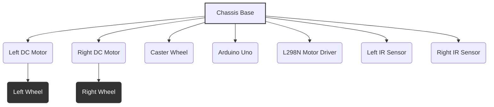

## 02-Project 1: Arduino Line-Following Robot

The line-following robot is a classic beginner's project in robotics, serving as an excellent introduction to sensor integration, basic motor control, and conditional programming. This project will guide you through building a simple mobile robot that can follow a dark line on a light surface.

### 2.1 Objective

Build an Arduino-based mobile robot that uses infrared (IR) sensors to detect and follow a black line drawn on a white surface.

### 2.2 Key Concepts Covered

*   **Electronics:** Basic circuit construction, power distribution, IR sensors, DC motors, motor drivers (H-bridge).
*   **Programming (Arduino):** Digital input/output, analog input (optional), `pinMode()`, `digitalRead()`, `analogWrite()` (PWM for motor speed), conditional statements (`if-else if-else`).
*   **Actuators:** DC motor control.
*   **Sensors:** IR line-following sensors.
*   **Algorithms:** Simple state-based control for line following.

### 2.3 Materials Required

#### 2.3.1 Hardware Components

*   **Arduino Uno (or compatible):** 1
*   **Robot Chassis:** A small mobile robot chassis with two DC gear motors and wheels (often comes as a kit).
*   **DC Gear Motors:** 2 (typically included with chassis kit)
*   **Wheels:** 2 (typically included with chassis kit)
*   **Caster Wheel/Skid:** 1 (for third point of contact, typically included with chassis kit)
*   **L298N Motor Driver Module:** 1 (or similar H-bridge driver)
*   **Infrared (IR) Line Following Sensor Module:** 2 (or a single module with two IR sensors)
    *   These modules usually have an IR LED emitter and a phototransistor receiver, plus an onboard comparator for digital output.
*   **9V Battery Clip & Connector (to barrel jack):** 1 (for Arduino power)
*   **9V (or 6-12V) Battery Pack/Holder:** 1 (for motor driver power, e.g., 6xAA holder, or another 9V battery)
*   **Jumper Wires (male-to-male, male-to-female):** Assorted pack
*   **Breadboard (optional, for connecting sensors if not modules):** 1
*   **Resistors (if building IR sensors from scratch):** e.g., 220 Ohm (for IR LED), 10k Ohm (for pull-up/down)
*   **LEDs (optional, for debugging):** 2 (e.g., red, green)
*   **USB Cable:** 1 (for Arduino programming)

#### 2.3.2 Tools

*   **Small Screwdriver Set**
*   **Wire Strippers (optional, if using loose wires)**
*   **Computer with Arduino IDE installed**
*   **Black electrical tape or black marker:** For drawing the line.
*   **White surface:** A large piece of white paper, poster board, or floor space.

### 2.4 Hardware Assembly

Follow the instructions that came with your robot chassis kit. The general steps are:

1.  **Assemble the Chassis:** Attach the motors, wheels, and caster wheel to the robot chassis.
2.  **Mount Arduino:** Secure the Arduino Uno board to the chassis using standoffs or ties.
3.  **Mount Motor Driver:** Secure the L298N motor driver module to the chassis.
4.  **Mount IR Sensors:** Position the two IR line-following sensors at the front underside of the robot, spaced so that they can straddle the black line. They should be close enough to the ground to detect the line clearly (typically 0.5-1.5 cm above the surface).
    *   If using individual IR modules, place one on the left and one on the right, separated by slightly less than the line width.

**Diagram 2.1: Conceptual Robot Chassis Assembly**



*Description: A conceptual top-down view of a basic robot chassis assembly, showing the placement of motors, wheels, caster, Arduino, motor driver, and IR sensors.*

### 2.5 Circuit Diagram

**Connections to L298N Motor Driver:**

*   **Motor A (Left Motor):** `OUT1` and `OUT2` pins of L298N to the two terminals of the left DC motor.
*   **Motor B (Right Motor):** `OUT3` and `OUT4` pins of L298N to the two terminals of the right DC motor.
*   **Power Input:** `+12V` (or motor voltage, e.g., +6V from 4xAA battery pack) to L298N's `+12V` terminal. `GND` to L298N's `GND` terminal.
*   **Logic Power:** L298N's `5V` output pin (if present, often via an onboard regulator) can power the Arduino 5V, or leave unconnected and power Arduino separately. **Connect L298N GND to Arduino GND.**

**Connections to Arduino:**

*   **L298N Control Pins:**
    *   `ENA` (Enable for Motor A) to Arduino Digital Pin 9 (PWM).
    *   `IN1` to Arduino Digital Pin 8.
    *   `IN2` to Arduino Digital Pin 7.
    *   `ENB` (Enable for Motor B) to Arduino Digital Pin 10 (PWM).
    *   `IN3` to Arduino Digital Pin 12.
    *   `IN4` to Arduino Digital Pin 11.
*   **IR Sensors (Digital Output Modules):**
    *   `VCC` of both IR sensors to Arduino `5V`.
    *   `GND` of both IR sensors to Arduino `GND`.
    *   `OUT` (output) of Left IR Sensor to Arduino Digital Pin 2.
    *   `OUT` (output) of Right IR Sensor to Arduino Digital Pin 3.
*   **Arduino Power:** 9V battery clip to Arduino's barrel jack.

**Diagram 2.2: Line Follower Robot Circuit Diagram**

```mermaid
graph LR
    SUBGRAPH Power Supplies
        ARD_BAT[9V Battery] -- (+) --> ARD_VIN(Arduino VIN)
        ARD_BAT -- (-) --> ARD_GND(Arduino GND)
        MOT_BAT[Motor Battery] -- (+) --> L298_12V(L298N +12V)
        MOT_BAT -- (-) --> L298_GND(L298N GND)
    END
    
    SUBGRAPH Arduino Uno
        ARD_5V(5V)
        ARD_GND
        ARD_D2(D2)
        ARD_D3(D3)
        ARD_D7(D7)
        ARD_D8(D8)
        ARD_D9(D9 PWM)
        ARD_D10(D10 PWM)
        ARD_D11(D11)
        ARD_D12(D12)
    END
    
    SUBGRAPH L298N Motor Driver
        L298_12V
        L298_5V(5V Out)
        L298_GND
        L298_ENA(ENA)
        L298_IN1(IN1)
        L298_IN2(IN2)
        L298_OUT1(OUT1)
        L298_OUT2(OUT2)
        L298_ENB(ENB)
        L298_IN3(IN3)
        L298_IN4(IN4)
        L298_OUT3(OUT3)
        L298_OUT4(OUT4)
    END
    
    SUBGRAPH IR Sensors
        IR_L_VCC(Left VCC)
        IR_L_GND(Left GND)
        IR_L_OUT(Left OUT)
        IR_R_VCC(Right VCC)
        IR_R_GND(Right GND)
        IR_R_OUT(Right OUT)
    END
    
    SUBGRAPH DC Motors
        MOTOR_L_T1(Left Motor T1)
        MOTOR_L_T2(Left Motor T2)
        MOTOR_R_T1(Right Motor T1)
        MOTOR_R_T2(Right Motor T2)
    END
    
    ARD_5V --> IR_L_VCC
    ARD_5V --> IR_R_VCC
    ARD_GND --> IR_L_GND
    ARD_GND --> IR_R_GND
    L298_GND --> ARD_GND
    
    IR_L_OUT --> ARD_D2
    IR_R_OUT --> ARD_D3
    
    ARD_D9 --> L298_ENA
    ARD_D8 --> L298_IN1
    ARD_D7 --> L298_IN2
    ARD_D10 --> L298_ENB
    ARD_D12 --> L298_IN3
    ARD_D11 --> L298_IN4
    
    L298_OUT1 --> MOTOR_L_T1
    L298_OUT2 --> MOTOR_L_T2
    L298_OUT3 --> MOTOR_R_T1
    L298_OUT4 --> MOTOR_R_T2
```

*Description: A detailed circuit diagram showing the connections between Arduino Uno, L298N motor driver, two IR line sensors, and two DC motors, along with power supplies.*

### 2.6 Software Development (Arduino Sketch)

#### 2.6.1 Define Pins and Constants

```cpp
// Motor Driver Pins
const int ENA = 9;   // Enable pin for Left Motor (PWM)
const int IN1 = 8;   // Input 1 for Left Motor direction
const int IN2 = 7;   // Input 2 for Left Motor direction

const int ENB = 10;  // Enable pin for Right Motor (PWM)
const int IN3 = 12;  // Input 1 for Right Motor direction
const int IN4 = 11;  // Input 2 for Right Motor direction

// IR Sensor Pins (Digital Output)
const int leftSensorPin = 2;
const int rightSensorPin = 3;

// Robot Speeds (0-255)
const int baseSpeed = 150;  // Base speed for going straight
const int turnSpeed = 100;  // Speed for turning
const int fullStop = 0;     // Full stop

// Sensor Readings (LOW means line detected, HIGH means no line)
// This depends on your specific IR module. Adjust if yours outputs HIGH on line.
const int LINE_DETECTED = LOW;
const int NO_LINE = HIGH;
```

#### 2.6.2 Motor Control Functions

Create helper functions for motor control.

```cpp
// Function to move the left motor
void moveLeftMotor(int speed) {
  if (speed == 0) {
    digitalWrite(IN1, LOW);
    digitalWrite(IN2, LOW);
    analogWrite(ENA, 0);
  } else if (speed > 0) { // Forward
    digitalWrite(IN1, HIGH);
    digitalWrite(IN2, LOW);
    analogWrite(ENA, speed);
  } else { // Backward
    digitalWrite(IN1, LOW);
    digitalWrite(IN2, HIGH);
    analogWrite(ENA, -speed);
  }
}

// Function to move the right motor
void moveRightMotor(int speed) {
  if (speed == 0) {
    digitalWrite(IN3, LOW);
    digitalWrite(IN4, LOW);
    analogWrite(ENB, 0);
  } else if (speed > 0) { // Forward
    digitalWrite(IN3, HIGH);
    digitalWrite(IN4, LOW);
    analogWrite(ENB, speed);
  } else { // Backward
    digitalWrite(IN3, LOW);
    digitalWrite(IN4, HIGH);
    analogWrite(ENB, -speed);
  }
}

// Function to move both motors forward
void moveForward() {
  moveLeftMotor(baseSpeed);
  moveRightMotor(baseSpeed);
}

// Function to turn left
void turnLeft() {
  moveLeftMotor(0); // Stop left motor
  moveRightMotor(turnSpeed); // Drive right motor forward
}

// Function to turn right
void turnRight() {
  moveLeftMotor(turnSpeed); // Drive left motor forward
  moveRightMotor(0); // Stop right motor
}

// Function to stop the robot
void stopRobot() {
  moveLeftMotor(fullStop);
  moveRightMotor(fullStop);
}
```

#### 2.6.3 `setup()` Function

Initialize serial communication and set pin modes.

```cpp
void setup() {
  Serial.begin(9600); // Initialize serial communication

  // Set motor driver pins as outputs
  pinMode(ENA, OUTPUT);
  pinMode(IN1, OUTPUT);
  pinMode(IN2, OUTPUT);
  pinMode(ENB, OUTPUT);
  pinMode(IN3, OUTPUT);
  pinMode(IN4, OUTPUT);

  // Set IR sensor pins as inputs
  pinMode(leftSensorPin, INPUT);
  pinMode(rightSensorPin, INPUT);

  Serial.println("Line Follower Robot Ready!");
  stopRobot(); // Ensure robot is stopped at startup
  delay(1000); // Small delay before starting operation
}
```

#### 2.6.4 `loop()` Function (Main Logic)

Read sensor data and implement the line-following logic using `if-else if-else`.

```cpp
void loop() {
  int leftSensorState = digitalRead(leftSensorPin);
  int rightSensorState = digitalRead(rightSensorPin);

  // Print sensor states for debugging
  Serial.print("Left: "); Serial.print(leftSensorState == LINE_DETECTED ? "LINE" : "----");
  Serial.print(" | Right: "); Serial.print(rightSensorState == LINE_DETECTED ? "LINE" : "----");
  
  if (leftSensorState == LINE_DETECTED && rightSensorState == LINE_DETECTED) {
    // Both sensors detect the line - go straight
    Serial.println(" -> Moving Forward");
    moveForward();
  } else if (leftSensorState == NO_LINE && rightSensorState == LINE_DETECTED) {
    // Left sensor off line, Right sensor on line - turn right
    Serial.println(" -> Turning Right");
    turnRight();
  } else if (leftSensorState == LINE_DETECTED && rightSensorState == NO_LINE) {
    // Left sensor on line, Right sensor off line - turn left
    Serial.println(" -> Turning Left");
    turnLeft();
  } else { // leftSensorState == NO_LINE && rightSensorState == NO_LINE
    // Both sensors off line - stop and search (or move slowly forward to find line again)
    // For this simple example, we'll stop.
    Serial.println(" -> Lost Line! Stopping.");
    stopRobot();
  }
}
```

### 2.7 Testing and Calibration

1.  **Motor Test:** Before placing the robot on the line, upload a simple sketch to test each motor direction and speed. Ensure both motors spin in the correct direction for "forward". If a motor spins backward, swap its two wires to the L298N.
2.  **Sensor Test:** Test the IR sensors. Connect them and print their `digitalRead()` values to the Serial Monitor. Verify that they output `LINE_DETECTED` (LOW) when over a black line and `NO_LINE` (HIGH) when over a white surface. Adjust `LINE_DETECTED`/`NO_LINE` constants if your sensors operate differently.
3.  **Draw a Line:** Create a clear black line on a white surface. A simple oval or figure-eight path is good. The line width should be wider than one sensor but narrower than the distance between the two sensors.
4.  **Speed Adjustment:** Tune the `baseSpeed` and `turnSpeed` constants. If the robot weaves too much, reduce `baseSpeed`. If it can't turn sharply enough, increase `turnSpeed` or reduce `baseSpeed` in the `turnLeft()`/`turnRight()` functions.
5.  **Sensor Height:** Adjust the height of the IR sensors above the ground for optimal performance. Too high, and they might not distinguish; too low, and they might get stuck.

### 2.8 Challenges and Further Enhancements

*   **Proportional Control:** Instead of `if-else` (on/off turning), implement a proportional controller. If one sensor is off the line, turn gradually, with the amount of turn proportional to how far off it is (requires analog IR sensors or more sophisticated digital ones).
*   **PID Control:** For smoother and more accurate line following, implement a PID controller that takes the sensor error and generates precise motor speed adjustments.
*   **Three or More Sensors:** Add a third (center) IR sensor for better line detection and smoother following, especially around curves.
*   **Intersection Detection:** Add logic to handle intersections (e.g., stop, turn left/right, follow a specific path).
*   **Power Management:** Implement a battery monitoring system to detect low battery and drive to a charging station (if available).
*   **Encoders:** Add encoders to the motors for more precise speed control and odometry.

---

### Notes for Teachers

*   **Safety First:** Emphasize proper battery handling and connecting the motor driver. Motors can consume significant current.
*   **Incremental Testing:** Guide students through testing each component (motors, then sensors, then combined behavior) individually before final integration.
*   **Troubleshooting Focus:** This project is excellent for teaching fundamental troubleshooting skills. Encourage students to identify issues logically.
*   **Visual Debugging:** Use LEDs as visual indicators for sensor states or robot actions before relying solely on the Serial Monitor.

### Notes for Students

*   **Wiring Accuracy:** Double-check all your wiring connections carefully. Incorrect wiring is the most common problem.
*   **Motor Direction:** Test your motors. If they spin in the opposite direction, reverse the polarity of their connection to the motor driver.
*   **Sensor Output:** Understand what your specific IR line sensor module outputs (HIGH or LOW) when it detects a line. Adjust the `LINE_DETECTED` constant accordingly.
*   **Start with a Simple Line:** Use a thick, straight black line on a white surface for initial testing. Gradually introduce curves.
*   **Power is Important:** Use a separate battery pack for your motors, as they draw a lot of current and can cause voltage drops that reset the Arduino powered from the same source.