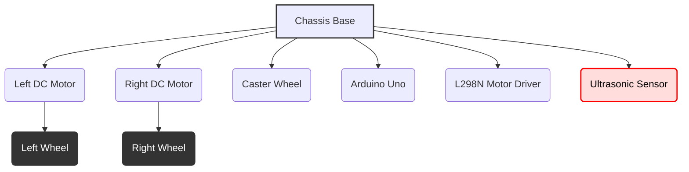

## 03-Project 2: Mobile Robot with Obstacle Avoidance (Ultrasonic)

Building upon the foundations of Project 1, this project introduces the concept of environmental perception using an ultrasonic distance sensor. You will enhance your mobile robot to detect obstacles in its path and autonomously navigate around them, demonstrating a basic level of intelligent behavior.

### 3.1 Objective

Build an Arduino-based mobile robot that detects obstacles using an ultrasonic sensor and executes avoidance maneuvers to continue moving, rather than crashing.

### 3.2 Key Concepts Covered

*   **Electronics:** Ultrasonic distance sensors, DC motors, motor drivers, power management.
*   **Programming (Arduino):** Digital I/O, `pulseIn()`, `delayMicroseconds()`, conditional statements, functions.
*   **Sensors:** Ultrasonic sensor (Time-of-Flight).
*   **Actuators:** DC motor control.
*   **Algorithms:** Reactive obstacle avoidance logic, basic state management.

### 3.3 Materials Required

#### 3.3.1 Hardware Components

*   **Arduino Uno (or compatible):** 1
*   **Robot Chassis:** A small mobile robot chassis with two DC gear motors and wheels.
*   **DC Gear Motors:** 2 (typically included with chassis kit)
*   **Wheels:** 2 (typically included with chassis kit)
*   **Caster Wheel/Skid:** 1 (typically included with chassis kit)
*   **L298N Motor Driver Module:** 1 (or similar H-bridge driver)
*   **HC-SR04 Ultrasonic Sensor Module:** 1
*   **SG90 Micro Servo Motor (optional, for scanning):** 1
*   **9V Battery Clip & Connector (to barrel jack):** 1 (for Arduino power)
*   **9V (or 6-12V) Battery Pack/Holder:** 1 (for motor driver power)
*   **Jumper Wires (male-to-male, male-to-female):** Assorted pack
*   **USB Cable:** 1 (for Arduino programming)

#### 3.3.2 Tools

*   **Small Screwdriver Set**
*   **Computer with Arduino IDE installed**
*   **Obstacles:** Books, boxes, walls for testing.

### 3.4 Hardware Assembly

1.  **Assemble the Chassis:** Attach the motors, wheels, and caster wheel to the robot chassis (same as Project 1).
2.  **Mount Arduino and Motor Driver:** Secure the Arduino Uno and L298N motor driver module to the chassis.
3.  **Mount Ultrasonic Sensor:**
    *   **Fixed Mount:** Mount the HC-SR04 sensor at the front of the robot, facing directly forward.
    *   **Scanning Mount (Optional, but recommended):** Mount the HC-SR04 sensor on the SG90 micro servo. Mount the servo at the front of the robot such that the ultrasonic sensor can pan left and right. This allows the robot to "look" for clearer paths.

**Diagram 3.1: Conceptual Robot Chassis with Ultrasonic Sensor**



*Description: A conceptual top-down view of a basic robot chassis with an ultrasonic sensor mounted at the front. Optionally, the sensor can be mounted on a micro servo for scanning.*

### 3.5 Circuit Diagram

**Connections to L298N Motor Driver (Same as Project 1):**

*   **Motor A (Left Motor):** `OUT1` and `OUT2` pins of L298N to the two terminals of the left DC motor.
*   **Motor B (Right Motor):** `OUT3` and `OUT4` pins of L298N to the two terminals of the right DC motor.
*   **Power Input:** `+12V` (or motor voltage) to L298N's `+12V` terminal. `GND` to L298N's `GND` terminal.
*   **Logic Power:** `L298N GND` to `Arduino GND`.

**Connections to Arduino:**

*   **L298N Control Pins:**
    *   `ENA` to Arduino Digital Pin 9 (PWM).
    *   `IN1` to Arduino Digital Pin 8.
    *   `IN2` to Arduino Digital Pin 7.
    *   `ENB` to Arduino Digital Pin 10 (PWM).
    *   `IN3` to Arduino Digital Pin 12.
    *   `IN4` to Arduino Digital Pin 11.
*   **HC-SR04 Ultrasonic Sensor:**
    *   `VCC` to Arduino `5V`.
    *   `GND` to Arduino `GND`.
    *   `Trig` to Arduino Digital Pin 4.
    *   `Echo` to Arduino Digital Pin 5.
*   **SG90 Micro Servo (if used):**
    *   `VCC` (red wire) to Arduino `5V`.
    *   `GND` (brown/black wire) to Arduino `GND`.
    *   `Signal` (orange/yellow wire) to Arduino Digital Pin 6 (PWM).
*   **Arduino Power:** 9V battery clip to Arduino's barrel jack.

**Diagram 3.2: Obstacle Avoidance Robot Circuit Diagram**

```mermaid
graph LR
    SUBGRAPH Power Supplies
        ARD_BAT[9V Battery] -- (+) --> ARD_VIN(Arduino VIN)
        ARD_BAT -- (-) --> ARD_GND(Arduino GND)
        MOT_BAT[Motor Battery] -- (+) --> L298_12V(L298N +12V)
        MOT_BAT -- (-) --> L298_GND(L298N GND)
    END
    
    SUBGRAPH Arduino Uno
        ARD_5V(5V)
        ARD_GND
        ARD_D4(D4)
        ARD_D5(D5)
        ARD_D6(D6 PWM)
        ARD_D7(D7)
        ARD_D8(D8)
        ARD_D9(D9 PWM)
        ARD_D10(D10 PWM)
        ARD_D11(D11)
        ARD_D12(D12)
    END
    
    SUBGRAPH L298N Motor Driver
        L298_12V
        L298_5V(5V Out)
        L298_GND
        L298_ENA(ENA)
        L298_IN1(IN1)
        L298_IN2(IN2)
        L298_OUT1(OUT1)
        L298_OUT2(OUT2)
        L298_ENB(ENB)
        L298_IN3(IN3)
        L298_IN4(IN4)
        L298_OUT3(OUT3)
        L298_OUT4(OUT4)
    END
    
    SUBGRAPH HC-SR04 Ultrasonic Sensor
        HCSR_VCC(VCC)
        HCSR_GND(GND)
        HCSR_TRIG(Trig)
        HCSR_ECHO(Echo)
    END

    SUBGRAPH SG90 Micro Servo (Optional)
        SG90_VCC(VCC)
        SG90_GND(GND)
        SG90_SIG(Signal)
    END
    
    SUBGRAPH DC Motors
        MOTOR_L_T1(Left Motor T1)
        MOTOR_L_T2(Left Motor T2)
        MOTOR_R_T1(Right Motor T1)
        MOTOR_R_T2(Right Motor T2)
    END
    
    ARD_5V --> HCSR_VCC
    ARD_GND --> HCSR_GND
    ARD_D4 --> HCSR_TRIG
    ARD_D5 --> HCSR_ECHO

    ARD_5V --> SG90_VCC
    ARD_GND --> SG90_GND
    ARD_D6 --> SG90_SIG
    
    ARD_5V -- (Optional) --> L298_5V
    L298_GND --> ARD_GND
    
    ARD_D9 --> L298_ENA
    ARD_D8 --> L298_IN1
    ARD_D7 --> L298_IN2
    ARD_D10 --> L298_ENB
    ARD_D12 --> L298_IN3
    ARD_D11 --> L298_IN4
    
    L298_OUT1 --> MOTOR_L_T1
    L298_OUT2 --> MOTOR_L_T2
    L298_OUT3 --> MOTOR_R_T1
    L298_OUT4 --> MOTOR_R_T2
```

*Description: A detailed circuit diagram showing the connections for the Obstacle Avoidance Robot, including Arduino Uno, L298N motor driver, HC-SR04 ultrasonic sensor, and an optional SG90 micro servo.*

### 3.6 Software Development (Arduino Sketch)

#### 3.6.1 Define Pins and Constants

```cpp
#include <Servo.h> // Include the Servo library if using SG90

// Motor Driver Pins (same as Project 1)
const int ENA = 9;   // Enable pin for Left Motor (PWM)
const int IN1 = 8;   // Input 1 for Left Motor direction
const int IN2 = 7;   // Input 2 for Left Motor direction

const int ENB = 10;  // Enable pin for Right Motor (PWM)
const int IN3 = 12;  // Input 1 for Right Motor direction
const int IN4 = 11;  // Input 2 for Right Motor direction

// Robot Speeds (0-255)
const int baseSpeed = 150;  // Speed for moving forward
const int avoidSpeed = 120; // Speed for avoidance turns
const int reverseSpeed = 100; // Speed for reversing
const int fullStop = 0;     // Full stop

// Ultrasonic Sensor Pins
const int trigPin = 4;
const int echoPin = 5;

// Obstacle Detection Threshold
const int obstacleDistanceCm = 20; // If object is closer than this, react

// Servo Motor for scanning (optional)
Servo ultrasonicServo;
const int servoPin = 6;
```

#### 3.6.2 Motor Control Functions

Use the same motor control functions as Project 1.

```cpp
// Function to move the left motor
void moveLeftMotor(int speed) { /* ... same as Project 1 ... */ }
// Function to move the right motor
void moveRightMotor(int speed) { /* ... same as Project 1 ... */ }

// Basic Movement Functions
void moveForward() {
  moveLeftMotor(baseSpeed);
  moveRightMotor(baseSpeed);
}

void turnLeft() {
  moveLeftMotor(0); // Stop left motor
  moveRightMotor(avoidSpeed); // Drive right motor forward
}

void turnRight() {
  moveLeftMotor(avoidSpeed); // Drive left motor forward
  moveRightMotor(0); // Stop right motor
}

void moveBackward() {
  moveLeftMotor(-reverseSpeed); // Negative speed to reverse
  moveRightMotor(-reverseSpeed);
}

void stopRobot() {
  moveLeftMotor(fullStop);
  moveRightMotor(fullStop);
}
```

#### 3.6.3 Ultrasonic Sensor Function

A function to read distance from the HC-SR04 sensor.

```cpp
long readUltrasonicDistance() {
  // Clears the trigPin by setting it LOW for 2 microseconds
  digitalWrite(trigPin, LOW);
  delayMicroseconds(2);

  // Sets the trigPin on HIGH state for 10 microseconds to send a pulse
  digitalWrite(trigPin, HIGH);
  delayMicroseconds(10);
  digitalWrite(trigPin, LOW);

  // Reads the echoPin, returns the sound wave travel time in microseconds
  long duration = pulseIn(echoPin, HIGH);

  // Calculate the distance (Speed of sound = 0.0343 cm/µs)
  // Distance = (Duration * 0.0343) / 2
  long distanceCm = duration * 0.0343 / 2;
  
  return distanceCm;
}
```

#### 3.6.4 `setup()` Function

Initialize pins and optionally the servo.

```cpp
void setup() {
  Serial.begin(9600);

  // Motor Driver Pins
  pinMode(ENA, OUTPUT); pinMode(IN1, OUTPUT); pinMode(IN2, OUTPUT);
  pinMode(ENB, OUTPUT); pinMode(IN3, OUTPUT); pinMode(IN4, OUTPUT);

  // Ultrasonic Sensor Pins
  pinMode(trigPin, OUTPUT);
  pinMode(echoPin, INPUT);

  // Servo (if used)
  ultrasonicServo.attach(servoPin);
  ultrasonicServo.write(90); // Center the servo

  Serial.println("Obstacle Avoidance Robot Ready!");
  stopRobot();
  delay(1000);
}
```

#### 3.6.5 `loop()` Function (Main Logic)

Implement the obstacle avoidance behavior.

```cpp
void loop() {
  long distance = readUltrasonicDistance();
  Serial.print("Distance: "); Serial.print(distance); Serial.println(" cm");

  if (distance > obstacleDistanceCm || distance == 0) { // distance == 0 often means no echo received (very far or error)
    // No obstacle detected or very far away, move forward
    moveForward();
  } else {
    // Obstacle detected, stop and avoid
    stopRobot();
    Serial.println("Obstacle detected! Avoiding...");
    delay(500); // Pause briefly

    // Scan left and right (if using servo)
    long leftDistance = 0;
    long rightDistance = 0;

    // Turn servo left and measure
    ultrasonicServo.write(45); // Left
    delay(700);
    leftDistance = readUltrasonicDistance();
    delay(100);

    // Turn servo right and measure
    ultrasonicServo.write(135); // Right
    delay(700);
    rightDistance = readUltrasonicDistance();
    delay(100);

    // Center servo
    ultrasonicServo.write(90);
    delay(500);

    Serial.print("Left Distance: "); Serial.print(leftDistance); Serial.print(" cm | ");
    Serial.print("Right Distance: "); Serial.print(rightDistance); Serial.println(" cm");

    if (leftDistance > rightDistance && leftDistance > obstacleDistanceCm) {
      // Left side is clearer, turn left
      Serial.println("Turning Left (Left side clearer)");
      turnLeft();
      delay(800); // Turn for a duration
    } else if (rightDistance > leftDistance && rightDistance > obstacleDistanceCm) {
      // Right side is clearer, turn right
      Serial.println("Turning Right (Right side clearer)");
      turnRight();
      delay(800); // Turn for a duration
    } else {
      // Both sides are blocked or unclear, reverse
      Serial.println("Both sides blocked or unclear. Reversing.");
      moveBackward();
      delay(1000); // Reverse for a duration
      // After reversing, make a turn to avoid getting stuck
      if (random(0,2) == 0) { // Randomly choose left or right
        turnLeft();
      } else {
        turnRight();
      }
      delay(800);
    }
    stopRobot(); // Stop after avoidance maneuver
  }
}
```

### 3.7 Testing and Calibration

1.  **Motor Test:** Ensure motors work correctly in both directions at various speeds.
2.  **Ultrasonic Sensor Test:** Upload a sketch that only reads and prints the `readUltrasonicDistance()` function output to the Serial Monitor. Test it with objects at known distances. Verify the readings are reasonable. Distance 0 typically indicates no echo received, usually when the object is too far or angled away.
3.  **Servo Test (if used):** Test the servo motor to ensure it moves to the desired angles (45, 90, 135).
4.  **Threshold Tuning:** Adjust `obstacleDistanceCm`. Start with a larger value (e.g., 50cm) and gradually decrease it to find a sweet spot.
5.  **Avoidance Maneuver Tuning:** Adjust the `delay()` times in `turnLeft()`, `turnRight()`, and `moveBackward()` to make the robot's turns and reversals effective for avoiding typical obstacles without getting stuck.

### 3.8 Challenges and Further Enhancements

*   **Smoother Movement:** Implement a state machine to manage the robot's behavior (e.g., `MOVING_FORWARD`, `AVOIDING_OBSTACLE_LEFT`, `AVOIDING_OBSTACLE_RIGHT`).
*   **Sensor Filtering:** Implement a simple moving average filter or median filter (from previous chapters) for the ultrasonic readings to reduce noise.
*   **Path Planning:** For more complex environments, implement a basic path planning algorithm (e.g., a simple wall-following behavior after avoidance).
*   **Multiple Sensors:** Add more ultrasonic sensors (e.g., one on each side) for a wider field of view.
*   **Mapping:** Attempt to create a rudimentary occupancy grid map of the environment using sensor readings (more advanced).
*   **Encoders:** Integrate motor encoders for more precise movement and turns during avoidance maneuvers.

---

### Notes for Teachers

*   **Debugging Logic:** Guide students to use Serial.print statements extensively to trace the robot's decisions (e.g., `Serial.println("Obstacle detected, turning right");`).
*   **Behavioral Flow:** Encourage students to draw simple flowcharts or state machine diagrams for the obstacle avoidance logic before coding it.
*   **Calibration is Key:** Emphasize that careful calibration of the ultrasonic sensor and tuning of avoidance parameters is essential for good performance.

### Notes for Students

*   **Noise in Sensors:** Understand that ultrasonic sensors can be noisy or provide erratic readings. Filtering can help.
*   **Blind Spots:** Be aware that fixed ultrasonic sensors have a limited field of view and can miss obstacles that are not directly in front. A scanning servo helps mitigate this.
*   **Behavioral Loops:** Test your robot in different obstacle configurations to ensure it doesn't get stuck in repetitive avoidance loops.
*   **Power for Servo:** Ensure your servo motor gets stable 5V power from the Arduino. If the servo jitters or doesn't move smoothly, check power or add a small capacitor across its VCC/GND.