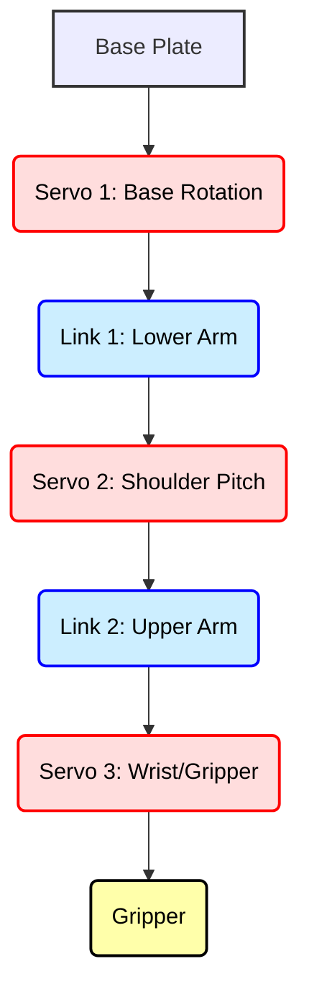

## 04-Project 3: Robotic Arm Control (Servo-based)

This project shifts focus from mobile robotics to manipulation. You will build and control a simple robotic arm using hobby servo motors, introducing concepts of joint control, kinematics (implicitly), and user interaction for precise positioning. This project is a gateway to understanding how robots interact with objects in a controlled manner.

### 4.1 Objective

Build a 2-DOF (Degree-of-Freedom) or 3-DOF robotic arm using hobby servo motors and control its joint angles via an Arduino, allowing it to move its gripper to different positions.

### 4.2 Key Concepts Covered

*   **Electronics:** Servo motors, power management for multiple servos.
*   **Programming (Arduino):** `Servo.h` library, `analogRead()` (for potentiometer input), `map()` function, conditional logic.
*   **Actuators:** Servo motor control (PWM).
*   **User Interface:** Potentiometer or serial input for control.
*   **Kinematics (implicit):** Understanding how joint angles affect end-effector position.

### 4.3 Materials Required

#### 4.3.1 Hardware Components

*   **Arduino Uno (or compatible):** 1
*   **Hobby Servo Motors (SG90 or MG996R/S):** 2 or 3 (e.g., one for base rotation, one for shoulder, one for gripper/wrist).
    *   SG90 (plastic gears, small) for lighter loads.
    *   MG996R/S (metal gears, larger torque) for heavier loads.
*   **Mini Robotic Arm Kit (optional):** A small plastic or acrylic kit designed for SG90/MG996R servos. This significantly simplifies mechanical assembly.
*   **Gripper Mechanism (optional):** Often comes with arm kits or can be 3D printed/fabricated.
*   **Breadboard:** 1 (for wiring potentiometers)
*   **Potentiometers (10k Ohm):** 2 or 3 (one for each servo, for manual control)
*   **Resistors (e.g., 220 Ohm, optional for LEDs):** A few
*   **LEDs (optional, for debugging/status):** A few
*   **External Power Supply (5V, 2A-5A):** Very important for multiple servos! A USB phone charger with a USB to barrel jack cable *might* work for 2-3 SG90s, but a dedicated 5V power supply (e.g., old phone charger with wires cut, buck converter from 9V/12V source) is safer.
    *   **Crucial:** Do NOT power more than 1-2 small servos directly from Arduino's 5V pin, it can damage the Arduino.
*   **Jumper Wires:** Assorted pack
*   **USB Cable:** 1 (for Arduino programming)

#### 4.3.2 Tools

*   **Small Screwdriver Set**
*   **Wire Strippers (optional)**
*   **Computer with Arduino IDE installed**
*   **Multimeter (recommended for power troubleshooting)**

### 4.4 Hardware Assembly

1.  **Assemble Robotic Arm Kit:** Follow the instructions for your specific robotic arm kit. This typically involves attaching servo motors to plastic/acrylic brackets and connecting the links. Ensure all servo horns are attached correctly and centered.
2.  **Mount Arduino:** Secure the Arduino Uno to a stable base, potentially the arm's base plate.
3.  **Mount Potentiometers:** If using manual control, mount the potentiometers on a small piece of cardboard or a breadboard for easy access.

**Diagram 4.1: Conceptual 3-DOF Robotic Arm Assembly**



*Description: A conceptual side view of a 3-DOF robotic arm, showing the base, three servo motors acting as joints, two links, and an end-effector (gripper).*

### 4.5 Circuit Diagram

**Crucial Power Note:** Powering multiple servos directly from the Arduino's 5V pin can cause current draw issues, leading to brownouts, erratic servo behavior, or damage to the Arduino. **Always use an external 5V power supply for servos and connect its GND to Arduino GND.**

*   **External 5V Power Supply:**
    *   `+5V` from external supply to `VCC` (red wire) of ALL servo motors.
    *   `GND` from external supply to `GND` (brown/black wire) of ALL servo motors.
    *   **Connect external `GND` to Arduino `GND`.** This creates a common ground, which is essential.
*   **Servo Motors:**
    *   `Signal` (orange/yellow wire) of Servo 1 to Arduino Digital Pin 9 (PWM).
    *   `Signal` of Servo 2 to Arduino Digital Pin 10 (PWM).
    *   `Signal` of Servo 3 (if used) to Arduino Digital Pin 11 (PWM).
*   **Potentiometers (for control):**
    *   One outer pin of each potentiometer to Arduino `5V`.
    *   The other outer pin of each potentiometer to Arduino `GND`.
    *   The middle (wiper) pin of Potentiometer 1 to Arduino Analog Pin A0.
    *   The middle (wiper) pin of Potentiometer 2 to Arduino Analog Pin A1.
    *   The middle (wiper) pin of Potentiometer 3 (if used) to Arduino Analog Pin A2.
*   **Arduino Power:** USB cable for programming and powering the Arduino logic (or via barrel jack).

**Diagram 4.2: Robotic Arm Circuit Diagram (Conceptual)**

```mermaid
graph LR
    SUBGRAPH Power Supplies
        ARD_USB[Arduino USB Power] -- (+5V) --> ARD_5V(Arduino 5V)
        ARD_USB -- GND --> ARD_GND(Arduino GND)
        EXT_PS[External 5V Power Supply] -- (+5V) --> SERVO_VCC_BUS(Servo +5V Bus)
        EXT_PS -- GND --> SERVO_GND_BUS(Servo GND Bus)
    END
    
    SUBGRAPH Arduino Uno
        ARD_5V
        ARD_GND
        ARD_A0(A0)
        ARD_A1(A1)
        ARD_A2(A2)
        ARD_D9(D9 PWM)
        ARD_D10(D10 PWM)
        ARD_D11(D11 PWM)
    END
    
    SUBGRAPH Servos
        SERVO1_VCC(Servo 1 VCC)
        SERVO1_GND(Servo 1 GND)
        SERVO1_SIG(Servo 1 Signal)
        SERVO2_VCC(Servo 2 VCC)
        SERVO2_GND(Servo 2 GND)
        SERVO2_SIG(Servo 2 Signal)
        SERVO3_VCC(Servo 3 VCC)
        SERVO3_GND(Servo 3 GND)
        SERVO3_SIG(Servo 3 Signal)
    END

    SUBGRAPH Potentiometers
        POT1_VCC(Pot 1 VCC)
        POT1_GND(Pot 1 GND)
        POT1_WIPER(Pot 1 Wiper)
        POT2_VCC(Pot 2 VCC)
        POT2_GND(Pot 2 GND)
        POT2_WIPER(Pot 2 Wiper)
        POT3_VCC(Pot 3 VCC)
        POT3_GND(Pot 3 GND)
        POT3_WIPER(Pot 3 Wiper)
    END
    
    SERVO_VCC_BUS --> SERVO1_VCC
    SERVO_VCC_BUS --> SERVO2_VCC
    SERVO_VCC_BUS --> SERVO3_VCC
    SERVO_GND_BUS --> SERVO1_GND
    SERVO_GND_BUS --> SERVO2_GND
    SERVO_GND_BUS --> SERVO3_GND
    SERVO_GND_BUS --> ARD_GND

    ARD_D9 --> SERVO1_SIG
    ARD_D10 --> SERVO2_SIG
    ARD_D11 --> SERVO3_SIG

    ARD_5V --> POT1_VCC
    ARD_GND --> POT1_GND
    POT1_WIPER --> ARD_A0
    
    ARD_5V --> POT2_VCC
    ARD_GND --> POT2_GND
    POT2_WIPER --> ARD_A1
    
    ARD_5V --> POT3_VCC
    ARD_GND --> POT3_GND
    POT3_WIPER --> ARD_A2
```

*Description: A detailed circuit diagram for a 3-DOF Robotic Arm controlled by potentiometers, showing critical external power supply for servos and common grounding with Arduino.*

### 4.6 Software Development (Arduino Sketch)

#### 4.6.1 Define Pins and Constants

```cpp
#include <Servo.h> // Include the Servo library

// Servo Objects
Servo baseServo;   // Servo for base rotation (Joint 1)
Servo shoulderServo; // Servo for shoulder pitch (Joint 2)
Servo gripperServo; // Servo for gripper/wrist (Joint 3)

// Servo Pins
const int baseServoPin = 9;
const int shoulderServoPin = 10;
const int gripperServoPin = 11; // Use -1 if not using a gripper servo

// Potentiometer Pins (for manual control)
const int basePotPin = A0;
const int shoulderPotPin = A1;
const int gripperPotPin = A2; // Use -1 if not using a gripper servo

// Servo Angle Limits (adjust based on your arm's physical limits and servo capabilities)
// Important to prevent servos from crashing into the arm structure
const int baseMinAngle = 0;   const int baseMaxAngle = 180;
const int shoulderMinAngle = 0; const shoulderMaxAngle = 180;
const int gripperMinAngle = 0; const gripperMaxAngle = 90; // Gripper often has smaller range
```

#### 4.6.2 `setup()` Function

Attach servos and initialize serial.

```cpp
void setup() {
  Serial.begin(9600); // Initialize serial communication

  // Attach servos to their pins
  baseServo.attach(baseServoPin);
  shoulderServo.attach(shoulderServoPin);
  if (gripperServoPin != -1) {
    gripperServo.attach(gripperServoPin);
  }

  // Set initial positions (e.g., home position)
  baseServo.write(90);
  shoulderServo.write(90);
  if (gripperServoPin != -1) {
    gripperServo.write(gripperMinAngle); // Gripper open
  }

  Serial.println("Robotic Arm Control Ready!");
  delay(1000);
}
```

#### 4.6.3 `loop()` Function (Main Logic - Potentiometer Control)

Read potentiometer values, map them to servo angles, and control the servos.

```cpp
void loop() {
  // Read potentiometer values (0-1023)
  int basePotValue = analogRead(basePotPin);
  int shoulderPotValue = analogRead(shoulderPotPin);
  int gripperPotValue = (gripperServoPin != -1) ? analogRead(gripperPotPin) : 0;

  // Map potentiometer values to servo angles (0-180 degrees)
  // Constrain to prevent going beyond physical limits
  int baseAngle = map(basePotValue, 0, 1023, baseMinAngle, baseMaxAngle);
  baseAngle = constrain(baseAngle, baseMinAngle, baseMaxAngle); // Ensure within physical bounds

  int shoulderAngle = map(shoulderPotValue, 0, 1023, shoulderMinAngle, shoulderMaxAngle);
  shoulderAngle = constrain(shoulderAngle, shoulderMinAngle, shoulderMaxAngle);

  int gripperAngle = gripperMinAngle; // Default to open
  if (gripperServoPin != -1) {
    gripperAngle = map(gripperPotValue, 0, 1023, gripperMinAngle, gripperMaxAngle);
    gripperAngle = constrain(gripperAngle, gripperMinAngle, gripperMaxAngle);
  }

  // Write angles to servos
  baseServo.write(baseAngle);
  shoulderServo.write(shoulderAngle);
  if (gripperServoPin != -1) {
    gripperServo.write(gripperAngle);
  }

  // Print current angles for debugging
  Serial.print("Base: "); Serial.print(baseAngle);
  Serial.print(" | Shoulder: "); Serial.print(shoulderAngle);
  if (gripperServoPin != -1) {
    Serial.print(" | Gripper: "); Serial.print(gripperAngle);
  }
  Serial.println();

  delay(15); // Small delay to prevent servo jitter and allow serial output
}
```

#### 4.6.4 Alternative: Serial Control

You could also control the arm by sending commands over serial (e.g., from a Python script or the Serial Monitor).

```cpp
/*
// Example loop for Serial Control:
void loop() {
  if (Serial.available() > 0) {
    char command = Serial.read(); // Read a character command

    if (command == 'b') { // Base servo control
      int angle = Serial.parseInt(); // Read integer angle
      if (angle >= baseMinAngle && angle <= baseMaxAngle) {
        baseServo.write(angle);
        Serial.print("Base set to: "); Serial.println(angle);
      } else {
        Serial.println("Invalid base angle.");
      }
    } else if (command == 's') { // Shoulder servo control
      int angle = Serial.parseInt();
      if (angle >= shoulderMinAngle && angle <= shoulderMaxAngle) {
        shoulderServo.write(angle);
        Serial.print("Shoulder set to: "); Serial.println(angle);
      } else {
        Serial.println("Invalid shoulder angle.");
      }
    } else if (command == 'g' && gripperServoPin != -1) { // Gripper control
      int angle = Serial.parseInt();
      if (angle >= gripperMinAngle && angle <= gripperMaxAngle) {
        gripperServo.write(angle);
        Serial.print("Gripper set to: "); Serial.println(angle);
      } else {
        Serial.println("Invalid gripper angle.");
      }
    }
    // Clear any remaining characters in the serial buffer
    while(Serial.available() > 0) {
      Serial.read();
    }
  }
}
*/
```

### 4.7 Testing and Calibration

1.  **Power Supply Test:** Connect your external 5V power supply. Before connecting to servos, use a multimeter to verify it provides stable 5V.
2.  **Servo Test (one by one):** Connect one servo at a time to your external power supply and Arduino signal pin. Use a minimal sketch to move it through its full range (`servo.write(0); delay(1000); servo.write(180);`). Observe its physical limits.
3.  **Potentiometer Test:** Read potentiometer values to the Serial Monitor (0-1023). Ensure they vary smoothly.
4.  **Angle Limits:** Very important: Determine the actual safe physical minimum and maximum angles for each joint of your arm. Update `_MinAngle` and `_MaxAngle` constants accordingly to prevent damage.
5.  **Arm Movement:** Test each servo independently with its potentiometer. Then test them together, observing the arm's motion.
6.  **Gripper Calibration:** If you have a gripper, calibrate its open and close angles.

### 4.8 Challenges and Further Enhancements

*   **Forward Kinematics:** Given the joint angles, calculate the end-effector (gripper) position in 2D or 3D space.
*   **Inverse Kinematics:** Given a desired (x,y) position for the end-effector, calculate the required joint angles. This is a significant challenge for even simple arms. Start with a 2-DOF planar arm, which has analytical solutions.
*   **Trajectory Planning:** Instead of directly mapping potentiometers to angles, implement smooth motion between two target points using interpolation.
*   **Record and Playback:** Record a sequence of arm movements (joint angles) and play them back.
*   **Feedback Control:** Add position sensors (e.g., potentiometers for each joint, if not already built into servos) and implement a PID controller for more precise joint angle control.
*   **Vision Integration:** Use a camera and computer vision (from previous chapters) to detect an object and command the arm to pick it up.
*   **Force Feedback:** Add FSRs or strain gauges to the gripper to measure grasp force.

---

### Notes for Teachers

*   **Power Supply Emphasis:** This is the most critical safety point. Reinforce the need for an adequate external power supply for servos and common grounding.
*   **Physical Limits:** Guide students to carefully determine and respect the physical angle limits of their arm's joints to prevent motor stall or damage.
*   **Kinematics Introduction:** Use this project as a practical demonstration of FK/IK concepts, even if not explicitly coded.
*   **Debugging Jerkiness:** Explain that servo jitter often indicates power supply issues.

### Notes for Students

*   **Separate Power:** Always power servos from an external power supply, not directly from the Arduino 5V. **Remember to connect all GNDs together.**
*   **Check Servo Angle Range:** Experimentally find the minimum and maximum safe operating angles for your specific servo and arm configuration.
*   **Start Centered:** Attach servo horns and arm links with the servo initially set to its center position (e.g., `servo.write(90)` in setup, then physically attach).
*   **Smooth Motion:** Delays between `servo.write()` commands can make movement smoother.
*   **Problem-Solving:** Robotic arms are a great exercise in visualizing 3D movement and solving geometric problems.