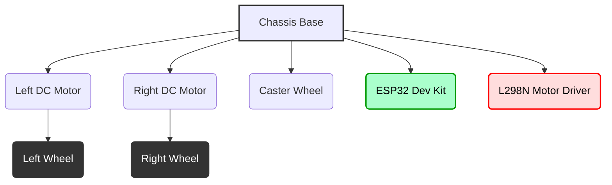

## 05-Project 4: ESP32 Wi-Fi Robot Car with Web Control

This project leverages the powerful capabilities of the ESP32 microcontroller, integrating Wi-Fi connectivity to build a robot car that can be controlled wirelessly from any web browser or smartphone on the same network. This introduces concepts of network communication, web server programming, and remote control of a robot.

### 5.1 Objective

Build an ESP32-based mobile robot car that can be controlled via a simple web interface hosted on the ESP32 itself. The web interface will allow users to send commands (e.g., forward, backward, left, right, stop) to the robot.

### 5.2 Key Concepts Covered

*   **Electronics:** ESP32 board, DC motors, motor drivers, power management.
*   **Programming (Arduino for ESP32):** Wi-Fi connectivity (`WiFi.h`), web server (`WebServer.h`), GPIO control, PWM.
*   **Network Communication:** HTTP protocol, client-server model.
*   **Actuators:** DC motor control.
*   **User Interface:** Web-based control.

### 5.3 Materials Required

#### 5.3.1 Hardware Components

*   **ESP32 Dev Kit (e.g., ESP32-WROOM-32 Development Board):** 1
*   **Robot Chassis:** A small mobile robot chassis with two DC gear motors and wheels.
*   **DC Gear Motors:** 2
*   **Wheels:** 2
*   **Caster Wheel/Skid:** 1
*   **L298N Motor Driver Module:** 1 (or a more compact L293D, or specialized ESP32 motor driver like ESP32-CAM shield with motor driver)
    *   **Note:** If using L298N, ensure its logic 5V is compatible with ESP32's 3.3V GPIO. Using a separate 5V regulator for L298N VCC and connecting its INx pins to ESP32 GPIOs is usually fine.
*   **Battery Pack/Holder (6-12V):** 1 (for motor driver power, e.g., 4xAA or 18650 Li-ion pack with step-up/down)
*   **USB Power Bank (optional, for ESP32 power):** To make the robot truly mobile without a cable.
*   **Jumper Wires:** Assorted pack
*   **USB Cable:** 1 (for ESP32 programming)

#### 5.3.2 Tools

*   **Small Screwdriver Set**
*   **Computer with Arduino IDE installed (with ESP32 board support)**
*   **Smartphone or computer with a web browser**

### 5.4 Hardware Assembly

1.  **Assemble the Chassis:** Attach motors, wheels, and caster wheel to the robot chassis.
2.  **Mount ESP32 and Motor Driver:** Secure the ESP32 development board and L298N motor driver module to the chassis.
3.  **Power Management:**
    *   Connect the motor battery pack to the L298N motor driver's power input (e.g., +12V and GND terminals).
    *   Power the ESP32: It can be powered via its micro-USB port from a USB power bank or a 5V step-down converter from the motor battery pack (if the pack is >5V). **Ensure ESP32 GND and Motor Driver GND are connected together (common ground).**

**Diagram 5.1: Conceptual ESP32 Robot Car Assembly**



*Description: A conceptual top-down view of an ESP32-based robot car assembly, showing the placement of motors, wheels, caster, ESP32, and motor driver.*

### 5.5 Circuit Diagram

**Connections to L298N Motor Driver:**

*   **Motor A (Left Motor):** `OUT1` and `OUT2` pins of L298N to the two terminals of the left DC motor.
*   **Motor B (Right Motor):** `OUT3` and `OUT4` pins of L298N to the two terminals of the right DC motor.
*   **Power Input:** `+12V` (or motor voltage, e.g., +6V from 4xAA battery pack) to L298N's `+12V` terminal. `GND` to L298N's `GND` terminal.
*   **Logic Power:** Connect L298N `GND` to ESP32 `GND`. (The L298N's 5V output pin can be left unconnected as ESP32 runs on 3.3V logic).

**Connections to ESP32:**

*   **L298N Control Pins (ESP32 GPIOs):**
    *   `ENA` (Enable for Motor A) to ESP32 GPIO 16 (PWM).
    *   `IN1` to ESP32 GPIO 17.
    *   `IN2` to ESP32 GPIO 5.
    *   `ENB` (Enable for Motor B) to ESP32 GPIO 18 (PWM).
    *   `IN3` to ESP32 GPIO 19.
    *   `IN4` to ESP32 GPIO 21.
    *   **Note:** Specific GPIO numbers can vary. Choose available PWM-capable pins for ENA/ENB.
*   **ESP32 Power:** Micro-USB cable to power bank / computer, or `5V` pin to step-down converter from motor battery.

**Diagram 5.2: ESP32 Wi-Fi Robot Car Circuit Diagram**

```mermaid
graph LR
    SUBGRAPH Power Supplies
        ESP32_PS[USB Power Bank/5V Converter] -- (+) --> ESP32_VIN(ESP32 5V/VIN)
        ESP32_PS -- (-) --> ESP32_GND(ESP32 GND)
        MOT_BAT[Motor Battery] -- (+) --> L298_12V(L298N +12V)
        MOT_BAT -- (-) --> L298_GND(L298N GND)
    END
    
    SUBGRAPH ESP32 Dev Kit
        ESP32_5V(5V)
        ESP32_GND
        ESP32_GPIO5(GPIO5)
        ESP32_GPIO16(GPIO16 PWM)
        ESP32_GPIO17(GPIO17)
        ESP32_GPIO18(GPIO18 PWM)
        ESP32_GPIO19(GPIO19)
        ESP32_GPIO21(GPIO21)
    END
    
    SUBGRAPH L298N Motor Driver
        L298_12V
        L298_5V(5V Out)
        L298_GND
        L298_ENA(ENA)
        L298_IN1(IN1)
        L298_IN2(IN2)
        L298_OUT1(OUT1)
        L298_OUT2(OUT2)
        L298_ENB(ENB)
        L298_IN3(IN3)
        L298_IN4(IN4)
        L298_OUT3(OUT3)
        L298_OUT4(OUT4)
    END
    
    SUBGRAPH DC Motors
        MOTOR_L_T1(Left Motor T1)
        MOTOR_L_T2(Left Motor T2)
        MOTOR_R_T1(Right Motor T1)
        MOTOR_R_T2(Right Motor T2)
    END
    
    L298_GND --> ESP32_GND
    
    ESP32_GPIO16 --> L298_ENA
    ESP32_GPIO17 --> L298_IN1
    ESP32_GPIO5 --> L298_IN2
    ESP32_GPIO18 --> L298_ENB
    ESP32_GPIO19 --> L298_IN3
    ESP32_GPIO21 --> L298_IN4
    
    L298_OUT1 --> MOTOR_L_T1
    L298_OUT2 --> MOTOR_L_T2
    L298_OUT3 --> MOTOR_R_T1
    L298_OUT4 --> MOTOR_R_T2
```

*Description: A detailed circuit diagram showing the connections between ESP32 Dev Kit, L298N motor driver, and two DC motors, with separate power supplies for ESP32 and motors, sharing a common ground.*

### 5.6 Software Development (Arduino Sketch for ESP32)

#### 5.6.1 Define Wi-Fi Credentials and Motor Pins

```cpp
#include <WiFi.h> 
#include <WebServer.h> // ESP32 Web Server library

// Replace with your network credentials
const char* ssid = "YOUR_WIFI_SSID";
const char* password = "YOUR_WIFI_PASSWORD";

WebServer server(80); // Create a web server on port 80

// Motor Driver Pins (ESP32 GPIOs) - adjust based on your wiring
// Left Motor
const int ENA = 16;
const int IN1 = 17;
const int IN2 = 5;

// Right Motor
const int ENB = 18;
const int IN3 = 19;
const int IN4 = 21;

// Motor Speeds (0-255)
const int baseSpeed = 150;
const int turnSpeed = 120;
const int fullStop = 0;

// PWM Channels for ESP32 (0-15)
const int pwmChannelA = 0;
const int pwmChannelB = 1;
const int freq = 30000; // PWM frequency
const int resolution = 8; // 8-bit resolution (0-255)
```

#### 5.6.2 Motor Control Functions

Use helper functions for motor control, now using ESP32's `ledcWrite` for PWM.

```cpp
// Initialize PWM channels
void initPWM() {
  ledcSetup(pwmChannelA, freq, resolution);
  ledcAttachPin(ENA, pwmChannelA);

  ledcSetup(pwmChannelB, freq, resolution);
  ledcAttachPin(ENB, pwmChannelB);
}

void setLeftMotorSpeed(int speed) {
  if (speed == 0) {
    digitalWrite(IN1, LOW);
    digitalWrite(IN2, LOW);
    ledcWrite(pwmChannelA, 0);
  } else if (speed > 0) { // Forward
    digitalWrite(IN1, HIGH);
    digitalWrite(IN2, LOW);
    ledcWrite(pwmChannelA, speed);
  } else { // Backward
    digitalWrite(IN1, LOW);
    digitalWrite(IN2, HIGH);
    ledcWrite(pwmChannelA, -speed);
  }
}

void setRightMotorSpeed(int speed) {
  if (speed == 0) {
    digitalWrite(IN3, LOW);
    digitalWrite(IN4, LOW);
    ledcWrite(pwmChannelB, 0);
  } else if (speed > 0) { // Forward
    digitalWrite(IN3, HIGH);
    digitalWrite(IN4, LOW);
    ledcWrite(pwmChannelB, speed);
  } else { // Backward
    digitalWrite(IN3, LOW);
    digitalWrite(IN4, HIGH);
    ledcWrite(pwmChannelB, -speed);
  }
}

// Robot movement commands
void moveForward() {
  setLeftMotorSpeed(baseSpeed);
  setRightMotorSpeed(baseSpeed);
}

void moveBackward() {
  setLeftMotorSpeed(-baseSpeed);
  setRightMotorSpeed(-baseSpeed);
}

void turnLeft() {
  setLeftMotorSpeed(0); // Stop left or reverse it
  setRightMotorSpeed(turnSpeed);
}

void turnRight() {
  setLeftMotorSpeed(turnSpeed);
  setRightMotorSpeed(0); // Stop right or reverse it
}

void stopMotors() {
  setLeftMotorSpeed(fullStop);
  setRightMotorSpeed(fullStop);
}
```

#### 5.6.3 Web Server Handlers

Define functions to respond to web requests.

```cpp
String createWebPage() {
  String html = R"rawliteral(
  <!DOCTYPE html>
  <html>
  <head>
    <meta name="viewport" content="width=device-width, initial-scale=1">
    <title>ESP32 Robot Control</title>
    <style>
      body { font-family: Arial, sans-serif; text-align: center; margin: 20px; background-color: #f0f0f0; }
      .button-grid { display: grid; grid-template-columns: repeat(3, 1fr); gap: 10px; max-width: 400px; margin: 20px auto; }
      .button-grid a {
        display: block; padding: 20px; background-color: #4CAF50; color: white; text-decoration: none;
        font-size: 24px; border-radius: 8px; transition: background-color 0.3s;
      }
      .button-grid a:hover { background-color: #45a049; }
      .button-grid a.stop { background-color: #f44336; }
      .button-grid a.stop:hover { background-color: #da190b; }
      .label { padding: 20px; background-color: #ddd; border-radius: 8px; font-size: 24px; }
      h1 { color: #333; }
      p { color: #555; }
    </style>
  </head>
  <body>
    <h1>ESP32 Robot Control</h1>
    <p>Robot IP: )rawliteral" + WiFi.localIP().toString() + R"rawliteral(
    <div class="button-grid">
      <span></span><a href="/forward">Forward</a><span></span>
      <a href="/left">Left</a><a href="/stop" class="stop">STOP</a><a href="/right">Right</a>
      <span></span><a href="/backward">Backward</a><span></span>
    </div>
  </body>
  </html>
  )rawliteral";
  return html;
}

void handleRoot() {
  server.send(200, "text/html", createWebPage());
}

void handleForward() {
  Serial.println("Command: Forward");
  moveForward();
  server.sendHeader("Location", "/"); // Redirect back to root
  server.send(303);
}

void handleBackward() {
  Serial.println("Command: Backward");
  moveBackward();
  server.sendHeader("Location", "/");
  server.send(303);
}

void handleLeft() {
  Serial.println("Command: Left");
  turnLeft();
  server.sendHeader("Location", "/");
  server.send(303);
}

void handleRight() {
  Serial.println("Command: Right");
  turnRight();
  server.sendHeader("Location", "/");
  server.send(303);
}

void handleStop() {
  Serial.println("Command: STOP");
  stopMotors();
  server.sendHeader("Location", "/");
  server.send(303);
}

void handleNotFound() {
  server.send(404, "text/plain", "Not Found");
}
```

#### 5.6.4 `setup()` Function

Connect to Wi-Fi, set up PWM, configure motor pins, and define web server routes.

```cpp
void setup() {
  Serial.begin(115200);

  // Motor pins
  pinMode(IN1, OUTPUT); pinMode(IN2, OUTPUT);
  pinMode(IN3, OUTPUT); pinMode(IN4, OUTPUT);

  initPWM(); // Initialize ESP32 PWM channels
  stopMotors(); // Ensure motors are stopped

  Serial.print("Connecting to WiFi ");
  Serial.println(ssid);
  WiFi.begin(ssid, password);
  int connect_timeout = 0;
  while (WiFi.status() != WL_CONNECTED && connect_timeout < 20) { // Try for 10 seconds
    delay(500);
    Serial.print(".");
    connect_timeout++;
  }

  if (WiFi.status() == WL_CONNECTED) {
    Serial.println("\nWiFi connected.");
    Serial.print("Robot IP address: ");
    Serial.println(WiFi.localIP());

    // Setup web server routes
    server.on("/", handleRoot);
    server.on("/forward", handleForward);
    server.on("/backward", handleBackward);
    server.on("/left", handleLeft);
    server.on("/right", handleRight);
    server.on("/stop", handleStop);
    server.onNotFound(handleNotFound);

    server.begin();
    Serial.println("HTTP server started.");
  } else {
    Serial.println("\nFailed to connect to WiFi. Check credentials and retry.");
    // Optionally blink an LED or go into a fallback mode
  }
}
```

#### 5.6.5 `loop()` Function

Continuously handle incoming web client requests.

```cpp
void loop() {
  server.handleClient(); // This line is crucial for the web server to function
  delay(1); // Small delay to yield to other tasks/Wi-Fi stack
}
```

### 5.7 Testing and Calibration

1.  **ESP32 Setup:** Ensure you have correctly installed ESP32 board support in your Arduino IDE.
2.  **Wi-Fi Credentials:** Double-check your `ssid` and `password`.
3.  **Motor Test:** Verify motor directions and speeds. Adjust `baseSpeed` and `turnSpeed`.
4.  **Network Connectivity:** After uploading, check the Serial Monitor for the ESP32's assigned IP address. Try to ping this IP address from your computer.
5.  **Web Control:** Open a web browser (on the same Wi-Fi network) and navigate to the IP address printed in the Serial Monitor. Test all robot movement buttons.
6.  **Debouncing:** Add a small delay after each motor command to give the robot time to execute the action before potentially receiving a new command, preventing jerky movements.

### 5.8 Challenges and Further Enhancements

*   **Custom Control Interface:** Instead of simple buttons, design a more advanced web interface using JavaScript for joystick-like control or slider-based speed adjustment.
*   **Feedback on Webpage:** Display sensor data (e.g., ultrasonic distance, battery level) on the web interface.
*   **Live Video Stream:** If using an ESP32-CAM, integrate a live video stream from the robot's camera to the web interface.
*   **Security:** Implement basic authentication for the web server (e.g., username/password).
*   **MQTT/WebSocket Control:** For more responsive and persistent control, implement MQTT or WebSocket communication instead of HTTP requests.
*   **Mobile App:** Develop a dedicated smartphone application (e.g., using Flutter, React Native, or a native platform) to control the robot via Wi-Fi or Bluetooth (if ESP32).
*   **Autonomous Mode Switch:** Add a button on the webpage to switch between manual web control and an autonomous mode (e.g., obstacle avoidance).

---

### Notes for Teachers

*   **Network Basics:** Explain basic concepts like IP addresses, client-server model, and HTTP requests.
*   **Security Reminder:** Briefly discuss the security implications of open web servers on local networks.
*   **Debugging Wi-Fi:** Guide students on how to troubleshoot common Wi-Fi connection issues (wrong SSID/password, network range).

### Notes for Students

*   **Common Ground:** Ensure your ESP32 and motor driver share a common GND connection.
*   **Power for Motors:** Motors drawing too much current can cause the ESP32 to reset or behave erratically. Use a separate, robust power supply for motors.
*   **GPIO Voltage:** Remember that ESP32 GPIOs operate at 3.3V logic. L298N logic inputs generally work fine with 3.3V, but be aware of the difference.
*   **IP Address:** Keep track of your robot's IP address. It might change if your router reassigns it.
*   **Serial Output for Debugging:** The Serial Monitor is still your best friend for debugging Wi-Fi connection issues and command processing.