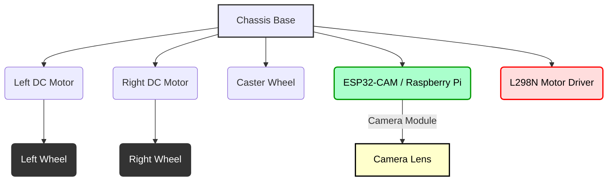

--- 
sidebar_position: 6
title: "Project 5: Simple Visual Object Tracking Robot"
---

## 06-Project 5: Simple Visual Object Tracking Robot

This project introduces basic computer vision into a mobile robot. You will build a robot that uses a camera to detect a specific colored object (e.g., a red ball) and then autonomously move towards and track that object. This project integrates perception, decision-making, and motor control based on visual input.

### 6.1 Objective

Build a mobile robot (preferably using an ESP32-CAM or Raspberry Pi for camera processing) that detects a specific colored object (e.g., a red ball) and tracks its movement by driving towards it and keeping it centered in its field of view.

### 6.2 Key Concepts Covered

*   **Electronics:** Mobile robot platform, motors, motor drivers, ESP32-CAM/Raspberry Pi.
*   **Programming:** Python (for Raspberry Pi/MicroPython on ESP32) or C++ (for more advanced ESP32-CAM/ESP-IDF setups), image processing (color thresholding), basic object detection, motor control.
*   **Computer Vision:** Color space conversion (HSV), thresholding, morphological operations, contour detection, centroid calculation.
*   **Actuators:** DC motor control based on visual feedback.
*   **Algorithms:** Simple visual servoing (proportional control based on object position).

### 6.3 Materials Required

#### 6.3.1 Hardware Components

*   **ESP32-CAM (or Raspberry Pi Zero W / Raspberry Pi 3/4):** 1 (This will be the brain for image processing)
    *   **ESP32-CAM:** More compact, lower power. Requires external motor driver.
    *   **Raspberry Pi:** More powerful, easier to work with Python/OpenCV. Can often directly drive motor drivers.
*   **Robot Chassis:** A small mobile robot chassis with two DC gear motors and wheels.
*   **DC Gear Motors:** 2
*   **Wheels:** 2
*   **Caster Wheel/Skid:** 1
*   **L298N Motor Driver Module (or equivalent for ESP32/Pi):** 1
    *   **Note:** For Raspberry Pi, dedicated HATs with motor drivers are available and simplify wiring.
*   **Battery Pack/Holder (6-12V):** 1 (for motor driver power)
*   **USB Power Bank (for ESP32-CAM/Raspberry Pi):** Crucial for powering the camera board independently.
*   **Jumper Wires:** Assorted pack
*   **Colored Object:** A brightly and uniformly colored object (e.g., a red ball, a blue block) for the robot to track.
*   **USB Cable:** 1

#### 6.3.2 Tools

*   **Small Screwdriver Set**
*   **Computer with Python/OpenCV (for Pi) or Arduino IDE (with ESP32-CAM support) installed**

### 6.5 Hardware Assembly

1.  **Assemble the Chassis:** Attach motors, wheels, and caster wheel to the robot chassis.
2.  **Mount Camera Board and Motor Driver:** Secure the ESP32-CAM or Raspberry Pi and the motor driver module to the chassis. Position the camera at the front of the robot, with a clear view forward.
3.  **Power Management:**
    *   Connect the motor battery pack to the L298N motor driver's power input.
    *   Power the camera board:
        *   **ESP32-CAM:** Typically powered via its 5V and GND pins from a USB power bank or a suitable 5V regulator.
        *   **Raspberry Pi:** Powered via its micro-USB or USB-C port from a USB power bank.
    *   **Ensure ALL GNDs are connected together (common ground):** Motor battery GND, camera board GND, and motor driver GND.

**Diagram 6.1: Conceptual Visual Tracking Robot Assembly**



*Description: A conceptual top-down view of a visual tracking robot assembly, showing the placement of motors, wheels, camera board (ESP32-CAM or Raspberry Pi), and motor driver.*

### 6.5 Circuit Diagram (Example for ESP32-CAM with L298N)

**Connections to L298N Motor Driver:** (Same as Project 4)

*   **Motor A (Left Motor):** `OUT1` and `OUT2` pins of L298N to the two terminals of the left DC motor.
*   **Motor B (Right Motor):** `OUT3` and `OUT4` pins of L298N to the two terminals of the right DC motor.
*   **Power Input:** `+12V` (or motor voltage) to L298N's `+12V` terminal. `GND` to L298N's `GND` terminal.
*   **Logic Power:** Connect L298N `GND` to ESP32-CAM `GND`.

**Connections from ESP32-CAM to L298N:**

*   **Note:** ESP32-CAM has fewer readily available GPIOs after camera usage. Choose unused pins.
*   **ENA** to ESP32-CAM GPIO 14 (PWM capable).
*   **IN1** to ESP32-CAM GPIO 13.
*   **IN2** to ESP32-CAM GPIO 15.
*   **ENB** to ESP32-CAM GPIO 2 (PWM capable).
*   **IN3** to ESP32-CAM GPIO 0.
*   **IN4** to ESP32-CAM GPIO 4.
*   **ESP32-CAM Power:** `5V` pin to USB power bank, `GND` to common ground.

**Diagram 6.2: ESP32-CAM Visual Tracking Robot Circuit Diagram**

```mermaid
graph LR
    SUBGRAPH Power Supplies
        ESP_PS[USB Power Bank] -- (+) --> ESP_5V(ESP32-CAM 5V)
        ESP_PS -- (-) --> ESP_GND(ESP32-CAM GND)
        MOT_BAT[Motor Battery] -- (+) --> L298_12V(L298N +12V)
        MOT_BAT -- (-) --> L298_GND(L298N GND)
    END
    
    SUBGRAPH ESP32-CAM
        ESP_5V
        ESP_GND
        ESP_GPIO0(GPIO0)
        ESP_GPIO2(GPIO2 PWM)
        ESP_GPIO4(GPIO4)
        ESP_GPIO13(GPIO13)
        ESP_GPIO14(GPIO14 PWM)
        ESP_GPIO15(GPIO15)
        ESP_CAM[Camera Module]
        ESP_CAM --> ESP32_CAM_PINS
    END
    
    SUBGRAPH L298N Motor Driver
        L298_12V
        L298_5V(5V Out)
        L298_GND
        L298_ENA(ENA)
        L298_IN1(IN1)
        L298_IN2(IN2)
        L298_OUT1(OUT1)
        L298_OUT2(OUT2)
        L298_ENB(ENB)
        L298_IN3(IN3)
        L298_IN4(IN4)
        L298_OUT3(OUT3)
        L298_OUT4(OUT4)
    END
    
    SUBGRAPH DC Motors
        MOTOR_L_T1(Left Motor T1)
        MOTOR_L_T2(Left Motor T2)
        MOTOR_R_T1(Right Motor T1)
        MOTOR_R_T2(Right Motor T2)
    END
    
    L298_GND --> ESP_GND
    
    ESP_GPIO14 --> L298_ENA
    ESP_GPIO13 --> L298_IN1
    ESP_GPIO15 --> L298_IN2
    ESP_GPIO2 --> L298_ENB
    ESP_GPIO0 --> L298_IN3
    ESP_GPIO4 --> L298_IN4
    
    L298_OUT1 --> MOTOR_L_T1
    L298_OUT2 --> MOTOR_L_T2
    L298_OUT3 --> MOTOR_R_T1
    L298_OUT4 --> MOTOR_R_T2
```

*Description: A detailed circuit diagram for an ESP32-CAM based visual tracking robot, connecting to an L298N motor driver and DC motors, with common grounding and separate power for camera board and motors.*

### 6.6 Software Development (Python for Raspberry Pi or Arduino for ESP32-CAM)

**Option 1: Python on Raspberry Pi (Recommended for ease of OpenCV)**

1.  **Install OpenCV:** `sudo apt-get update && sudo apt-get install python3-opencv`
2.  **Install picamera (if using Pi Camera Module):** `sudo apt-get install python3-picamera`

```python
# robot_tracker.py (Python for Raspberry Pi)
import cv2
import numpy as np
import time
import RPi.GPIO as GPIO # For motor control

# --- Motor Control Pins (Adjust these for your RPi GPIO setup) ---
# Assuming L298N connected to RPi GPIO
MOTOR_AIN1 = 17 # Left Motor Input 1
MOTOR_AIN2 = 18 # Left Motor Input 2
MOTOR_PWMA = 27 # Left Motor PWM (e.g., GPIO 27)

MOTOR_BIN1 = 22 # Right Motor Input 1
MOTOR_BIN2 = 23 # Right Motor Input 2
MOTOR_PWMB = 24 # Right Motor PWM (e.g., GPIO 24)

# --- Robot Parameters ---
BASE_SPEED = 50 # PWM value (0-100 for RPi.GPIO PWM)
TURN_SPEED_FACTOR = 0.8 # How much to reduce one wheel speed for turning
STOP_SPEED = 0

# --- Color Detection Parameters (HSV Range for Red) ---
# These values will need to be calibrated for your object and lighting conditions.
# Use a tool like OpenCV's `cv.cvtColor(np.uint8([[[B,G,R]]]), cv.COLOR_BGR2HSV)`
# and then `cv.inRange()` to find the right range.
LOWER_COLOR = np.array([0, 100, 100])
UPPER_COLOR = np.array([10, 255, 255])
# For a different color (e.g., Blue):
# LOWER_COLOR = np.array([100, 100, 100])
# UPPER_COLOR = np.array([120, 255, 255])

# --- Tracking Control Parameters ---
CENTER_X_THRESHOLD = 50 # Pixels around center to consider "centered"
MIN_OBJECT_AREA = 500   # Minimum contour area to consider an object (filter noise)

# --- GPIO Setup ---
def setup_gpio():
    GPIO.setmode(GPIO.BCM) # Use BCM numbering
    
    # Left Motor
    GPIO.setup(MOTOR_AIN1, GPIO.OUT)
    GPIO.setup(MOTOR_AIN2, GPIO.OUT)
    GPIO.setup(MOTOR_PWMA, GPIO.OUT)
    
    # Right Motor
    GPIO.setup(MOTOR_BIN1, GPIO.OUT)
    GPIO.setup(MOTOR_BIN2, GPIO.OUT)
    GPIO.setup(MOTOR_PWMB, GPIO.OUT)

    # Setup PWM instances
    global pwm_left, pwm_right
    pwm_left = GPIO.PWM(MOTOR_PWMA, 100) # 100 Hz PWM frequency
    pwm_right = GPIO.PWM(MOTOR_PWMB, 100)
    
    pwm_left.start(0)
    pwm_right.start(0)

# --- Motor Control Functions ---
def set_motor_speed(motor, speed):
    # speed: -100 to 100
    if motor == "left":
        if speed > 0: # Forward
            GPIO.output(MOTOR_AIN1, GPIO.HIGH)
            GPIO.output(MOTOR_AIN2, GPIO.LOW)
            pwm_left.ChangeDutyCycle(min(100, speed))
        elif speed < 0: # Backward
            GPIO.output(MOTOR_AIN1, GPIO.LOW)
            GPIO.output(MOTOR_AIN2, GPIO.HIGH)
            pwm_left.ChangeDutyCycle(min(100, abs(speed)))
        else: # Stop
            GPIO.output(MOTOR_AIN1, GPIO.LOW)
            GPIO.output(MOTOR_AIN2, GPIO.LOW)
            pwm_left.ChangeDutyCycle(0)
    elif motor == "right":
        if speed > 0: # Forward
            GPIO.output(MOTOR_BIN1, GPIO.HIGH)
            GPIO.output(MOTOR_BIN2, GPIO.LOW)
            pwm_right.ChangeDutyCycle(min(100, speed))
        elif speed < 0: # Backward
            GPIO.output(MOTOR_BIN1, GPIO.LOW)
            GPIO.output(MOTOR_BIN2, GPIO.HIGH)
            pwm_right.ChangeDutyCycle(min(100, abs(speed)))
        else: # Stop
            GPIO.output(MOTOR_BIN1, GPIO.LOW)
            GPIO.output(MOTOR_BIN2, GPIO.LOW)
            pwm_right.ChangeDutyCycle(0)

def move_forward():
    set_motor_speed("left", BASE_SPEED)
    set_motor_speed("right", BASE_SPEED)

def turn_left():
    set_motor_speed("left", -BASE_SPEED * TURN_SPEED_FACTOR) # Reverse left for sharper turn
    set_motor_speed("right", BASE_SPEED)

def turn_right():
    set_motor_speed("left", BASE_SPEED)
    set_motor_speed("right", -BASE_SPEED * TURN_SPEED_FACTOR) # Reverse right for sharper turn

def stop_motors():
    set_motor_speed("left", STOP_SPEED)
    set_motor_speed("right", STOP_SPEED)

# --- Main Tracking Loop ---
def main():
    setup_gpio()
    
    # Initialize camera (using CSI camera for Pi)
    # cap = cv2.VideoCapture(0) # For USB camera
    # For Raspberry Pi Camera Module, use picamera or specific OpenCV backend
    # E.g., from picamera import PiCamera; camera = PiCamera(); camera.resolution = (640, 480)
    # For this example, let's simulate a camera feed or use a simple capture.
    
    # Placeholder for camera initialization (adjust for your specific setup)
    # Assuming a resolution of 640x480 for frame processing
    frame_width = 640
    frame_center_x = frame_width // 2

    print("Robot visual object tracking started. Press 'q' to quit.")

    try:
        # Example: Using a dummy frame if no camera is available
        # In a real scenario, this would be: `ret, frame = cap.read()`
        # while True:
        #     # Simulate frame or read from actual camera
        #     # frame = np.zeros((480, 640, 3), dtype=np.uint8) # Dummy frame
        #     # ... (read from camera here)
        #     # if not ret: continue

        for _ in range(1000): # Run for a simulated number of frames
            # Simulate a frame (e.g., with a red object for testing)
            frame = np.zeros((480, 640, 3), dtype=np.uint8)
            # Simulate object appearing randomly
            if np.random.rand() < 0.2:
                obj_x = np.random.randint(0, frame_width - 50)
                obj_y = np.random.randint(0, 480 - 50)
                frame[obj_y:obj_y+50, obj_x:obj_x+50] = [0, 0, 255] # Red square

            # Convert BGR to HSV
            hsv = cv2.cvtColor(frame, cv2.COLOR_BGR2HSV)

            # Create a mask for the specified color range
            mask = cv2.inRange(hsv, LOWER_COLOR, UPPER_COLOR)

            # Perform morphological operations to clean up mask
            mask = cv2.erode(mask, None, iterations=2)
            mask = cv2.dilate(mask, None, iterations=2)

            # Find contours in the mask
            contours, _ = cv2.findContours(mask, cv2.RETR_EXTERNAL, cv2.CHAIN_APPROX_SIMPLE)

            object_found = False
            if contours:
                # Find the largest contour
                largest_contour = max(contours, key=cv2.contourArea)
                
                # Filter by minimum area
                if cv2.contourArea(largest_contour) > MIN_OBJECT_AREA:
                    object_found = True
                    # Get bounding circle and its centroid
                    ((x, y), radius) = cv2.minEnclosingCircle(largest_contour)
                    M = cv2.moments(largest_contour)
                    center_x = int(M["m10"] / M["m00"])
                    # center_y = int(M["m01"] / M["m00"]) # Not needed for horizontal tracking

                    # Draw bounding circle (optional, for visualization)
                    # cv2.circle(frame, (int(x), int(y)), int(radius), (0, 255, 255), 2)
                    # cv2.circle(frame, (center_x, int(y)), 5, (0, 0, 255), -1)

                    # --- Decision Making (Proportional Control) ---
                    if center_x < frame_center_x - CENTER_X_THRESHOLD:
                        print(f"Object at Left ({center_x}). Turning Left.")
                        turn_left()
                    elif center_x > frame_center_x + CENTER_X_THRESHOLD:
                        print(f"Object at Right ({center_x}). Turning Right.")
                        turn_right()
                    else:
                        print(f"Object Centered ({center_x}). Moving Forward.")
                        move_forward()
                else:
                    print("Object too small or noisy.")
                    stop_motors()
            
            if not object_found:
                print("No object detected. Stopping.")
                stop_motors()

            # Display the frame (optional, for debugging/visualization)
            # cv2.imshow("Tracking", frame)
            # key = cv2.waitKey(1) & 0xFF
            # if key == ord("q"): break
            
            time.sleep(0.1) # Simulate frame rate

    except KeyboardInterrupt:
        print("Stopping robot.")
    finally:
        stop_motors()
        GPIO.cleanup()
        # cap.release()
        # cv2.destroyAllWindows()

if __name__ == "__main__":
    main()
```

**Option 2: Arduino for ESP32-CAM (More complex setup for image processing)**

For ESP32-CAM, you'd use the ESP-IDF framework or specific Arduino libraries for ESP32-CAM. The image processing part would be written in C++. This is a conceptual example.

```cpp
// ESP32-CAM Visual Object Tracking Robot
// This sketch aims to detect a specific colored object and track it.
// Requires ESP32-CAM board support in Arduino IDE.

#include "esp_camera.h"
#include <WiFi.h>
#include <WebServer.h> // For optional web streaming/control if needed
#include <esp_timer.h> // For timing
#include <soc/soc.h>   // Disable brownout detector
#include <soc/rtc_cntl_reg.h> // Disable brownout detector

// --- Motor Control Pins (Adjust these for your ESP32-CAM GPIO setup) ---
// See ESP32-CAM pinout, avoid pins used by camera (e.g., GPIO 4, 16, 0, 2, 12, 13, 14, 15)
// Example: Using GPIOs 12, 13, 14, 15, 0, 2 for L298N (careful with 0, 2 as they are boot pins)
// Better to pick less critical GPIOs if available, but ESP32-CAM has limited options.
// For L298N, need 2 PWM (ENA, ENB) and 4 digital (IN1-IN4)

// Left Motor (example GPIOs, adjust as needed)
const int ENA = 14;   // GPIO 14 (PWM)
const int IN1 = 13;   // GPIO 13
const int IN2 = 15;   // GPIO 15

// Right Motor (example GPIOs, adjust as needed)
const int ENB = 2;   // GPIO 2 (PWM, also onboard LED) - be careful
const int IN3 = 0;   // GPIO 0 (boot pin) - be careful
const int IN4 = 4;   // GPIO 4 (Flash LED, also boot pin) - be careful

// Motor Speeds (0-255)
const int BASE_SPEED = 100;
const int TURN_SPEED_FACTOR = 0.8;
const int STOP_SPEED = 0;

// PWM Channels for ESP32 (0-15)
const int pwmChannelA = 0;
const int pwmChannelB = 1;
const int freq = 30000;
const int resolution = 8; // 8-bit resolution (0-255)

// --- Color Detection Parameters (HSV Range for Red) ---
// These values will need to be calibrated for your object and lighting conditions.
// Example values for red, adjust accordingly
int hMin = 0; int sMin = 100; int vMin = 100;
int hMax = 10; int sMax = 255; int vMax = 255;
// A second range for red (since red wraps around 0/180 in HSV)
int hMin2 = 160; int sMin2 = 100; int vMin2 = 100;
int hMax2 = 180; int sMax2 = 255; int vMax2 = 255;

// --- Tracking Control Parameters ---
const int CENTER_X_THRESHOLD = 50; // Pixels around center to consider "centered"
const int MIN_OBJECT_AREA = 500;   // Minimum contour area to consider an object

// --- Camera Configuration ---
camera_config_t config;

// --- Motor Control Functions (ESP32-Specific PWM) ---
void initPWM() {
  ledcSetup(pwmChannelA, freq, resolution);
  ledcAttachPin(ENA, pwmChannelA);

  ledcSetup(pwmChannelB, freq, resolution);
  ledcAttachPin(ENB, pwmChannelB);
}

void setLeftMotorSpeed(int speed) { /* ... same as Project 4 ... */ }
void setRightMotorSpeed(int speed) { /* ... same as Project 4 ... */ }
void moveForward() { /* ... same as Project 4 ... */ }
void moveBackward() { /* ... same as Project 4 ... */ }
void turnLeft() { /* ... same as Project 4 ... */ }
void turnRight() { /* ... same as Project 4 ... */ }
void stopMotors() { /* ... same as Project 4 ... */ }


// --- Camera Setup ---
void setupCamera() {
  WRITE_PERI_REG(RTC_CNTL_BROWN_OUT_REG, 0); // Disable brownout detector

  config.ledc_channel = LEDC_CHANNEL_0;
  config.ledc_timer = LEDC_TIMER_0;
  config.pin_d0 = 5; config.pin_d1 = 18; config.pin_d2 = 19; config.pin_d3 = 21;
  config.pin_d4 = 36; config.pin_d5 = 39; config.pin_d6 = 34; config.pin_d7 = 35;
  config.pin_xclk = 0;
  config.pin_pclk = 22; config.pin_vsync = 25; config.pin_href = 23;
  config.pin_sscb_sda = 26; config.pin_sscb_scl = 27;
  config.pin_pwdn = 32; config.pin_reset = -1; // reset pin (negative for disable reset pad)
  config.xclk_freq_hz = 20000000;
  config.pixel_format = PIXFORMAT_JPEG; // Use JPEG for faster transfer/processing if stream
  // For actual image processing, use YUV422 or RGB565 to avoid JPEG decode on ESP32
  // config.pixel_format = PIXFORMAT_RGB565; // Or PIXFORMAT_YUV422

  config.frame_size = FRAMESIZE_QVGA; // 320x240
  config.jpeg_quality = 10;
  config.fb_count = 1; // At least 2 for JPEG, 1 for RGB/YUV

  esp_err_t err = esp_camera_init(&config);
  if (err != ESP_OK) {
    Serial.printf("Camera init failed with error 0x%x\n", err);
    return;
  }
  Serial.println("Camera initialized.");
  // Set white balance mode to auto
  sensor_t * s = esp_camera_sensor_get();
  s->set_whitebal(s, 1);
}

// --- Main Setup ---
void setup() {
  Serial.begin(115200);

  // Motor pins
  pinMode(IN1, OUTPUT); pinMode(IN2, OUTPUT);
  pinMode(IN3, OUTPUT); pinMode(IN4, OUTPUT);

  initPWM(); // Initialize ESP32 PWM channels
  stopMotors();

  setupCamera();
  Serial.println("ESP32-CAM Visual Tracker Ready!");
}

// --- Main Loop ---
void loop() {
  camera_fb_t * fb = esp_camera_fb_get();
  if (!fb) {
    Serial.println("Camera capture failed");
    return;
  }

  // --- Image Processing (Conceptual, highly optimized code needed for real-time) ---
  // ESP32-CAM does not run full OpenCV directly.
  // This logic must be implemented using highly optimized pixel manipulation
  // or a specialized library for ESP32-CAM (e.g. from esp-who)
  
  int center_x = -1;
  int object_area = 0;

  // Placeholder for image processing:
  // 1. Convert to HSV (pixel by pixel) - if PIXFORMAT_RGB565 is used
  // 2. Apply color thresholding (pixel by pixel) to create a binary mask
  // 3. Find largest contour/blob in the mask
  // 4. Calculate centroid (center_x) and area of the largest blob

  // For demonstration, let's simulate a detected object
  if (random(0,100) < 50) { // 50% chance of detecting an object
      center_x = random(50, fb->width - 50); // Random x within frame
      object_area = random(MIN_OBJECT_AREA, MIN_OBJECT_AREA * 5);
  }

  Serial.printf("Frame: %dx%d, Object detected: %s\n", fb->width, fb->height, (center_x != -1 ? "YES" : "NO"));
  
  if (center_x != -1 && object_area > MIN_OBJECT_AREA) {
    int frame_center_x = fb->width / 2;
    if (center_x < frame_center_x - CENTER_X_THRESHOLD) {
      Serial.printf("Object at Left (%d). Turning Left.\n", center_x);
      turnLeft();
    } else if (center_x > frame_center_x + CENTER_X_THRESHOLD) {
      Serial.printf("Object at Right (%d). Turning Right.\n", center_x);
      turnRight();
    } else {
      Serial.printf("Object Centered (%d). Moving Forward.\n", center_x);
      moveForward();
    }
  } else {
    Serial.println("No object detected. Stopping.");
    stopMotors();
  }

  esp_camera_fb_return(fb); // Return the frame buffer
  delay(10); // Yield to other tasks
}
```

### 6.7 Testing and Calibration

1.  **Camera Setup:**
    *   **Raspberry Pi:** Ensure your camera module is enabled (`sudo raspi-config`) and working. Test with `raspistill` or a simple Python script (`import cv2; cap = cv2.VideoCapture(0)`).
    *   **ESP32-CAM:** Flash the ESP32-CAM with the Arduino sketch. Check the Serial Monitor for output and ensure the camera initializes without errors. You might need to adjust pin configurations for your specific module.
2.  **Color Calibration:** This is critical. Use an OpenCV Python script (or online HSV color picker tools) to find the precise `LOWER_COLOR` and `UPPER_COLOR` HSV ranges for your colored object under your specific lighting conditions.
3.  **Motor Test:** Verify motor functionality as in previous projects.
4.  **Tracking Test:** Place the colored object in front of the robot. Observe its movement.
    *   If it doesn't detect the object, re-calibrate color range or check `MIN_OBJECT_AREA`.
    *   If it oscillates too much, adjust `BASE_SPEED`, `TURN_SPEED_FACTOR`, or `CENTER_X_THRESHOLD`.
    *   If it loses the object, try to make the object larger or light the area better.

### 6.8 Challenges and Further Enhancements

*   **Robust Color Detection:** Use adaptive thresholding or more sophisticated color models to handle varying lighting conditions better.
*   **PID Control for Steering:** Implement a PID controller for steering based on the object's X-position error (difference from `frame_center_x`) for smoother and more accurate tracking.
*   **Distance Control:** Based on the object's size (area or radius), control the robot's forward speed to maintain a constant distance from the object.
*   **Multiple Objects:** Extend the system to track multiple objects or prioritize one over others.
*   **Lost Object Behavior:** Implement a "search" behavior if the object is lost (e.g., spin slowly, look around).
*   **Obstacle Avoidance:** Integrate an ultrasonic sensor (as in Project 2) to ensure the robot doesn't crash into other objects while tracking its target.
*   **Web Interface (ESP32-CAM):** Combine this with the web control from Project 4, possibly streaming a low-resolution camera feed to the webpage.

--- 

### Notes for Teachers

*   **Computational Demands:** Highlight the significant computational demands of computer vision and why platforms like Raspberry Pi or ESP32-CAM are necessary.
*   **Calibration Importance:** Emphasize that color detection is highly sensitive to lighting and careful calibration of HSV ranges is crucial.
*   **Debugging Visuals:** Encourage students to display the processed frames (original, HSV, mask, contours) for debugging the vision pipeline.

### Notes for Students

*   **Power is Key:** Ensure both your camera board and motors have adequate and stable power. Common grounding is vital.
*   **Color Sensitivity:** Color detection is tricky. Small changes in lighting can drastically affect the mask. Calibrate your HSV ranges thoroughly.
*   **Optimized Code:** For real-time performance, especially on ESP32-CAM, your image processing code needs to be very efficient (e.g., minimizing pixel operations, choosing appropriate frame sizes).
*   **Simulate First:** If struggling with real-time performance, try running parts of your vision code on pre-recorded video or images on a more powerful computer first.
*   **"Garbage In, Garbage Out":** The quality of your visual tracking directly depends on the quality of your camera feed and your color detection.
