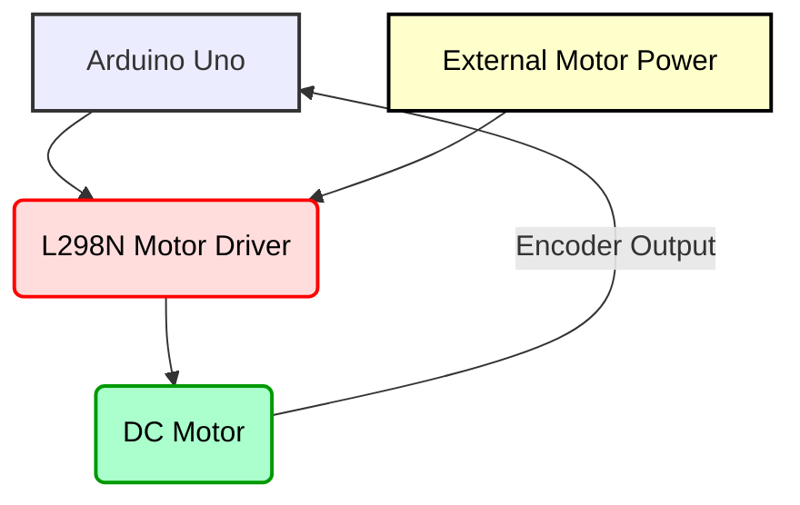

## 07-Project 6: Implementing PID Motor Control

This project takes motor control to the next level by implementing a **PID (Proportional-Integral-Derivative) controller** to precisely regulate the speed of a DC motor. Unlike simple open-loop control (setting a fixed PWM value), PID uses sensor feedback (from an encoder) to maintain a desired motor speed, even under varying loads or disturbances. This is a fundamental concept for achieving accurate and stable motion in any robotic system.

### 7.1 Objective

Implement a PID controller on an Arduino to maintain a target speed for a DC motor equipped with an encoder, demonstrating stable and accurate speed regulation.

### 7.2 Key Concepts Covered

*   **Electronics:** DC motor, motor driver, rotary encoder, Arduino.
*   **Programming (Arduino):** Interrupts (for encoder), Timers (`millis()` for non-blocking timing), PID algorithm implementation, digital I/O, PWM output.
*   **Actuators:** Precise DC motor speed control.
*   **Sensors:** Rotary encoder for speed feedback.
*   **Algorithms:** PID control loop (Proportional, Integral, Derivative terms), closed-loop feedback systems.

### 7.3 Materials Required

#### 7.3.1 Hardware Components

*   **Arduino Uno (or compatible):** 1
*   **DC Gear Motor with Encoder:** 1 (e.g., a motor with an integrated magnetic or optical encoder, often 12V or 6V)
    *   **Note:** If your motor doesn't have an encoder, you can add an external rotary encoder to the motor shaft.
*   **L298N Motor Driver Module:** 1 (or another suitable H-bridge motor driver, e.g., DRV8871)
*   **External Power Supply (for motor):** 12V or 6V power supply adequate for your motor (e.g., wall adapter, battery pack).
    *   **Crucial:** Do NOT power the motor directly from Arduino 5V.
*   **Breadboard:** 1 (optional, for encoder pull-ups or signal conditioning)
*   **Resistors (e.g., 10k Ohm):** 2 (for encoder signal pull-ups, if needed)
*   **Capacitors (e.g., 0.1uF, 100uF):** A few (for power supply smoothing, motor noise suppression)
*   **Jumper Wires:** Assorted pack
*   **USB Cable:** 1 (for Arduino programming)

#### 7.3.2 Tools

*   **Small Screwdriver Set**
*   **Multimeter (highly recommended for troubleshooting)**
*   **Computer with Arduino IDE installed**

### 7.4 Hardware Assembly

1.  **Mount Motor and Encoder:** Secure your DC motor with encoder to a stable base. Ensure the encoder output (if external) is aligned with the motor shaft.
2.  **Mount Arduino and Motor Driver:** Mount the Arduino Uno and L298N motor driver.

**Diagram 7.1: Conceptual PID Motor Control Setup**



*Description: A conceptual block diagram showing the main components for PID motor control: Arduino, motor driver, DC motor with encoder, and external motor power supply.*

### 7.5 Circuit Diagram

**Connections to L298N Motor Driver:**

*   **Motor:** `OUT1` and `OUT2` pins of L298N to the two terminals of the DC motor.
*   **Power Input:** `+MotorV` (e.g., 12V) to L298N's `+12V` terminal. `GND` to L298N's `GND` terminal.
*   **Logic Power:** L298N `GND` to Arduino `GND`. (Leave L298N's 5V output unconnected if powering Arduino via USB).

**Connections to Arduino:**

*   **L298N Control Pins:**
    *   `ENA` (Enable) to Arduino Digital Pin 9 (PWM).
    *   `IN1` to Arduino Digital Pin 8.
    *   `IN2` to Arduino Digital Pin 7.
*   **DC Motor Encoder (Incremental Quadrature Encoder):**
    *   `VCC` to Arduino `5V`.
    *   `GND` to Arduino `GND`.
    *   `Encoder_A_Output` to Arduino Digital Pin 2 (Interrupt 0 on Uno).
    *   `Encoder_B_Output` to Arduino Digital Pin 3 (Interrupt 1 on Uno).
    *   **Note:** Encoder outputs may require pull-up resistors (10k Ohm) to 5V if they are open-collector. Internal pull-ups (`INPUT_PULLUP`) can sometimes be used.
*   **Arduino Power:** USB cable (for programming and powering Arduino logic).

**Diagram 7.2: PID Motor Control Circuit Diagram**

```mermaid
graph LR
    SUBGRAPH Power Supplies
        ARD_USB[Arduino USB Power] -- (+5V) --> ARD_5V(Arduino 5V)
        ARD_USB -- GND --> ARD_GND(Arduino GND)
        MOT_PS[Motor Power Supply] -- (+MotorV) --> L298_12V(L298N +12V)
        MOT_PS -- GND --> L298_GND(L298N GND)
    END
    
    SUBGRAPH Arduino Uno
        ARD_5V
        ARD_GND
        ARD_D2(D2 Interrupt 0)
        ARD_D3(D3 Interrupt 1)
        ARD_D7(D7)
        ARD_D8(D8)
        ARD_D9(D9 PWM)
    END
    
    SUBGRAPH L298N Motor Driver
        L298_12V
        L298_GND
        L298_ENA(ENA)
        L298_IN1(IN1)
        L298_IN2(IN2)
        L298_OUT1(OUT1)
        L298_OUT2(OUT2)
    END
    
    SUBGRAPH DC Motor with Encoder
        MOTOR_T1(Motor T1)
        MOTOR_T2(Motor T2)
        ENC_VCC(Encoder VCC)
        ENC_GND(Encoder GND)
        ENC_A_OUT(Encoder A Out)
        ENC_B_OUT(Encoder B Out)
    END
    
    L298_GND --> ARD_GND
    
    ARD_5V --> ENC_VCC
    ARD_GND --> ENC_GND
    ARD_D2 --> ENC_A_OUT
    ARD_D3 --> ENC_B_OUT
    
    ARD_D9 --> L298_ENA
    ARD_D8 --> L298_IN1
    ARD_D7 --> L298_IN2
    
    L298_OUT1 --> MOTOR_T1
    L298_OUT2 --> MOTOR_T2
```

*Description: A detailed circuit diagram showing connections for PID motor control: Arduino Uno, L298N motor driver, DC motor, and quadrature encoder. Emphasizes separate power supplies and common ground.*

### 7.6 Software Development (Arduino Sketch)

#### 7.6.1 Define Pins and Constants

```cpp
// Motor Driver Pins
const int ENA = 9;   // Enable pin (PWM)
const int IN1 = 8;   // Input 1
const int IN2 = 7;   // Input 2

// Encoder Pins (must be interrupt pins)
const int encoderPinA = 2; // Interrupt 0 on Uno
const int encoderPinB = 3; // Interrupt 1 on Uno

// PID Constants (THESE WILL REQUIRE TUNING for your specific motor)
float Kp = 1.0;
float Ki = 0.5;
float Kd = 0.0;

// Target Speed in RPM
float targetRPM = 100.0;

// Encoder Variables
volatile long encoderTicks = 0; // Counts total encoder pulses
const int PPR = 300;           // Pulses Per Revolution (of the encoder, not necessarily motor shaft)
                               // Check your encoder datasheet or count them.
                               // For magnetic encoders, often this is poles * 4.

// PID Variables
float error = 0;
float integral = 0;
float derivative = 0;
float previousError = 0;

// Timing Variables for PID loop (non-blocking)
unsigned long lastPidComputeTime = 0;
const int pidInterval = 20; // PID loop runs every 20ms (50 Hz)

// Motor Control Output
int motorPWM = 0; // PWM value sent to motor (0-255)
```

#### 7.6.2 Encoder Interrupt Service Routine (ISR)

This ISR increments `encoderTicks` based on the encoder's quadrature output, allowing for speed calculation.

```cpp
void readEncoder() {
  int B_State = digitalRead(encoderPinB);
  if (digitalRead(encoderPinA) == HIGH) { // A going HIGH
    if (B_State == LOW) { // A leads B -> Forward
      encoderTicks++;
    } else { // B leads A -> Backward
      encoderTicks--;
    }
  } else { // A going LOW
    if (B_State == HIGH) { // A leads B -> Forward
      encoderTicks++;
    } else { // B leads A -> Backward
      encoderTicks--;
    }
  }
}
```

#### 7.6.3 Motor Control Function

A helper function to set motor speed and direction.

```cpp
void setMotorPWM(int pwmValue) {
  // Constrain PWM value
  pwmValue = constrain(pwmValue, -255, 255); // Allow negative for reverse

  if (pwmValue == 0) {
    digitalWrite(IN1, LOW);
    digitalWrite(IN2, LOW);
    analogWrite(ENA, 0);
  } else if (pwmValue > 0) { // Forward
    digitalWrite(IN1, HIGH);
    digitalWrite(IN2, LOW);
    analogWrite(ENA, pwmValue);
  } else { // Backward
    digitalWrite(IN1, LOW);
    digitalWrite(IN2, HIGH);
    analogWrite(ENA, -pwmValue); // Use absolute value for PWM
  }
  motorPWM = pwmValue; // Store actual PWM sent
}
```

#### 7.6.4 `setup()` Function

Initialize pins, encoder interrupts, and set initial motor state.

```cpp
void setup() {
  Serial.begin(115200); // Higher baud rate for debugging

  // Motor Driver Pins
  pinMode(ENA, OUTPUT);
  pinMode(IN1, OUTPUT);
  pinMode(IN2, OUTPUT);

  // Encoder Pins
  pinMode(encoderPinA, INPUT_PULLUP); // Use internal pull-up resistors
  pinMode(encoderPinB, INPUT_PULLUP);

  // Attach Interrupts for encoder pins
  attachInterrupt(digitalPinToInterrupt(encoderPinA), readEncoder, CHANGE);
  // attachInterrupt(digitalPinToInterrupt(encoderPinB), readEncoder, CHANGE); // Can attach to both for higher resolution, but usually just one phase is enough for speed

  setMotorPWM(0); // Ensure motor is stopped
  Serial.println("PID Motor Control Ready!");
}
```

#### 7.6.5 `loop()` Function (Main PID Logic)

This function continuously calculates the motor's current speed, computes the PID output, and applies it to the motor.

```cpp
void loop() {
  unsigned long currentTime = millis();

  // --- PID Control Loop ---
  if (currentTime - lastPidComputeTime >= pidInterval) {
    // 1. Calculate Elapsed Time for Speed Calculation
    float deltaTime = (float)(currentTime - lastPidComputeTime) / 1000.0; // Convert to seconds
    
    // 2. Calculate Current Speed (RPM)
    // Critical section for shared volatile variable `encoderTicks`
    noInterrupts(); // Disable interrupts while reading/resetting volatile variable
    long currentEncoderTicks = encoderTicks;
    encoderTicks = 0; // Reset encoderTicks for next interval
    interrupts(); // Re-enable interrupts

    float currentRPM = (float)currentEncoderTicks / PPR * (60.0 / deltaTime);

    // 3. PID Calculation
    error = targetRPM - currentRPM;
    integral += error * deltaTime;
    // Anti-windup: limit integral to prevent overshooting
    integral = constrain(integral, -200, 200); // Adjust limits as needed
    derivative = (error - previousError) / deltaTime;

    float output = (Kp * error) + (Ki * integral) + (Kd * derivative);

    // 4. Apply Output to Motor (Convert PID output to PWM value)
    // output can be negative if error is negative (robot too fast)
    // constrain to PWM range 0-255. Set direction if negative.
    setMotorPWM(constrain(output, -255, 255)); // Assume output drives PWM directly

    // 5. Update for next iteration
    previousError = error;
    lastPidComputeTime = currentTime;

    // --- Print Debug Information ---
    Serial.print("Target: "); Serial.print(targetRPM);
    Serial.print("\tCurrent: "); Serial.print(currentRPM);
    Serial.print("\tError: "); Serial.print(error);
    Serial.print("\tIntegral: "); Serial.print(integral);
    Serial.print("\tDeriv: "); Serial.print(derivative);
    Serial.print("\tPWM: "); Serial.println(motorPWM);
  }
  
  // You can change targetRPM here or from Serial Monitor input
  // Example: Change target RPM after 10 seconds
  static unsigned long startTime = millis();
  if (millis() - startTime > 10000 && targetRPM == 100.0) {
    targetRPM = 150.0;
    Serial.println("\n--- Changing target RPM to 150.0 ---");
    integral = 0; // Reset integral for faster response to new setpoint
    previousError = 0; // Reset derivative term
  }
}
```

### 7.7 Testing and Calibration

1.  **Encoder Test:** Upload a minimal sketch that only reads and prints `encoderTicks` using the ISR. Rotate the motor shaft manually and observe the counts. Verify `PPR` value.
2.  **Motor Test:** Verify motor driver functionality using direct PWM values to ensure it spins forward and backward.
3.  **No-PID Speed Control:** Comment out the PID calculation part and just set a fixed `motorPWM` value. Measure the actual RPM (e.g., using a tachometer app on a phone) and compare to encoder-derived `currentRPM`.
4.  **PID Tuning (Iterative Process):** This is the most crucial and challenging part.
    *   **Start with Kp:** Set `Ki` and `Kd` to 0. Slowly increase `Kp` from a very small value (e.g., 0.1). Observe if the motor reaches target RPM. If it oscillates, reduce `Kp`. If it never reaches, increase `Kp`.
    *   **Add Kd:** Once `Kp` gets the motor close but it oscillates, gradually increase `Kd` from a small value (e.g., 0.01). `Kd` should dampen oscillations. If it becomes jittery, `Kd` is too high.
    *   **Add Ki:** Finally, if there's a steady-state error (motor consistently runs slightly below or above target), gradually increase `Ki` from a small value (e.g., 0.001). `Ki` should eliminate the remaining offset. Too high `Ki` can cause overshoot and instability.
    *   **Ziegler-Nichols:** For systematic tuning, you can research the Ziegler-Nichols method.
5.  **Load Test:** Apply light loads to the motor shaft and observe how well the PID controller maintains the `targetRPM`. This demonstrates the power of feedback control.

### 7.8 Challenges and Further Enhancements

*   **Advanced PID Tuning:** Implement auto-tuning features (e.g., relay feedback method) or more sophisticated tuning algorithms.
*   **Multiple Motors:** Extend to control two motors for a mobile robot, maintaining desired linear and angular velocities. This often involves two nested PID loops (outer loop for velocity, inner loop for motor speed).
*   **Trajectory Following:** Integrate PID control with path planning to allow the robot to follow complex trajectories accurately.
*   **Sensor Noise Reduction:** Implement filtering for encoder readings (e.g., median filter) to improve derivative term stability.
*   **Bang-Bang vs. PID:** Compare the performance of PID with simpler control methods like bang-bang control for motor speed.
*   **Parameter Saving:** Store `Kp, Ki, Kd` values in EEPROM so they persist across power cycles.
*   **Adaptive PID:** Implement algorithms to dynamically adjust PID gains based on changing load conditions or error magnitudes.

---

### Notes for Teachers

*   **PID is Fundamental:** Emphasize that PID is a cornerstone of classical control and vital for accurate robot motion.
*   **Tuning is an Art:** Explain that PID tuning is often more an art than a science initially, requiring patience and observation.
*   **Non-blocking Code:** Highlight the use of `millis()` for PID timing to avoid blocking, crucial for real-time systems.
*   **Volatile Keyword:** Reinforce the importance of `volatile` for variables shared between ISRs and main code.

### Notes for Students

*   **Common Grounding:** Ensure all components (Arduino, motor driver, encoder, motor power supply) share a common ground.
*   **Power for Motor:** The motor power supply should be separate and adequate.
*   **Encoder Accuracy:** The `PPR` (Pulses Per Revolution) of your encoder is critical for accurate speed calculation. Get this right.
*   **Start with Kp:** Always begin PID tuning by adjusting `Kp` first, then `Kd`, then `Ki`.
*   **Print Everything:** Use `Serial.print()` to output all PID terms, error, current RPM, and PWM output. This is invaluable for tuning.
*   **Safety:** Motors can spin unexpectedly during tuning. Be prepared to hit the reset button or disconnect power.
